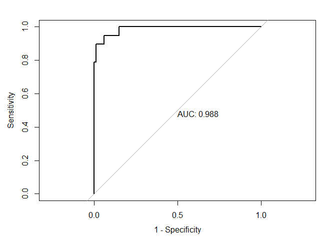

MRI
================
Zongchao Liu
5/19/2020

# 追加最新的45例MRI data

``` r
features_new = read_csv('../MRI_data/mri-2.csv')
```

    ## Warning: Missing column names filled in: 'X1' [1]

``` r
selected.patients_new = read_csv("../MRI_data/primary2.csv") %>%
  select(PCR) %>%
  mutate(PCR = factor(PCR))
```

    ## Warning: Missing column names filled in: 'X1' [1]

``` r
MRI.features_new = read_csv('../MRI_data/mri-2.csv') %>%
  .[,-c(1:38)] %>%
  cbind(selected.patients_new) %>%
  select(PCR, everything())
```

    ## Warning: Missing column names filled in: 'X1' [1]

This is only for the MRI data

# import data

``` r
selected.patients = read_csv("../MRI_data/mri_names.csv",col_names = F) %>%
  select(2) %>%
  rename("Name" = "X2") %>%
  separate(Name,into = c("Name","file")) %>%
  select(Name) %>%
  mutate(Name = recode(Name, "wugenghui" = "wugenghui2",
                "yinshaozeng" = "yinshaozhen"))

features = read_csv('../2020.05/feature_extracted_total177.csv')
response = read_csv('../2020.05/outcome_2020_total(1).csv') %>%
  mutate(Name = features$name) %>%
  filter(Name %in% c(selected.patients$Name)) %>%
  select(PCR)

#sum(selected.patients$Name %in% response$Name) # 33,41
#selected.patients$Name[33]
c(selected.patients$Name)[c(33,41)] # no response for these 2 patients "wugenghui"   "yinshaozeng"
```

    ## [1] "wugenghui2"  "yinshaozhen"

``` r
MRI.features = read_csv('../MRI_data/mri.csv') %>%
  .[,-c(1:38)] %>% # drop the 2 patients; 52 in total
  cbind(response,.)
```

    ## Warning: Missing column names filled in: 'X1' [1]

``` r
clinical = read_csv('../2020.05/outcome_2020_total(1).csv') %>%
  mutate(Name = features$name) %>%
  filter(Name %in% c(selected.patients$Name))
clinical_new = read_csv("../MRI_data/primary2.csv") %>% 
  select(-1,-2) %>%
  rename("Tumor length" = "Tumor.length",
         "Tumor thickness" = "Tumor.thickness")
```

    ## Warning: Missing column names filled in: 'X1' [1]

``` r
clinical = rbind(clinical,clinical_new) 
rm(features)


MRI.features = rbind(MRI.features,MRI.features_new)
```

仔细核查了姓名，一共44 + 54 = 99 人（2020.05.26）

# get scores

``` r
library(mlbench)
library(ranger)
library(ggcorrplot)
# calculate correlation matrix
correlationMatrix = cor(MRI.features[,2:1133])
# summarize the correlation matrix
#print(correlationMatrix)
# find attributes that are highly corrected (ideally >0.75)
highlyCorrelated = findCorrelation(correlationMatrix, cutoff = 0.65) #0.6 拖后腿了,0.75区分度100%
# print indexes of highly correlated attributes
#print(highlyCorrelated)
length(highlyCorrelated)
```

    ## [1] 1075

``` r
# plot the corr
cor.lowcorr = cor(MRI.features[,-c(1,highlyCorrelated)])
colnames(cor.lowcorr) = as.character(seq(1:ncol(cor.lowcorr)))
rownames(cor.lowcorr) = as.character(seq(1:ncol(cor.lowcorr)))

ggcorrplot(cor.lowcorr,
           #type = "lower",
           outline.color = "white",
           colors = c("#6D9EC1", "white", "#E46726")) +
  labs(x = "Features ID",
       title = "Correlation Matrix for the 57 Selected Radiomics Features at the First Stage",
       y = "Features ID") +
  theme(plot.title = element_text(hjust=.5))
```

<!-- -->

``` r
1132-length(highlyCorrelated)
```

    ## [1] 57

# LASSO get scores

## LASSO reg

``` r
library(MLmetrics)
```

    ## 
    ## Attaching package: 'MLmetrics'

    ## The following objects are masked from 'package:caret':
    ## 
    ##     MAE, RMSE

    ## The following object is masked from 'package:base':
    ## 
    ##     Recall

``` r
#features.lasso = features %>% .[features_into_account] #datase for lasso
#x = features.lasso %>% as.matrix() %>% scale()
#y = features$pcr %>% as.factor()


x = MRI.features %>%  .[,-highlyCorrelated] %>% as.matrix() %>% scale()
y = MRI.features$PCR %>% as.factor()

levels(y) = c("N","Y")

ctrl1  = trainControl(method = "cv", number = 10,
                      summaryFunction = prSummary,
                       # prSummary needs calculated class probs
                       classProbs = T,
                       sampling = "down")

set.seed(888)
lasso.fit = train(x, y,method = "glmnet",
                  tuneGrid = expand.grid(alpha = 1,lambda =exp(seq(-8, -3, length=1000))),
        #preProc = c("center", "scale"),
        metric = "ROC",
        trControl = ctrl1)
```

    ## Warning in train.default(x, y, method = "glmnet", tuneGrid = expand.grid(alpha =
    ## 1, : The metric "ROC" was not in the result set. AUC will be used instead.

``` r
lasso.fit$bestTune
```

    ##     alpha     lambda
    ## 686     1 0.01034169

``` r
#lasso.fit$finalModel$beta
ggplot(lasso.fit,highlight = T) +
  theme_bw() +
  labs(title = "Variable Selection Process via Logistic LASSO Regression") +
  theme(plot.title = element_text(hjust = .5))
```

<!-- -->

``` r
#trace plots for lasso variable selection
library(glmnet)
```

    ## Loading required package: Matrix

    ## 
    ## Attaching package: 'Matrix'

    ## The following objects are masked from 'package:tidyr':
    ## 
    ##     expand, pack, unpack

    ## Loaded glmnet 4.0-2

``` r
plot(lasso.fit$finalModel, xvar = "lambda", label = T,
     main = "Trace Plot for the Coefficients")
```

<!-- -->

## calculate scores

``` r
coef = data.frame(as.matrix(coef(lasso.fit$finalModel,lasso.fit$bestTune$lambda)))

coef = coef %>%
  mutate(coef = rownames(coef)) %>%
  rename("value" = "X1") %>%
  filter(value !=0)

coef %>%
  filter(value !=0) %>%
  nrow() # number of useful predictors
```

    ## [1] 23

``` r
# The selected predictors are:
predictors = coef$coef[-1] #plus intercept 1+n
# the next step is to calculate radscores:
predictors_val = coef$value[-1]

# the next step is to calculate radscores:
feature.matrix = MRI.features[predictors] %>% as.matrix() %>% scale()
coef.matrix = predictors_val %>% as.matrix()
MRscore = feature.matrix %*% coef.matrix + coef$value[1]

# construct a new dataset for future prediction
data.pred = clinical %>%
  mutate(MRscore = MRscore,
         PCR = factor(PCR))

MRscore_merge = data.pred %>% select(Name, MRscore)
```

# check scores

``` r
data.pred %>%
  mutate(id = 1:nrow(data.pred)) %>%
  ggplot(aes(x = PCR,
             y = MRscore, fill = PCR)) +
  geom_boxplot() +
  theme_bw()
```

<!-- -->

``` r
data.pred %>%
  arrange(PCR) %>%
  mutate(id = 1:nrow(data.pred)) %>%
  ggplot(aes(x = reorder(id,MRscore), y = MRscore,
              fill = PCR)) +
  geom_col() +
  theme_classic() +
  labs(title = "MRI-score for the 99 Patients",
       x = "Patients",
       y = "Radscore") + 
  theme(plot.title = element_text(hjust = .5),
        axis.text.x = element_blank(),
        axis.ticks.x = element_blank()) +
  ggsci::scale_fill_jama(labels = c("PCR = 0", "PCR = 1"))
```

<!-- -->

# save data

``` r
#write_csv(data.pred[,ncol(data.pred)],"./2020.05/MRscore99.csv")
data.org = read_csv('../2020.05/CTscore177.csv') %>% mutate(Name = recode(Name, "lixilai2" = "lixilai"))
```

    ## Warning: Missing column names filled in: 'X1' [1]

    ## Parsed with column specification:
    ## cols(
    ##   X1 = col_double(),
    ##   Name = col_character(),
    ##   Age = col_double(),
    ##   Sex = col_character(),
    ##   Group = col_character(),
    ##   cT = col_double(),
    ##   cN = col_double(),
    ##   cTNM = col_double(),
    ##   MRF = col_double(),
    ##   `Tumor length` = col_double(),
    ##   `Tumor thickness` = col_double(),
    ##   Distance = col_double(),
    ##   CEA = col_double(),
    ##   Differentiation = col_double(),
    ##   PCR = col_double(),
    ##   radscore = col_double()
    ## )

``` r
data.pred = data.org %>%
  mutate(Age = factor(Age),
         cT = ifelse(cT == 2, 3, cT),
         cT = factor(cT),
         cN = factor(cN),
         cTNM = factor(cTNM),
         MRF = as.character(MRF),
         `Tumor length` = factor(`Tumor length`),
         Distance = factor(Distance),
         CEA = factor(CEA),
         Differentiation = factor(Differentiation),
         PCR = factor(PCR),
         Group = ifelse(Group == "C", "B", Group)
         #rf.score = rf.score
         ) %>%
  arrange(Name) %>%
  .[,-1] #data.pred is for future modeling. Pay attention: the name `data.pred` also used in previous script, clear the environment before using this

data.pred = merge(MRscore_merge,data.pred) %>% select(1,3:16,2) %>%
  mutate(mixed = (MRscore+radscore)/2)

write.csv(data.pred,"../2020.05/MRandCTscore99.csv")
#clinical$Name[75] %in% data.org$Name
#lixilai  not in data.org

#作图，检查数据变动是否有误
data.pred %>%
  arrange(PCR) %>%
  mutate(id = 1:nrow(data.pred)) %>%
  ggplot(aes(x = reorder(id,MRscore), y = MRscore,
              fill = PCR)) +
  geom_col() +
  theme_classic() +
  labs(title = "MRI-score for the 99 Patients",
       x = "Patients",
       y = "Radscore") + 
  theme(plot.title = element_text(hjust = .5),
        axis.text.x = element_blank(),
        axis.ticks.x = element_blank()) +
  ggsci::scale_fill_jama(labels = c("PCR = 0", "PCR = 1"))
```

<!-- -->

``` r
ggsave("MRI_plot.pdf")
```

    ## Saving 7 x 5 in image

``` r
data.pred %>%
  arrange(PCR) %>%
  mutate(id = 1:nrow(data.pred)) %>%
  ggplot(aes(x = reorder(id,mixed), y = mixed,
              fill = PCR)) +
  geom_col() +
  theme_classic() +
  labs(title = "Mixed-score for the 99 Patients",
       x = "Patients",
       y = "Radscore") + 
  theme(plot.title = element_text(hjust = .5),
        axis.text.x = element_blank(),
        axis.ticks.x = element_blank()) +
  ggsci::scale_fill_jama(labels = c("PCR = 0", "PCR = 1"))
```

<!-- -->

``` r
ggsave("MIXED_plot.pdf")
```

    ## Saving 7 x 5 in image

# modeling

``` r
# preprocess data and settings
set.seed(888)
ctrl = trainControl(method = "repeatedcv", number = 10, repeats = 5,
                    classProbs = TRUE,
                    summaryFunction = twoClassSummary)

levels(data.pred$PCR) = c("N", "Y")

#partition
#rowTrain = createDataPartition(y = data.pred$PCR,
#                               p = 2/3, # 划分训练验证
#                               list = F)
```

# boosting

``` r
# gbm1: MR with other variables
gbm1.grid = expand.grid(n.trees = c(750,1000),
                        interaction.depth = 1,
                        shrinkage = c(0.01),
                        n.minobsinnode = 10)
set.seed(888)
# Binomial loss function
gbm1.fit = train(PCR ~ ., data.pred[,-c(1,15,17)],
                 tuneGrid = gbm1.grid,
                 trControl = ctrl,
                 method = "gbm",
                 distribution = "bernoulli",
                 metric = "ROC",
                 verbose = FALSE)

ggplot(gbm1.fit, highlight = T) +
  theme_minimal() +
  labs(title = "Tuning Parameters for Gradient Boosting Machine 1") +
  theme(plot.title = element_text(hjust = .5)) +
  ggsci::scale_color_lancet()
```

<!-- -->

``` r
gbm1.fit$bestTune
```

    ##   n.trees interaction.depth shrinkage n.minobsinnode
    ## 2    1000                 1      0.01             10

``` r
# gbm2: CT with other variables
gbm2.grid = expand.grid(n.trees = c(750,1000),
                        interaction.depth = 1,
                        shrinkage = c(0.01),
                        n.minobsinnode = 10)
set.seed(888)
# Binomial loss function
gbm2.fit = train(PCR ~ ., data.pred[,-c(1,16,17)],
                 tuneGrid = gbm2.grid,
                 trControl = ctrl,
                 method = "gbm",
                 distribution = "bernoulli",
                 metric = "ROC",
                 verbose = FALSE)

ggplot(gbm2.fit, highlight = T) +
  theme_minimal() +
  labs(title = "Tuning Parameters for Gradient Boosting Machine 2") +
  theme(plot.title = element_text(hjust = .5)) +
  ggsci::scale_color_lancet()
```

<!-- -->

``` r
# gbm3: MR and CT with other variables
gbm3.grid = expand.grid(n.trees = c(750,1000),
                        interaction.depth = 1,
                        shrinkage = c(0.01),
                        n.minobsinnode = 10)
set.seed(888)
# Binomial loss function
gbm3.fit = train(PCR ~ ., data.pred[,-c(1,17)],
                 tuneGrid = gbm3.grid,
                 trControl = ctrl,
                 method = "gbm",
                 distribution = "bernoulli",
                 metric = "ROC",
                 verbose = FALSE)

ggplot(gbm3.fit, highlight = T) +
  theme_minimal() +
  labs(title = "Tuning Parameters for Gradient Boosting Machine 3") +
  theme(plot.title = element_text(hjust = .5)) +
  ggsci::scale_color_lancet()
```

<!-- -->

``` r
# gbm4: Mixed score with other variables
gbm4.grid = expand.grid(n.trees = c(750,1000),
                        interaction.depth = 1,
                        shrinkage = c(0.01),
                        n.minobsinnode = 10)
set.seed(888)
# Binomial loss function
gbm4.fit = train(PCR ~ ., data.pred[,-c(1,15,16)],
                 tuneGrid = gbm4.grid,
                 trControl = ctrl,
                 method = "gbm",
                 distribution = "bernoulli",
                 metric = "ROC",
                 verbose = FALSE)

ggplot(gbm4.fit, highlight = T) +
  theme_minimal() +
  labs(title = "Tuning Parameters for Gradient Boosting Machine 4") +
  theme(plot.title = element_text(hjust = .5)) +
  ggsci::scale_color_lancet()
```

<!-- -->

``` r
gbm4.fit$bestTune
```

    ##   n.trees interaction.depth shrinkage n.minobsinnode
    ## 2    1000                 1      0.01             10

``` r
res = resamples(list(gbmMRI = gbm1.fit,
                     gbmCT = gbm2.fit,
                     gbmBoth = gbm3.fit,
                     gbmMixed = gbm4.fit),
                     metric = "ROC")
summary(res)
```

    ## 
    ## Call:
    ## summary.resamples(object = res)
    ## 
    ## Models: gbmMRI, gbmCT, gbmBoth, gbmMixed 
    ## Number of resamples: 50 
    ## 
    ## ROC 
    ##            Min. 1st Qu. Median    Mean 3rd Qu. Max. NA's
    ## gbmMRI   0.1875  0.7500 0.8750 0.83250       1    1    0
    ## gbmCT    0.1250  0.8125 0.8750 0.83500       1    1    0
    ## gbmBoth  0.1250  0.8750 1.0000 0.89500       1    1    0
    ## gbmMixed 0.3125  0.8125 0.9375 0.87625       1    1    0
    ## 
    ## Sens 
    ##           Min. 1st Qu. Median   Mean 3rd Qu. Max. NA's
    ## gbmMRI   0.625   0.875  0.875 0.9025       1    1    0
    ## gbmCT    0.750   0.875  1.000 0.9425       1    1    0
    ## gbmBoth  0.750   0.875  1.000 0.9375       1    1    0
    ## gbmMixed 0.750   0.875  1.000 0.9375       1    1    0
    ## 
    ## Spec 
    ##          Min. 1st Qu. Median Mean 3rd Qu. Max. NA's
    ## gbmMRI      0     0.0    0.5 0.42     0.5    1    0
    ## gbmCT       0     0.0    0.5 0.51     1.0    1    0
    ## gbmBoth     0     0.5    1.0 0.76     1.0    1    0
    ## gbmMixed    0     0.5    0.5 0.68     1.0    1    0

``` r
bwplot(res)
```

<!-- -->

\#AUC

``` r
library(pROC)
```

    ## Type 'citation("pROC")' for a citation.

    ## 
    ## Attaching package: 'pROC'

    ## The following objects are masked from 'package:stats':
    ## 
    ##     cov, smooth, var

``` r
# Boosting train ROC
gbm1.fit.pred.train.prob = predict(gbm1.fit,newdata = data.pred[,-1],type = "prob")[,2]# select pos resp
gbm1.fit.pred.train = rep("N",length(gbm1.fit.pred.train.prob))
gbm1.fit.pred.train[gbm1.fit.pred.train.prob > 0.5] = "Y"

roc.gbm1.fit = roc(data.pred$PCR[], gbm1.fit.pred.train.prob)
```

    ## Setting levels: control = N, case = Y

    ## Setting direction: controls < cases

``` r
plot(roc.gbm1.fit,
     legacy.axes = T,
     print.auc = T,
     print.thres = T)
```

<!-- -->

``` r
ci.auc(roc.gbm1.fit)
```

    ## 95% CI: 0.9167-0.9938 (DeLong)

``` r
# Boosting train ROC
gbm2.fit.pred.train.prob = predict(gbm2.fit, newdata = data.pred[,-1], type = "prob")[,2]# select pos resp
gbm2.fit.pred.train = rep("N",length(gbm2.fit.pred.train.prob))
gbm2.fit.pred.train[gbm2.fit.pred.train.prob > 0.5] = "Y"

roc.gbm2.fit = roc(data.pred$PCR, gbm2.fit.pred.train.prob)
```

    ## Setting levels: control = N, case = Y
    ## Setting direction: controls < cases

``` r
plot(roc.gbm2.fit,
     legacy.axes = T,
     print.auc = T)
```

<!-- -->

``` r
ci.auc(roc.gbm2.fit)
```

    ## 95% CI: 0.8991-0.9996 (DeLong)

``` r
# Boosting train ROC
gbm3.fit.pred.train.prob = predict(gbm3.fit, newdata = data.pred[,-1], type = "prob")[,2]# select pos resp
gbm3.fit.pred.train = rep("N",length(gbm3.fit.pred.train.prob))
gbm3.fit.pred.train[gbm3.fit.pred.train.prob > 0.5] = "Y"

roc.gbm3.fit = roc(data.pred$PCR, gbm3.fit.pred.train.prob)
```

    ## Setting levels: control = N, case = Y
    ## Setting direction: controls < cases

``` r
plot(roc.gbm3.fit,
     legacy.axes = T,
     print.auc = T)
```

<!-- -->

``` r
ci.auc(roc.gbm3.fit)
```

    ## 95% CI: 0.9695-1 (DeLong)

``` r
gbm4.fit.pred.train.prob = predict(gbm4.fit,newdata = data.pred[,-1],type = "prob")[,2]# select pos resp
gbm4.fit.pred.train = rep("N",length(gbm4.fit.pred.train.prob))
gbm4.fit.pred.train[gbm4.fit.pred.train.prob > 0.5] = "Y"

roc.gbm4.fit = roc(data.pred$PCR, gbm4.fit.pred.train.prob)
```

    ## Setting levels: control = N, case = Y
    ## Setting direction: controls < cases

``` r
plot(roc.gbm4.fit,
     legacy.axes = T,
     print.auc = T,
     print.thres = T)
```

<!-- -->

``` r
ci.auc(roc.gbm4.fit)
```

    ## 95% CI: 0.9553-1 (DeLong)

``` r
#pdf(file = "PrimaryCohort.pdf",width = 8)
plot(roc.gbm1.fit, print.auc=TRUE,print.auc.x=0.3,print.auc.y=0.1,auc.polygon.col="gray", grid = c(0.5, 0.3), max.auc.polygon=TRUE,legen = T,main = "Primary Cohort",col="yellow")
plot.roc(roc.gbm2.fit,add=T,col="red", print.auc=TRUE,print.auc.x=0.3,print.auc.y=0.2)
#plot.roc(roc.gbm3.fit,add=T,col="blue",print.auc=TRUE,print.auc.x=0.3,pri#nt.auc.y=0.3)
plot.roc(roc.gbm4.fit,add=T,col="blue",print.auc=TRUE,print.auc.x=0.3,print.auc.y=0.4)
legend("bottomright",legend = c(
                  "MRI-GBM`",
                  "CT-GBM",
                  #"MRI-CT-GBM",
                  "MIxed-GBM"),
       col = c("yellow",#"red",
               "red","blue"),lwd = 4,cex = 0.35)
```

<!-- -->

``` r
#dev.off()
```

# testset results(舍弃)

``` r
# Boosting test ROC
gbm1.fit.pred.test.prob = predict(gbm1.fit,newdata = data.pred[-rowTrain,-1], type = "prob")[,2]# select pos resp
gbm1.fit.pred.test = rep("N",length(gbm1.fit.pred.test.prob))
gbm1.fit.pred.test[gbm1.fit.pred.test.prob > 0.5] = "Y"

roc.gbm1.fit.test = roc(data.pred$PCR[-rowTrain], gbm1.fit.pred.test.prob)
plot(roc.gbm1.fit.test,
     legacy.axes = T,
     print.auc = T)
ci.auc(roc.gbm1.fit.test)

# Boosting test ROC
gbm2.fit.pred.test.prob = predict(gbm2.fit,newdata = data.pred[-rowTrain,-1], type = "prob")[,2]# select pos resp
gbm2.fit.pred.test = rep("N",length(gbm2.fit.pred.test.prob))
gbm2.fit.pred.test[gbm2.fit.pred.test.prob > 0.5] = "Y"

roc.gbm2.fit.test = roc(data.pred$PCR[-rowTrain], gbm2.fit.pred.test.prob)
plot(roc.gbm2.fit.test,
     legacy.axes = T,
     print.auc = T)
ci.auc(roc.gbm2.fit.test)

# Boosting test ROC
gbm3.fit.pred.test.prob = predict(gbm3.fit,newdata = data.pred[-rowTrain,-1], type = "prob")[,2]# select pos resp
gbm3.fit.pred.test = rep("N",length(gbm3.fit.pred.test.prob))
gbm3.fit.pred.test[gbm3.fit.pred.test.prob > 0.5] = "Y"

roc.gbm3.fit.test = roc(data.pred$PCR[-rowTrain], gbm3.fit.pred.test.prob)
plot(roc.gbm3.fit.test,
     legacy.axes = T,
     print.auc = T)
ci.auc(roc.gbm3.fit.test)

# Boosting test ROC
gbm4.fit.pred.test.prob = predict(gbm4.fit,newdata = data.pred[-rowTrain,-1], type = "prob")[,2]# select pos resp
gbm4.fit.pred.test = rep("N",length(gbm4.fit.pred.test.prob))
gbm4.fit.pred.test[gbm4.fit.pred.test.prob > 0.5] = "Y"

roc.gbm4.fit.test = roc(data.pred$PCR[-rowTrain], gbm4.fit.pred.test.prob)
plot(roc.gbm4.fit.test,
     legacy.axes = T,
     print.auc = T)
ci.auc(roc.gbm4.fit.test)
```

# primary results(SEN,SPEC,NPV,PPV…)

``` r
# primary results
caret::confusionMatrix(factor(gbm1.fit.pred.train),reference = data.pred$PCR,
                       positive = "Y")
```

    ## Confusion Matrix and Statistics
    ## 
    ##           Reference
    ## Prediction  N  Y
    ##          N 77  6
    ##          Y  3 13
    ##                                           
    ##                Accuracy : 0.9091          
    ##                  95% CI : (0.8344, 0.9576)
    ##     No Information Rate : 0.8081          
    ##     P-Value [Acc > NIR] : 0.004682        
    ##                                           
    ##                   Kappa : 0.6881          
    ##                                           
    ##  Mcnemar's Test P-Value : 0.504985        
    ##                                           
    ##             Sensitivity : 0.6842          
    ##             Specificity : 0.9625          
    ##          Pos Pred Value : 0.8125          
    ##          Neg Pred Value : 0.9277          
    ##              Prevalence : 0.1919          
    ##          Detection Rate : 0.1313          
    ##    Detection Prevalence : 0.1616          
    ##       Balanced Accuracy : 0.8234          
    ##                                           
    ##        'Positive' Class : Y               
    ## 

``` r
caret::confusionMatrix(factor(gbm2.fit.pred.train),reference = data.pred$PCR,
                       positive = "Y")
```

    ## Confusion Matrix and Statistics
    ## 
    ##           Reference
    ## Prediction  N  Y
    ##          N 76  4
    ##          Y  4 15
    ##                                          
    ##                Accuracy : 0.9192         
    ##                  95% CI : (0.847, 0.9645)
    ##     No Information Rate : 0.8081         
    ##     P-Value [Acc > NIR] : 0.001816       
    ##                                          
    ##                   Kappa : 0.7395         
    ##                                          
    ##  Mcnemar's Test P-Value : 1.000000       
    ##                                          
    ##             Sensitivity : 0.7895         
    ##             Specificity : 0.9500         
    ##          Pos Pred Value : 0.7895         
    ##          Neg Pred Value : 0.9500         
    ##              Prevalence : 0.1919         
    ##          Detection Rate : 0.1515         
    ##    Detection Prevalence : 0.1919         
    ##       Balanced Accuracy : 0.8697         
    ##                                          
    ##        'Positive' Class : Y              
    ## 

``` r
caret::confusionMatrix(factor(gbm3.fit.pred.train),reference = data.pred$PCR,
                       positive = "Y")
```

    ## Confusion Matrix and Statistics
    ## 
    ##           Reference
    ## Prediction  N  Y
    ##          N 80  4
    ##          Y  0 15
    ##                                           
    ##                Accuracy : 0.9596          
    ##                  95% CI : (0.8998, 0.9889)
    ##     No Information Rate : 0.8081          
    ##     P-Value [Acc > NIR] : 9.901e-06       
    ##                                           
    ##                   Kappa : 0.8584          
    ##                                           
    ##  Mcnemar's Test P-Value : 0.1336          
    ##                                           
    ##             Sensitivity : 0.7895          
    ##             Specificity : 1.0000          
    ##          Pos Pred Value : 1.0000          
    ##          Neg Pred Value : 0.9524          
    ##              Prevalence : 0.1919          
    ##          Detection Rate : 0.1515          
    ##    Detection Prevalence : 0.1515          
    ##       Balanced Accuracy : 0.8947          
    ##                                           
    ##        'Positive' Class : Y               
    ## 

``` r
caret::confusionMatrix(factor(gbm4.fit.pred.train),reference = data.pred$PCR,
                       positive = "Y")
```

    ## Confusion Matrix and Statistics
    ## 
    ##           Reference
    ## Prediction  N  Y
    ##          N 79  5
    ##          Y  1 14
    ##                                           
    ##                Accuracy : 0.9394          
    ##                  95% CI : (0.8727, 0.9774)
    ##     No Information Rate : 0.8081          
    ##     P-Value [Acc > NIR] : 0.0001856       
    ##                                           
    ##                   Kappa : 0.7876          
    ##                                           
    ##  Mcnemar's Test P-Value : 0.2206714       
    ##                                           
    ##             Sensitivity : 0.7368          
    ##             Specificity : 0.9875          
    ##          Pos Pred Value : 0.9333          
    ##          Neg Pred Value : 0.9405          
    ##              Prevalence : 0.1919          
    ##          Detection Rate : 0.1414          
    ##    Detection Prevalence : 0.1515          
    ##       Balanced Accuracy : 0.8622          
    ##                                           
    ##        'Positive' Class : Y               
    ##
