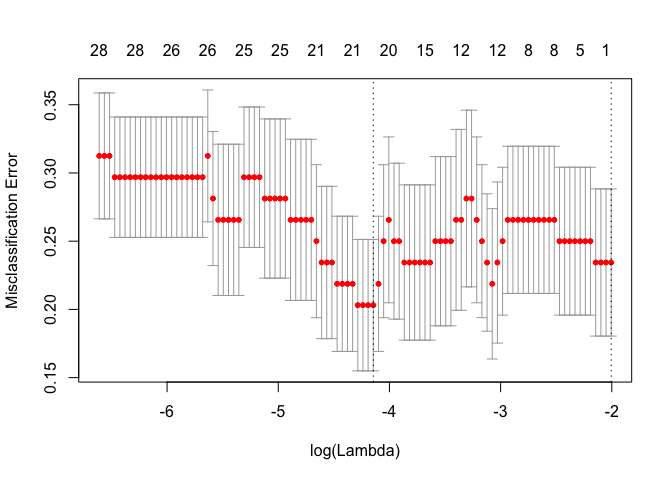
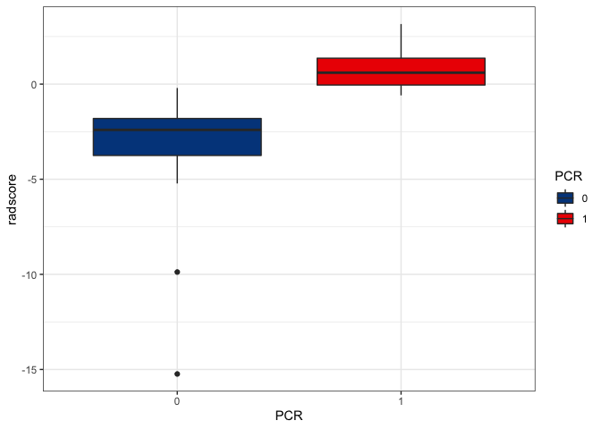
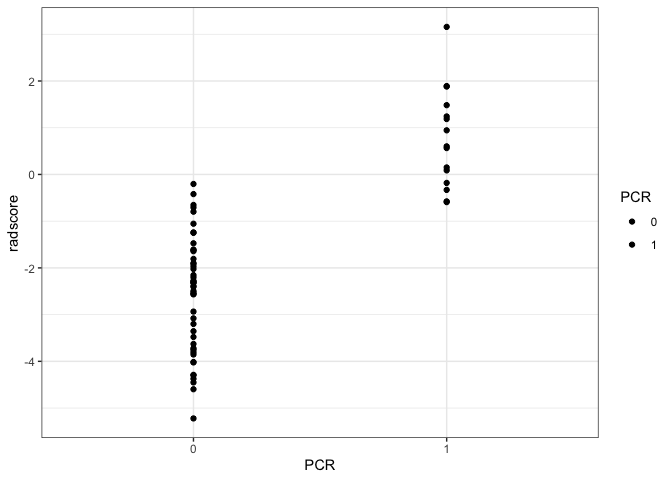

report
================
Zongchao Liu
1/13/2020

# \* 清洗数据，提取结局变量（这一块先跳过）

``` r
outcome_df = read_csv('./data/factors_outcomes.csv') %>%
 rename("name" = "names_eng" ,
        "age" = "年龄",
        "sex" = "性别",
        "group" = "组别（无序分类）",
        "cT" = "cT（有序分类）",
        "cN" = "cN（有序分类）",
        "MRF" = "MRF阳性（二分类）",
        "tumor_length" = "肿瘤长度（连续数值）",
        "tumor_thickness" = "肿瘤厚度（连续数值）",
        "distance" = "治疗前肛缘距离（连续数值）",
        "path" = "活检病理类型（无序分类）",
        "CEA" = "治疗前CEA（连续数值）",
        "differentiation" = "活检分化程度（有序分类）"
        ) %>%
  mutate(name = recode(name,
                       "cengrenyong" = "zengrenyong",
                       "huanghuaxing" = "huanghuaxin",
                       "licaiqun" = "licaiqun2",
                       "lijiabin" = "lijiabing",
                       "wugenghui" = "wugenghui2",
                       "yanpinggen" = "yangpinggen",
                       "yinshaozeng" = "yinshaozhen",
                       "chenqiuru" = "chenqiru"
                       ),
         PCR = factor(PCR),
         differentiation = factor(differentiation),
         sex = recode(sex,
                      "男" = "male",
                      "女" = "female"),
         group = as.character(group),
         cT = factor(cT),
         cN = factor(cN),
         MRF = as.character(MRF),
         path = as.character(path)) %>%
  arrange(name) %>%
  .[15]
```

# 1\. 清洗数据，采用的是CTexample的滤波器获取特征

``` r
features = read_csv("./data/feature_extracted_2019_1.csv") %>%
  janitor::clean_names() %>%
  mutate(id = c(1:64)) %>%
  select(-x1) %>%
  select(id,everything())

# 挑选出可以用于回归的变量
feature_for_lasso = features[,-c(2:38)]

# 获取观测值姓名信息
file_names = tibble(
  names = list.files("./done")) %>%
  filter(str_detect(names, "-") == FALSE)

# 匹配姓名与CT影像特征数据
feature_for_lasso = cbind(file_names, feature_for_lasso) %>%
  separate(names,c("name","format")) %>%
  select(-format)
```

# see distribution, 查看各个提取特征的数值分布

``` r
# center the data
centered_features = scale(feature_for_lasso[,-c(1:2)], scale = T, center = F) %>% 
  as.data.frame() %>% cbind(file_names, .) %>%
  separate(names,c("name","format")) %>%
  select(-format)

# load and combine results

centered_features = cbind(outcome_df, centered_features)# this is the data for analysis


skimr::skim(centered_features)
```

    ## Skim summary statistics
    ##  n obs: 64 
    ##  n variables: 1220 
    ## 
    ## ── Variable type:character ────────────────────────────────────────────────────────────────────────────────────────────
    ##  variable missing complete  n min max empty n_unique
    ##      name       0       64 64   5  13     0       64
    ## 
    ## ── Variable type:factor ───────────────────────────────────────────────────────────────────────────────────────────────
    ##  variable missing complete  n n_unique          top_counts ordered
    ##       PCR       0       64 64        2 0: 49, 1: 15, NA: 0   FALSE
    ## 
    ## ── Variable type:numeric ──────────────────────────────────────────────────────────────────────────────────────────────
    ##                                                            variable
    ##                         log_sigma_1_0_mm_3d_firstorder_10percentile
    ##                         log_sigma_1_0_mm_3d_firstorder_90percentile
    ##                               log_sigma_1_0_mm_3d_firstorder_energy
    ##                              log_sigma_1_0_mm_3d_firstorder_entropy
    ##                  log_sigma_1_0_mm_3d_firstorder_interquartile_range
    ##                             log_sigma_1_0_mm_3d_firstorder_kurtosis
    ##                              log_sigma_1_0_mm_3d_firstorder_maximum
    ##                                 log_sigma_1_0_mm_3d_firstorder_mean
    ##              log_sigma_1_0_mm_3d_firstorder_mean_absolute_deviation
    ##                               log_sigma_1_0_mm_3d_firstorder_median
    ##                              log_sigma_1_0_mm_3d_firstorder_minimum
    ##                                log_sigma_1_0_mm_3d_firstorder_range
    ##       log_sigma_1_0_mm_3d_firstorder_robust_mean_absolute_deviation
    ##                    log_sigma_1_0_mm_3d_firstorder_root_mean_squared
    ##                             log_sigma_1_0_mm_3d_firstorder_skewness
    ##                         log_sigma_1_0_mm_3d_firstorder_total_energy
    ##                           log_sigma_1_0_mm_3d_firstorder_uniformity
    ##                             log_sigma_1_0_mm_3d_firstorder_variance
    ##                            log_sigma_1_0_mm_3d_glcm_autocorrelation
    ##                         log_sigma_1_0_mm_3d_glcm_cluster_prominence
    ##                              log_sigma_1_0_mm_3d_glcm_cluster_shade
    ##                           log_sigma_1_0_mm_3d_glcm_cluster_tendency
    ##                                   log_sigma_1_0_mm_3d_glcm_contrast
    ##                                log_sigma_1_0_mm_3d_glcm_correlation
    ##                         log_sigma_1_0_mm_3d_glcm_difference_average
    ##                         log_sigma_1_0_mm_3d_glcm_difference_entropy
    ##                        log_sigma_1_0_mm_3d_glcm_difference_variance
    ##                                         log_sigma_1_0_mm_3d_glcm_id
    ##                                        log_sigma_1_0_mm_3d_glcm_idm
    ##                                       log_sigma_1_0_mm_3d_glcm_idmn
    ##                                        log_sigma_1_0_mm_3d_glcm_idn
    ##                                       log_sigma_1_0_mm_3d_glcm_imc1
    ##                                       log_sigma_1_0_mm_3d_glcm_imc2
    ##                           log_sigma_1_0_mm_3d_glcm_inverse_variance
    ##                              log_sigma_1_0_mm_3d_glcm_joint_average
    ##                               log_sigma_1_0_mm_3d_glcm_joint_energy
    ##                              log_sigma_1_0_mm_3d_glcm_joint_entropy
    ##                        log_sigma_1_0_mm_3d_glcm_maximum_probability
    ##                                log_sigma_1_0_mm_3d_glcm_sum_entropy
    ##                                log_sigma_1_0_mm_3d_glcm_sum_squares
    ##                         log_sigma_1_0_mm_3d_gldm_dependence_entropy
    ##                  log_sigma_1_0_mm_3d_gldm_dependence_non_uniformity
    ##       log_sigma_1_0_mm_3d_gldm_dependence_non_uniformity_normalized
    ##                        log_sigma_1_0_mm_3d_gldm_dependence_variance
    ##                  log_sigma_1_0_mm_3d_gldm_gray_level_non_uniformity
    ##                        log_sigma_1_0_mm_3d_gldm_gray_level_variance
    ##                   log_sigma_1_0_mm_3d_gldm_high_gray_level_emphasis
    ##                  log_sigma_1_0_mm_3d_gldm_large_dependence_emphasis
    ##  log_sigma_1_0_mm_3d_gldm_large_dependence_high_gray_level_emphasis
    ##   log_sigma_1_0_mm_3d_gldm_large_dependence_low_gray_level_emphasis
    ##                    log_sigma_1_0_mm_3d_gldm_low_gray_level_emphasis
    ##                  log_sigma_1_0_mm_3d_gldm_small_dependence_emphasis
    ##  log_sigma_1_0_mm_3d_gldm_small_dependence_high_gray_level_emphasis
    ##   log_sigma_1_0_mm_3d_gldm_small_dependence_low_gray_level_emphasis
    ##                 log_sigma_1_0_mm_3d_glrlm_gray_level_non_uniformity
    ##      log_sigma_1_0_mm_3d_glrlm_gray_level_non_uniformity_normalized
    ##                       log_sigma_1_0_mm_3d_glrlm_gray_level_variance
    ##              log_sigma_1_0_mm_3d_glrlm_high_gray_level_run_emphasis
    ##                         log_sigma_1_0_mm_3d_glrlm_long_run_emphasis
    ##         log_sigma_1_0_mm_3d_glrlm_long_run_high_gray_level_emphasis
    ##          log_sigma_1_0_mm_3d_glrlm_long_run_low_gray_level_emphasis
    ##               log_sigma_1_0_mm_3d_glrlm_low_gray_level_run_emphasis
    ##                               log_sigma_1_0_mm_3d_glrlm_run_entropy
    ##                 log_sigma_1_0_mm_3d_glrlm_run_length_non_uniformity
    ##      log_sigma_1_0_mm_3d_glrlm_run_length_non_uniformity_normalized
    ##                            log_sigma_1_0_mm_3d_glrlm_run_percentage
    ##                              log_sigma_1_0_mm_3d_glrlm_run_variance
    ##                        log_sigma_1_0_mm_3d_glrlm_short_run_emphasis
    ##        log_sigma_1_0_mm_3d_glrlm_short_run_high_gray_level_emphasis
    ##         log_sigma_1_0_mm_3d_glrlm_short_run_low_gray_level_emphasis
    ##                 log_sigma_1_0_mm_3d_glszm_gray_level_non_uniformity
    ##      log_sigma_1_0_mm_3d_glszm_gray_level_non_uniformity_normalized
    ##                       log_sigma_1_0_mm_3d_glszm_gray_level_variance
    ##             log_sigma_1_0_mm_3d_glszm_high_gray_level_zone_emphasis
    ##                       log_sigma_1_0_mm_3d_glszm_large_area_emphasis
    ##       log_sigma_1_0_mm_3d_glszm_large_area_high_gray_level_emphasis
    ##        log_sigma_1_0_mm_3d_glszm_large_area_low_gray_level_emphasis
    ##              log_sigma_1_0_mm_3d_glszm_low_gray_level_zone_emphasis
    ##                  log_sigma_1_0_mm_3d_glszm_size_zone_non_uniformity
    ##       log_sigma_1_0_mm_3d_glszm_size_zone_non_uniformity_normalized
    ##                       log_sigma_1_0_mm_3d_glszm_small_area_emphasis
    ##       log_sigma_1_0_mm_3d_glszm_small_area_high_gray_level_emphasis
    ##        log_sigma_1_0_mm_3d_glszm_small_area_low_gray_level_emphasis
    ##                              log_sigma_1_0_mm_3d_glszm_zone_entropy
    ##                           log_sigma_1_0_mm_3d_glszm_zone_percentage
    ##                             log_sigma_1_0_mm_3d_glszm_zone_variance
    ##                         log_sigma_2_0_mm_3d_firstorder_10percentile
    ##                         log_sigma_2_0_mm_3d_firstorder_90percentile
    ##                               log_sigma_2_0_mm_3d_firstorder_energy
    ##                              log_sigma_2_0_mm_3d_firstorder_entropy
    ##                  log_sigma_2_0_mm_3d_firstorder_interquartile_range
    ##                             log_sigma_2_0_mm_3d_firstorder_kurtosis
    ##                              log_sigma_2_0_mm_3d_firstorder_maximum
    ##                                 log_sigma_2_0_mm_3d_firstorder_mean
    ##              log_sigma_2_0_mm_3d_firstorder_mean_absolute_deviation
    ##                               log_sigma_2_0_mm_3d_firstorder_median
    ##                              log_sigma_2_0_mm_3d_firstorder_minimum
    ##                                log_sigma_2_0_mm_3d_firstorder_range
    ##       log_sigma_2_0_mm_3d_firstorder_robust_mean_absolute_deviation
    ##                    log_sigma_2_0_mm_3d_firstorder_root_mean_squared
    ##                             log_sigma_2_0_mm_3d_firstorder_skewness
    ##                         log_sigma_2_0_mm_3d_firstorder_total_energy
    ##                           log_sigma_2_0_mm_3d_firstorder_uniformity
    ##                             log_sigma_2_0_mm_3d_firstorder_variance
    ##                            log_sigma_2_0_mm_3d_glcm_autocorrelation
    ##                         log_sigma_2_0_mm_3d_glcm_cluster_prominence
    ##                              log_sigma_2_0_mm_3d_glcm_cluster_shade
    ##                           log_sigma_2_0_mm_3d_glcm_cluster_tendency
    ##                                   log_sigma_2_0_mm_3d_glcm_contrast
    ##                                log_sigma_2_0_mm_3d_glcm_correlation
    ##                         log_sigma_2_0_mm_3d_glcm_difference_average
    ##                         log_sigma_2_0_mm_3d_glcm_difference_entropy
    ##                        log_sigma_2_0_mm_3d_glcm_difference_variance
    ##                                         log_sigma_2_0_mm_3d_glcm_id
    ##                                        log_sigma_2_0_mm_3d_glcm_idm
    ##                                       log_sigma_2_0_mm_3d_glcm_idmn
    ##                                        log_sigma_2_0_mm_3d_glcm_idn
    ##                                       log_sigma_2_0_mm_3d_glcm_imc1
    ##                                       log_sigma_2_0_mm_3d_glcm_imc2
    ##                           log_sigma_2_0_mm_3d_glcm_inverse_variance
    ##                              log_sigma_2_0_mm_3d_glcm_joint_average
    ##                               log_sigma_2_0_mm_3d_glcm_joint_energy
    ##                              log_sigma_2_0_mm_3d_glcm_joint_entropy
    ##                        log_sigma_2_0_mm_3d_glcm_maximum_probability
    ##                                log_sigma_2_0_mm_3d_glcm_sum_entropy
    ##                                log_sigma_2_0_mm_3d_glcm_sum_squares
    ##                         log_sigma_2_0_mm_3d_gldm_dependence_entropy
    ##                  log_sigma_2_0_mm_3d_gldm_dependence_non_uniformity
    ##       log_sigma_2_0_mm_3d_gldm_dependence_non_uniformity_normalized
    ##                        log_sigma_2_0_mm_3d_gldm_dependence_variance
    ##                  log_sigma_2_0_mm_3d_gldm_gray_level_non_uniformity
    ##                        log_sigma_2_0_mm_3d_gldm_gray_level_variance
    ##                   log_sigma_2_0_mm_3d_gldm_high_gray_level_emphasis
    ##                  log_sigma_2_0_mm_3d_gldm_large_dependence_emphasis
    ##  log_sigma_2_0_mm_3d_gldm_large_dependence_high_gray_level_emphasis
    ##   log_sigma_2_0_mm_3d_gldm_large_dependence_low_gray_level_emphasis
    ##                    log_sigma_2_0_mm_3d_gldm_low_gray_level_emphasis
    ##                  log_sigma_2_0_mm_3d_gldm_small_dependence_emphasis
    ##  log_sigma_2_0_mm_3d_gldm_small_dependence_high_gray_level_emphasis
    ##   log_sigma_2_0_mm_3d_gldm_small_dependence_low_gray_level_emphasis
    ##                 log_sigma_2_0_mm_3d_glrlm_gray_level_non_uniformity
    ##      log_sigma_2_0_mm_3d_glrlm_gray_level_non_uniformity_normalized
    ##                       log_sigma_2_0_mm_3d_glrlm_gray_level_variance
    ##              log_sigma_2_0_mm_3d_glrlm_high_gray_level_run_emphasis
    ##                         log_sigma_2_0_mm_3d_glrlm_long_run_emphasis
    ##         log_sigma_2_0_mm_3d_glrlm_long_run_high_gray_level_emphasis
    ##          log_sigma_2_0_mm_3d_glrlm_long_run_low_gray_level_emphasis
    ##               log_sigma_2_0_mm_3d_glrlm_low_gray_level_run_emphasis
    ##                               log_sigma_2_0_mm_3d_glrlm_run_entropy
    ##                 log_sigma_2_0_mm_3d_glrlm_run_length_non_uniformity
    ##      log_sigma_2_0_mm_3d_glrlm_run_length_non_uniformity_normalized
    ##                            log_sigma_2_0_mm_3d_glrlm_run_percentage
    ##                              log_sigma_2_0_mm_3d_glrlm_run_variance
    ##                        log_sigma_2_0_mm_3d_glrlm_short_run_emphasis
    ##        log_sigma_2_0_mm_3d_glrlm_short_run_high_gray_level_emphasis
    ##         log_sigma_2_0_mm_3d_glrlm_short_run_low_gray_level_emphasis
    ##                 log_sigma_2_0_mm_3d_glszm_gray_level_non_uniformity
    ##      log_sigma_2_0_mm_3d_glszm_gray_level_non_uniformity_normalized
    ##                       log_sigma_2_0_mm_3d_glszm_gray_level_variance
    ##             log_sigma_2_0_mm_3d_glszm_high_gray_level_zone_emphasis
    ##                       log_sigma_2_0_mm_3d_glszm_large_area_emphasis
    ##       log_sigma_2_0_mm_3d_glszm_large_area_high_gray_level_emphasis
    ##        log_sigma_2_0_mm_3d_glszm_large_area_low_gray_level_emphasis
    ##              log_sigma_2_0_mm_3d_glszm_low_gray_level_zone_emphasis
    ##                  log_sigma_2_0_mm_3d_glszm_size_zone_non_uniformity
    ##       log_sigma_2_0_mm_3d_glszm_size_zone_non_uniformity_normalized
    ##                       log_sigma_2_0_mm_3d_glszm_small_area_emphasis
    ##       log_sigma_2_0_mm_3d_glszm_small_area_high_gray_level_emphasis
    ##        log_sigma_2_0_mm_3d_glszm_small_area_low_gray_level_emphasis
    ##                              log_sigma_2_0_mm_3d_glszm_zone_entropy
    ##                           log_sigma_2_0_mm_3d_glszm_zone_percentage
    ##                             log_sigma_2_0_mm_3d_glszm_zone_variance
    ##                         log_sigma_3_0_mm_3d_firstorder_10percentile
    ##                         log_sigma_3_0_mm_3d_firstorder_90percentile
    ##                               log_sigma_3_0_mm_3d_firstorder_energy
    ##                              log_sigma_3_0_mm_3d_firstorder_entropy
    ##                  log_sigma_3_0_mm_3d_firstorder_interquartile_range
    ##                             log_sigma_3_0_mm_3d_firstorder_kurtosis
    ##                              log_sigma_3_0_mm_3d_firstorder_maximum
    ##                                 log_sigma_3_0_mm_3d_firstorder_mean
    ##              log_sigma_3_0_mm_3d_firstorder_mean_absolute_deviation
    ##                               log_sigma_3_0_mm_3d_firstorder_median
    ##                              log_sigma_3_0_mm_3d_firstorder_minimum
    ##                                log_sigma_3_0_mm_3d_firstorder_range
    ##       log_sigma_3_0_mm_3d_firstorder_robust_mean_absolute_deviation
    ##                    log_sigma_3_0_mm_3d_firstorder_root_mean_squared
    ##                             log_sigma_3_0_mm_3d_firstorder_skewness
    ##                         log_sigma_3_0_mm_3d_firstorder_total_energy
    ##                           log_sigma_3_0_mm_3d_firstorder_uniformity
    ##                             log_sigma_3_0_mm_3d_firstorder_variance
    ##                            log_sigma_3_0_mm_3d_glcm_autocorrelation
    ##                         log_sigma_3_0_mm_3d_glcm_cluster_prominence
    ##                              log_sigma_3_0_mm_3d_glcm_cluster_shade
    ##                           log_sigma_3_0_mm_3d_glcm_cluster_tendency
    ##                                   log_sigma_3_0_mm_3d_glcm_contrast
    ##                                log_sigma_3_0_mm_3d_glcm_correlation
    ##                         log_sigma_3_0_mm_3d_glcm_difference_average
    ##                         log_sigma_3_0_mm_3d_glcm_difference_entropy
    ##                        log_sigma_3_0_mm_3d_glcm_difference_variance
    ##                                         log_sigma_3_0_mm_3d_glcm_id
    ##                                        log_sigma_3_0_mm_3d_glcm_idm
    ##                                       log_sigma_3_0_mm_3d_glcm_idmn
    ##                                        log_sigma_3_0_mm_3d_glcm_idn
    ##                                       log_sigma_3_0_mm_3d_glcm_imc1
    ##                                       log_sigma_3_0_mm_3d_glcm_imc2
    ##                           log_sigma_3_0_mm_3d_glcm_inverse_variance
    ##                              log_sigma_3_0_mm_3d_glcm_joint_average
    ##                               log_sigma_3_0_mm_3d_glcm_joint_energy
    ##                              log_sigma_3_0_mm_3d_glcm_joint_entropy
    ##                        log_sigma_3_0_mm_3d_glcm_maximum_probability
    ##                                log_sigma_3_0_mm_3d_glcm_sum_entropy
    ##                                log_sigma_3_0_mm_3d_glcm_sum_squares
    ##                         log_sigma_3_0_mm_3d_gldm_dependence_entropy
    ##                  log_sigma_3_0_mm_3d_gldm_dependence_non_uniformity
    ##       log_sigma_3_0_mm_3d_gldm_dependence_non_uniformity_normalized
    ##                        log_sigma_3_0_mm_3d_gldm_dependence_variance
    ##                  log_sigma_3_0_mm_3d_gldm_gray_level_non_uniformity
    ##                        log_sigma_3_0_mm_3d_gldm_gray_level_variance
    ##                   log_sigma_3_0_mm_3d_gldm_high_gray_level_emphasis
    ##                  log_sigma_3_0_mm_3d_gldm_large_dependence_emphasis
    ##  log_sigma_3_0_mm_3d_gldm_large_dependence_high_gray_level_emphasis
    ##   log_sigma_3_0_mm_3d_gldm_large_dependence_low_gray_level_emphasis
    ##                    log_sigma_3_0_mm_3d_gldm_low_gray_level_emphasis
    ##                  log_sigma_3_0_mm_3d_gldm_small_dependence_emphasis
    ##  log_sigma_3_0_mm_3d_gldm_small_dependence_high_gray_level_emphasis
    ##   log_sigma_3_0_mm_3d_gldm_small_dependence_low_gray_level_emphasis
    ##                 log_sigma_3_0_mm_3d_glrlm_gray_level_non_uniformity
    ##      log_sigma_3_0_mm_3d_glrlm_gray_level_non_uniformity_normalized
    ##                       log_sigma_3_0_mm_3d_glrlm_gray_level_variance
    ##              log_sigma_3_0_mm_3d_glrlm_high_gray_level_run_emphasis
    ##                         log_sigma_3_0_mm_3d_glrlm_long_run_emphasis
    ##         log_sigma_3_0_mm_3d_glrlm_long_run_high_gray_level_emphasis
    ##          log_sigma_3_0_mm_3d_glrlm_long_run_low_gray_level_emphasis
    ##               log_sigma_3_0_mm_3d_glrlm_low_gray_level_run_emphasis
    ##                               log_sigma_3_0_mm_3d_glrlm_run_entropy
    ##                 log_sigma_3_0_mm_3d_glrlm_run_length_non_uniformity
    ##      log_sigma_3_0_mm_3d_glrlm_run_length_non_uniformity_normalized
    ##                            log_sigma_3_0_mm_3d_glrlm_run_percentage
    ##                              log_sigma_3_0_mm_3d_glrlm_run_variance
    ##                        log_sigma_3_0_mm_3d_glrlm_short_run_emphasis
    ##        log_sigma_3_0_mm_3d_glrlm_short_run_high_gray_level_emphasis
    ##         log_sigma_3_0_mm_3d_glrlm_short_run_low_gray_level_emphasis
    ##                 log_sigma_3_0_mm_3d_glszm_gray_level_non_uniformity
    ##      log_sigma_3_0_mm_3d_glszm_gray_level_non_uniformity_normalized
    ##                       log_sigma_3_0_mm_3d_glszm_gray_level_variance
    ##             log_sigma_3_0_mm_3d_glszm_high_gray_level_zone_emphasis
    ##                       log_sigma_3_0_mm_3d_glszm_large_area_emphasis
    ##       log_sigma_3_0_mm_3d_glszm_large_area_high_gray_level_emphasis
    ##        log_sigma_3_0_mm_3d_glszm_large_area_low_gray_level_emphasis
    ##              log_sigma_3_0_mm_3d_glszm_low_gray_level_zone_emphasis
    ##                  log_sigma_3_0_mm_3d_glszm_size_zone_non_uniformity
    ##       log_sigma_3_0_mm_3d_glszm_size_zone_non_uniformity_normalized
    ##                       log_sigma_3_0_mm_3d_glszm_small_area_emphasis
    ##       log_sigma_3_0_mm_3d_glszm_small_area_high_gray_level_emphasis
    ##        log_sigma_3_0_mm_3d_glszm_small_area_low_gray_level_emphasis
    ##                              log_sigma_3_0_mm_3d_glszm_zone_entropy
    ##                           log_sigma_3_0_mm_3d_glszm_zone_percentage
    ##                             log_sigma_3_0_mm_3d_glszm_zone_variance
    ##                         log_sigma_4_0_mm_3d_firstorder_10percentile
    ##                         log_sigma_4_0_mm_3d_firstorder_90percentile
    ##                               log_sigma_4_0_mm_3d_firstorder_energy
    ##                              log_sigma_4_0_mm_3d_firstorder_entropy
    ##                  log_sigma_4_0_mm_3d_firstorder_interquartile_range
    ##                             log_sigma_4_0_mm_3d_firstorder_kurtosis
    ##                              log_sigma_4_0_mm_3d_firstorder_maximum
    ##                                 log_sigma_4_0_mm_3d_firstorder_mean
    ##              log_sigma_4_0_mm_3d_firstorder_mean_absolute_deviation
    ##                               log_sigma_4_0_mm_3d_firstorder_median
    ##                              log_sigma_4_0_mm_3d_firstorder_minimum
    ##                                log_sigma_4_0_mm_3d_firstorder_range
    ##       log_sigma_4_0_mm_3d_firstorder_robust_mean_absolute_deviation
    ##                    log_sigma_4_0_mm_3d_firstorder_root_mean_squared
    ##                             log_sigma_4_0_mm_3d_firstorder_skewness
    ##                         log_sigma_4_0_mm_3d_firstorder_total_energy
    ##                           log_sigma_4_0_mm_3d_firstorder_uniformity
    ##                             log_sigma_4_0_mm_3d_firstorder_variance
    ##                            log_sigma_4_0_mm_3d_glcm_autocorrelation
    ##                         log_sigma_4_0_mm_3d_glcm_cluster_prominence
    ##                              log_sigma_4_0_mm_3d_glcm_cluster_shade
    ##                           log_sigma_4_0_mm_3d_glcm_cluster_tendency
    ##                                   log_sigma_4_0_mm_3d_glcm_contrast
    ##                                log_sigma_4_0_mm_3d_glcm_correlation
    ##                         log_sigma_4_0_mm_3d_glcm_difference_average
    ##                         log_sigma_4_0_mm_3d_glcm_difference_entropy
    ##                        log_sigma_4_0_mm_3d_glcm_difference_variance
    ##                                         log_sigma_4_0_mm_3d_glcm_id
    ##                                        log_sigma_4_0_mm_3d_glcm_idm
    ##                                       log_sigma_4_0_mm_3d_glcm_idmn
    ##                                        log_sigma_4_0_mm_3d_glcm_idn
    ##                                       log_sigma_4_0_mm_3d_glcm_imc1
    ##                                       log_sigma_4_0_mm_3d_glcm_imc2
    ##                           log_sigma_4_0_mm_3d_glcm_inverse_variance
    ##                              log_sigma_4_0_mm_3d_glcm_joint_average
    ##                               log_sigma_4_0_mm_3d_glcm_joint_energy
    ##                              log_sigma_4_0_mm_3d_glcm_joint_entropy
    ##                        log_sigma_4_0_mm_3d_glcm_maximum_probability
    ##                                log_sigma_4_0_mm_3d_glcm_sum_entropy
    ##                                log_sigma_4_0_mm_3d_glcm_sum_squares
    ##                         log_sigma_4_0_mm_3d_gldm_dependence_entropy
    ##                  log_sigma_4_0_mm_3d_gldm_dependence_non_uniformity
    ##       log_sigma_4_0_mm_3d_gldm_dependence_non_uniformity_normalized
    ##                        log_sigma_4_0_mm_3d_gldm_dependence_variance
    ##                  log_sigma_4_0_mm_3d_gldm_gray_level_non_uniformity
    ##                        log_sigma_4_0_mm_3d_gldm_gray_level_variance
    ##                   log_sigma_4_0_mm_3d_gldm_high_gray_level_emphasis
    ##                  log_sigma_4_0_mm_3d_gldm_large_dependence_emphasis
    ##  log_sigma_4_0_mm_3d_gldm_large_dependence_high_gray_level_emphasis
    ##   log_sigma_4_0_mm_3d_gldm_large_dependence_low_gray_level_emphasis
    ##                    log_sigma_4_0_mm_3d_gldm_low_gray_level_emphasis
    ##                  log_sigma_4_0_mm_3d_gldm_small_dependence_emphasis
    ##  log_sigma_4_0_mm_3d_gldm_small_dependence_high_gray_level_emphasis
    ##   log_sigma_4_0_mm_3d_gldm_small_dependence_low_gray_level_emphasis
    ##                 log_sigma_4_0_mm_3d_glrlm_gray_level_non_uniformity
    ##      log_sigma_4_0_mm_3d_glrlm_gray_level_non_uniformity_normalized
    ##                       log_sigma_4_0_mm_3d_glrlm_gray_level_variance
    ##              log_sigma_4_0_mm_3d_glrlm_high_gray_level_run_emphasis
    ##                         log_sigma_4_0_mm_3d_glrlm_long_run_emphasis
    ##         log_sigma_4_0_mm_3d_glrlm_long_run_high_gray_level_emphasis
    ##          log_sigma_4_0_mm_3d_glrlm_long_run_low_gray_level_emphasis
    ##               log_sigma_4_0_mm_3d_glrlm_low_gray_level_run_emphasis
    ##                               log_sigma_4_0_mm_3d_glrlm_run_entropy
    ##                 log_sigma_4_0_mm_3d_glrlm_run_length_non_uniformity
    ##      log_sigma_4_0_mm_3d_glrlm_run_length_non_uniformity_normalized
    ##                            log_sigma_4_0_mm_3d_glrlm_run_percentage
    ##                              log_sigma_4_0_mm_3d_glrlm_run_variance
    ##                        log_sigma_4_0_mm_3d_glrlm_short_run_emphasis
    ##        log_sigma_4_0_mm_3d_glrlm_short_run_high_gray_level_emphasis
    ##         log_sigma_4_0_mm_3d_glrlm_short_run_low_gray_level_emphasis
    ##                 log_sigma_4_0_mm_3d_glszm_gray_level_non_uniformity
    ##      log_sigma_4_0_mm_3d_glszm_gray_level_non_uniformity_normalized
    ##                       log_sigma_4_0_mm_3d_glszm_gray_level_variance
    ##             log_sigma_4_0_mm_3d_glszm_high_gray_level_zone_emphasis
    ##                       log_sigma_4_0_mm_3d_glszm_large_area_emphasis
    ##       log_sigma_4_0_mm_3d_glszm_large_area_high_gray_level_emphasis
    ##        log_sigma_4_0_mm_3d_glszm_large_area_low_gray_level_emphasis
    ##              log_sigma_4_0_mm_3d_glszm_low_gray_level_zone_emphasis
    ##                  log_sigma_4_0_mm_3d_glszm_size_zone_non_uniformity
    ##       log_sigma_4_0_mm_3d_glszm_size_zone_non_uniformity_normalized
    ##                       log_sigma_4_0_mm_3d_glszm_small_area_emphasis
    ##       log_sigma_4_0_mm_3d_glszm_small_area_high_gray_level_emphasis
    ##        log_sigma_4_0_mm_3d_glszm_small_area_low_gray_level_emphasis
    ##                              log_sigma_4_0_mm_3d_glszm_zone_entropy
    ##                           log_sigma_4_0_mm_3d_glszm_zone_percentage
    ##                             log_sigma_4_0_mm_3d_glszm_zone_variance
    ##                         log_sigma_5_0_mm_3d_firstorder_10percentile
    ##                         log_sigma_5_0_mm_3d_firstorder_90percentile
    ##                               log_sigma_5_0_mm_3d_firstorder_energy
    ##                              log_sigma_5_0_mm_3d_firstorder_entropy
    ##                  log_sigma_5_0_mm_3d_firstorder_interquartile_range
    ##                             log_sigma_5_0_mm_3d_firstorder_kurtosis
    ##                              log_sigma_5_0_mm_3d_firstorder_maximum
    ##                                 log_sigma_5_0_mm_3d_firstorder_mean
    ##              log_sigma_5_0_mm_3d_firstorder_mean_absolute_deviation
    ##                               log_sigma_5_0_mm_3d_firstorder_median
    ##                              log_sigma_5_0_mm_3d_firstorder_minimum
    ##                                log_sigma_5_0_mm_3d_firstorder_range
    ##       log_sigma_5_0_mm_3d_firstorder_robust_mean_absolute_deviation
    ##                    log_sigma_5_0_mm_3d_firstorder_root_mean_squared
    ##                             log_sigma_5_0_mm_3d_firstorder_skewness
    ##                         log_sigma_5_0_mm_3d_firstorder_total_energy
    ##                           log_sigma_5_0_mm_3d_firstorder_uniformity
    ##                             log_sigma_5_0_mm_3d_firstorder_variance
    ##                            log_sigma_5_0_mm_3d_glcm_autocorrelation
    ##                         log_sigma_5_0_mm_3d_glcm_cluster_prominence
    ##                              log_sigma_5_0_mm_3d_glcm_cluster_shade
    ##                           log_sigma_5_0_mm_3d_glcm_cluster_tendency
    ##                                   log_sigma_5_0_mm_3d_glcm_contrast
    ##                                log_sigma_5_0_mm_3d_glcm_correlation
    ##                         log_sigma_5_0_mm_3d_glcm_difference_average
    ##                         log_sigma_5_0_mm_3d_glcm_difference_entropy
    ##                        log_sigma_5_0_mm_3d_glcm_difference_variance
    ##                                         log_sigma_5_0_mm_3d_glcm_id
    ##                                        log_sigma_5_0_mm_3d_glcm_idm
    ##                                       log_sigma_5_0_mm_3d_glcm_idmn
    ##                                        log_sigma_5_0_mm_3d_glcm_idn
    ##                                       log_sigma_5_0_mm_3d_glcm_imc1
    ##                                       log_sigma_5_0_mm_3d_glcm_imc2
    ##                           log_sigma_5_0_mm_3d_glcm_inverse_variance
    ##                              log_sigma_5_0_mm_3d_glcm_joint_average
    ##                               log_sigma_5_0_mm_3d_glcm_joint_energy
    ##                              log_sigma_5_0_mm_3d_glcm_joint_entropy
    ##                        log_sigma_5_0_mm_3d_glcm_maximum_probability
    ##                                log_sigma_5_0_mm_3d_glcm_sum_entropy
    ##                                log_sigma_5_0_mm_3d_glcm_sum_squares
    ##                         log_sigma_5_0_mm_3d_gldm_dependence_entropy
    ##                  log_sigma_5_0_mm_3d_gldm_dependence_non_uniformity
    ##       log_sigma_5_0_mm_3d_gldm_dependence_non_uniformity_normalized
    ##                        log_sigma_5_0_mm_3d_gldm_dependence_variance
    ##                  log_sigma_5_0_mm_3d_gldm_gray_level_non_uniformity
    ##                        log_sigma_5_0_mm_3d_gldm_gray_level_variance
    ##                   log_sigma_5_0_mm_3d_gldm_high_gray_level_emphasis
    ##                  log_sigma_5_0_mm_3d_gldm_large_dependence_emphasis
    ##  log_sigma_5_0_mm_3d_gldm_large_dependence_high_gray_level_emphasis
    ##   log_sigma_5_0_mm_3d_gldm_large_dependence_low_gray_level_emphasis
    ##                    log_sigma_5_0_mm_3d_gldm_low_gray_level_emphasis
    ##                  log_sigma_5_0_mm_3d_gldm_small_dependence_emphasis
    ##  log_sigma_5_0_mm_3d_gldm_small_dependence_high_gray_level_emphasis
    ##   log_sigma_5_0_mm_3d_gldm_small_dependence_low_gray_level_emphasis
    ##                 log_sigma_5_0_mm_3d_glrlm_gray_level_non_uniformity
    ##      log_sigma_5_0_mm_3d_glrlm_gray_level_non_uniformity_normalized
    ##                       log_sigma_5_0_mm_3d_glrlm_gray_level_variance
    ##              log_sigma_5_0_mm_3d_glrlm_high_gray_level_run_emphasis
    ##                         log_sigma_5_0_mm_3d_glrlm_long_run_emphasis
    ##         log_sigma_5_0_mm_3d_glrlm_long_run_high_gray_level_emphasis
    ##          log_sigma_5_0_mm_3d_glrlm_long_run_low_gray_level_emphasis
    ##               log_sigma_5_0_mm_3d_glrlm_low_gray_level_run_emphasis
    ##                               log_sigma_5_0_mm_3d_glrlm_run_entropy
    ##                 log_sigma_5_0_mm_3d_glrlm_run_length_non_uniformity
    ##      log_sigma_5_0_mm_3d_glrlm_run_length_non_uniformity_normalized
    ##                            log_sigma_5_0_mm_3d_glrlm_run_percentage
    ##                              log_sigma_5_0_mm_3d_glrlm_run_variance
    ##                        log_sigma_5_0_mm_3d_glrlm_short_run_emphasis
    ##        log_sigma_5_0_mm_3d_glrlm_short_run_high_gray_level_emphasis
    ##         log_sigma_5_0_mm_3d_glrlm_short_run_low_gray_level_emphasis
    ##                 log_sigma_5_0_mm_3d_glszm_gray_level_non_uniformity
    ##      log_sigma_5_0_mm_3d_glszm_gray_level_non_uniformity_normalized
    ##                       log_sigma_5_0_mm_3d_glszm_gray_level_variance
    ##             log_sigma_5_0_mm_3d_glszm_high_gray_level_zone_emphasis
    ##                       log_sigma_5_0_mm_3d_glszm_large_area_emphasis
    ##       log_sigma_5_0_mm_3d_glszm_large_area_high_gray_level_emphasis
    ##        log_sigma_5_0_mm_3d_glszm_large_area_low_gray_level_emphasis
    ##              log_sigma_5_0_mm_3d_glszm_low_gray_level_zone_emphasis
    ##                  log_sigma_5_0_mm_3d_glszm_size_zone_non_uniformity
    ##       log_sigma_5_0_mm_3d_glszm_size_zone_non_uniformity_normalized
    ##                       log_sigma_5_0_mm_3d_glszm_small_area_emphasis
    ##       log_sigma_5_0_mm_3d_glszm_small_area_high_gray_level_emphasis
    ##        log_sigma_5_0_mm_3d_glszm_small_area_low_gray_level_emphasis
    ##                              log_sigma_5_0_mm_3d_glszm_zone_entropy
    ##                           log_sigma_5_0_mm_3d_glszm_zone_percentage
    ##                             log_sigma_5_0_mm_3d_glszm_zone_variance
    ##                                    original_firstorder_10percentile
    ##                                    original_firstorder_90percentile
    ##                                          original_firstorder_energy
    ##                                         original_firstorder_entropy
    ##                             original_firstorder_interquartile_range
    ##                                        original_firstorder_kurtosis
    ##                                         original_firstorder_maximum
    ##                                            original_firstorder_mean
    ##                         original_firstorder_mean_absolute_deviation
    ##                                          original_firstorder_median
    ##                                         original_firstorder_minimum
    ##                                           original_firstorder_range
    ##                  original_firstorder_robust_mean_absolute_deviation
    ##                               original_firstorder_root_mean_squared
    ##                                        original_firstorder_skewness
    ##                                    original_firstorder_total_energy
    ##                                      original_firstorder_uniformity
    ##                                        original_firstorder_variance
    ##                                       original_glcm_autocorrelation
    ##                                    original_glcm_cluster_prominence
    ##                                         original_glcm_cluster_shade
    ##                                      original_glcm_cluster_tendency
    ##                                              original_glcm_contrast
    ##                                           original_glcm_correlation
    ##                                    original_glcm_difference_average
    ##                                    original_glcm_difference_entropy
    ##                                   original_glcm_difference_variance
    ##                                                    original_glcm_id
    ##                                                   original_glcm_idm
    ##                                                  original_glcm_idmn
    ##                                                   original_glcm_idn
    ##                                                  original_glcm_imc1
    ##                                                  original_glcm_imc2
    ##                                      original_glcm_inverse_variance
    ##                                         original_glcm_joint_average
    ##                                          original_glcm_joint_energy
    ##                                         original_glcm_joint_entropy
    ##                                   original_glcm_maximum_probability
    ##                                           original_glcm_sum_entropy
    ##                                           original_glcm_sum_squares
    ##                                    original_gldm_dependence_entropy
    ##                             original_gldm_dependence_non_uniformity
    ##                  original_gldm_dependence_non_uniformity_normalized
    ##                                   original_gldm_dependence_variance
    ##                             original_gldm_gray_level_non_uniformity
    ##                                   original_gldm_gray_level_variance
    ##                              original_gldm_high_gray_level_emphasis
    ##                             original_gldm_large_dependence_emphasis
    ##             original_gldm_large_dependence_high_gray_level_emphasis
    ##              original_gldm_large_dependence_low_gray_level_emphasis
    ##                               original_gldm_low_gray_level_emphasis
    ##                             original_gldm_small_dependence_emphasis
    ##             original_gldm_small_dependence_high_gray_level_emphasis
    ##              original_gldm_small_dependence_low_gray_level_emphasis
    ##                            original_glrlm_gray_level_non_uniformity
    ##                 original_glrlm_gray_level_non_uniformity_normalized
    ##                                  original_glrlm_gray_level_variance
    ##                         original_glrlm_high_gray_level_run_emphasis
    ##                                    original_glrlm_long_run_emphasis
    ##                    original_glrlm_long_run_high_gray_level_emphasis
    ##                     original_glrlm_long_run_low_gray_level_emphasis
    ##                          original_glrlm_low_gray_level_run_emphasis
    ##                                          original_glrlm_run_entropy
    ##                            original_glrlm_run_length_non_uniformity
    ##                 original_glrlm_run_length_non_uniformity_normalized
    ##                                       original_glrlm_run_percentage
    ##                                         original_glrlm_run_variance
    ##                                   original_glrlm_short_run_emphasis
    ##                   original_glrlm_short_run_high_gray_level_emphasis
    ##                    original_glrlm_short_run_low_gray_level_emphasis
    ##                            original_glszm_gray_level_non_uniformity
    ##                 original_glszm_gray_level_non_uniformity_normalized
    ##                                  original_glszm_gray_level_variance
    ##                        original_glszm_high_gray_level_zone_emphasis
    ##                                  original_glszm_large_area_emphasis
    ##                  original_glszm_large_area_high_gray_level_emphasis
    ##                   original_glszm_large_area_low_gray_level_emphasis
    ##                         original_glszm_low_gray_level_zone_emphasis
    ##                             original_glszm_size_zone_non_uniformity
    ##                  original_glszm_size_zone_non_uniformity_normalized
    ##                                  original_glszm_small_area_emphasis
    ##                  original_glszm_small_area_high_gray_level_emphasis
    ##                   original_glszm_small_area_low_gray_level_emphasis
    ##                                         original_glszm_zone_entropy
    ##                                      original_glszm_zone_percentage
    ##                                        original_glszm_zone_variance
    ##                                           original_shape_elongation
    ##                                             original_shape_flatness
    ##                                    original_shape_least_axis_length
    ##                                    original_shape_major_axis_length
    ##                            original_shape_maximum2d_diameter_column
    ##                               original_shape_maximum2d_diameter_row
    ##                             original_shape_maximum2d_diameter_slice
    ##                                   original_shape_maximum3d_diameter
    ##                                          original_shape_mesh_volume
    ##                                    original_shape_minor_axis_length
    ##                                           original_shape_sphericity
    ##                                         original_shape_surface_area
    ##                                 original_shape_surface_volume_ratio
    ##                                         original_shape_voxel_volume
    ##                                 wavelet_hhh_firstorder_10percentile
    ##                                 wavelet_hhh_firstorder_90percentile
    ##                                       wavelet_hhh_firstorder_energy
    ##                                      wavelet_hhh_firstorder_entropy
    ##                          wavelet_hhh_firstorder_interquartile_range
    ##                                     wavelet_hhh_firstorder_kurtosis
    ##                                      wavelet_hhh_firstorder_maximum
    ##                                         wavelet_hhh_firstorder_mean
    ##                      wavelet_hhh_firstorder_mean_absolute_deviation
    ##                                       wavelet_hhh_firstorder_median
    ##                                      wavelet_hhh_firstorder_minimum
    ##                                        wavelet_hhh_firstorder_range
    ##               wavelet_hhh_firstorder_robust_mean_absolute_deviation
    ##                            wavelet_hhh_firstorder_root_mean_squared
    ##                                     wavelet_hhh_firstorder_skewness
    ##                                 wavelet_hhh_firstorder_total_energy
    ##                                   wavelet_hhh_firstorder_uniformity
    ##                                     wavelet_hhh_firstorder_variance
    ##                                    wavelet_hhh_glcm_autocorrelation
    ##                                 wavelet_hhh_glcm_cluster_prominence
    ##                                      wavelet_hhh_glcm_cluster_shade
    ##                                   wavelet_hhh_glcm_cluster_tendency
    ##                                           wavelet_hhh_glcm_contrast
    ##                                        wavelet_hhh_glcm_correlation
    ##                                 wavelet_hhh_glcm_difference_average
    ##                                 wavelet_hhh_glcm_difference_entropy
    ##                                wavelet_hhh_glcm_difference_variance
    ##                                                 wavelet_hhh_glcm_id
    ##                                                wavelet_hhh_glcm_idm
    ##                                               wavelet_hhh_glcm_idmn
    ##                                                wavelet_hhh_glcm_idn
    ##                                               wavelet_hhh_glcm_imc1
    ##                                               wavelet_hhh_glcm_imc2
    ##                                   wavelet_hhh_glcm_inverse_variance
    ##                                      wavelet_hhh_glcm_joint_average
    ##                                       wavelet_hhh_glcm_joint_energy
    ##                                      wavelet_hhh_glcm_joint_entropy
    ##                                wavelet_hhh_glcm_maximum_probability
    ##                                        wavelet_hhh_glcm_sum_entropy
    ##                                        wavelet_hhh_glcm_sum_squares
    ##                                 wavelet_hhh_gldm_dependence_entropy
    ##                          wavelet_hhh_gldm_dependence_non_uniformity
    ##               wavelet_hhh_gldm_dependence_non_uniformity_normalized
    ##                                wavelet_hhh_gldm_dependence_variance
    ##                          wavelet_hhh_gldm_gray_level_non_uniformity
    ##                                wavelet_hhh_gldm_gray_level_variance
    ##                           wavelet_hhh_gldm_high_gray_level_emphasis
    ##                          wavelet_hhh_gldm_large_dependence_emphasis
    ##          wavelet_hhh_gldm_large_dependence_high_gray_level_emphasis
    ##           wavelet_hhh_gldm_large_dependence_low_gray_level_emphasis
    ##                            wavelet_hhh_gldm_low_gray_level_emphasis
    ##                          wavelet_hhh_gldm_small_dependence_emphasis
    ##          wavelet_hhh_gldm_small_dependence_high_gray_level_emphasis
    ##           wavelet_hhh_gldm_small_dependence_low_gray_level_emphasis
    ##                         wavelet_hhh_glrlm_gray_level_non_uniformity
    ##              wavelet_hhh_glrlm_gray_level_non_uniformity_normalized
    ##                               wavelet_hhh_glrlm_gray_level_variance
    ##                      wavelet_hhh_glrlm_high_gray_level_run_emphasis
    ##                                 wavelet_hhh_glrlm_long_run_emphasis
    ##                 wavelet_hhh_glrlm_long_run_high_gray_level_emphasis
    ##                  wavelet_hhh_glrlm_long_run_low_gray_level_emphasis
    ##                       wavelet_hhh_glrlm_low_gray_level_run_emphasis
    ##                                       wavelet_hhh_glrlm_run_entropy
    ##                         wavelet_hhh_glrlm_run_length_non_uniformity
    ##              wavelet_hhh_glrlm_run_length_non_uniformity_normalized
    ##                                    wavelet_hhh_glrlm_run_percentage
    ##                                      wavelet_hhh_glrlm_run_variance
    ##                                wavelet_hhh_glrlm_short_run_emphasis
    ##                wavelet_hhh_glrlm_short_run_high_gray_level_emphasis
    ##                 wavelet_hhh_glrlm_short_run_low_gray_level_emphasis
    ##                         wavelet_hhh_glszm_gray_level_non_uniformity
    ##              wavelet_hhh_glszm_gray_level_non_uniformity_normalized
    ##                               wavelet_hhh_glszm_gray_level_variance
    ##                     wavelet_hhh_glszm_high_gray_level_zone_emphasis
    ##                               wavelet_hhh_glszm_large_area_emphasis
    ##               wavelet_hhh_glszm_large_area_high_gray_level_emphasis
    ##                wavelet_hhh_glszm_large_area_low_gray_level_emphasis
    ##                      wavelet_hhh_glszm_low_gray_level_zone_emphasis
    ##                          wavelet_hhh_glszm_size_zone_non_uniformity
    ##               wavelet_hhh_glszm_size_zone_non_uniformity_normalized
    ##                               wavelet_hhh_glszm_small_area_emphasis
    ##               wavelet_hhh_glszm_small_area_high_gray_level_emphasis
    ##                wavelet_hhh_glszm_small_area_low_gray_level_emphasis
    ##                                      wavelet_hhh_glszm_zone_entropy
    ##                                   wavelet_hhh_glszm_zone_percentage
    ##                                     wavelet_hhh_glszm_zone_variance
    ##                                 wavelet_hhl_firstorder_10percentile
    ##                                 wavelet_hhl_firstorder_90percentile
    ##                                       wavelet_hhl_firstorder_energy
    ##                                      wavelet_hhl_firstorder_entropy
    ##                          wavelet_hhl_firstorder_interquartile_range
    ##                                     wavelet_hhl_firstorder_kurtosis
    ##                                      wavelet_hhl_firstorder_maximum
    ##                                         wavelet_hhl_firstorder_mean
    ##                      wavelet_hhl_firstorder_mean_absolute_deviation
    ##                                       wavelet_hhl_firstorder_median
    ##                                      wavelet_hhl_firstorder_minimum
    ##                                        wavelet_hhl_firstorder_range
    ##               wavelet_hhl_firstorder_robust_mean_absolute_deviation
    ##                            wavelet_hhl_firstorder_root_mean_squared
    ##                                     wavelet_hhl_firstorder_skewness
    ##                                 wavelet_hhl_firstorder_total_energy
    ##                                   wavelet_hhl_firstorder_uniformity
    ##                                     wavelet_hhl_firstorder_variance
    ##                                    wavelet_hhl_glcm_autocorrelation
    ##                                 wavelet_hhl_glcm_cluster_prominence
    ##                                      wavelet_hhl_glcm_cluster_shade
    ##                                   wavelet_hhl_glcm_cluster_tendency
    ##                                           wavelet_hhl_glcm_contrast
    ##                                        wavelet_hhl_glcm_correlation
    ##                                 wavelet_hhl_glcm_difference_average
    ##                                 wavelet_hhl_glcm_difference_entropy
    ##                                wavelet_hhl_glcm_difference_variance
    ##                                                 wavelet_hhl_glcm_id
    ##                                                wavelet_hhl_glcm_idm
    ##                                               wavelet_hhl_glcm_idmn
    ##                                                wavelet_hhl_glcm_idn
    ##                                               wavelet_hhl_glcm_imc1
    ##                                               wavelet_hhl_glcm_imc2
    ##                                   wavelet_hhl_glcm_inverse_variance
    ##                                      wavelet_hhl_glcm_joint_average
    ##                                       wavelet_hhl_glcm_joint_energy
    ##                                      wavelet_hhl_glcm_joint_entropy
    ##                                wavelet_hhl_glcm_maximum_probability
    ##                                        wavelet_hhl_glcm_sum_entropy
    ##                                        wavelet_hhl_glcm_sum_squares
    ##                                 wavelet_hhl_gldm_dependence_entropy
    ##                          wavelet_hhl_gldm_dependence_non_uniformity
    ##               wavelet_hhl_gldm_dependence_non_uniformity_normalized
    ##                                wavelet_hhl_gldm_dependence_variance
    ##                          wavelet_hhl_gldm_gray_level_non_uniformity
    ##                                wavelet_hhl_gldm_gray_level_variance
    ##                           wavelet_hhl_gldm_high_gray_level_emphasis
    ##                          wavelet_hhl_gldm_large_dependence_emphasis
    ##          wavelet_hhl_gldm_large_dependence_high_gray_level_emphasis
    ##           wavelet_hhl_gldm_large_dependence_low_gray_level_emphasis
    ##                            wavelet_hhl_gldm_low_gray_level_emphasis
    ##                          wavelet_hhl_gldm_small_dependence_emphasis
    ##          wavelet_hhl_gldm_small_dependence_high_gray_level_emphasis
    ##           wavelet_hhl_gldm_small_dependence_low_gray_level_emphasis
    ##                         wavelet_hhl_glrlm_gray_level_non_uniformity
    ##              wavelet_hhl_glrlm_gray_level_non_uniformity_normalized
    ##                               wavelet_hhl_glrlm_gray_level_variance
    ##                      wavelet_hhl_glrlm_high_gray_level_run_emphasis
    ##                                 wavelet_hhl_glrlm_long_run_emphasis
    ##                 wavelet_hhl_glrlm_long_run_high_gray_level_emphasis
    ##                  wavelet_hhl_glrlm_long_run_low_gray_level_emphasis
    ##                       wavelet_hhl_glrlm_low_gray_level_run_emphasis
    ##                                       wavelet_hhl_glrlm_run_entropy
    ##                         wavelet_hhl_glrlm_run_length_non_uniformity
    ##              wavelet_hhl_glrlm_run_length_non_uniformity_normalized
    ##                                    wavelet_hhl_glrlm_run_percentage
    ##                                      wavelet_hhl_glrlm_run_variance
    ##                                wavelet_hhl_glrlm_short_run_emphasis
    ##                wavelet_hhl_glrlm_short_run_high_gray_level_emphasis
    ##                 wavelet_hhl_glrlm_short_run_low_gray_level_emphasis
    ##                         wavelet_hhl_glszm_gray_level_non_uniformity
    ##              wavelet_hhl_glszm_gray_level_non_uniformity_normalized
    ##                               wavelet_hhl_glszm_gray_level_variance
    ##                     wavelet_hhl_glszm_high_gray_level_zone_emphasis
    ##                               wavelet_hhl_glszm_large_area_emphasis
    ##               wavelet_hhl_glszm_large_area_high_gray_level_emphasis
    ##                wavelet_hhl_glszm_large_area_low_gray_level_emphasis
    ##                      wavelet_hhl_glszm_low_gray_level_zone_emphasis
    ##                          wavelet_hhl_glszm_size_zone_non_uniformity
    ##               wavelet_hhl_glszm_size_zone_non_uniformity_normalized
    ##                               wavelet_hhl_glszm_small_area_emphasis
    ##               wavelet_hhl_glszm_small_area_high_gray_level_emphasis
    ##                wavelet_hhl_glszm_small_area_low_gray_level_emphasis
    ##                                      wavelet_hhl_glszm_zone_entropy
    ##                                   wavelet_hhl_glszm_zone_percentage
    ##                                     wavelet_hhl_glszm_zone_variance
    ##                                 wavelet_hlh_firstorder_10percentile
    ##                                 wavelet_hlh_firstorder_90percentile
    ##                                       wavelet_hlh_firstorder_energy
    ##                                      wavelet_hlh_firstorder_entropy
    ##                          wavelet_hlh_firstorder_interquartile_range
    ##                                     wavelet_hlh_firstorder_kurtosis
    ##                                      wavelet_hlh_firstorder_maximum
    ##                                         wavelet_hlh_firstorder_mean
    ##                      wavelet_hlh_firstorder_mean_absolute_deviation
    ##                                       wavelet_hlh_firstorder_median
    ##                                      wavelet_hlh_firstorder_minimum
    ##                                        wavelet_hlh_firstorder_range
    ##               wavelet_hlh_firstorder_robust_mean_absolute_deviation
    ##                            wavelet_hlh_firstorder_root_mean_squared
    ##                                     wavelet_hlh_firstorder_skewness
    ##                                 wavelet_hlh_firstorder_total_energy
    ##                                   wavelet_hlh_firstorder_uniformity
    ##                                     wavelet_hlh_firstorder_variance
    ##                                    wavelet_hlh_glcm_autocorrelation
    ##                                 wavelet_hlh_glcm_cluster_prominence
    ##                                      wavelet_hlh_glcm_cluster_shade
    ##                                   wavelet_hlh_glcm_cluster_tendency
    ##                                           wavelet_hlh_glcm_contrast
    ##                                        wavelet_hlh_glcm_correlation
    ##                                 wavelet_hlh_glcm_difference_average
    ##                                 wavelet_hlh_glcm_difference_entropy
    ##                                wavelet_hlh_glcm_difference_variance
    ##                                                 wavelet_hlh_glcm_id
    ##                                                wavelet_hlh_glcm_idm
    ##                                               wavelet_hlh_glcm_idmn
    ##                                                wavelet_hlh_glcm_idn
    ##                                               wavelet_hlh_glcm_imc1
    ##                                               wavelet_hlh_glcm_imc2
    ##                                   wavelet_hlh_glcm_inverse_variance
    ##                                      wavelet_hlh_glcm_joint_average
    ##                                       wavelet_hlh_glcm_joint_energy
    ##                                      wavelet_hlh_glcm_joint_entropy
    ##                                wavelet_hlh_glcm_maximum_probability
    ##                                        wavelet_hlh_glcm_sum_entropy
    ##                                        wavelet_hlh_glcm_sum_squares
    ##                                 wavelet_hlh_gldm_dependence_entropy
    ##                          wavelet_hlh_gldm_dependence_non_uniformity
    ##               wavelet_hlh_gldm_dependence_non_uniformity_normalized
    ##                                wavelet_hlh_gldm_dependence_variance
    ##                          wavelet_hlh_gldm_gray_level_non_uniformity
    ##                                wavelet_hlh_gldm_gray_level_variance
    ##                           wavelet_hlh_gldm_high_gray_level_emphasis
    ##                          wavelet_hlh_gldm_large_dependence_emphasis
    ##          wavelet_hlh_gldm_large_dependence_high_gray_level_emphasis
    ##           wavelet_hlh_gldm_large_dependence_low_gray_level_emphasis
    ##                            wavelet_hlh_gldm_low_gray_level_emphasis
    ##                          wavelet_hlh_gldm_small_dependence_emphasis
    ##          wavelet_hlh_gldm_small_dependence_high_gray_level_emphasis
    ##           wavelet_hlh_gldm_small_dependence_low_gray_level_emphasis
    ##                         wavelet_hlh_glrlm_gray_level_non_uniformity
    ##              wavelet_hlh_glrlm_gray_level_non_uniformity_normalized
    ##                               wavelet_hlh_glrlm_gray_level_variance
    ##                      wavelet_hlh_glrlm_high_gray_level_run_emphasis
    ##                                 wavelet_hlh_glrlm_long_run_emphasis
    ##                 wavelet_hlh_glrlm_long_run_high_gray_level_emphasis
    ##                  wavelet_hlh_glrlm_long_run_low_gray_level_emphasis
    ##                       wavelet_hlh_glrlm_low_gray_level_run_emphasis
    ##                                       wavelet_hlh_glrlm_run_entropy
    ##                         wavelet_hlh_glrlm_run_length_non_uniformity
    ##              wavelet_hlh_glrlm_run_length_non_uniformity_normalized
    ##                                    wavelet_hlh_glrlm_run_percentage
    ##                                      wavelet_hlh_glrlm_run_variance
    ##                                wavelet_hlh_glrlm_short_run_emphasis
    ##                wavelet_hlh_glrlm_short_run_high_gray_level_emphasis
    ##                 wavelet_hlh_glrlm_short_run_low_gray_level_emphasis
    ##                         wavelet_hlh_glszm_gray_level_non_uniformity
    ##              wavelet_hlh_glszm_gray_level_non_uniformity_normalized
    ##                               wavelet_hlh_glszm_gray_level_variance
    ##                     wavelet_hlh_glszm_high_gray_level_zone_emphasis
    ##                               wavelet_hlh_glszm_large_area_emphasis
    ##               wavelet_hlh_glszm_large_area_high_gray_level_emphasis
    ##                wavelet_hlh_glszm_large_area_low_gray_level_emphasis
    ##                      wavelet_hlh_glszm_low_gray_level_zone_emphasis
    ##                          wavelet_hlh_glszm_size_zone_non_uniformity
    ##               wavelet_hlh_glszm_size_zone_non_uniformity_normalized
    ##                               wavelet_hlh_glszm_small_area_emphasis
    ##               wavelet_hlh_glszm_small_area_high_gray_level_emphasis
    ##                wavelet_hlh_glszm_small_area_low_gray_level_emphasis
    ##                                      wavelet_hlh_glszm_zone_entropy
    ##                                   wavelet_hlh_glszm_zone_percentage
    ##                                     wavelet_hlh_glszm_zone_variance
    ##                                 wavelet_hll_firstorder_10percentile
    ##                                 wavelet_hll_firstorder_90percentile
    ##                                       wavelet_hll_firstorder_energy
    ##                                      wavelet_hll_firstorder_entropy
    ##                          wavelet_hll_firstorder_interquartile_range
    ##                                     wavelet_hll_firstorder_kurtosis
    ##                                      wavelet_hll_firstorder_maximum
    ##                                         wavelet_hll_firstorder_mean
    ##                      wavelet_hll_firstorder_mean_absolute_deviation
    ##                                       wavelet_hll_firstorder_median
    ##                                      wavelet_hll_firstorder_minimum
    ##                                        wavelet_hll_firstorder_range
    ##               wavelet_hll_firstorder_robust_mean_absolute_deviation
    ##                            wavelet_hll_firstorder_root_mean_squared
    ##                                     wavelet_hll_firstorder_skewness
    ##                                 wavelet_hll_firstorder_total_energy
    ##                                   wavelet_hll_firstorder_uniformity
    ##                                     wavelet_hll_firstorder_variance
    ##                                    wavelet_hll_glcm_autocorrelation
    ##                                 wavelet_hll_glcm_cluster_prominence
    ##                                      wavelet_hll_glcm_cluster_shade
    ##                                   wavelet_hll_glcm_cluster_tendency
    ##                                           wavelet_hll_glcm_contrast
    ##                                        wavelet_hll_glcm_correlation
    ##                                 wavelet_hll_glcm_difference_average
    ##                                 wavelet_hll_glcm_difference_entropy
    ##                                wavelet_hll_glcm_difference_variance
    ##                                                 wavelet_hll_glcm_id
    ##                                                wavelet_hll_glcm_idm
    ##                                               wavelet_hll_glcm_idmn
    ##                                                wavelet_hll_glcm_idn
    ##                                               wavelet_hll_glcm_imc1
    ##                                               wavelet_hll_glcm_imc2
    ##                                   wavelet_hll_glcm_inverse_variance
    ##                                      wavelet_hll_glcm_joint_average
    ##                                       wavelet_hll_glcm_joint_energy
    ##                                      wavelet_hll_glcm_joint_entropy
    ##                                wavelet_hll_glcm_maximum_probability
    ##                                        wavelet_hll_glcm_sum_entropy
    ##                                        wavelet_hll_glcm_sum_squares
    ##                                 wavelet_hll_gldm_dependence_entropy
    ##                          wavelet_hll_gldm_dependence_non_uniformity
    ##               wavelet_hll_gldm_dependence_non_uniformity_normalized
    ##                                wavelet_hll_gldm_dependence_variance
    ##                          wavelet_hll_gldm_gray_level_non_uniformity
    ##                                wavelet_hll_gldm_gray_level_variance
    ##                           wavelet_hll_gldm_high_gray_level_emphasis
    ##                          wavelet_hll_gldm_large_dependence_emphasis
    ##          wavelet_hll_gldm_large_dependence_high_gray_level_emphasis
    ##           wavelet_hll_gldm_large_dependence_low_gray_level_emphasis
    ##                            wavelet_hll_gldm_low_gray_level_emphasis
    ##                          wavelet_hll_gldm_small_dependence_emphasis
    ##          wavelet_hll_gldm_small_dependence_high_gray_level_emphasis
    ##           wavelet_hll_gldm_small_dependence_low_gray_level_emphasis
    ##                         wavelet_hll_glrlm_gray_level_non_uniformity
    ##              wavelet_hll_glrlm_gray_level_non_uniformity_normalized
    ##                               wavelet_hll_glrlm_gray_level_variance
    ##                      wavelet_hll_glrlm_high_gray_level_run_emphasis
    ##                                 wavelet_hll_glrlm_long_run_emphasis
    ##                 wavelet_hll_glrlm_long_run_high_gray_level_emphasis
    ##                  wavelet_hll_glrlm_long_run_low_gray_level_emphasis
    ##                       wavelet_hll_glrlm_low_gray_level_run_emphasis
    ##                                       wavelet_hll_glrlm_run_entropy
    ##                         wavelet_hll_glrlm_run_length_non_uniformity
    ##              wavelet_hll_glrlm_run_length_non_uniformity_normalized
    ##                                    wavelet_hll_glrlm_run_percentage
    ##                                      wavelet_hll_glrlm_run_variance
    ##                                wavelet_hll_glrlm_short_run_emphasis
    ##                wavelet_hll_glrlm_short_run_high_gray_level_emphasis
    ##                 wavelet_hll_glrlm_short_run_low_gray_level_emphasis
    ##                         wavelet_hll_glszm_gray_level_non_uniformity
    ##              wavelet_hll_glszm_gray_level_non_uniformity_normalized
    ##                               wavelet_hll_glszm_gray_level_variance
    ##                     wavelet_hll_glszm_high_gray_level_zone_emphasis
    ##                               wavelet_hll_glszm_large_area_emphasis
    ##               wavelet_hll_glszm_large_area_high_gray_level_emphasis
    ##                wavelet_hll_glszm_large_area_low_gray_level_emphasis
    ##                      wavelet_hll_glszm_low_gray_level_zone_emphasis
    ##                          wavelet_hll_glszm_size_zone_non_uniformity
    ##               wavelet_hll_glszm_size_zone_non_uniformity_normalized
    ##                               wavelet_hll_glszm_small_area_emphasis
    ##               wavelet_hll_glszm_small_area_high_gray_level_emphasis
    ##                wavelet_hll_glszm_small_area_low_gray_level_emphasis
    ##                                      wavelet_hll_glszm_zone_entropy
    ##                                   wavelet_hll_glszm_zone_percentage
    ##                                     wavelet_hll_glszm_zone_variance
    ##                                 wavelet_lhh_firstorder_10percentile
    ##                                 wavelet_lhh_firstorder_90percentile
    ##                                       wavelet_lhh_firstorder_energy
    ##                                      wavelet_lhh_firstorder_entropy
    ##                          wavelet_lhh_firstorder_interquartile_range
    ##                                     wavelet_lhh_firstorder_kurtosis
    ##                                      wavelet_lhh_firstorder_maximum
    ##                                         wavelet_lhh_firstorder_mean
    ##                      wavelet_lhh_firstorder_mean_absolute_deviation
    ##                                       wavelet_lhh_firstorder_median
    ##                                      wavelet_lhh_firstorder_minimum
    ##                                        wavelet_lhh_firstorder_range
    ##               wavelet_lhh_firstorder_robust_mean_absolute_deviation
    ##                            wavelet_lhh_firstorder_root_mean_squared
    ##                                     wavelet_lhh_firstorder_skewness
    ##                                 wavelet_lhh_firstorder_total_energy
    ##                                   wavelet_lhh_firstorder_uniformity
    ##                                     wavelet_lhh_firstorder_variance
    ##                                    wavelet_lhh_glcm_autocorrelation
    ##                                 wavelet_lhh_glcm_cluster_prominence
    ##                                      wavelet_lhh_glcm_cluster_shade
    ##                                   wavelet_lhh_glcm_cluster_tendency
    ##                                           wavelet_lhh_glcm_contrast
    ##                                        wavelet_lhh_glcm_correlation
    ##                                 wavelet_lhh_glcm_difference_average
    ##                                 wavelet_lhh_glcm_difference_entropy
    ##                                wavelet_lhh_glcm_difference_variance
    ##                                                 wavelet_lhh_glcm_id
    ##                                                wavelet_lhh_glcm_idm
    ##                                               wavelet_lhh_glcm_idmn
    ##                                                wavelet_lhh_glcm_idn
    ##                                               wavelet_lhh_glcm_imc1
    ##                                               wavelet_lhh_glcm_imc2
    ##                                   wavelet_lhh_glcm_inverse_variance
    ##                                      wavelet_lhh_glcm_joint_average
    ##                                       wavelet_lhh_glcm_joint_energy
    ##                                      wavelet_lhh_glcm_joint_entropy
    ##                                wavelet_lhh_glcm_maximum_probability
    ##                                        wavelet_lhh_glcm_sum_entropy
    ##                                        wavelet_lhh_glcm_sum_squares
    ##                                 wavelet_lhh_gldm_dependence_entropy
    ##                          wavelet_lhh_gldm_dependence_non_uniformity
    ##               wavelet_lhh_gldm_dependence_non_uniformity_normalized
    ##                                wavelet_lhh_gldm_dependence_variance
    ##                          wavelet_lhh_gldm_gray_level_non_uniformity
    ##                                wavelet_lhh_gldm_gray_level_variance
    ##                           wavelet_lhh_gldm_high_gray_level_emphasis
    ##                          wavelet_lhh_gldm_large_dependence_emphasis
    ##          wavelet_lhh_gldm_large_dependence_high_gray_level_emphasis
    ##           wavelet_lhh_gldm_large_dependence_low_gray_level_emphasis
    ##                            wavelet_lhh_gldm_low_gray_level_emphasis
    ##                          wavelet_lhh_gldm_small_dependence_emphasis
    ##          wavelet_lhh_gldm_small_dependence_high_gray_level_emphasis
    ##           wavelet_lhh_gldm_small_dependence_low_gray_level_emphasis
    ##                         wavelet_lhh_glrlm_gray_level_non_uniformity
    ##              wavelet_lhh_glrlm_gray_level_non_uniformity_normalized
    ##                               wavelet_lhh_glrlm_gray_level_variance
    ##                      wavelet_lhh_glrlm_high_gray_level_run_emphasis
    ##                                 wavelet_lhh_glrlm_long_run_emphasis
    ##                 wavelet_lhh_glrlm_long_run_high_gray_level_emphasis
    ##                  wavelet_lhh_glrlm_long_run_low_gray_level_emphasis
    ##                       wavelet_lhh_glrlm_low_gray_level_run_emphasis
    ##                                       wavelet_lhh_glrlm_run_entropy
    ##                         wavelet_lhh_glrlm_run_length_non_uniformity
    ##              wavelet_lhh_glrlm_run_length_non_uniformity_normalized
    ##                                    wavelet_lhh_glrlm_run_percentage
    ##                                      wavelet_lhh_glrlm_run_variance
    ##                                wavelet_lhh_glrlm_short_run_emphasis
    ##                wavelet_lhh_glrlm_short_run_high_gray_level_emphasis
    ##                 wavelet_lhh_glrlm_short_run_low_gray_level_emphasis
    ##                         wavelet_lhh_glszm_gray_level_non_uniformity
    ##              wavelet_lhh_glszm_gray_level_non_uniformity_normalized
    ##                               wavelet_lhh_glszm_gray_level_variance
    ##                     wavelet_lhh_glszm_high_gray_level_zone_emphasis
    ##                               wavelet_lhh_glszm_large_area_emphasis
    ##               wavelet_lhh_glszm_large_area_high_gray_level_emphasis
    ##                wavelet_lhh_glszm_large_area_low_gray_level_emphasis
    ##                      wavelet_lhh_glszm_low_gray_level_zone_emphasis
    ##                          wavelet_lhh_glszm_size_zone_non_uniformity
    ##               wavelet_lhh_glszm_size_zone_non_uniformity_normalized
    ##                               wavelet_lhh_glszm_small_area_emphasis
    ##               wavelet_lhh_glszm_small_area_high_gray_level_emphasis
    ##                wavelet_lhh_glszm_small_area_low_gray_level_emphasis
    ##                                      wavelet_lhh_glszm_zone_entropy
    ##                                   wavelet_lhh_glszm_zone_percentage
    ##                                     wavelet_lhh_glszm_zone_variance
    ##                                 wavelet_lhl_firstorder_10percentile
    ##                                 wavelet_lhl_firstorder_90percentile
    ##                                       wavelet_lhl_firstorder_energy
    ##                                      wavelet_lhl_firstorder_entropy
    ##                          wavelet_lhl_firstorder_interquartile_range
    ##                                     wavelet_lhl_firstorder_kurtosis
    ##                                      wavelet_lhl_firstorder_maximum
    ##                                         wavelet_lhl_firstorder_mean
    ##                      wavelet_lhl_firstorder_mean_absolute_deviation
    ##                                       wavelet_lhl_firstorder_median
    ##                                      wavelet_lhl_firstorder_minimum
    ##                                        wavelet_lhl_firstorder_range
    ##               wavelet_lhl_firstorder_robust_mean_absolute_deviation
    ##                            wavelet_lhl_firstorder_root_mean_squared
    ##                                     wavelet_lhl_firstorder_skewness
    ##                                 wavelet_lhl_firstorder_total_energy
    ##                                   wavelet_lhl_firstorder_uniformity
    ##                                     wavelet_lhl_firstorder_variance
    ##                                    wavelet_lhl_glcm_autocorrelation
    ##                                 wavelet_lhl_glcm_cluster_prominence
    ##                                      wavelet_lhl_glcm_cluster_shade
    ##                                   wavelet_lhl_glcm_cluster_tendency
    ##                                           wavelet_lhl_glcm_contrast
    ##                                        wavelet_lhl_glcm_correlation
    ##                                 wavelet_lhl_glcm_difference_average
    ##                                 wavelet_lhl_glcm_difference_entropy
    ##                                wavelet_lhl_glcm_difference_variance
    ##                                                 wavelet_lhl_glcm_id
    ##                                                wavelet_lhl_glcm_idm
    ##                                               wavelet_lhl_glcm_idmn
    ##                                                wavelet_lhl_glcm_idn
    ##                                               wavelet_lhl_glcm_imc1
    ##                                               wavelet_lhl_glcm_imc2
    ##                                   wavelet_lhl_glcm_inverse_variance
    ##                                      wavelet_lhl_glcm_joint_average
    ##                                       wavelet_lhl_glcm_joint_energy
    ##                                      wavelet_lhl_glcm_joint_entropy
    ##                                wavelet_lhl_glcm_maximum_probability
    ##                                        wavelet_lhl_glcm_sum_entropy
    ##                                        wavelet_lhl_glcm_sum_squares
    ##                                 wavelet_lhl_gldm_dependence_entropy
    ##                          wavelet_lhl_gldm_dependence_non_uniformity
    ##               wavelet_lhl_gldm_dependence_non_uniformity_normalized
    ##                                wavelet_lhl_gldm_dependence_variance
    ##                          wavelet_lhl_gldm_gray_level_non_uniformity
    ##                                wavelet_lhl_gldm_gray_level_variance
    ##                           wavelet_lhl_gldm_high_gray_level_emphasis
    ##                          wavelet_lhl_gldm_large_dependence_emphasis
    ##          wavelet_lhl_gldm_large_dependence_high_gray_level_emphasis
    ##           wavelet_lhl_gldm_large_dependence_low_gray_level_emphasis
    ##                            wavelet_lhl_gldm_low_gray_level_emphasis
    ##                          wavelet_lhl_gldm_small_dependence_emphasis
    ##          wavelet_lhl_gldm_small_dependence_high_gray_level_emphasis
    ##           wavelet_lhl_gldm_small_dependence_low_gray_level_emphasis
    ##                         wavelet_lhl_glrlm_gray_level_non_uniformity
    ##              wavelet_lhl_glrlm_gray_level_non_uniformity_normalized
    ##                               wavelet_lhl_glrlm_gray_level_variance
    ##                      wavelet_lhl_glrlm_high_gray_level_run_emphasis
    ##                                 wavelet_lhl_glrlm_long_run_emphasis
    ##                 wavelet_lhl_glrlm_long_run_high_gray_level_emphasis
    ##                  wavelet_lhl_glrlm_long_run_low_gray_level_emphasis
    ##                       wavelet_lhl_glrlm_low_gray_level_run_emphasis
    ##                                       wavelet_lhl_glrlm_run_entropy
    ##                         wavelet_lhl_glrlm_run_length_non_uniformity
    ##              wavelet_lhl_glrlm_run_length_non_uniformity_normalized
    ##                                    wavelet_lhl_glrlm_run_percentage
    ##                                      wavelet_lhl_glrlm_run_variance
    ##                                wavelet_lhl_glrlm_short_run_emphasis
    ##                wavelet_lhl_glrlm_short_run_high_gray_level_emphasis
    ##                 wavelet_lhl_glrlm_short_run_low_gray_level_emphasis
    ##                         wavelet_lhl_glszm_gray_level_non_uniformity
    ##              wavelet_lhl_glszm_gray_level_non_uniformity_normalized
    ##                               wavelet_lhl_glszm_gray_level_variance
    ##                     wavelet_lhl_glszm_high_gray_level_zone_emphasis
    ##                               wavelet_lhl_glszm_large_area_emphasis
    ##               wavelet_lhl_glszm_large_area_high_gray_level_emphasis
    ##                wavelet_lhl_glszm_large_area_low_gray_level_emphasis
    ##                      wavelet_lhl_glszm_low_gray_level_zone_emphasis
    ##                          wavelet_lhl_glszm_size_zone_non_uniformity
    ##               wavelet_lhl_glszm_size_zone_non_uniformity_normalized
    ##                               wavelet_lhl_glszm_small_area_emphasis
    ##               wavelet_lhl_glszm_small_area_high_gray_level_emphasis
    ##                wavelet_lhl_glszm_small_area_low_gray_level_emphasis
    ##                                      wavelet_lhl_glszm_zone_entropy
    ##                                   wavelet_lhl_glszm_zone_percentage
    ##                                     wavelet_lhl_glszm_zone_variance
    ##                                 wavelet_llh_firstorder_10percentile
    ##                                 wavelet_llh_firstorder_90percentile
    ##                                       wavelet_llh_firstorder_energy
    ##                                      wavelet_llh_firstorder_entropy
    ##                          wavelet_llh_firstorder_interquartile_range
    ##                                     wavelet_llh_firstorder_kurtosis
    ##                                      wavelet_llh_firstorder_maximum
    ##                                         wavelet_llh_firstorder_mean
    ##                      wavelet_llh_firstorder_mean_absolute_deviation
    ##                                       wavelet_llh_firstorder_median
    ##                                      wavelet_llh_firstorder_minimum
    ##                                        wavelet_llh_firstorder_range
    ##               wavelet_llh_firstorder_robust_mean_absolute_deviation
    ##                            wavelet_llh_firstorder_root_mean_squared
    ##                                     wavelet_llh_firstorder_skewness
    ##                                 wavelet_llh_firstorder_total_energy
    ##                                   wavelet_llh_firstorder_uniformity
    ##                                     wavelet_llh_firstorder_variance
    ##                                    wavelet_llh_glcm_autocorrelation
    ##                                 wavelet_llh_glcm_cluster_prominence
    ##                                      wavelet_llh_glcm_cluster_shade
    ##                                   wavelet_llh_glcm_cluster_tendency
    ##                                           wavelet_llh_glcm_contrast
    ##                                        wavelet_llh_glcm_correlation
    ##                                 wavelet_llh_glcm_difference_average
    ##                                 wavelet_llh_glcm_difference_entropy
    ##                                wavelet_llh_glcm_difference_variance
    ##                                                 wavelet_llh_glcm_id
    ##                                                wavelet_llh_glcm_idm
    ##                                               wavelet_llh_glcm_idmn
    ##                                                wavelet_llh_glcm_idn
    ##                                               wavelet_llh_glcm_imc1
    ##                                               wavelet_llh_glcm_imc2
    ##                                   wavelet_llh_glcm_inverse_variance
    ##                                      wavelet_llh_glcm_joint_average
    ##                                       wavelet_llh_glcm_joint_energy
    ##                                      wavelet_llh_glcm_joint_entropy
    ##                                wavelet_llh_glcm_maximum_probability
    ##                                        wavelet_llh_glcm_sum_entropy
    ##                                        wavelet_llh_glcm_sum_squares
    ##                                 wavelet_llh_gldm_dependence_entropy
    ##                          wavelet_llh_gldm_dependence_non_uniformity
    ##               wavelet_llh_gldm_dependence_non_uniformity_normalized
    ##                                wavelet_llh_gldm_dependence_variance
    ##                          wavelet_llh_gldm_gray_level_non_uniformity
    ##                                wavelet_llh_gldm_gray_level_variance
    ##                           wavelet_llh_gldm_high_gray_level_emphasis
    ##                          wavelet_llh_gldm_large_dependence_emphasis
    ##          wavelet_llh_gldm_large_dependence_high_gray_level_emphasis
    ##           wavelet_llh_gldm_large_dependence_low_gray_level_emphasis
    ##                            wavelet_llh_gldm_low_gray_level_emphasis
    ##                          wavelet_llh_gldm_small_dependence_emphasis
    ##          wavelet_llh_gldm_small_dependence_high_gray_level_emphasis
    ##           wavelet_llh_gldm_small_dependence_low_gray_level_emphasis
    ##                         wavelet_llh_glrlm_gray_level_non_uniformity
    ##              wavelet_llh_glrlm_gray_level_non_uniformity_normalized
    ##                               wavelet_llh_glrlm_gray_level_variance
    ##                      wavelet_llh_glrlm_high_gray_level_run_emphasis
    ##                                 wavelet_llh_glrlm_long_run_emphasis
    ##                 wavelet_llh_glrlm_long_run_high_gray_level_emphasis
    ##                  wavelet_llh_glrlm_long_run_low_gray_level_emphasis
    ##                       wavelet_llh_glrlm_low_gray_level_run_emphasis
    ##                                       wavelet_llh_glrlm_run_entropy
    ##                         wavelet_llh_glrlm_run_length_non_uniformity
    ##              wavelet_llh_glrlm_run_length_non_uniformity_normalized
    ##                                    wavelet_llh_glrlm_run_percentage
    ##                                      wavelet_llh_glrlm_run_variance
    ##                                wavelet_llh_glrlm_short_run_emphasis
    ##                wavelet_llh_glrlm_short_run_high_gray_level_emphasis
    ##                 wavelet_llh_glrlm_short_run_low_gray_level_emphasis
    ##                         wavelet_llh_glszm_gray_level_non_uniformity
    ##              wavelet_llh_glszm_gray_level_non_uniformity_normalized
    ##                               wavelet_llh_glszm_gray_level_variance
    ##                     wavelet_llh_glszm_high_gray_level_zone_emphasis
    ##                               wavelet_llh_glszm_large_area_emphasis
    ##               wavelet_llh_glszm_large_area_high_gray_level_emphasis
    ##                wavelet_llh_glszm_large_area_low_gray_level_emphasis
    ##                      wavelet_llh_glszm_low_gray_level_zone_emphasis
    ##                          wavelet_llh_glszm_size_zone_non_uniformity
    ##               wavelet_llh_glszm_size_zone_non_uniformity_normalized
    ##                               wavelet_llh_glszm_small_area_emphasis
    ##               wavelet_llh_glszm_small_area_high_gray_level_emphasis
    ##                wavelet_llh_glszm_small_area_low_gray_level_emphasis
    ##                                      wavelet_llh_glszm_zone_entropy
    ##                                   wavelet_llh_glszm_zone_percentage
    ##                                     wavelet_llh_glszm_zone_variance
    ##                                 wavelet_lll_firstorder_10percentile
    ##                                 wavelet_lll_firstorder_90percentile
    ##                                       wavelet_lll_firstorder_energy
    ##                                      wavelet_lll_firstorder_entropy
    ##                          wavelet_lll_firstorder_interquartile_range
    ##                                     wavelet_lll_firstorder_kurtosis
    ##                                      wavelet_lll_firstorder_maximum
    ##                                         wavelet_lll_firstorder_mean
    ##                      wavelet_lll_firstorder_mean_absolute_deviation
    ##                                       wavelet_lll_firstorder_median
    ##                                      wavelet_lll_firstorder_minimum
    ##                                        wavelet_lll_firstorder_range
    ##               wavelet_lll_firstorder_robust_mean_absolute_deviation
    ##                            wavelet_lll_firstorder_root_mean_squared
    ##                                     wavelet_lll_firstorder_skewness
    ##                                 wavelet_lll_firstorder_total_energy
    ##                                   wavelet_lll_firstorder_uniformity
    ##                                     wavelet_lll_firstorder_variance
    ##                                    wavelet_lll_glcm_autocorrelation
    ##                                 wavelet_lll_glcm_cluster_prominence
    ##                                      wavelet_lll_glcm_cluster_shade
    ##                                   wavelet_lll_glcm_cluster_tendency
    ##                                           wavelet_lll_glcm_contrast
    ##                                        wavelet_lll_glcm_correlation
    ##                                 wavelet_lll_glcm_difference_average
    ##                                 wavelet_lll_glcm_difference_entropy
    ##                                wavelet_lll_glcm_difference_variance
    ##                                                 wavelet_lll_glcm_id
    ##                                                wavelet_lll_glcm_idm
    ##                                               wavelet_lll_glcm_idmn
    ##                                                wavelet_lll_glcm_idn
    ##                                               wavelet_lll_glcm_imc1
    ##                                               wavelet_lll_glcm_imc2
    ##                                   wavelet_lll_glcm_inverse_variance
    ##                                      wavelet_lll_glcm_joint_average
    ##                                       wavelet_lll_glcm_joint_energy
    ##                                      wavelet_lll_glcm_joint_entropy
    ##                                wavelet_lll_glcm_maximum_probability
    ##                                        wavelet_lll_glcm_sum_entropy
    ##                                        wavelet_lll_glcm_sum_squares
    ##                                 wavelet_lll_gldm_dependence_entropy
    ##                          wavelet_lll_gldm_dependence_non_uniformity
    ##               wavelet_lll_gldm_dependence_non_uniformity_normalized
    ##                                wavelet_lll_gldm_dependence_variance
    ##                          wavelet_lll_gldm_gray_level_non_uniformity
    ##                                wavelet_lll_gldm_gray_level_variance
    ##                           wavelet_lll_gldm_high_gray_level_emphasis
    ##                          wavelet_lll_gldm_large_dependence_emphasis
    ##          wavelet_lll_gldm_large_dependence_high_gray_level_emphasis
    ##           wavelet_lll_gldm_large_dependence_low_gray_level_emphasis
    ##                            wavelet_lll_gldm_low_gray_level_emphasis
    ##                          wavelet_lll_gldm_small_dependence_emphasis
    ##          wavelet_lll_gldm_small_dependence_high_gray_level_emphasis
    ##           wavelet_lll_gldm_small_dependence_low_gray_level_emphasis
    ##                         wavelet_lll_glrlm_gray_level_non_uniformity
    ##              wavelet_lll_glrlm_gray_level_non_uniformity_normalized
    ##                               wavelet_lll_glrlm_gray_level_variance
    ##                      wavelet_lll_glrlm_high_gray_level_run_emphasis
    ##                                 wavelet_lll_glrlm_long_run_emphasis
    ##                 wavelet_lll_glrlm_long_run_high_gray_level_emphasis
    ##                  wavelet_lll_glrlm_long_run_low_gray_level_emphasis
    ##                       wavelet_lll_glrlm_low_gray_level_run_emphasis
    ##                                       wavelet_lll_glrlm_run_entropy
    ##                         wavelet_lll_glrlm_run_length_non_uniformity
    ##              wavelet_lll_glrlm_run_length_non_uniformity_normalized
    ##                                    wavelet_lll_glrlm_run_percentage
    ##                                      wavelet_lll_glrlm_run_variance
    ##                                wavelet_lll_glrlm_short_run_emphasis
    ##                wavelet_lll_glrlm_short_run_high_gray_level_emphasis
    ##                 wavelet_lll_glrlm_short_run_low_gray_level_emphasis
    ##                         wavelet_lll_glszm_gray_level_non_uniformity
    ##              wavelet_lll_glszm_gray_level_non_uniformity_normalized
    ##                               wavelet_lll_glszm_gray_level_variance
    ##                     wavelet_lll_glszm_high_gray_level_zone_emphasis
    ##                               wavelet_lll_glszm_large_area_emphasis
    ##               wavelet_lll_glszm_large_area_high_gray_level_emphasis
    ##                wavelet_lll_glszm_large_area_low_gray_level_emphasis
    ##                      wavelet_lll_glszm_low_gray_level_zone_emphasis
    ##                          wavelet_lll_glszm_size_zone_non_uniformity
    ##               wavelet_lll_glszm_size_zone_non_uniformity_normalized
    ##                               wavelet_lll_glszm_small_area_emphasis
    ##               wavelet_lll_glszm_small_area_high_gray_level_emphasis
    ##                wavelet_lll_glszm_small_area_low_gray_level_emphasis
    ##                                      wavelet_lll_glszm_zone_entropy
    ##                                   wavelet_lll_glszm_zone_percentage
    ##                                     wavelet_lll_glszm_zone_variance
    ##  missing complete  n    mean          sd          p0         p25      p50
    ##        0       64 64 -0.76       0.64       -4.24       -0.72    -0.61   
    ##        0       64 64  0.94       0.31        0.045       0.82     1      
    ##        0       64 64  0.76       0.64        0.056       0.27     0.55   
    ##        0       64 64  0.95       0.3         0.56        0.82     0.86   
    ##        0       64 64  0.85       0.52        0.52        0.65     0.76   
    ##        0       64 64  0.6        0.8         0.13        0.15     0.24   
    ##        0       64 64  0.72       0.69        0.15        0.31     0.46   
    ##        0       64 64 -0.73       0.67       -4.14       -0.78    -0.57   
    ##        0       64 64  0.82       0.56        0.46        0.6      0.67   
    ##        0       64 64 -0.87       0.48       -3.22       -1.01    -0.84   
    ##        0       64 64 -0.77       0.63       -2.85       -1.03    -0.43   
    ##        0       64 64  0.78       0.61        0.21        0.38     0.57   
    ##        0       64 64  0.83       0.55        0.49        0.63     0.73   
    ##        0       64 64  0.99       0.0062      0.96        0.99     0.99   
    ##        0       64 64 -0.39       0.92       -2.94       -0.67    -0.013  
    ##        0       64 64  0.76       0.64        0.056       0.27     0.55   
    ##        0       64 64  0.98       0.16        0.37        0.94     0.98   
    ##        0       64 64  0.45       0.89        0.087       0.14     0.17   
    ##        0       64 64  0.56       0.82        0.073       0.087    0.18   
    ##        0       64 64  0.3        0.95        0.0026      0.0047   0.0065 
    ##        0       64 64 -0.26       0.96       -6.37       -0.013    0.013  
    ##        0       64 64  0.5        0.86        0.12        0.22     0.24   
    ##        0       64 64  0.76       0.65        0.33        0.51     0.57   
    ##        0       64 64  0.95       0.27        0.64        0.78     0.85   
    ##        0       64 64  0.93       0.34        0.52        0.78     0.87   
    ##        0       64 64  0.97       0.21        0.71        0.88     0.92   
    ##        0       64 64  0.79       0.61        0.41        0.56     0.59   
    ##        0       64 64  0.99       0.046       0.79        0.98     1      
    ##        0       64 64  0.99       0.051       0.76        0.98     1      
    ##        0       64 64  0.99       0.0068      0.98        0.99     0.99   
    ##        0       64 64  0.99       0.016       0.96        0.98     0.99   
    ##        0       64 64 -0.95       0.29       -1.86       -1       -0.84   
    ##        0       64 64  0.96       0.25        0.62        0.79     0.89   
    ##        0       64 64  0.98       0.14        0.61        0.91     0.99   
    ##        0       64 64  0.82       0.56        0.36        0.39     0.57   
    ##        0       64 64  0.96       0.24        0.25        0.85     0.95   
    ##        0       64 64  0.96       0.27        0.58        0.85     0.89   
    ##        0       64 64  0.98       0.18        0.46        0.87     0.99   
    ##        0       64 64  0.96       0.24        0.6         0.86     0.9    
    ##        0       64 64  0.55       0.83        0.15        0.27     0.3    
    ##        0       64 64  0.99       0.057       0.89        0.96     0.98   
    ##        0       64 64  0.74       0.66        0.05        0.25     0.52   
    ##        0       64 64  0.99       0.073       0.86        0.93     0.98   
    ##        0       64 64  0.98       0.14        0.72        0.88     0.99   
    ##        0       64 64  0.78       0.62        0.062       0.28     0.6    
    ##        0       64 64  0.54       0.84        0.15        0.25     0.27   
    ##        0       64 64  0.57       0.82        0.076       0.091    0.19   
    ##        0       64 64  0.98       0.14        0.51        0.92     1.01   
    ##        0       64 64  0.6        0.8         0.083       0.1      0.22   
    ##        0       64 64  0.77       0.63        0.017       0.15     0.6    
    ##        0       64 64  0.78       0.61        0.027       0.17     0.64   
    ##        0       64 64  0.83       0.55        0.39        0.56     0.66   
    ##        0       64 64  0.4        0.91        0.025       0.041    0.076  
    ##        0       64 64  0.78       0.62        0.072       0.24     0.55   
    ##        0       64 64  0.76       0.64        0.068       0.28     0.56   
    ##        0       64 64  0.98       0.16        0.32        0.96     1.03   
    ##        0       64 64  0.57       0.82        0.19        0.24     0.28   
    ##        0       64 64  0.58       0.81        0.086       0.1      0.2    
    ##        0       64 64  0.96       0.25        0.35        0.78     1.01   
    ##        0       64 64  0.62       0.78        0.079       0.12     0.25   
    ##        0       64 64  0.76       0.64        0.014       0.14     0.59   
    ##        0       64 64  0.78       0.61        0.03        0.17     0.63   
    ##        0       64 64  0.99       0.068       0.86        0.95     0.98   
    ##        0       64 64  0.77       0.63        0.077       0.35     0.64   
    ##        0       64 64  0.97       0.2         0.76        0.85     0.92   
    ##        0       64 64  0.98       0.13        0.82        0.89     0.95   
    ##        0       64 64  0.95       0.27        0.34        0.77     0.99   
    ##        0       64 64  0.98       0.13        0.81        0.9      0.95   
    ##        0       64 64  0.55       0.83        0.079       0.091    0.18   
    ##        0       64 64  0.78       0.61        0.039       0.17     0.6    
    ##        0       64 64  0.77       0.63        0.08        0.4      0.62   
    ##        0       64 64  0.93       0.34        0.19        0.86     0.99   
    ##        0       64 64  0.6        0.79        0.1         0.21     0.25   
    ##        0       64 64  0.61       0.79        0.1         0.12     0.23   
    ##        0       64 64  0.61       0.79        0.0069      0.11     0.36   
    ##        0       64 64  0.42       0.9         0.0041      0.042    0.15   
    ##        0       64 64  0.5        0.86        0.00023     0.055    0.21   
    ##        0       64 64  0.76       0.65        0.038       0.14     0.51   
    ##        0       64 64  0.68       0.73        0.047       0.29     0.46   
    ##        0       64 64  0.94       0.31        0.6         0.72     0.85   
    ##        0       64 64  0.97       0.22        0.43        0.83     0.92   
    ##        0       64 64  0.53       0.85        0.035       0.082    0.15   
    ##        0       64 64  0.75       0.65        0.07        0.2      0.42   
    ##        0       64 64  0.98       0.13        0.54        0.91     0.98   
    ##        0       64 64  0.76       0.64        0.16        0.38     0.57   
    ##        0       64 64  0.61       0.79        0.0069      0.11     0.36   
    ##        0       64 64 -0.73       0.68       -3.85       -0.64    -0.52   
    ##        0       64 64 -0.19       0.98       -4.46       -0.44    -0.076  
    ##        0       64 64  0.76       0.64        0.056       0.27     0.55   
    ##        0       64 64  0.91       0.39        0.48        0.67     0.82   
    ##        0       64 64  0.74       0.67        0.38        0.48     0.57   
    ##        0       64 64  0.67       0.73        0.18        0.23     0.31   
    ##        0       64 64  0.71       0.7         0.14        0.27     0.43   
    ##        0       64 64 -0.76       0.65       -4.04       -0.81    -0.6    
    ##        0       64 64  0.75       0.65        0.34        0.45     0.53   
    ##        0       64 64 -0.79       0.61       -4.19       -0.84    -0.71   
    ##        0       64 64 -0.75       0.65       -2.62       -1.07    -0.39   
    ##        0       64 64  0.76       0.64        0.19        0.31     0.54   
    ##        0       64 64  0.74       0.67        0.36        0.47     0.55   
    ##        0       64 64  0.99       0.016       0.91        0.99     1      
    ##        0       64 64 -0.33       0.94       -2.31       -0.94    -0.049  
    ##        0       64 64  0.76       0.64        0.056       0.27     0.55   
    ##        0       64 64  0.96       0.25        0.19        0.86     0.97   
    ##        0       64 64  0.42       0.9         0.042       0.08     0.12   
    ##        0       64 64  0.57       0.82        0.038       0.071    0.13   
    ##        0       64 64  0.29       0.96        0.00075     0.0021   0.0035 
    ##        0       64 64 -0.32       0.95       -6.23       -0.14    -0.0035 
    ##        0       64 64  0.43       0.9         0.043       0.088    0.13   
    ##        0       64 64  0.56       0.83        0.16        0.23     0.31   
    ##        0       64 64  0.98       0.16        0.68        0.87     0.93   
    ##        0       64 64  0.78       0.61        0.32        0.46     0.61   
    ##        0       64 64  0.93       0.35        0.56        0.71     0.84   
    ##        0       64 64  0.66       0.75        0.23        0.34     0.41   
    ##        0       64 64  0.99       0.071       0.63        0.98     1.01   
    ##        0       64 64  0.99       0.08        0.58        0.98     1.01   
    ##        0       64 64  0.99       0.0042      0.98        0.99     0.99   
    ##        0       64 64  0.99       0.011       0.96        0.98     0.99   
    ##        0       64 64 -0.98       0.17       -1.31       -1.12    -0.94   
    ##        0       64 64  0.98       0.15        0.65        0.89     0.97   
    ##        0       64 64  0.94       0.32        0.48        0.68     0.9    
    ##        0       64 64  0.8        0.59        0.25        0.35     0.48   
    ##        0       64 64  0.94       0.33        0.057       0.73     0.94   
    ##        0       64 64  0.91       0.4         0.45        0.67     0.81   
    ##        0       64 64  0.96       0.25        0.09        0.85     0.99   
    ##        0       64 64  0.93       0.35        0.48        0.71     0.86   
    ##        0       64 64  0.44       0.9         0.051       0.1      0.14   
    ##        0       64 64  0.99       0.12        0.79        0.89     0.98   
    ##        0       64 64  0.7        0.71        0.048       0.17     0.43   
    ##        0       64 64  0.93       0.35        0.55        0.65     0.77   
    ##        0       64 64  0.98       0.18        0.25        0.9      0.96   
    ##        0       64 64  0.75       0.66        0.031       0.24     0.56   
    ##        0       64 64  0.45       0.89        0.058       0.1      0.15   
    ##        0       64 64  0.58       0.81        0.042       0.07     0.13   
    ##        0       64 64  0.97       0.22        0.14        0.83     0.99   
    ##        0       64 64  0.6        0.8         0.033       0.092    0.16   
    ##        0       64 64  0.74       0.67        0.0049      0.1      0.67   
    ##        0       64 64  0.73       0.67        0.03        0.11     0.62   
    ##        0       64 64  0.67       0.73        0.23        0.36     0.45   
    ##        0       64 64  0.33       0.94        0.0076      0.016    0.037  
    ##        0       64 64  0.79       0.6         0.077       0.25     0.68   
    ##        0       64 64  0.78       0.62        0.069       0.35     0.66   
    ##        0       64 64  0.96       0.25        0.23        0.91     1.01   
    ##        0       64 64  0.53       0.84        0.096       0.14     0.18   
    ##        0       64 64  0.59       0.81        0.048       0.08     0.15   
    ##        0       64 64  0.88       0.46        0.097       0.51     0.77   
    ##        0       64 64  0.58       0.81        0.025       0.1      0.2    
    ##        0       64 64  0.7        0.71        0.0042      0.1      0.52   
    ##        0       64 64  0.74       0.67        0.034       0.12     0.61   
    ##        0       64 64  0.99       0.092       0.78        0.94     0.99   
    ##        0       64 64  0.81       0.58        0.067       0.43     0.66   
    ##        0       64 64  0.92       0.37        0.5         0.7      0.83   
    ##        0       64 64  0.95       0.28        0.59        0.75     0.9    
    ##        0       64 64  0.86       0.5         0.052       0.47     0.7    
    ##        0       64 64  0.97       0.22        0.6         0.82     0.93   
    ##        0       64 64  0.52       0.85        0.042       0.058    0.11   
    ##        0       64 64  0.75       0.66        0.045       0.15     0.58   
    ##        0       64 64  0.81       0.57        0.13        0.43     0.68   
    ##        0       64 64  0.92       0.38        0.15        0.71     1.04   
    ##        0       64 64  0.56       0.83        0.071       0.12     0.16   
    ##        0       64 64  0.6        0.79        0.063       0.11     0.19   
    ##        0       64 64  0.56       0.82        0.0017      0.084    0.33   
    ##        0       64 64  0.38       0.92        0.0038      0.029    0.11   
    ##        0       64 64  0.4        0.91        3.1e-05     0.027    0.15   
    ##        0       64 64  0.74       0.66        0.056       0.18     0.56   
    ##        0       64 64  0.56       0.83        0.048       0.14     0.27   
    ##        0       64 64  0.87       0.48        0.35        0.54     0.69   
    ##        0       64 64  0.92       0.37        0.14        0.64     0.89   
    ##        0       64 64  0.5        0.86        0.0034      0.053    0.11   
    ##        0       64 64  0.76       0.65        0.078       0.19     0.57   
    ##        0       64 64  0.98       0.14        0.62        0.91     1      
    ##        0       64 64  0.63       0.77        0.087       0.3      0.38   
    ##        0       64 64  0.56       0.82        0.0016      0.082    0.33   
    ##        0       64 64 -0.77       0.63       -3.52       -0.68    -0.57   
    ##        0       64 64 -0.62       0.78       -4.88       -0.71    -0.49   
    ##        0       64 64  0.76       0.64        0.056       0.26     0.55   
    ##        0       64 64  0.92       0.37        0.48        0.73     0.8    
    ##        0       64 64  0.78       0.62        0.36        0.52     0.59   
    ##        0       64 64  0.79       0.6         0.28        0.39     0.49   
    ##        0       64 64  0.71       0.7         0.038       0.24     0.36   
    ##        0       64 64 -0.8        0.59       -3.78       -0.8     -0.66   
    ##        0       64 64  0.78       0.62        0.35        0.47     0.54   
    ##        0       64 64 -0.82       0.56       -3.85       -0.89    -0.72   
    ##        0       64 64 -0.77       0.63       -3.04       -0.94    -0.44   
    ##        0       64 64  0.77       0.64        0.19        0.33     0.45   
    ##        0       64 64  0.78       0.62        0.35        0.51     0.57   
    ##        0       64 64  0.99       0.021       0.89        0.99     1      
    ##        0       64 64 -0.15       0.99       -3          -0.69     0.065  
    ##        0       64 64  0.76       0.64        0.056       0.26     0.55   
    ##        0       64 64  0.95       0.28        0.2         0.86     0.97   
    ##        0       64 64  0.44       0.9         0.047       0.089    0.12   
    ##        0       64 64  0.57       0.82        0.049       0.11     0.17   
    ##        0       64 64  0.26       0.96        0.00055     0.0019   0.0033 
    ##        0       64 64 -0.29       0.96       -6.75       -0.058   -0.0036 
    ##        0       64 64  0.46       0.89        0.048       0.11     0.13   
    ##        0       64 64  0.54       0.84        0.13        0.24     0.31   
    ##        0       64 64  0.99       0.12        0.62        0.92     0.95   
    ##        0       64 64  0.77       0.63        0.27        0.48     0.63   
    ##        0       64 64  0.93       0.36        0.5         0.73     0.85   
    ##        0       64 64  0.66       0.75        0.21        0.36     0.43   
    ##        0       64 64  0.99       0.077       0.62        0.99     1      
    ##        0       64 64  0.99       0.085       0.57        0.99     1.01   
    ##        0       64 64  0.99       0.0042      0.98        0.99     0.99   
    ##        0       64 64  0.99       0.011       0.97        0.98     0.99   
    ##        0       64 64 -0.98       0.16       -1.31       -1.11    -0.97   
    ##        0       64 64  0.99       0.11        0.59        0.93     0.96   
    ##        0       64 64  0.93       0.34        0.4         0.72     0.91   
    ##        0       64 64  0.82       0.57        0.28        0.44     0.54   
    ##        0       64 64  0.92       0.37        0.06        0.77     0.89   
    ##        0       64 64  0.91       0.39        0.45        0.73     0.8    
    ##        0       64 64  0.94       0.31        0.1         0.79     0.94   
    ##        0       64 64  0.93       0.34        0.48        0.77     0.83   
    ##        0       64 64  0.46       0.88        0.055       0.12     0.14   
    ##        0       64 64  0.98       0.13        0.73        0.92     0.97   
    ##        0       64 64  0.61       0.79        0.029       0.13     0.32   
    ##        0       64 64  0.89       0.45        0.47        0.58     0.68   
    ##        0       64 64  0.98       0.15        0.28        0.92     0.97   
    ##        0       64 64  0.72       0.69        0.034       0.23     0.48   
    ##        0       64 64  0.47       0.88        0.062       0.12     0.15   
    ##        0       64 64  0.57       0.82        0.053       0.12     0.17   
    ##        0       64 64  0.96       0.24        0.13        0.83     0.99   
    ##        0       64 64  0.56       0.83        0.048       0.11     0.23   
    ##        0       64 64  0.72       0.68        0.0098      0.14     0.67   
    ##        0       64 64  0.74       0.67        0.03        0.14     0.61   
    ##        0       64 64  0.64       0.76        0.19        0.33     0.42   
    ##        0       64 64  0.29       0.96        0.0063      0.017    0.028  
    ##        0       64 64  0.8        0.59        0.08        0.32     0.64   
    ##        0       64 64  0.79       0.6         0.092       0.34     0.66   
    ##        0       64 64  0.95       0.27        0.23        0.86     1.05   
    ##        0       64 64  0.52       0.85        0.084       0.14     0.16   
    ##        0       64 64  0.58       0.81        0.065       0.14     0.18   
    ##        0       64 64  0.84       0.53        0.083       0.46     0.69   
    ##        0       64 64  0.43       0.9         0.027       0.071    0.2    
    ##        0       64 64  0.7        0.71        0.0061      0.12     0.62   
    ##        0       64 64  0.75       0.65        0.046       0.17     0.65   
    ##        0       64 64  0.99       0.1         0.76        0.93     0.99   
    ##        0       64 64  0.83       0.55        0.087       0.45     0.71   
    ##        0       64 64  0.91       0.4         0.42        0.7      0.81   
    ##        0       64 64  0.95       0.3         0.5         0.75     0.9    
    ##        0       64 64  0.8        0.6         0.046       0.38     0.59   
    ##        0       64 64  0.96       0.24        0.56        0.8      0.9    
    ##        0       64 64  0.51       0.86        0.049       0.1      0.12   
    ##        0       64 64  0.79       0.61        0.083       0.25     0.63   
    ##        0       64 64  0.8        0.6         0.084       0.39     0.7    
    ##        0       64 64  0.91       0.4         0.17        0.58     1.04   
    ##        0       64 64  0.57       0.82        0.036       0.13     0.18   
    ##        0       64 64  0.59       0.81        0.078       0.15     0.19   
    ##        0       64 64  0.55       0.83        0.00098     0.07     0.27   
    ##        0       64 64  0.38       0.93        0.0033      0.023    0.096  
    ##        0       64 64  0.5        0.87        3.4e-05     0.033    0.23   
    ##        0       64 64  0.81       0.58        0.057       0.25     0.8    
    ##        0       64 64  0.51       0.86        0.04        0.12     0.21   
    ##        0       64 64  0.9        0.41        0.34        0.63     0.79   
    ##        0       64 64  0.94       0.33        0.19        0.73     0.92   
    ##        0       64 64  0.5        0.87        0.007       0.07     0.12   
    ##        0       64 64  0.78       0.62        0.086       0.28     0.67   
    ##        0       64 64  0.98       0.15        0.65        0.89     0.99   
    ##        0       64 64  0.56       0.83        0.077       0.22     0.3    
    ##        0       64 64  0.55       0.84        0.00097     0.069    0.27   
    ##        0       64 64 -0.82       0.57       -3.25       -0.76    -0.64   
    ##        0       64 64 -0.78       0.62       -3.31       -1.03    -0.69   
    ##        0       64 64  0.76       0.65        0.056       0.26     0.54   
    ##        0       64 64  0.93       0.36        0.42        0.73     0.79   
    ##        0       64 64  0.81       0.58        0.3         0.54     0.64   
    ##        0       64 64  0.79       0.6         0.28        0.4      0.56   
    ##        0       64 64  0.7        0.71       -0.064       0.17     0.3    
    ##        0       64 64 -0.85       0.51       -3.24       -0.91    -0.71   
    ##        0       64 64  0.79       0.61        0.32        0.49     0.56   
    ##        0       64 64 -0.86       0.5        -3.3        -0.95    -0.71   
    ##        0       64 64 -0.79       0.6        -3.13       -0.83    -0.53   
    ##        0       64 64  0.76       0.64        0.2         0.34     0.43   
    ##        0       64 64  0.81       0.58        0.29        0.53     0.62   
    ##        0       64 64  0.99       0.02        0.9         0.99     1      
    ##        0       64 64  0.3        0.95       -2.73        0.038    0.39   
    ##        0       64 64  0.76       0.65        0.056       0.26     0.54   
    ##        0       64 64  0.96       0.27        0.22        0.88     1      
    ##        0       64 64  0.44       0.9         0.05        0.097    0.12   
    ##        0       64 64  0.53       0.84        0.051       0.13     0.19   
    ##        0       64 64  0.26       0.96        0.00058     0.0021   0.0036 
    ##        0       64 64 -0.073      1          -5.56       -0.0098   0.01   
    ##        0       64 64  0.46       0.89        0.04        0.12     0.14   
    ##        0       64 64  0.55       0.84        0.1         0.25     0.31   
    ##        0       64 64  0.99       0.088       0.8         0.93     0.98   
    ##        0       64 64  0.76       0.64        0.2         0.49     0.59   
    ##        0       64 64  0.92       0.37        0.4         0.74     0.82   
    ##        0       64 64  0.66       0.74        0.17        0.38     0.44   
    ##        0       64 64  0.99       0.075       0.65        0.99     1.01   
    ##        0       64 64  0.99       0.083       0.61        0.99     1.01   
    ##        0       64 64  0.99       0.0043      0.98        0.99     0.99   
    ##        0       64 64  0.99       0.0097      0.97        0.99     0.99   
    ##        0       64 64 -0.98       0.14       -1.34       -1.1     -0.99   
    ##        0       64 64  0.99       0.084       0.73        0.94     0.98   
    ##        0       64 64  0.92       0.37        0.29        0.72     0.86   
    ##        0       64 64  0.82       0.56        0.3         0.49     0.6    
    ##        0       64 64  0.93       0.35        0.069       0.82     0.99   
    ##        0       64 64  0.92       0.38        0.37        0.71     0.77   
    ##        0       64 64  0.95       0.29        0.11        0.82     0.99   
    ##        0       64 64  0.94       0.33        0.39        0.75     0.81   
    ##        0       64 64  0.46       0.88        0.046       0.12     0.15   
    ##        0       64 64  0.98       0.12        0.68        0.92     0.95   
    ##        0       64 64  0.59       0.8         0.028       0.13     0.35   
    ##        0       64 64  0.91       0.41        0.48        0.64     0.82   
    ##        0       64 64  0.98       0.14        0.38        0.92     0.97   
    ##        0       64 64  0.73       0.68        0.038       0.23     0.55   
    ##        0       64 64  0.46       0.89        0.056       0.13     0.15   
    ##        0       64 64  0.53       0.84        0.056       0.13     0.19   
    ##        0       64 64  0.97       0.23        0.17        0.87     1.02   
    ##        0       64 64  0.52       0.85        0.046       0.14     0.26   
    ##        0       64 64  0.73       0.68        0.0083      0.21     0.59   
    ##        0       64 64  0.75       0.66        0.029       0.29     0.58   
    ##        0       64 64  0.64       0.77        0.2         0.35     0.4    
    ##        0       64 64  0.26       0.96        0.0034      0.016    0.02   
    ##        0       64 64  0.81       0.58        0.063       0.34     0.61   
    ##        0       64 64  0.8        0.59        0.094       0.34     0.67   
    ##        0       64 64  0.95       0.28        0.22        0.89     1.04   
    ##        0       64 64  0.49       0.87        0.083       0.13     0.17   
    ##        0       64 64  0.55       0.83        0.063       0.16     0.21   
    ##        0       64 64  0.85       0.52        0.092       0.54     0.82   
    ##        0       64 64  0.39       0.92        0.025       0.077    0.19   
    ##        0       64 64  0.74       0.67        0.0046      0.18     0.64   
    ##        0       64 64  0.77       0.63        0.042       0.31     0.62   
    ##        0       64 64  0.99       0.1         0.76        0.93     1      
    ##        0       64 64  0.82       0.56        0.082       0.45     0.66   
    ##        0       64 64  0.9        0.41        0.4         0.69     0.82   
    ##        0       64 64  0.95       0.3         0.45        0.74     0.88   
    ##        0       64 64  0.81       0.57        0.055       0.44     0.74   
    ##        0       64 64  0.96       0.27        0.55        0.79     0.89   
    ##        0       64 64  0.46       0.89        0.026       0.099    0.12   
    ##        0       64 64  0.8        0.59        0.081       0.35     0.61   
    ##        0       64 64  0.8        0.59        0.045       0.43     0.63   
    ##        0       64 64  0.89       0.44        0.16        0.5      0.95   
    ##        0       64 64  0.58       0.81        0.038       0.12     0.17   
    ##        0       64 64  0.57       0.82        0.064       0.15     0.19   
    ##        0       64 64  0.53       0.84        0.00088     0.069    0.28   
    ##        0       64 64  0.38       0.92        0.0018      0.027    0.12   
    ##        0       64 64  0.58       0.81    4e-05           0.04     0.26   
    ##        0       64 64  0.82       0.57        0.052       0.36     0.74   
    ##        0       64 64  0.54       0.84        0.058       0.17     0.26   
    ##        0       64 64  0.91       0.39        0.38        0.66     0.8    
    ##        0       64 64  0.93       0.35        0.0024      0.72     0.91   
    ##        0       64 64  0.49       0.87        0.00019     0.082    0.14   
    ##        0       64 64  0.72       0.69        0.0026      0.24     0.46   
    ##        0       64 64  0.97       0.2         0.33        0.86     0.98   
    ##        0       64 64  0.52       0.85        0.056       0.19     0.26   
    ##        0       64 64  0.53       0.85        0.00089     0.068    0.27   
    ##        0       64 64 -0.86       0.5        -2.76       -0.82    -0.72   
    ##        0       64 64 -0.61       0.79       -2.26       -0.98    -0.68   
    ##        0       64 64  0.76       0.64        0.057       0.26     0.54   
    ##        0       64 64  0.92       0.37        0.46        0.71     0.79   
    ##        0       64 64  0.8        0.58        0.26        0.55     0.62   
    ##        0       64 64  0.71       0.7         0.22        0.31     0.4    
    ##        0       64 64  0.69       0.72       -0.12        0.16     0.29   
    ##        0       64 64 -0.9        0.41       -2.39       -0.98    -0.83   
    ##        0       64 64  0.78       0.62        0.39        0.49     0.55   
    ##        0       64 64 -0.89       0.43       -2.59       -0.98    -0.79   
    ##        0       64 64 -0.83       0.55       -2.89       -0.85    -0.6    
    ##        0       64 64  0.78       0.62        0.21        0.35     0.43   
    ##        0       64 64  0.8        0.6         0.29        0.53     0.59   
    ##        0       64 64  0.99       0.016       0.94        0.99     0.99   
    ##        0       64 64  0.53       0.84       -1.69        0.19     0.42   
    ##        0       64 64  0.76       0.64        0.057       0.26     0.54   
    ##        0       64 64  0.95       0.28        0.21        0.83     1.02   
    ##        0       64 64  0.43       0.9         0.056       0.091    0.12   
    ##        0       64 64  0.56       0.83        0.077       0.15     0.25   
    ##        0       64 64  0.26       0.97        0.00069     0.002    0.0034 
    ##        0       64 64  0.19       0.98       -3.09        0.0017   0.0072 
    ##        0       64 64  0.45       0.89        0.066       0.11     0.14   
    ##        0       64 64  0.55       0.83        0.11        0.25     0.3    
    ##        0       64 64  0.99       0.066       0.8         0.95     0.98   
    ##        0       64 64  0.75       0.66        0.2         0.45     0.54   
    ##        0       64 64  0.91       0.39        0.4         0.71     0.79   
    ##        0       64 64  0.68       0.73        0.18        0.38     0.44   
    ##        0       64 64  0.99       0.074       0.67        0.99     1.01   
    ##        0       64 64  0.99       0.081       0.64        0.99     1.01   
    ##        0       64 64  0.99       0.0035      0.98        0.99     0.99   
    ##        0       64 64  0.99       0.0082      0.97        0.99     0.99   
    ##        0       64 64 -0.99       0.11       -1.25       -1.06    -0.98   
    ##        0       64 64  0.99       0.067       0.78        0.95     0.98   
    ##        0       64 64  0.91       0.41        0.3         0.67     0.8    
    ##        0       64 64  0.84       0.52        0.35        0.51     0.67   
    ##        0       64 64  0.93       0.35        0.073       0.78     0.99   
    ##        0       64 64  0.91       0.39        0.4         0.7      0.77   
    ##        0       64 64  0.95       0.28        0.12        0.86     1      
    ##        0       64 64  0.93       0.34        0.43        0.73     0.82   
    ##        0       64 64  0.46       0.89        0.075       0.12     0.15   
    ##        0       64 64  0.98       0.13        0.72        0.9      0.95   
    ##        0       64 64  0.62       0.78        0.037       0.14     0.34   
    ##        0       64 64  0.91       0.4         0.45        0.62     0.78   
    ##        0       64 64  0.98       0.12        0.52        0.92     0.97   
    ##        0       64 64  0.74       0.67        0.037       0.24     0.57   
    ##        0       64 64  0.45       0.89        0.077       0.12     0.14   
    ##        0       64 64  0.55       0.83        0.08        0.15     0.24   
    ##        0       64 64  0.97       0.22        0.21        0.91     1      
    ##        0       64 64  0.55       0.83        0.062       0.19     0.32   
    ##        0       64 64  0.77       0.63        0.015       0.35     0.63   
    ##        0       64 64  0.78       0.62        0.039       0.34     0.65   
    ##        0       64 64  0.64       0.76        0.22        0.35     0.41   
    ##        0       64 64  0.26       0.97        0.0087      0.016    0.021  
    ##        0       64 64  0.82       0.56        0.065       0.43     0.61   
    ##        0       64 64  0.8        0.6         0.08        0.34     0.67   
    ##        0       64 64  0.95       0.29        0.21        0.86     1.04   
    ##        0       64 64  0.49       0.87        0.084       0.13     0.16   
    ##        0       64 64  0.57       0.82        0.087       0.17     0.25   
    ##        0       64 64  0.86       0.49        0.096       0.57     0.78   
    ##        0       64 64  0.45       0.89        0.04        0.12     0.25   
    ##        0       64 64  0.78       0.62        0.0069      0.26     0.77   
    ##        0       64 64  0.8        0.59        0.055       0.35     0.67   
    ##        0       64 64  0.99       0.095       0.78        0.93     0.99   
    ##        0       64 64  0.8        0.59        0.085       0.39     0.66   
    ##        0       64 64  0.9        0.43        0.43        0.66     0.8    
    ##        0       64 64  0.94       0.31        0.48        0.74     0.89   
    ##        0       64 64  0.83       0.54        0.063       0.47     0.77   
    ##        0       64 64  0.95       0.28        0.58        0.79     0.88   
    ##        0       64 64  0.47       0.88        0.055       0.1      0.14   
    ##        0       64 64  0.83       0.56        0.097       0.42     0.63   
    ##        0       64 64  0.8        0.59        0.11        0.41     0.65   
    ##        0       64 64  0.89       0.45        0.18        0.47     0.98   
    ##        0       64 64  0.61       0.79        0.04        0.11     0.16   
    ##        0       64 64  0.58       0.81        0.082       0.16     0.21   
    ##        0       64 64  0.55       0.83    9e-04           0.091    0.25   
    ##        0       64 64  0.4        0.91        0.00082     0.031    0.12   
    ##        0       64 64  0.59       0.8         6.7e-05     0.057    0.29   
    ##        0       64 64  0.83       0.55        0.053       0.37     0.79   
    ##        0       64 64  0.56       0.83        0.088       0.19     0.29   
    ##        0       64 64  0.94       0.31        0.44        0.74     0.89   
    ##        0       64 64  0.95       0.28        0.29        0.77     0.97   
    ##        0       64 64  0.5        0.86        0.024       0.09     0.14   
    ##        0       64 64  0.68       0.73        0.05        0.25     0.55   
    ##        0       64 64  0.97       0.19        0.53        0.86     0.97   
    ##        0       64 64  0.52       0.85        0.069       0.18     0.25   
    ##        0       64 64  0.55       0.83        0.00091     0.083    0.26   
    ##        0       64 64  0.95       0.3        -0.27        0.8      0.97   
    ##        0       64 64  0.99       0.11        0.62        0.92     0.98   
    ##        0       64 64  0.77       0.64        0.056       0.27     0.56   
    ##        0       64 64  0.98       0.13        0.77        0.89     0.98   
    ##        0       64 64  0.98       0.18        0.66        0.87     0.95   
    ##        0       64 64  0.42       0.9         0.051       0.07     0.1    
    ##        0       64 64  0.96       0.27        0.7         0.86     0.91   
    ##        0       64 64  0.98       0.15        0.51        0.89     0.99   
    ##        0       64 64  0.95       0.3         0.63        0.78     0.9    
    ##        0       64 64  0.98       0.15        0.53        0.9      1      
    ##        0       64 64 -0.65       0.76       -2.86       -0.85    -0.3    
    ##        0       64 64  0.81       0.58        0.26        0.4      0.54   
    ##        0       64 64  0.98       0.18        0.64        0.85     0.96   
    ##        0       64 64  0.99       0.01        0.96        0.99     0.99   
    ##        0       64 64 -0.6        0.8        -4.4        -0.59    -0.27   
    ##        0       64 64  0.77       0.64        0.056       0.27     0.56   
    ##        0       64 64  0.98       0.14        0.57        0.9      0.99   
    ##        0       64 64  0.58       0.81        0.17        0.27     0.34   
    ##        0       64 64  0.52       0.85        0.03        0.07     0.13   
    ##        0       64 64  0.26       0.97        0.0014      0.0034   0.005  
    ##        0       64 64 -0.3        0.95       -4.89       -0.045   -0.022  
    ##        0       64 64  0.66       0.74        0.24        0.35     0.46   
    ##        0       64 64  0.71       0.7         0.32        0.41     0.51   
    ##        0       64 64  0.98       0.18        0.41        0.86     0.98   
    ##        0       64 64  0.96       0.26        0.65        0.79     0.89   
    ##        0       64 64  0.98       0.15        0.8         0.89     0.95   
    ##        0       64 64  0.64       0.77        0.28        0.34     0.4    
    ##        0       64 64  0.99       0.056       0.85        0.96     1      
    ##        0       64 64  0.99       0.065       0.82        0.95     1      
    ##        0       64 64  0.99       0.0049      0.98        0.99     0.99   
    ##        0       64 64  0.99       0.019       0.95        0.98     0.99   
    ##        0       64 64 -0.97       0.23       -1.46       -1.14    -0.93   
    ##        0       64 64  0.98       0.15        0.64        0.88     0.97   
    ##        0       64 64  0.99       0.075       0.82        0.93     0.99   
    ##        0       64 64  0.78       0.62        0.24        0.36     0.5    
    ##        0       64 64  0.96       0.25        0.43        0.78     0.96   
    ##        0       64 64  0.98       0.13        0.77        0.89     0.97   
    ##        0       64 64  0.96       0.24        0.53        0.77     0.97   
    ##        0       64 64  0.99       0.1         0.81        0.92     0.98   
    ##        0       64 64  0.68       0.73        0.26        0.37     0.48   
    ##        0       64 64  0.99       0.034       0.92        0.97     0.99   
    ##        0       64 64  0.77       0.63        0.071       0.34     0.63   
    ##        0       64 64  0.99       0.12        0.8         0.89     0.95   
    ##        0       64 64  0.97       0.19        0.57        0.85     0.99   
    ##        0       64 64  0.74       0.66        0.058       0.24     0.53   
    ##        0       64 64  0.6        0.8         0.2         0.3      0.37   
    ##        0       64 64  0.51       0.85        0.03        0.069    0.13   
    ##        0       64 64  0.96       0.25        0.51        0.77     0.97   
    ##        0       64 64  0.48       0.87        0.024       0.072    0.11   
    ##        0       64 64  0.73       0.67        0.014       0.16     0.48   
    ##        0       64 64  0.72       0.69        0.019       0.15     0.56   
    ##        0       64 64  0.88       0.47        0.42        0.63     0.75   
    ##        0       64 64  0.4        0.92        0.015       0.03     0.075  
    ##        0       64 64  0.69       0.72        0.029       0.21     0.45   
    ##        0       64 64  0.77       0.63        0.075       0.3      0.55   
    ##        0       64 64  0.98       0.13        0.52        0.91     0.98   
    ##        0       64 64  0.58       0.81        0.19        0.26     0.33   
    ##        0       64 64  0.51       0.86        0.03        0.068    0.13   
    ##        0       64 64  0.94       0.32        0.49        0.71     0.88   
    ##        0       64 64  0.44       0.9         0.018       0.065    0.098  
    ##        0       64 64  0.73       0.68        0.017       0.15     0.47   
    ##        0       64 64  0.71       0.7         0.019       0.15     0.54   
    ##        0       64 64  0.99       0.06        0.86        0.96     0.99   
    ##        0       64 64  0.79       0.6         0.079       0.4      0.66   
    ##        0       64 64  0.98       0.14        0.73        0.9      0.97   
    ##        0       64 64  0.99       0.11        0.77        0.91     0.97   
    ##        0       64 64  0.9        0.42        0.32        0.61     0.82   
    ##        0       64 64  0.99       0.077       0.84        0.94     0.99   
    ##        0       64 64  0.51       0.86        0.029       0.064    0.13   
    ##        0       64 64  0.7        0.71        0.017       0.13     0.51   
    ##        0       64 64  0.78       0.62        0.12        0.37     0.6    
    ##        0       64 64  0.95       0.28        0.26        0.88     0.97   
    ##        0       64 64  0.56       0.83        0.12        0.18     0.21   
    ##        0       64 64  0.52       0.85        0.034       0.065    0.13   
    ##        0       64 64  0.65       0.76        0.014       0.15     0.44   
    ##        0       64 64  0.25       0.97        0.00069     0.015    0.047  
    ##        0       64 64  0.57       0.82        0.00069     0.07     0.36   
    ##        0       64 64  0.69       0.72        0.037       0.16     0.42   
    ##        0       64 64  0.6        0.79        0.043       0.21     0.38   
    ##        0       64 64  0.92       0.37        0.41        0.72     0.79   
    ##        0       64 64  0.97       0.23        0.55        0.83     0.89   
    ##        0       64 64  0.47       0.88        0.019       0.043    0.09   
    ##        0       64 64  0.7        0.71        0.072       0.24     0.45   
    ##        0       64 64  0.99       0.07        0.8         0.95     1      
    ##        0       64 64  0.83       0.55        0.29        0.54     0.67   
    ##        0       64 64  0.64       0.76        0.013       0.14     0.43   
    ##        0       64 64  0.98       0.18        0.48        0.9      0.99   
    ##        0       64 64  0.96       0.23        0.56        0.78     0.98   
    ##        0       64 64  0.94       0.32        0.33        0.72     0.93   
    ##        0       64 64  0.95       0.28        0.44        0.77     0.9    
    ##        0       64 64  0.9        0.43        0.29        0.7      0.88   
    ##        0       64 64  0.94       0.33        0.43        0.7      0.85   
    ##        0       64 64  0.95       0.29        0.48        0.77     0.9    
    ##        0       64 64  0.91       0.4         0.37        0.68     0.82   
    ##        0       64 64  0.76       0.64        0.056       0.27     0.55   
    ##        0       64 64  0.96       0.25        0.37        0.82     0.94   
    ##        0       64 64  0.98       0.18        0.53        0.85     0.97   
    ##        0       64 64  0.81       0.57        0.095       0.4      0.68   
    ##        0       64 64  0.96       0.25        0.45        0.76     0.94   
    ##        0       64 64  0.76       0.64        0.056       0.27     0.55   
    ##        0       64 64 -0.85       0.51       -4.43       -0.88    -0.81   
    ##        0       64 64  0.85       0.51        0.36        0.66     0.8    
    ##        0       64 64  0.76       0.64        0.056       0.27     0.55   
    ##        0       64 64  0.99       8.5e-05     0.99        0.99     0.99   
    ##        0       64 64  0.85       0.51        0.37        0.66     0.83   
    ##        0       64 64  0.8        0.59        0.41        0.5      0.52   
    ##        0       64 64  0.86       0.49        0.28        0.57     0.71   
    ##        0       64 64 -0.23       0.97       -6.19       -0.51    -0.21   
    ##        0       64 64  0.86       0.51        0.35        0.65     0.81   
    ##        0       64 64 -0.0029     1          -2.64       -0.62    -0.0026 
    ##        0       64 64 -0.84       0.53       -3.18       -0.85    -0.69   
    ##        0       64 64  0.86       0.5         0.26        0.56     0.73   
    ##        0       64 64  0.85       0.51        0.37        0.66     0.82   
    ##        0       64 64  0.99       7.4e-06     0.99        0.99     0.99   
    ##        0       64 64 -0.19       0.98       -3.6        -0.23    -0.083  
    ##        0       64 64  0.76       0.64        0.056       0.27     0.55   
    ##        0       64 64  0.99       6.5e-05     0.99        0.99     0.99   
    ##        0       64 64  0.41       0.91        0.047       0.18     0.26   
    ##        0       64 64  0.97       0.21        0.93        0.94     0.94   
    ##        0       64 64  0.99       0.016       0.97        0.98     0.99   
    ##        0       64 64  0.078      1          -2.42       -0.6      0.038  
    ##        0       64 64  0.99       0.016       0.97        0.98     0.99   
    ##        0       64 64  0.99       0.015       0.93        0.98     1      
    ##        0       64 64 -0.66       0.75       -1.68       -1.21    -0.88   
    ##        0       64 64  0.99       0.015       0.93        0.98     1      
    ##        0       64 64  0.99       0.0076      0.97        0.99     0.99   
    ##        0       64 64  0.99       0.01        0.97        0.98     1      
    ##        0       64 64  0.99       0.0052      0.99        0.99     0.99   
    ##        0       64 64  0.99       0.0052      0.99        0.99     0.99   
    ##        0       64 64  0.99       0.0071      0.99        0.99     0.99   
    ##        0       64 64  0.99       0.0069      0.99        0.99     0.99   
    ##        0       64 64 -0.91       0.4        -1.84       -1.21    -0.77   
    ##        0       64 64  0.96       0.24        0.6         0.74     0.94   
    ##        0       64 64  0.99       0.015       0.93        0.98     1      
    ##        0       64 64  0.99       0.082       0.97        0.98     0.98   
    ##        0       64 64  0.99       0.0098      0.98        0.98     0.99   
    ##        0       64 64  0.99       0.0038      0.98        0.99     0.99   
    ##        0       64 64  0.99       0.023       0.96        0.97     0.99   
    ##        0       64 64  0.99       0.0096      0.97        0.98     0.99   
    ##        0       64 64  0.99       7.3e-05     0.99        0.99     0.99   
    ##        0       64 64  0.99       0.016       0.95        0.98     0.99   
    ##        0       64 64  0.74       0.67        0.049       0.24     0.52   
    ##        0       64 64  0.99       0.071       0.84        0.94     0.98   
    ##        0       64 64  0.99       0.097       0.74        0.93     0.99   
    ##        0       64 64  0.76       0.64        0.056       0.27     0.55   
    ##        0       64 64  0.99       7.6e-05     0.99        0.99     0.99   
    ##        0       64 64  0.97       0.19        0.94        0.95     0.95   
    ##        0       64 64  0.99       0.083       0.8         0.93     1      
    ##        0       64 64  0.97       0.2         0.76        0.89     0.95   
    ##        0       64 64  0.98       0.12        0.28        0.93     1.01   
    ##        0       64 64  0.99       0.089       0.29        1        1      
    ##        0       64 64  0.98       0.14        0.74        0.88     0.95   
    ##        0       64 64  0.95       0.3         0.68        0.83     0.89   
    ##        0       64 64  0.98       0.16        0.38        0.89     0.96   
    ##        0       64 64  0.77       0.63        0.062       0.28     0.56   
    ##        0       64 64  0.99   4e-05           0.99        0.99     0.99   
    ##        0       64 64  0.99       7.3e-05     0.99        0.99     0.99   
    ##        0       64 64  0.97       0.19        0.94        0.95     0.95   
    ##        0       64 64  0.99       0.088       0.78        0.94     1      
    ##        0       64 64  0.97       0.2         0.74        0.89     0.96   
    ##        0       64 64  0.98       0.13        0.27        0.94     1.01   
    ##        0       64 64  0.99       0.089       0.29        1        1      
    ##        0       64 64  0.99       0.029       0.92        0.97     1      
    ##        0       64 64  0.78       0.62        0.069       0.3      0.59   
    ##        0       64 64  0.99       0.046       0.9         0.96     0.98   
    ##        0       64 64  0.99       0.036       0.93        0.97     0.99   
    ##        0       64 64  0.98       0.14        0.66        0.9      0.99   
    ##        0       64 64  0.99       0.026       0.94        0.97     0.99   
    ##        0       64 64  0.97       0.2         0.9         0.93     0.94   
    ##        0       64 64  0.99       0.091       0.3         0.98     0.99   
    ##        0       64 64  0.62       0.78        0.28        0.28     0.47   
    ##        0       64 64  0.99       0.068       0.89        0.94     0.94   
    ##        0       64 64  0.99       0.09        0.78        0.92     1.04   
    ##        0       64 64  0.97       0.23        0.65        0.92     0.92   
    ##        0       64 64  0.51       0.86        0.0023      0.058    0.19   
    ##        0       64 64  0.51       0.86        0.0023      0.058    0.19   
    ##        0       64 64  0.5        0.86        0.0022      0.058    0.18   
    ##        0       64 64  0.98       0.16        0.33        0.87     1.01   
    ##        0       64 64  0.63       0.77        0.47        0.47     0.47   
    ##        0       64 64  0.93       0.36        0.31        0.61     0.82   
    ##        0       64 64  0.69       0.72        8.5e-09     5.1e-07  0.52   
    ##        0       64 64  0.59       0.81        6.3e-09     3.8e-07  0.29   
    ##        0       64 64  0.63       0.77        8.8e-09     5.3e-07  0.4    
    ##        0       64 64  0.93       0.36        0.57        0.57     0.9    
    ##        0       64 64  0.68       0.73        0.077       0.24     0.45   
    ##        0       64 64  0.41       0.91        0       3e-05        0.06   
    ##        0       64 64 -0.94       0.33       -2.18       -1.17    -0.82   
    ##        0       64 64  0.94       0.33        0.59        0.68     0.82   
    ##        0       64 64  0.76       0.64        0.056       0.27     0.55   
    ##        0       64 64  0.98       0.16        0.86        0.87     0.91   
    ##        0       64 64  0.94       0.32        0.59        0.68     0.83   
    ##        0       64 64  0.66       0.74        0.27        0.3      0.33   
    ##        0       64 64  0.82       0.56        0.31        0.43     0.62   
    ##        0       64 64  0.39       0.92       -2.73        0.027    0.32   
    ##        0       64 64  0.93       0.34        0.59        0.66     0.82   
    ##        0       64 64 -0.094      1          -5.75       -0.54     0.043  
    ##        0       64 64 -0.84       0.53       -2.65       -0.99    -0.69   
    ##        0       64 64  0.84       0.53        0.31        0.45     0.66   
    ##        0       64 64  0.94       0.32        0.59        0.68     0.83   
    ##        0       64 64  0.99       0.00015     0.99        0.99     0.99   
    ##        0       64 64  0.15       0.99       -3.16       -0.028    0.052  
    ##        0       64 64  0.76       0.64        0.056       0.27     0.55   
    ##        0       64 64  0.99       0.069       0.64        0.97     1.02   
    ##        0       64 64  0.68       0.73        0.22        0.29     0.51   
    ##        0       64 64  0.69       0.72        0.12        0.33     0.33   
    ##        0       64 64  0.23       0.97        0.038       0.041    0.053  
    ##        0       64 64  0.17       0.99       -0.31       -0.0067   0.0034 
    ##        0       64 64  0.89       0.44        0.7         0.72     0.75   
    ##        0       64 64  0.91       0.39        0.71        0.73     0.79   
    ##        0       64 64  0.1        0.99       -1.57       -0.63     0.11   
    ##        0       64 64  0.98       0.14        0.86        0.89     0.93   
    ##        0       64 64  0.98       0.14        0.87        0.89     0.92   
    ##        0       64 64  0.89       0.45        0.69        0.71     0.74   
    ##        0       64 64  0.99       0.029       0.86        0.98     1      
    ##        0       64 64  0.99       0.036       0.83        0.98     1      
    ##        0       64 64  0.99       0.019       0.92        0.99     0.99   
    ##        0       64 64  0.99       0.029       0.91        0.98     0.98   
    ##        0       64 64 -0.95       0.27       -1.63       -1.15    -0.98   
    ##        0       64 64  0.94       0.32        0.48        0.68     0.95   
    ##        0       64 64  0.99       0.019       0.94        0.98     0.99   
    ##        0       64 64  0.91       0.4         0.41        0.68     0.68   
    ##        0       64 64  0.99       0.11        0.49        0.95     1.04   
    ##        0       64 64  0.98       0.15        0.87        0.88     0.91   
    ##        0       64 64  0.99       0.057       0.72        0.98     1      
    ##        0       64 64  0.99       0.11        0.9         0.92     0.94   
    ##        0       64 64  0.9        0.42        0.72        0.73     0.76   
    ##        0       64 64  0.99       0.035       0.95        0.97     0.98   
    ##        0       64 64  0.74       0.66        0.05        0.26     0.55   
    ##        0       64 64  0.99       0.073       0.76        0.94     1      
    ##        0       64 64  0.98       0.15        0.79        0.89     0.93   
    ##        0       64 64  0.76       0.65        0.055       0.27     0.56   
    ##        0       64 64  0.88       0.46        0.69        0.7      0.74   
    ##        0       64 64  0.7        0.71        0.13        0.33     0.34   
    ##        0       64 64  0.98       0.12        0.65        0.93     0.99   
    ##        0       64 64  0.7        0.71        0.12        0.36     0.4    
    ##        0       64 64  0.78       0.62        0.063       0.37     0.84   
    ##        0       64 64  0.78       0.62        0.072       0.44     0.92   
    ##        0       64 64  0.87       0.48        0.47        0.58     0.69   
    ##        0       64 64  0.46       0.88        0.045       0.12     0.17   
    ##        0       64 64  0.8        0.59        0.081       0.51     0.7    
    ##        0       64 64  0.76       0.64        0.059       0.28     0.56   
    ##        0       64 64  0.99       0.092       0.56        0.96     1.03   
    ##        0       64 64  0.84       0.54        0.6         0.61     0.67   
    ##        0       64 64  0.7        0.71        0.13        0.33     0.34   
    ##        0       64 64  0.97       0.22        0.59        0.81     0.94   
    ##        0       64 64  0.67       0.74        0.09        0.32     0.39   
    ##        0       64 64  0.82       0.57        0.066       0.39     0.79   
    ##        0       64 64  0.78       0.62        0.073       0.44     0.91   
    ##        0       64 64  0.99       0.055       0.89        0.96     0.99   
    ##        0       64 64  0.79       0.6         0.069       0.34     0.65   
    ##        0       64 64  0.99       0.082       0.88        0.93     0.97   
    ##        0       64 64  0.99       0.055       0.92        0.95     0.98   
    ##        0       64 64  0.95       0.29        0.46        0.78     0.93   
    ##        0       64 64  0.99       0.05        0.92        0.96     0.98   
    ##        0       64 64  0.69       0.72        0.12        0.31     0.34   
    ##        0       64 64  0.78       0.62        0.074       0.43     0.86   
    ##        0       64 64  0.56       0.83        0.016       0.077    0.18   
    ##        0       64 64  0.95       0.28        0.38        0.74     0.93   
    ##        0       64 64  0.84       0.54        0.084       0.55     0.79   
    ##        0       64 64  0.74       0.67        0.092       0.38     0.49   
    ##        0       64 64  0.5        0.86        0.0014      0.043    0.13   
    ##        0       64 64  0.49       0.87        0.0017      0.033    0.12   
    ##        0       64 64  0.49       0.87        0.00016     0.014    0.12   
    ##        0       64 64  0.83       0.54        0.061       0.39     0.73   
    ##        0       64 64  0.62       0.78        0.032       0.12     0.3    
    ##        0       64 64  0.94       0.32        0.39        0.72     0.88   
    ##        0       64 64  0.94       0.32        2.4e-06     0.8      0.94   
    ##        0       64 64  0.71       0.7         2.6e-07     0.33     0.48   
    ##        0       64 64  0.79       0.6         4.5e-06     0.31     0.57   
    ##        0       64 64  0.97       0.22        0.26        0.85     0.97   
    ##        0       64 64  0.6        0.8         0.028       0.077    0.3    
    ##        0       64 64  0.49       0.87        1.7e-05     0.037    0.12   
    ##        0       64 64 -0.75       0.65       -4.5        -0.85    -0.57   
    ##        0       64 64  0.73       0.68        0.27        0.43     0.55   
    ##        0       64 64  0.76       0.64        0.056       0.27     0.55   
    ##        0       64 64  0.99       0.037       0.98        0.98     0.98   
    ##        0       64 64  0.78       0.62        0.31        0.48     0.62   
    ##        0       64 64  0.6        0.79        0.12        0.17     0.26   
    ##        0       64 64  0.77       0.63        0.13        0.44     0.56   
    ##        0       64 64  0.44       0.9        -0.41        0.16     0.28   
    ##        0       64 64  0.75       0.65        0.27        0.46     0.56   
    ##        0       64 64  0.62       0.78       -0.98        0.29     0.43   
    ##        0       64 64 -0.79       0.61       -2.89       -0.94    -0.61   
    ##        0       64 64  0.79       0.61        0.15        0.44     0.6    
    ##        0       64 64  0.77       0.63        0.3         0.47     0.6    
    ##        0       64 64  0.99       0.00015     0.99        0.99     0.99   
    ##        0       64 64  0.4        0.91       -1.74        0.059    0.19   
    ##        0       64 64  0.76       0.64        0.056       0.27     0.55   
    ##        0       64 64  0.99       0.012       0.9         0.99     0.99   
    ##        0       64 64  0.32       0.95        0.02        0.061    0.11   
    ##        0       64 64  0.82       0.56        0.59        0.6      0.61   
    ##        0       64 64  0.92       0.39        0.81        0.84     0.86   
    ##        0       64 64 -0.18       0.98       -1.52       -0.42    -0.25   
    ##        0       64 64  0.99       0.07        0.93        0.97     0.98   
    ##        0       64 64  0.99       0.044       0.91        0.96     0.98   
    ##        0       64 64  0.93       0.34        0.023       0.72     0.95   
    ##        0       64 64  0.99       0.035       0.91        0.97     0.99   
    ##        0       64 64  0.99       0.023       0.98        0.98     0.99   
    ##        0       64 64  0.99       0.034       0.97        0.98     0.99   
    ##        0       64 64  0.99       0.0099      0.96        0.99     0.99   
    ##        0       64 64  0.99       0.01        0.96        0.99     0.99   
    ##        0       64 64  0.99       0.027       0.97        0.98     0.98   
    ##        0       64 64  0.99       0.029       0.97        0.98     0.98   
    ##        0       64 64 -0.98       0.17       -1.63       -1.09    -0.96   
    ##        0       64 64  0.98       0.16        0.81        0.87     0.96   
    ##        0       64 64  0.99       0.033       0.92        0.97     0.99   
    ##        0       64 64  0.96       0.26        0.84        0.85     0.85   
    ##        0       64 64  0.99       0.02        0.85        0.99     0.99   
    ##        0       64 64  0.99       0.032       0.98        0.98     0.99   
    ##        0       64 64  0.99       0.037       0.92        0.97     0.99   
    ##        0       64 64  0.99       0.029       0.96        0.98     0.99   
    ##        0       64 64  0.99       0.048       0.97        0.98     0.98   
    ##        0       64 64  0.99       0.017       0.95        0.98     0.99   
    ##        0       64 64  0.74       0.67        0.048       0.25     0.51   
    ##        0       64 64  0.99       0.066       0.83        0.95     0.99   
    ##        0       64 64  0.99       0.11        0.72        0.91     0.97   
    ##        0       64 64  0.76       0.64        0.057       0.27     0.55   
    ##        0       64 64  0.99       0.055       0.97        0.98     0.98   
    ##        0       64 64  0.84       0.53        0.62        0.63     0.63   
    ##        0       64 64  0.99       0.08        0.76        0.94     1.01   
    ##        0       64 64  0.84       0.53        0.52        0.61     0.66   
    ##        0       64 64  0.95       0.3         0.13        0.94     1.04   
    ##        0       64 64  0.95       0.29        0.15        1.06     1.07   
    ##        0       64 64  0.97       0.2         0.72        0.85     0.92   
    ##        0       64 64  0.7        0.71        0.38        0.44     0.49   
    ##        0       64 64  0.94       0.32        0.18        0.88     0.99   
    ##        0       64 64  0.77       0.63        0.062       0.28     0.56   
    ##        0       64 64  0.99       0.018       0.86        1        1      
    ##        0       64 64  0.99       0.086       0.97        0.97     0.97   
    ##        0       64 64  0.84       0.54        0.61        0.63     0.63   
    ##        0       64 64  0.99       0.097       0.74        0.93     0.99   
    ##        0       64 64  0.84       0.54        0.48        0.6      0.65   
    ##        0       64 64  0.95       0.3         0.13        0.95     1.05   
    ##        0       64 64  0.95       0.29        0.15        1.07     1.07   
    ##        0       64 64  0.99       0.034       0.9         0.97     1      
    ##        0       64 64  0.77       0.63        0.068       0.29     0.6    
    ##        0       64 64  0.99       0.057       0.88        0.95     0.97   
    ##        0       64 64  0.99       0.041       0.92        0.96     0.98   
    ##        0       64 64  0.98       0.13        0.62        0.91     0.99   
    ##        0       64 64  0.99       0.035       0.93        0.97     0.98   
    ##        0       64 64  0.83       0.55        0.57        0.61     0.63   
    ##        0       64 64  0.95       0.3         0.15        1.03     1.06   
    ##        0       64 64  0.45       0.89        0.056       0.19     0.31   
    ##        0       64 64  0.97       0.19        0.53        0.93     0.96   
    ##        0       64 64  0.64       0.77        0.21        0.39     0.42   
    ##        0       64 64  0.77       0.64        0.32        0.46     0.56   
    ##        0       64 64  0.6        0.8         0.0086      0.1      0.35   
    ##        0       64 64  0.47       0.88        0.0059      0.065    0.24   
    ##        0       64 64  0.61       0.79        0.003       0.12     0.29   
    ##        0       64 64  0.94       0.31        0.2         0.8      1      
    ##        0       64 64  0.3        0.95        0.049       0.083    0.15   
    ##        0       64 64  0.94       0.31        0.43        0.72     0.89   
    ##        0       64 64  0.94       0.32        4.7e-07     0.76     0.94   
    ##        0       64 64  0.68       0.73        2.3e-07     0.32     0.43   
    ##        0       64 64  0.88       0.46        4.8e-07     0.57     0.95   
    ##        0       64 64  0.96       0.24        0.37        0.83     0.98   
    ##        0       64 64  0.6        0.8         0.11        0.23     0.37   
    ##        0       64 64  0.58       0.81        7.2e-05     0.087    0.33   
    ##        0       64 64 -0.91       0.41       -3.65       -0.99    -0.86   
    ##        0       64 64  0.97       0.19        0.6         0.83     0.96   
    ##        0       64 64  0.76       0.64        0.056       0.27     0.55   
    ##        0       64 64  0.98       0.18        0.74        0.88     0.95   
    ##        0       64 64  0.97       0.2         0.6         0.84     0.93   
    ##        0       64 64  0.48       0.88        0.064       0.082    0.12   
    ##        0       64 64  0.75       0.65        0.17        0.34     0.49   
    ##        0       64 64 -0.76       0.64       -4.53       -0.84    -0.59   
    ##        0       64 64  0.93       0.36        0.53        0.77     0.85   
    ##        0       64 64 -0.88       0.46       -2.61       -1.1     -0.73   
    ##        0       64 64 -0.73       0.68       -2.81       -0.82    -0.4    
    ##        0       64 64  0.76       0.64        0.18        0.36     0.46   
    ##        0       64 64  0.97       0.23        0.59        0.84     0.91   
    ##        0       64 64  0.99       0.0021      0.98        0.99     0.99   
    ##        0       64 64 -0.25       0.97       -4.27       -0.19    -0.022  
    ##        0       64 64  0.76       0.64        0.056       0.27     0.55   
    ##        0       64 64  0.99       0.096       0.56        0.94     1      
    ##        0       64 64  0.52       0.85        0.11        0.22     0.29   
    ##        0       64 64  0.51       0.86        0.031       0.069    0.12   
    ##        0       64 64  0.27       0.96        0.0011      0.004    0.006  
    ##        0       64 64 -0.23       0.97       -7.21       -0.011   -0.00018
    ##        0       64 64  0.55       0.83        0.21        0.29     0.33   
    ##        0       64 64  0.72       0.69        0.37        0.46     0.54   
    ##        0       64 64  0.92       0.37        0.4         0.65     0.84   
    ##        0       64 64  0.96       0.24        0.7         0.86     0.9    
    ##        0       64 64  0.98       0.15        0.79        0.9      0.95   
    ##        0       64 64  0.65       0.76        0.3         0.38     0.45   
    ##        0       64 64  0.99       0.039       0.83        0.97     1      
    ##        0       64 64  0.99       0.045       0.79        0.97     1      
    ##        0       64 64  0.99       0.0078      0.97        0.99     0.99   
    ##        0       64 64  0.99       0.023       0.94        0.97     0.99   
    ##        0       64 64 -0.97       0.21       -1.63       -1.06    -0.93   
    ##        0       64 64  0.96       0.25        0.63        0.79     0.89   
    ##        0       64 64  0.99       0.048       0.81        0.96     1      
    ##        0       64 64  0.77       0.63        0.24        0.36     0.47   
    ##        0       64 64  0.98       0.15        0.44        0.89     1.01   
    ##        0       64 64  0.98       0.16        0.76        0.89     0.95   
    ##        0       64 64  0.98       0.14        0.57        0.91     0.97   
    ##        0       64 64  0.98       0.14        0.8         0.9      0.96   
    ##        0       64 64  0.61       0.79        0.26        0.34     0.4    
    ##        0       64 64  0.99       0.035       0.93        0.98     0.99   
    ##        0       64 64  0.75       0.66        0.056       0.26     0.52   
    ##        0       64 64  0.99       0.068       0.78        0.95     0.99   
    ##        0       64 64  0.98       0.13        0.7         0.9      0.97   
    ##        0       64 64  0.75       0.65        0.059       0.25     0.53   
    ##        0       64 64  0.58       0.81        0.23        0.3      0.36   
    ##        0       64 64  0.51       0.86        0.033       0.071    0.12   
    ##        0       64 64  0.98       0.15        0.61        0.86     0.99   
    ##        0       64 64  0.48       0.88        0.027       0.068    0.12   
    ##        0       64 64  0.71       0.69        0.02        0.18     0.58   
    ##        0       64 64  0.74       0.67        0.019       0.17     0.63   
    ##        0       64 64  0.84       0.53        0.35        0.57     0.71   
    ##        0       64 64  0.43       0.9         0.015       0.042    0.068  
    ##        0       64 64  0.71       0.7         0.023       0.21     0.48   
    ##        0       64 64  0.76       0.64        0.066       0.27     0.52   
    ##        0       64 64  0.98       0.12        0.47        0.94     0.99   
    ##        0       64 64  0.57       0.82        0.18        0.26     0.32   
    ##        0       64 64  0.51       0.86        0.036       0.073    0.12   
    ##        0       64 64  0.96       0.25        0.48        0.77     0.95   
    ##        0       64 64  0.44       0.9         0.022       0.063    0.1    
    ##        0       64 64  0.7        0.71        0.019       0.18     0.52   
    ##        0       64 64  0.74       0.67        0.019       0.17     0.63   
    ##        0       64 64  0.99       0.061       0.87        0.96     0.98   
    ##        0       64 64  0.78       0.62        0.069       0.34     0.69   
    ##        0       64 64  0.99       0.11        0.79        0.9      0.97   
    ##        0       64 64  0.99       0.076       0.85        0.93     0.98   
    ##        0       64 64  0.95       0.3         0.39        0.7      0.93   
    ##        0       64 64  0.99       0.072       0.85        0.94     0.99   
    ##        0       64 64  0.52       0.85        0.036       0.073    0.12   
    ##        0       64 64  0.74       0.67        0.018       0.17     0.6    
    ##        0       64 64  0.69       0.72        0.085       0.3      0.44   
    ##        0       64 64  0.94       0.31        0.23        0.76     1.03   
    ##        0       64 64  0.61       0.79        0.15        0.21     0.24   
    ##        0       64 64  0.53       0.85        0.04        0.088    0.14   
    ##        0       64 64  0.57       0.82        0.0089      0.11     0.34   
    ##        0       64 64  0.28       0.96    7e-04           0.017    0.057  
    ##        0       64 64  0.45       0.89        0.00032     0.039    0.15   
    ##        0       64 64  0.67       0.74        0.023       0.15     0.43   
    ##        0       64 64  0.57       0.82        0.039       0.18     0.32   
    ##        0       64 64  0.95       0.29        0.49        0.74     0.86   
    ##        0       64 64  0.96       0.23        0.47        0.82     0.93   
    ##        0       64 64  0.49       0.87        0.0077      0.057    0.11   
    ##        0       64 64  0.71       0.7         0.053       0.22     0.49   
    ##        0       64 64  0.99       0.11        0.72        0.94     0.98   
    ##        0       64 64  0.73       0.68        0.13        0.37     0.56   
    ##        0       64 64  0.57       0.82        0.0089      0.11     0.34   
    ##        0       64 64 -0.86       0.5        -4.24       -0.9     -0.79   
    ##        0       64 64  0.86       0.51        0.25        0.63     0.77   
    ##        0       64 64  0.76       0.64        0.056       0.27     0.55   
    ##        0       64 64  0.99       0.026       0.98        0.99     0.99   
    ##        0       64 64  0.86       0.5         0.26        0.63     0.8    
    ##        0       64 64  0.77       0.63        0.34        0.43     0.5    
    ##        0       64 64  0.87       0.49        0.17        0.56     0.73   
    ##        0       64 64  0.45       0.89       -0.67        0.17     0.28   
    ##        0       64 64  0.86       0.5         0.25        0.64     0.79   
    ##        0       64 64  0.72       0.69       -0.96        0.33     0.64   
    ##        0       64 64 -0.85       0.52       -3.04       -0.98    -0.71   
    ##        0       64 64  0.87       0.48        0.16        0.57     0.74   
    ##        0       64 64  0.86       0.5         0.26        0.63     0.79   
    ##        0       64 64  0.99       0.00011     0.99        0.99     0.99   
    ##        0       64 64  0.26       0.96       -1.66       -0.083    0.13   
    ##        0       64 64  0.76       0.64        0.056       0.27     0.55   
    ##        0       64 64  0.99       0.0078      0.93        0.99     0.99   
    ##        0       64 64  0.46       0.89        0.027       0.19     0.29   
    ##        0       64 64  0.82       0.56        0.59        0.6      0.61   
    ##        0       64 64  0.98       0.14        0.87        0.92     0.96   
    ##        0       64 64 -0.38       0.92       -2.06       -0.74    -0.45   
    ##        0       64 64  0.99       0.056       0.9         0.95     0.99   
    ##        0       64 64  0.99       0.063       0.87        0.96     0.98   
    ##        0       64 64  0.64       0.76       -0.68       -0.0089   0.65   
    ##        0       64 64  0.99       0.055       0.87        0.96     0.99   
    ##        0       64 64  0.99       0.034       0.95        0.97     0.99   
    ##        0       64 64  0.99       0.048       0.94        0.97     0.98   
    ##        0       64 64  0.99       0.017       0.95        0.98     0.99   
    ##        0       64 64  0.99       0.017       0.95        0.98     0.99   
    ##        0       64 64  0.99       0.029       0.97        0.97     0.98   
    ##        0       64 64  0.99       0.032       0.96        0.97     0.98   
    ##        0       64 64 -0.95       0.28       -1.49       -1.15    -0.99   
    ##        0       64 64  0.96       0.25        0.52        0.72     1.01   
    ##        0       64 64  0.99       0.052       0.86        0.96     0.99   
    ##        0       64 64  0.96       0.26        0.84        0.85     0.85   
    ##        0       64 64  0.99       0.029       0.84        0.97     1      
    ##        0       64 64  0.99       0.029       0.97        0.98     0.99   
    ##        0       64 64  0.99       0.05        0.84        0.94     1      
    ##        0       64 64  0.99       0.035       0.94        0.97     0.99   
    ##        0       64 64  0.99       0.031       0.98        0.99     0.99   
    ##        0       64 64  0.99       0.015       0.97        0.99     0.99   
    ##        0       64 64  0.75       0.65        0.058       0.26     0.55   
    ##        0       64 64  0.99       0.05        0.83        0.97     1      
    ##        0       64 64  0.99       0.11        0.82        0.94     0.96   
    ##        0       64 64  0.77       0.64        0.057       0.27     0.55   
    ##        0       64 64  0.99       0.032       0.98        0.99     0.99   
    ##        0       64 64  0.84       0.54        0.62        0.63     0.63   
    ##        0       64 64  0.99       0.11        0.78        0.91     0.97   
    ##        0       64 64  0.83       0.55        0.48        0.59     0.63   
    ##        0       64 64  0.94       0.31        0.13        0.9      1.03   
    ##        0       64 64  0.95       0.29        0.15        1.06     1.07   
    ##        0       64 64  0.96       0.24        0.7         0.84     0.93   
    ##        0       64 64  0.63       0.77        0.33        0.39     0.43   
    ##        0       64 64  0.94       0.32        0.12        0.86     1.01   
    ##        0       64 64  0.77       0.63        0.064       0.29     0.56   
    ##        0       64 64  0.99       0.012       0.9         0.99     0.99   
    ##        0       64 64  0.99       0.051       0.98        0.98     0.98   
    ##        0       64 64  0.84       0.54        0.62        0.63     0.63   
    ##        0       64 64  0.98       0.13        0.71        0.9      0.99   
    ##        0       64 64  0.83       0.55        0.45        0.58     0.64   
    ##        0       64 64  0.94       0.31        0.11        0.88     1.03   
    ##        0       64 64  0.95       0.29        0.15        1.07     1.07   
    ##        0       64 64  0.99       0.04        0.91        0.96     0.99   
    ##        0       64 64  0.78       0.62        0.072       0.32     0.59   
    ##        0       64 64  0.99       0.072       0.87        0.94     0.99   
    ##        0       64 64  0.99       0.052       0.9         0.95     0.99   
    ##        0       64 64  0.98       0.18        0.63        0.86     0.98   
    ##        0       64 64  0.99       0.045       0.91        0.96     0.99   
    ##        0       64 64  0.83       0.55        0.57        0.61     0.63   
    ##        0       64 64  0.95       0.3         0.14        1        1.07   
    ##        0       64 64  0.2        0.98        0.017       0.051    0.084  
    ##        0       64 64  0.98       0.17        0.55        0.96     0.99   
    ##        0       64 64  0.75       0.66        0.29        0.47     0.5    
    ##        0       64 64  0.78       0.62        0.33        0.48     0.55   
    ##        0       64 64  0.61       0.79        0.0046      0.089    0.35   
    ##        0       64 64  0.41       0.91        0.002       0.043    0.15   
    ##        0       64 64  0.64       0.76        0.0052      0.1      0.42   
    ##        0       64 64  0.94       0.31        0.22        0.81     1.01   
    ##        0       64 64  0.17       0.99        0.018       0.021    0.037  
    ##        0       64 64  0.89       0.44        0.23        0.63     0.82   
    ##        0       64 64  0.89       0.44        1.1e-06     0.6      0.92   
    ##        0       64 64  0.64       0.76    5e-07           0.23     0.45   
    ##        0       64 64  0.83       0.55        1.1e-06     0.34     0.83   
    ##        0       64 64  0.96       0.23        0.38        0.87     0.97   
    ##        0       64 64  0.43       0.9         0.065       0.15     0.22   
    ##        0       64 64  0.57       0.82        0           0.071    0.31   
    ##        0       64 64 -0.84       0.53       -4.6        -0.91    -0.71   
    ##        0       64 64  0.95       0.29        0.63        0.7      0.85   
    ##        0       64 64  0.76       0.64        0.056       0.27     0.55   
    ##        0       64 64  0.97       0.21        0.71        0.81     0.92   
    ##        0       64 64  0.93       0.34        0.6         0.69     0.81   
    ##        0       64 64  0.54       0.84        0.15        0.16     0.19   
    ##        0       64 64  0.79       0.61        0.26        0.4      0.54   
    ##        0       64 64 -0.46       0.89       -7.21       -0.41    -0.3    
    ##        0       64 64  0.91       0.4         0.56        0.66     0.8    
    ##        0       64 64 -0.62       0.78       -6.46       -0.68    -0.51   
    ##        0       64 64 -0.81       0.58       -2.82       -0.98    -0.58   
    ##        0       64 64  0.82       0.56        0.29        0.43     0.64   
    ##        0       64 64  0.92       0.36        0.59        0.68     0.8    
    ##        0       64 64  0.99       0.005       0.95        0.99     0.99   
    ##        0       64 64 -0.28       0.96       -4.97       -0.2     -0.036  
    ##        0       64 64  0.76       0.64        0.056       0.27     0.55   
    ##        0       64 64  0.97       0.23        0.36        0.8      1.02   
    ##        0       64 64  0.54       0.84        0.15        0.22     0.33   
    ##        0       64 64  0.57       0.82        0.07        0.12     0.25   
    ##        0       64 64  0.19       0.98        0.0023      0.0052   0.011  
    ##        0       64 64 -0.2        0.98       -7.61       -0.039   -0.0021 
    ##        0       64 64  0.5        0.87        0.16        0.22     0.3    
    ##        0       64 64  0.7        0.71        0.23        0.31     0.5    
    ##        0       64 64  0.63       0.77       -0.51        0.05     0.55   
    ##        0       64 64  0.93       0.36        0.55        0.65     0.83   
    ##        0       64 64  0.97       0.2         0.74        0.81     0.93   
    ##        0       64 64  0.66       0.75        0.24        0.31     0.46   
    ##        0       64 64  0.99       0.1         0.69        0.91     1.01   
    ##        0       64 64  0.98       0.13        0.61        0.89     1.01   
    ##        0       64 64  0.99       0.0098      0.97        0.99     0.99   
    ##        0       64 64  0.99       0.028       0.93        0.97     0.99   
    ##        0       64 64 -0.98       0.18       -1.34       -1.09    -1.02   
    ##        0       64 64  0.96       0.24        0.54        0.74     1.02   
    ##        0       64 64  0.99       0.052       0.77        0.98     1.01   
    ##        0       64 64  0.84       0.54        0.35        0.45     0.65   
    ##        0       64 64  0.93       0.35        0.19        0.63     0.98   
    ##        0       64 64  0.97       0.2         0.72        0.81     0.93   
    ##        0       64 64  0.95       0.28        0.34        0.74     1.02   
    ##        0       64 64  0.98       0.16        0.78        0.86     0.94   
    ##        0       64 64  0.58       0.81        0.2         0.26     0.38   
    ##        0       64 64  0.99       0.037       0.94        0.97     0.98   
    ##        0       64 64  0.78       0.62        0.069       0.33     0.64   
    ##        0       64 64  0.98       0.18        0.8         0.84     0.9    
    ##        0       64 64  0.97       0.2         0.44        0.82     1      
    ##        0       64 64  0.73       0.68        0.042       0.26     0.55   
    ##        0       64 64  0.56       0.82        0.18        0.25     0.36   
    ##        0       64 64  0.58       0.81        0.072       0.12     0.25   
    ##        0       64 64  0.94       0.32        0.31        0.69     0.91   
    ##        0       64 64  0.51       0.86        0.057       0.11     0.16   
    ##        0       64 64  0.69       0.72        0.018       0.17     0.38   
    ##        0       64 64  0.75       0.65        0.029       0.22     0.54   
    ##        0       64 64  0.86       0.49        0.39        0.54     0.72   
    ##        0       64 64  0.5        0.86        0.031       0.071    0.2    
    ##        0       64 64  0.78       0.62        0.032       0.26     0.67   
    ##        0       64 64  0.75       0.66        0.051       0.27     0.59   
    ##        0       64 64  0.97       0.22        0.36        0.8      1.01   
    ##        0       64 64  0.59       0.81        0.2         0.26     0.37   
    ##        0       64 64  0.58       0.81        0.073       0.12     0.26   
    ##        0       64 64  0.95       0.28        0.45        0.75     0.93   
    ##        0       64 64  0.5        0.86        0.053       0.1      0.18   
    ##        0       64 64  0.71       0.7         0.035       0.16     0.48   
    ##        0       64 64  0.75       0.65        0.029       0.21     0.53   
    ##        0       64 64  0.99       0.06        0.9         0.96     0.98   
    ##        0       64 64  0.79       0.61        0.078       0.36     0.64   
    ##        0       64 64  0.98       0.16        0.75        0.85     0.98   
    ##        0       64 64  0.99       0.1         0.84        0.9      0.99   
    ##        0       64 64  0.92       0.39        0.28        0.64     0.86   
    ##        0       64 64  0.99       0.085       0.86        0.92     0.99   
    ##        0       64 64  0.59       0.81        0.067       0.12     0.26   
    ##        0       64 64  0.76       0.64        0.029       0.2      0.57   
    ##        0       64 64  0.76       0.65        0.091       0.32     0.58   
    ##        0       64 64  0.94       0.32        0.2         0.64     0.93   
    ##        0       64 64  0.7        0.71        0.27        0.33     0.46   
    ##        0       64 64  0.59       0.8         0.08        0.14     0.29   
    ##        0       64 64  0.63       0.77        0.0042      0.1      0.31   
    ##        0       64 64  0.32       0.95        0.0012      0.017    0.065  
    ##        0       64 64  0.54       0.84    3e-04           0.051    0.14   
    ##        0       64 64  0.71       0.7         0.032       0.17     0.44   
    ##        0       64 64  0.69       0.72        0.075       0.27     0.5    
    ##        0       64 64  0.95       0.29        0.51        0.78     0.87   
    ##        0       64 64  0.97       0.22        0.52        0.82     0.92   
    ##        0       64 64  0.55       0.83        0.051       0.092    0.24   
    ##        0       64 64  0.74       0.67        0.059       0.22     0.51   
    ##        0       64 64  0.99       0.081       0.82        0.92     1      
    ##        0       64 64  0.82       0.56        0.28        0.5      0.64   
    ##        0       64 64  0.63       0.77        0.004       0.1      0.31   
    ##        0       64 64 -0.63       0.77       -6.09       -0.65    -0.45   
    ##        0       64 64  0.78       0.62        0.24        0.47     0.59   
    ##        0       64 64  0.76       0.64        0.056       0.27     0.55   
    ##        0       64 64  0.96       0.26        0.69        0.85     0.89   
    ##        0       64 64  0.68       0.73        0.22        0.42     0.54   
    ##        0       64 64  0.68       0.73        0.087       0.13     0.35   
    ##        0       64 64  0.7        0.71        0.11        0.29     0.45   
    ##        0       64 64 -0.63       0.77       -6.01       -0.71    -0.41   
    ##        0       64 64  0.69       0.72        0.2         0.38     0.48   
    ##        0       64 64 -0.83       0.55       -3.6        -1.02    -0.7    
    ##        0       64 64 -0.79       0.61       -2.53       -1.03    -0.62   
    ##        0       64 64  0.79       0.6         0.13        0.41     0.67   
    ##        0       64 64  0.68       0.73        0.22        0.42     0.54   
    ##        0       64 64  0.99       0.0029      0.97        0.99     0.99   
    ##        0       64 64 -0.64       0.76       -2.69       -0.98    -0.27   
    ##        0       64 64  0.76       0.64        0.056       0.27     0.55   
    ##        0       64 64  0.98       0.12        0.38        0.95     0.99   
    ##        0       64 64  0.3        0.95        0.0099      0.04     0.083  
    ##        0       64 64  0.64       0.76        0.063       0.22     0.45   
    ##        0       64 64  0.22       0.97        0.01        0.012    0.013  
    ##        0       64 64 -0.18       0.98       -7.12        0.03     0.053  
    ##        0       64 64  0.57       0.82        0.25        0.38     0.4    
    ##        0       64 64  0.71       0.69        0.37        0.53     0.6    
    ##        0       64 64  0.97       0.19        0.29        0.87     0.94   
    ##        0       64 64  0.92       0.38        0.53        0.77     0.85   
    ##        0       64 64  0.97       0.2         0.73        0.89     0.94   
    ##        0       64 64  0.79       0.61        0.49        0.63     0.68   
    ##        0       64 64  0.99       0.047       0.76        0.98     1      
    ##        0       64 64  0.99       0.052       0.72        0.98     1      
    ##        0       64 64  0.99       0.016       0.95        0.98     1      
    ##        0       64 64  0.99       0.02        0.95        0.98     0.99   
    ##        0       64 64 -0.96       0.26       -1.65       -1.1     -0.92   
    ##        0       64 64  0.98       0.18        0.52        0.88     0.94   
    ##        0       64 64  0.98       0.18        0.6         0.88     0.97   
    ##        0       64 64  0.87       0.49        0.31        0.58     0.83   
    ##        0       64 64  0.97       0.21        0.24        0.87     0.94   
    ##        0       64 64  0.96       0.25        0.65        0.86     0.91   
    ##        0       64 64  0.98       0.18        0.39        0.88     0.96   
    ##        0       64 64  0.97       0.2         0.68        0.89     0.93   
    ##        0       64 64  0.61       0.79        0.27        0.41     0.44   
    ##        0       64 64  0.99       0.05        0.9         0.97     0.99   
    ##        0       64 64  0.75       0.65        0.06        0.26     0.53   
    ##        0       64 64  0.99       0.08        0.87        0.94     0.98   
    ##        0       64 64  0.98       0.12        0.62        0.91     1      
    ##        0       64 64  0.78       0.62        0.066       0.27     0.56   
    ##        0       64 64  0.59       0.81        0.28        0.39     0.41   
    ##        0       64 64  0.64       0.76        0.067       0.23     0.45   
    ##        0       64 64  0.98       0.15        0.38        0.92     1      
    ##        0       64 64  0.68       0.73        0.071       0.22     0.5    
    ##        0       64 64  0.63       0.77        0.013       0.15     0.26   
    ##        0       64 64  0.66       0.75        0.04        0.16     0.28   
    ##        0       64 64  0.72       0.69        0.39        0.49     0.56   
    ##        0       64 64  0.35       0.93        0.023       0.059    0.11   
    ##        0       64 64  0.76       0.65        0.12        0.29     0.49   
    ##        0       64 64  0.76       0.64        0.059       0.28     0.58   
    ##        0       64 64  0.98       0.12        0.32        1.01     1.02   
    ##        0       64 64  0.57       0.82        0.31        0.33     0.35   
    ##        0       64 64  0.66       0.75        0.086       0.25     0.48   
    ##        0       64 64  0.96       0.26        0.28        0.79     0.97   
    ##        0       64 64  0.69       0.72        0.076       0.23     0.47   
    ##        0       64 64  0.61       0.79        0.0094      0.14     0.26   
    ##        0       64 64  0.68       0.73        0.047       0.17     0.3    
    ##        0       64 64  0.99       0.061       0.86        0.95     1      
    ##        0       64 64  0.59       0.8         0.041       0.21     0.45   
    ##        0       64 64  0.97       0.23        0.71        0.86     0.92   
    ##        0       64 64  0.98       0.15        0.76        0.9      0.95   
    ##        0       64 64  0.94       0.3         0.22        0.74     0.93   
    ##        0       64 64  0.98       0.14        0.81        0.91     0.94   
    ##        0       64 64  0.61       0.79        0.075       0.21     0.39   
    ##        0       64 64  0.71       0.7         0.066       0.2      0.35   
    ##        0       64 64  0.38       0.92        0.031       0.13     0.23   
    ##        0       64 64  0.91       0.4         0.16        0.62     0.93   
    ##        0       64 64  0.57       0.82        0.0088      0.14     0.28   
    ##        0       64 64  0.72       0.69        0.13        0.29     0.53   
    ##        0       64 64  0.65       0.76        0.0022      0.11     0.43   
    ##        0       64 64  0.57       0.82        0.0039      0.066    0.29   
    ##        0       64 64  0.56       0.83        0.00013     0.051    0.24   
    ##        0       64 64  0.84       0.53        0.072       0.37     0.67   
    ##        0       64 64  0.26       0.96        0.016       0.065    0.096  
    ##        0       64 64  0.92       0.36        0.43        0.66     0.81   
    ##        0       64 64  0.95       0.29        0.0017      0.78     0.92   
    ##        0       64 64  0.64       0.76        0.00025     0.22     0.39   
    ##        0       64 64  0.75       0.65        0.0016      0.27     0.44   
    ##        0       64 64  0.97       0.2         0.41        0.87     0.96   
    ##        0       64 64  0.47       0.88        0.1         0.17     0.26   
    ##        0       64 64  0.64       0.76        0.0022      0.098    0.42   
    ##        0       64 64  0.95       0.3        -0.4         0.8      0.97   
    ##        0       64 64  0.99       0.12        0.6         0.91     0.99   
    ##        0       64 64  0.77       0.63        0.055       0.26     0.58   
    ##        0       64 64  0.99       0.096       0.82        0.92     0.98   
    ##        0       64 64  0.97       0.21        0.59        0.84     0.94   
    ##        0       64 64  0.46       0.89        0.052       0.084    0.12   
    ##        0       64 64  0.96       0.26        0.71        0.84     0.91   
    ##        0       64 64  0.98       0.15        0.5         0.89     0.99   
    ##        0       64 64  0.93       0.35        0.58        0.74     0.86   
    ##        0       64 64  0.98       0.15        0.52        0.91     1      
    ##        0       64 64 -0.63       0.77       -2.91       -0.79    -0.33   
    ##        0       64 64  0.79       0.61        0.22        0.37     0.52   
    ##        0       64 64  0.97       0.22        0.58        0.83     0.95   
    ##        0       64 64  0.99       0.026       0.91        0.98     0.99   
    ##        0       64 64 -0.66       0.75       -4.21       -0.72    -0.35   
    ##        0       64 64  0.77       0.63        0.055       0.26     0.58   
    ##        0       64 64  0.98       0.18        0.49        0.85     0.98   
    ##        0       64 64  0.52       0.85        0.13        0.21     0.28   
    ##        0       64 64  0.5        0.86        0.018       0.048    0.11   
    ##        0       64 64  0.26       0.96        0.00091     0.0029   0.004  
    ##        0       64 64 -0.3        0.95       -4.71       -0.044   -0.022  
    ##        0       64 64  0.6        0.8         0.17        0.27     0.39   
    ##        0       64 64  0.51       0.86        0.14        0.22     0.27   
    ##        0       64 64  0.99       0.095       0.76        0.92     1      
    ##        0       64 64  0.93       0.34        0.57        0.76     0.86   
    ##        0       64 64  0.98       0.14        0.75        0.9      0.96   
    ##        0       64 64  0.45       0.89        0.093       0.14     0.18   
    ##        0       64 64  0.99       0.07        0.75        0.94     0.99   
    ##        0       64 64  0.99       0.09        0.7         0.93     0.99   
    ##        0       64 64  0.99       0.0033      0.98        0.99     0.99   
    ##        0       64 64  0.99       0.018       0.95        0.98     0.99   
    ##        0       64 64 -0.98       0.17       -1.51       -1.07    -0.95   
    ##        0       64 64  0.99       0.063       0.81        0.96     0.99   
    ##        0       64 64  0.99       0.048       0.74        0.98     0.99   
    ##        0       64 64  0.75       0.65        0.19        0.3      0.47   
    ##        0       64 64  0.95       0.3         0.33        0.7      0.92   
    ##        0       64 64  0.99       0.096       0.81        0.93     0.98   
    ##        0       64 64  0.95       0.28        0.49        0.76     0.94   
    ##        0       64 64  0.99       0.078       0.85        0.94     0.98   
    ##        0       64 64  0.58       0.81        0.17        0.27     0.37   
    ##        0       64 64  0.99       0.035       0.89        0.97     0.99   
    ##        0       64 64  0.78       0.62        0.074       0.35     0.61   
    ##        0       64 64  0.98       0.15        0.71        0.87     0.98   
    ##        0       64 64  0.96       0.23        0.48        0.82     0.92   
    ##        0       64 64  0.73       0.67        0.062       0.25     0.51   
    ##        0       64 64  0.53       0.85        0.14        0.21     0.29   
    ##        0       64 64  0.5        0.86        0.018       0.047    0.11   
    ##        0       64 64  0.95       0.29        0.5         0.75     0.87   
    ##        0       64 64  0.43       0.9         0.012       0.046    0.099  
    ##        0       64 64  0.66       0.75        0.009       0.13     0.34   
    ##        0       64 64  0.63       0.77        0.012       0.1      0.37   
    ##        0       64 64  0.9        0.42        0.33        0.63     0.83   
    ##        0       64 64  0.4        0.92        0.0054      0.021    0.06   
    ##        0       64 64  0.63       0.78        0.021       0.13     0.32   
    ##        0       64 64  0.76       0.64        0.072       0.28     0.55   
    ##        0       64 64  0.98       0.16        0.47        0.87     0.97   
    ##        0       64 64  0.52       0.85        0.14        0.2      0.26   
    ##        0       64 64  0.5        0.86        0.018       0.046    0.11   
    ##        0       64 64  0.97       0.22        0.66        0.82     0.93   
    ##        0       64 64  0.44       0.89        0.013       0.045    0.097  
    ##        0       64 64  0.64       0.76        0.019       0.11     0.37   
    ##        0       64 64  0.63       0.78        0.012       0.1      0.36   
    ##        0       64 64  0.99       0.055       0.87        0.96     0.99   
    ##        0       64 64  0.79       0.61        0.07        0.37     0.62   
    ##        0       64 64  0.99       0.096       0.74        0.92     0.99   
    ##        0       64 64  0.99       0.066       0.81        0.94     1      
    ##        0       64 64  0.92       0.36        0.42        0.66     0.84   
    ##        0       64 64  0.99       0.048       0.85        0.96     1      
    ##        0       64 64  0.5        0.86        0.017       0.044    0.11   
    ##        0       64 64  0.62       0.78        0.011       0.095    0.34   
    ##        0       64 64  0.8        0.59        0.083       0.39     0.65   
    ##        0       64 64  0.96       0.25        0.27        0.89     1      
    ##        0       64 64  0.51       0.86        0.085       0.12     0.16   
    ##        0       64 64  0.49       0.87        0.015       0.036    0.1    
    ##        0       64 64  0.56       0.83        0.0086      0.098    0.29   
    ##        0       64 64  0.2        0.98        0.00038     0.0063   0.019  
    ##        0       64 64  0.45       0.89        0.00027     0.026    0.21   
    ##        0       64 64  0.59       0.81        0.032       0.12     0.28   
    ##        0       64 64  0.67       0.74        0.023       0.33     0.48   
    ##        0       64 64  0.94       0.31        0.5         0.79     0.87   
    ##        0       64 64  0.98       0.17        0.65        0.89     0.95   
    ##        0       64 64  0.46       0.89        0.0061      0.023    0.071  
    ##        0       64 64  0.63       0.77        0.055       0.19     0.34   
    ##        0       64 64  0.99       0.058       0.83        0.96     1      
    ##        0       64 64  0.86       0.49        0.24        0.53     0.77   
    ##        0       64 64  0.55       0.83        0.0084      0.096    0.28   
    ##      p75    p100     hist
    ##  -0.52   -0.34   ▁▁▁▁▁▁▁▇
    ##   1.14    1.58   ▁▁▁▃▇▇▃▁
    ##   0.99    2.74   ▇▇▅▃▁▁▁▁
    ##   0.96    2.32   ▂▇▂▁▁▁▁▁
    ##   0.84    4.03   ▇▁▁▁▁▁▁▁
    ##   0.75    4.39   ▇▂▁▁▁▁▁▁
    ##   0.79    3.5    ▇▂▂▁▁▁▁▁
    ##  -0.41   -0.16   ▁▁▁▁▁▁▃▇
    ##   0.76    3.9    ▇▁▁▁▁▁▁▁
    ##  -0.57   -0.22   ▁▁▁▁▂▆▇▆
    ##  -0.34   -0.2    ▁▁▁▁▂▂▂▇
    ##   0.95    2.54   ▇▃▂▁▁▁▁▁
    ##   0.81    4.15   ▇▁▁▁▁▁▁▁
    ##   1       1      ▁▁▁▁▁▁▃▇
    ##   0.067   2.14   ▁▂▁▂▇▁▁▁
    ##   0.99    2.74   ▇▇▅▃▁▁▁▁
    ##   1.04    1.33   ▁▁▁▁▅▇▂▁
    ##   0.27    5.61   ▇▁▁▁▁▁▁▁
    ##   0.65    4.29   ▇▂▁▁▁▁▁▁
    ##   0.046   6.43   ▇▁▁▁▁▁▁▁
    ##   0.017   0.31   ▁▁▁▁▁▁▁▇
    ##   0.32    5.77   ▇▁▁▁▁▁▁▁
    ##   0.67    4.13   ▇▁▁▁▁▁▁▁
    ##   0.97    1.77   ▆▇▂▁▁▁▁▁
    ##   0.98    2.61   ▃▇▁▁▁▁▁▁
    ##   0.98    1.92   ▂▇▂▁▁▁▁▁
    ##   0.67    3.82   ▇▁▁▁▁▁▁▁
    ##   1.01    1.07   ▁▁▁▁▁▇▅▂
    ##   1.02    1.07   ▁▁▁▁▁▆▇▂
    ##   1       1      ▁▁▃▂▅▂▅▇
    ##   1.01    1.02   ▂▅▇▇▃▆▇▃
    ##  -0.76   -0.63   ▁▂▂▁▂▃▇▇
    ##   1       1.74   ▃▇▅▁▁▁▁▁
    ##   1.06    1.28   ▁▁▂▅▇▆▃▂
    ##   1.07    2.74   ▇▂▂▁▁▁▁▁
    ##   1.05    1.62   ▁▁▁▇▇▂▁▁
    ##   0.99    2.21   ▂▇▂▁▁▁▁▁
    ##   1.06    1.4    ▁▁▃▃▇▅▁▁
    ##   1       2.01   ▂▇▂▁▁▁▁▁
    ##   0.37    5.55   ▇▁▁▁▁▁▁▁
    ##   1       1.24   ▂▆▇▂▁▁▁▁
    ##   0.94    2.85   ▇▃▃▂▁▁▁▁
    ##   1.03    1.18   ▃▇▇▇▆▃▂▂
    ##   1.09    1.24   ▅▂▇▅▇▇▃▃
    ##   1.06    2.71   ▇▅▅▃▁▁▁▁
    ##   0.35    5.43   ▇▁▁▁▁▁▁▁
    ##   0.66    4.29   ▇▂▁▁▁▁▁▁
    ##   1.08    1.21   ▁▁▁▂▅▇▇▃
    ##   0.83    4.12   ▇▂▁▁▁▁▁▁
    ##   1.41    1.84   ▇▂▃▁▁▂▅▂
    ##   1.43    1.74   ▇▃▃▁▁▁▆▃
    ##   0.84    3.77   ▇▂▁▁▁▁▁▁
    ##   0.28    5.3    ▇▁▁▁▁▁▁▁
    ##   1.25    2.48   ▇▅▃▂▃▁▁▁
    ##   1.01    2.65   ▇▅▅▂▁▁▁▂
    ##   1.06    1.2    ▁▁▁▁▁▃▇▂
    ##   0.37    4.83   ▇▁▁▁▁▁▁▁
    ##   0.69    4.28   ▇▂▁▁▁▁▁▁
    ##   1.11    1.43   ▁▂▃▅▅▇▃▂
    ##   0.98    3.5    ▇▁▂▁▁▁▁▁
    ##   1.36    2.14   ▇▃▂▁▃▃▂▁
    ##   1.37    1.85   ▇▂▃▁▁▅▅▂
    ##   1.01    1.22   ▂▃▇▅▁▁▁▁
    ##   0.97    3.59   ▇▆▃▁▁▁▁▁
    ##   1.03    1.83   ▇▇▃▁▁▁▁▁
    ##   1.03    1.48   ▇▇▅▂▂▁▁▁
    ##   1.13    1.48   ▂▃▃▆▃▇▃▃
    ##   1.04    1.47   ▅▇▃▂▁▁▁▁
    ##   0.61    4.24   ▇▂▁▁▁▁▁▁
    ##   1.31    2.1    ▇▃▂▁▃▃▂▁
    ##   0.88    4.37   ▇▅▂▁▁▁▁▁
    ##   1.1     1.7    ▂▁▁▅▇▃▁▁
    ##   0.49    3.13   ▇▁▁▁▁▁▁▁
    ##   0.83    4.19   ▇▂▁▁▁▁▁▁
    ##   0.81    4.19   ▇▃▁▁▁▁▁▁
    ##   0.42    6.74   ▇▁▁▁▁▁▁▁
    ##   0.53    5.9    ▇▂▁▁▁▁▁▁
    ##   1.44    1.91   ▇▃▂▁▂▂▃▂
    ##   0.68    4.36   ▇▂▁▁▁▁▁▁
    ##   1.09    2.01   ▇▆▂▂▁▁▁▁
    ##   1.06    1.58   ▁▁▇▇▅▂▁▂
    ##   0.58    4.5    ▇▁▁▁▁▁▁▁
    ##   1.34    2.19   ▇▂▁▁▂▂▁▁
    ##   1.03    1.31   ▁▁▁▃▇▃▂▁
    ##   0.98    3.88   ▇▃▂▁▁▁▁▁
    ##   0.8     4.18   ▇▃▁▁▁▁▁▁
    ##  -0.43   -0.26   ▁▁▁▁▁▁▁▇
    ##   0.41    1.27   ▁▁▁▁▂▇▇▃
    ##   0.98    2.75   ▇▇▅▃▁▁▁▁
    ##   0.98    2.44   ▆▇▂▁▁▁▁▁
    ##   0.66    4.37   ▇▁▁▁▁▁▁▁
    ##   0.85    4.59   ▇▂▁▁▁▁▁▁
    ##   0.88    3.26   ▇▂▁▁▁▁▁▁
    ##  -0.43   -0.19   ▁▁▁▁▁▁▂▇
    ##   0.64    3.85   ▇▁▁▁▁▁▁▁
    ##  -0.51   -0.2    ▁▁▁▁▁▁▇▇
    ##  -0.29   -0.21   ▁▁▁▁▁▁▁▇
    ##   0.89    2.4    ▇▃▃▁▁▁▁▂
    ##   0.64    4.2    ▇▁▁▁▁▁▁▁
    ##   1       1.01   ▁▁▁▁▁▁▂▇
    ##   0.27    2.8    ▂▂▂▇▅▁▁▁
    ##   0.98    2.75   ▇▇▅▃▁▁▁▁
    ##   1.14    1.37   ▁▁▂▃▇▆▇▃
    ##   0.25    5.42   ▇▁▁▁▁▁▁▁
    ##   0.73    3.18   ▇▂▁▁▁▁▁▁
    ##   0.059   6.75   ▇▁▁▁▁▁▁▁
    ##   0.003   0.27   ▁▁▁▁▁▁▁▇
    ##   0.26    5.63   ▇▁▁▁▁▁▁▁
    ##   0.45    4.86   ▇▁▁▁▁▁▁▁
    ##   1.09    1.3    ▁▂▇▇▂▁▃▃
    ##   0.8     3.89   ▇▂▁▁▁▁▁▁
    ##   0.98    2.39   ▅▇▂▁▁▁▁▁
    ##   0.53    4.72   ▇▁▁▁▁▁▁▁
    ##   1.03    1.06   ▁▁▁▁▁▂▅▇
    ##   1.04    1.06   ▁▁▁▁▁▁▅▇
    ##   1       1      ▁▁▃▂▂▃▅▇
    ##   1       1.01   ▁▁▃▆▃▆▇▆
    ##  -0.86   -0.57   ▂▃▂▃▇▂▁▁
    ##   1.05    1.29   ▁▂▆▇▆▂▂▃
    ##   1.11    2.17   ▇▆▇▅▁▁▁▁
    ##   1.13    2.3    ▇▁▁▁▁▁▁▁
    ##   1.21    1.55   ▁▁▅▇▇▆▇▃
    ##   0.94    2.54   ▆▇▂▁▁▁▁▁
    ##   1.16    1.32   ▁▁▁▂▅▇▇▇
    ##   0.98    2.22   ▅▇▅▁▁▁▁▁
    ##   0.27    5.58   ▇▁▁▁▁▁▁▁
    ##   1.04    1.36   ▆▆▇▇▂▂▁▁
    ##   1       3.08   ▇▃▂▂▁▁▁▁
    ##   1.11    1.95   ▇▃▂▂▁▂▁▁
    ##   1.04    1.44   ▁▁▁▂▇▅▁▁
    ##   1.07    2.56   ▇▂▃▃▁▁▁▁
    ##   0.28    5.4    ▇▁▁▁▁▁▁▁
    ##   0.73    3.21   ▇▂▁▁▁▁▁▁
    ##   1.14    1.29   ▁▁▁▂▆▇▇▇
    ##   0.93    3.91   ▇▁▁▁▁▁▁▁
    ##   1.41    2.23   ▇▁▆▁▁▃▂▁
    ##   1.26    2.81   ▇▃▃▂▂▁▁▁
    ##   0.62    4.6    ▇▁▁▁▁▁▁▁
    ##   0.17    5.91   ▇▁▁▁▁▁▁▁
    ##   1.2     2.44   ▇▃▅▂▃▁▁▁
    ##   0.98    2.94   ▇▆▅▂▁▁▁▁
    ##   1.13    1.35   ▁▁▁▂▂▇▆▂
    ##   0.48    4.71   ▇▁▁▁▁▁▁▁
    ##   0.77    3.14   ▇▂▁▁▁▁▁▁
    ##   1.19    1.93   ▂▇▇▅▅▃▂▂
    ##   0.91    4.94   ▇▂▁▁▁▁▁▁
    ##   1.11    2.92   ▇▃▂▂▂▁▁▁
    ##   1.21    2.5    ▇▂▅▁▂▁▁▁
    ##   1.04    1.2    ▂▂▃▇▇▂▅▁
    ##   0.97    3.51   ▅▇▂▂▁▁▁▁
    ##   1.03    2.63   ▇▇▃▁▁▁▁▁
    ##   1.09    2.14   ▇▇▅▃▁▁▁▁
    ##   1.22    2.12   ▅▇▇▃▅▃▂▂
    ##   1.04    1.8    ▂▇▇▂▂▁▁▁
    ##   0.52    3.91   ▇▁▁▁▁▁▁▁
    ##   1.11    2.52   ▇▂▃▁▂▁▂▁
    ##   1.06    3.22   ▇▆▅▁▁▁▁▁
    ##   1.17    1.52   ▃▂▁▂▃▇▅▂
    ##   0.47    3.21   ▇▁▁▁▁▁▁▁
    ##   0.77    3.09   ▇▂▁▁▁▁▁▁
    ##   0.75    5.11   ▇▂▁▁▁▁▁▁
    ##   0.41    7.05   ▇▁▁▁▁▁▁▁
    ##   0.39    6      ▇▁▁▁▁▁▁▁
    ##   1.25    2.48   ▇▃▂▁▂▂▁▁
    ##   0.5     4.68   ▇▁▁▁▁▁▁▁
    ##   1.01    2.39   ▇▇▂▂▁▁▁▁
    ##   1.08    1.87   ▁▂▆▇▂▂▂▁
    ##   0.4     3.79   ▇▁▁▁▁▁▁▁
    ##   1.02    2.31   ▇▃▅▁▁▁▁▁
    ##   1.08    1.25   ▂▂▃▃▆▇▅▂
    ##   0.58    5.11   ▇▁▁▁▁▁▁▁
    ##   0.75    5.06   ▇▃▁▁▁▁▁▁
    ##  -0.45   -0.3    ▁▁▁▁▁▁▁▇
    ##  -0.17    0.28   ▁▁▁▁▁▁▇▆
    ##   0.98    2.76   ▇▇▅▃▁▁▁▁
    ##   0.98    2.28   ▃▇▂▁▁▁▁▁
    ##   0.7     3.37   ▇▁▁▁▁▁▁▁
    ##   1.04    3.13   ▇▂▂▁▁▁▁▁
    ##   1.05    3.27   ▇▂▂▁▁▁▁▁
    ##  -0.48   -0.26   ▁▁▁▁▁▁▃▇
    ##   0.68    3.48   ▇▁▁▁▁▁▁▁
    ##  -0.55   -0.25   ▁▁▁▁▁▁▇▇
    ##  -0.37   -0.24   ▁▁▁▁▁▁▂▇
    ##   0.99    2.7    ▇▂▂▁▁▁▁▁
    ##   0.69    3.34   ▇▁▁▁▁▁▁▁
    ##   1       1.01   ▁▁▁▁▁▁▅▇
    ##   0.53    2.42   ▁▁▂▃▇▇▁▁
    ##   0.98    2.76   ▇▇▅▃▁▁▁▁
    ##   1.11    1.52   ▁▁▁▂▇▃▁▂
    ##   0.27    5.49   ▇▁▁▁▁▁▁▁
    ##   0.67    3.82   ▇▁▁▁▁▁▁▁
    ##   0.036   7.17   ▇▁▁▁▁▁▁▁
    ##   0.0066  0.32   ▁▁▁▁▁▁▁▇
    ##   0.28    5.56   ▇▁▁▁▁▁▁▁
    ##   0.4     5.12   ▇▁▁▁▁▁▁▁
    ##   1.06    1.22   ▁▁▂▅▇▅▂▃
    ##   0.73    3.86   ▇▂▁▁▁▁▁▁
    ##   0.94    2.43   ▅▇▁▁▁▁▁▁
    ##   0.55    5.01   ▇▁▁▁▁▁▁▁
    ##   1.03    1.07   ▁▁▁▁▁▁▇▇
    ##   1.03    1.07   ▁▁▁▁▁▁▇▇
    ##   1       1      ▁▁▁▁▅▅▆▇
    ##   1       1.01   ▂▃▆▇▇▇▆▆
    ##  -0.89   -0.59   ▂▅▅▇▇▃▂▁
    ##   1.05    1.18   ▁▁▁▂▇▃▂▅
    ##   1.05    2.2    ▃▆▇▂▁▁▁▁
    ##   1.09    2.57   ▇▁▁▁▁▁▁▁
    ##   1.11    1.77   ▁▂▂▇▆▂▂▂
    ##   0.96    2.41   ▃▇▂▁▁▁▁▁
    ##   1.15    1.52   ▁▁▃▅▇▆▅▃
    ##   1       2.11   ▂▇▃▁▁▁▁▁
    ##   0.3     5.54   ▇▁▁▁▁▁▁▁
    ##   1.02    1.36   ▂▂▇▇▂▁▂▁
    ##   0.71    3.49   ▇▂▂▁▁▁▁▁
    ##   1.04    2.26   ▇▂▂▁▁▁▁▁
    ##   1.02    1.27   ▁▁▁▁▂▇▂▂
    ##   0.93    2.73   ▇▃▅▁▁▁▁▂
    ##   0.3     5.44   ▇▁▁▁▁▁▁▁
    ##   0.65    3.93   ▇▁▁▁▁▁▁▁
    ##   1.14    1.37   ▁▁▁▃▇▇▆▅
    ##   0.75    5.52   ▇▂▁▁▁▁▁▁
    ##   0.92    2.68   ▇▃▆▂▁▁▁▁
    ##   0.98    2.7    ▇▅▅▁▁▂▁▁
    ##   0.54    4.66   ▇▁▁▁▁▁▁▁
    ##   0.13    6.87   ▇▁▁▁▁▁▁▁
    ##   1.12    2.48   ▇▅▅▃▂▂▂▁
    ##   1.1     2.91   ▇▅▅▃▁▁▁▁
    ##   1.14    1.32   ▁▁▁▂▁▅▇▂
    ##   0.37    5.08   ▇▁▁▁▁▁▁▁
    ##   0.68    4.01   ▇▂▁▁▁▁▁▁
    ##   1.11    2.55   ▃▇▃▂▂▂▁▁
    ##   0.47    6.96   ▇▁▁▁▁▁▁▁
    ##   0.95    3.86   ▇▅▂▁▁▁▁▁
    ##   0.99    2.46   ▇▅▆▂▁▁▂▁
    ##   1.05    1.28   ▁▅▇▇▇▅▁▁
    ##   1.08    2.86   ▆▇▅▂▂▁▁▁
    ##   0.98    2.77   ▅▇▂▁▁▁▁▁
    ##   1.07    2.18   ▅▇▆▃▁▁▁▁
    ##   1.07    2.8    ▆▇▂▂▂▁▁▁
    ##   1       1.9    ▂▇▇▂▁▁▁▁
    ##   0.47    5.13   ▇▁▁▁▁▁▁▁
    ##   1.09    2.34   ▇▅▅▂▁▂▂▁
    ##   0.93    3.58   ▆▇▂▁▁▁▁▁
    ##   1.19    1.65   ▅▂▂▃▆▇▃▂
    ##   0.64    3.68   ▇▁▁▁▁▁▁▁
    ##   0.7     4      ▇▂▁▁▁▁▁▁
    ##   0.75    5.13   ▇▂▁▁▁▁▁▁
    ##   0.37    7.07   ▇▁▁▁▁▁▁▁
    ##   0.66    5.36   ▇▂▁▁▁▁▁▁
    ##   1.09    2.35   ▇▃▇▅▂▁▁▁
    ##   0.48    4.59   ▇▁▁▁▁▁▁▁
    ##   1.03    2.29   ▅▇▅▂▂▁▁▁
    ##   1.1     1.78   ▂▂▆▇▇▂▂▂
    ##   0.55    4.63   ▇▂▁▁▁▁▁▁
    ##   1.1     2.96   ▇▃▃▂▁▁▁▁
    ##   1.08    1.28   ▃▁▅▇▇▇▃▃
    ##   0.46    5.28   ▇▁▁▁▁▁▁▁
    ##   0.73    5.1    ▇▂▁▁▁▁▁▁
    ##  -0.52   -0.38   ▁▁▁▁▁▁▁▇
    ##  -0.35    0.092  ▁▁▁▁▁▇▇▆
    ##   0.97    2.77   ▇▆▅▂▁▁▁▁
    ##   0.98    2.22   ▁▇▂▁▁▁▁▁
    ##   0.73    3.09   ▇▅▁▁▁▁▁▁
    ##   1.06    3.03   ▇▂▂▁▁▁▁▁
    ##   1.21    3.05   ▇▂▂▂▂▁▁▁
    ##  -0.57   -0.36   ▁▁▁▁▁▁▅▇
    ##   0.7     3.36   ▇▁▁▁▁▁▁▁
    ##  -0.62   -0.34   ▁▁▁▁▁▁▆▇
    ##  -0.43   -0.29   ▁▁▁▁▁▁▂▇
    ##   1.14    2.98   ▇▁▂▁▁▁▁▁
    ##   0.72    3.05   ▇▅▁▁▁▁▁▁
    ##   1       1.01   ▁▁▁▁▁▁▅▇
    ##   0.75    2.26   ▁▁▂▁▇▇▂▂
    ##   0.97    2.77   ▇▆▅▂▁▁▁▁
    ##   1.11    1.73   ▁▁▁▃▇▁▁▁
    ##   0.25    5.4    ▇▁▁▁▁▁▁▁
    ##   0.47    4.32   ▇▁▁▁▁▁▁▁
    ##   0.046   6.72   ▇▁▁▁▁▁▁▁
    ##   0.022   3.35   ▁▁▁▁▇▇▁▁
    ##   0.26    5.26   ▇▁▁▁▁▁▁▁
    ##   0.42    5.34   ▇▁▁▁▁▁▁▁
    ##   1.04    1.21   ▂▅▇▇▅▅▂▁
    ##   0.7     3.83   ▇▃▁▁▁▁▁▁
    ##   0.95    2.49   ▁▇▂▁▁▁▁▁
    ##   0.59    5.01   ▇▁▁▁▁▁▁▁
    ##   1.03    1.08   ▁▁▁▁▁▁▇▅
    ##   1.03    1.08   ▁▁▁▁▁▁▇▆
    ##   1       1      ▁▁▁▂▃▆▃▇
    ##   1       1.01   ▂▂▃▇▆▇▆▅
    ##  -0.88   -0.7    ▁▁▇▇▇▇▆▂
    ##   1.04    1.16   ▁▁▁▅▇▃▂▃
    ##   0.99    2.28   ▁▇▇▂▁▁▁▁
    ##   0.93    2.79   ▇▃▂▁▁▁▁▁
    ##   1.08    2.12   ▂▁▂▇▃▁▁▁
    ##   0.96    2.38   ▁▇▂▁▁▁▁▁
    ##   1.12    1.73   ▁▁▂▅▇▅▁▁
    ##   1.01    2.07   ▁▇▅▂▁▁▁▁
    ##   0.27    5.28   ▇▁▁▁▁▁▁▁
    ##   1.02    1.35   ▁▁▇▇▃▁▂▁
    ##   0.63    4      ▇▃▁▁▁▁▁▁
    ##   1.03    2.99   ▇▆▂▁▁▁▁▁
    ##   1.05    1.42   ▁▁▁▂▇▂▁▁
    ##   0.91    2.82   ▇▃▅▂▁▁▁▁
    ##   0.28    5.36   ▇▁▁▁▁▁▁▁
    ##   0.47    4.49   ▇▁▁▁▁▁▁▁
    ##   1.13    1.42   ▁▁▁▃▆▇▇▁
    ##   0.47    6.1    ▇▁▁▁▁▁▁▁
    ##   0.96    2.62   ▇▆▅▂▂▁▁▂
    ##   0.97    2.7    ▇▆▅▁▁▁▁▁
    ##   0.56    4.84   ▇▁▁▁▁▁▁▁
    ##   0.087   7.03   ▇▁▁▁▁▁▁▁
    ##   1.2     2.49   ▇▇▃▃▁▃▁▁
    ##   1.06    2.94   ▇▅▅▂▁▁▁▁
    ##   1.13    1.43   ▂▂▂▁▃▇▅▂
    ##   0.36    5.1    ▇▁▁▁▁▁▁▁
    ##   0.49    4.66   ▇▁▁▁▁▁▁▁
    ##   1.07    3.35   ▃▇▅▂▁▁▁▁
    ##   0.36    7.31   ▇▁▁▁▁▁▁▁
    ##   1.01    3.03   ▇▃▅▂▁▁▁▁
    ##   1       2.52   ▇▇▅▃▁▁▁▁
    ##   1.05    1.29   ▁▅▆▇▆▃▁▁
    ##   1.11    2.91   ▆▇▃▃▂▁▁▁
    ##   0.94    2.68   ▃▇▂▁▁▁▁▁
    ##   1.03    2.12   ▁▇▅▂▁▁▁▁
    ##   1.01    3.54   ▇▇▅▁▁▁▁▁
    ##   1.02    1.92   ▂▇▆▁▁▁▁▁
    ##   0.36    5.75   ▇▁▁▁▁▁▁▁
    ##   1.14    2.38   ▇▇▃▃▂▁▂▁
    ##   1.03    3.74   ▅▇▃▁▁▁▁▁
    ##   1.12    1.87   ▆▃▂▇▅▃▂▂
    ##   0.72    3.88   ▇▁▁▁▁▁▁▁
    ##   0.63    4.49   ▇▂▁▁▁▁▁▁
    ##   0.69    5.12   ▇▂▁▁▁▁▁▁
    ##   0.33    6.84   ▇▁▁▁▁▁▁▁
    ##   0.79    3.81   ▇▂▂▁▁▁▁▁
    ##   1.13    2.99   ▇▆▆▃▃▁▁▁
    ##   0.51    4.65   ▇▁▁▁▁▁▁▁
    ##   1.13    2.61   ▅▇▂▂▁▁▁▁
    ##   1.15    1.63   ▁▁▃▅▇▃▅▂
    ##   0.49    4.89   ▇▂▁▁▁▁▁▁
    ##   0.88    3.1    ▇▆▂▁▁▁▁▁
    ##   1.11    1.36   ▁▁▂▃▇▇▅▃
    ##   0.45    5.6    ▇▁▁▁▁▁▁▁
    ##   0.69    5.13   ▇▂▁▁▁▁▁▁
    ##  -0.58   -0.46   ▁▁▁▁▁▁▃▇
    ##  -0.31    2.48   ▁▂▇▅▁▁▁▁
    ##   0.97    2.78   ▇▆▅▂▁▁▁▁
    ##   0.96    2.23   ▂▇▂▁▁▁▁▁
    ##   0.75    3.28   ▇▅▁▁▁▁▁▁
    ##   0.83    4.35   ▇▂▁▁▁▁▁▁
    ##   1.13    2.93   ▇▃▂▂▂▁▁▁
    ##  -0.65   -0.46   ▁▁▁▁▁▃▇▇
    ##   0.69    3.51   ▇▁▁▁▁▁▁▁
    ##  -0.66   -0.43   ▁▁▁▁▁▃▇▆
    ##  -0.5    -0.34   ▁▁▁▁▁▁▃▇
    ##   1.14    3.02   ▇▂▁▁▁▁▁▁
    ##   0.74    3.33   ▇▂▁▁▁▁▁▁
    ##   1       1.01   ▁▁▁▁▂▅▇▇
    ##   0.88    2.92   ▁▁▁▇▂▂▁▁
    ##   0.97    2.78   ▇▆▅▂▁▁▁▁
    ##   1.08    1.66   ▁▁▁▂▇▂▁▁
    ##   0.26    5.45   ▇▁▁▁▁▁▁▁
    ##   0.4     4.17   ▇▁▁▁▁▁▁▁
    ##   0.037   6.95   ▇▁▁▁▁▁▁▁
    ##   0.032   5.35   ▁▁▇▁▁▁▁▁
    ##   0.27    5.16   ▇▁▁▁▁▁▁▁
    ##   0.43    5.25   ▇▁▁▁▁▁▁▁
    ##   1.03    1.18   ▁▁▃▇▅▃▂▁
    ##   0.69    3.87   ▇▂▁▁▁▁▁▁
    ##   0.93    2.53   ▂▇▂▁▁▁▁▁
    ##   0.63    4.82   ▇▁▁▁▁▁▁▁
    ##   1.03    1.07   ▁▁▁▁▁▁▇▇
    ##   1.03    1.07   ▁▁▁▁▁▁▆▇
    ##   1       1      ▂▁▁▃▃▃▅▇
    ##   1       1.01   ▁▂▅▇▅▇▆▅
    ##  -0.92   -0.73   ▂▁▅▆▇▅▂▂
    ##   1.03    1.14   ▁▁▂▅▇▁▂▂
    ##   0.98    2.38   ▂▇▆▁▁▁▁▁
    ##   0.85    2.67   ▇▅▁▁▁▁▁▁
    ##   1.08    1.96   ▂▂▃▇▇▂▁▁
    ##   0.94    2.38   ▂▇▂▁▁▁▁▁
    ##   1.09    1.62   ▁▁▁▂▇▃▂▁
    ##   0.98    2.08   ▁▇▂▂▁▁▁▁
    ##   0.28    5.18   ▇▁▁▁▁▁▁▁
    ##   1.02    1.34   ▁▁▇▅▁▂▁▁
    ##   0.69    3.77   ▇▃▁▁▁▁▁▁
    ##   1.04    2.6    ▇▇▃▂▁▁▁▁
    ##   1       1.31   ▁▁▁▃▇▂▂▁
    ##   0.95    2.8    ▇▅▅▁▁▁▁▁
    ##   0.29    5.39   ▇▁▁▁▁▁▁▁
    ##   0.39    4.38   ▇▁▁▁▁▁▁▁
    ##   1.12    1.35   ▁▁▁▁▅▇▇▂
    ##   0.5     5.64   ▇▁▁▁▁▁▁▁
    ##   1.12    2.64   ▇▇▅▃▂▂▁▁
    ##   1.15    2.62   ▇▇▃▃▁▂▁▁
    ##   0.54    4.91   ▇▁▁▁▁▁▁▁
    ##   0.1     7.17   ▇▁▁▁▁▁▁▁
    ##   1.08    2.62   ▅▇▃▂▂▂▁▁
    ##   1.02    2.89   ▇▆▅▂▁▁▁▁
    ##   1.11    1.51   ▂▂▂▁▅▇▃▁
    ##   0.4     5.15   ▇▁▁▁▁▁▁▁
    ##   0.46    4.64   ▇▁▁▁▁▁▁▁
    ##   1.12    2.93   ▅▇▇▂▁▁▁▁
    ##   0.44    6.95   ▇▁▁▁▁▁▁▁
    ##   1.21    2.53   ▇▃▃▃▃▁▁▁
    ##   1.17    2.28   ▇▇▇▂▃▁▂▂
    ##   1.04    1.28   ▁▃▇▇▃▃▁▁
    ##   1.05    3.06   ▇▇▃▃▁▁▁▁
    ##   0.9     2.69   ▆▇▂▁▁▁▁▁
    ##   1.01    2.13   ▃▇▇▂▁▁▁▁
    ##   1.08    3.18   ▅▇▅▂▁▁▁▁
    ##   1       1.97   ▃▇▃▁▁▁▁▁
    ##   0.35    5.76   ▇▁▁▁▁▁▁▁
    ##   1.11    2.24   ▆▇▃▃▂▁▂▁
    ##   1.03    3.68   ▇▇▅▁▁▁▁▁
    ##   1.19    1.91   ▇▅▂▇▇▃▂▂
    ##   0.91    3.4    ▇▁▁▁▁▁▁▁
    ##   0.75    4.7    ▇▂▁▁▁▁▁▁
    ##   0.7     4.78   ▇▂▁▁▁▁▁▁
    ##   0.33    6.35   ▇▁▁▁▁▁▁▁
    ##   0.8     3.68   ▇▃▁▁▁▁▁▁
    ##   1.17    2.57   ▇▅▇▃▂▂▁▁
    ##   0.58    5.77   ▇▁▁▁▁▁▁▁
    ##   1.07    1.81   ▅▅▇▆▃▁▂▁
    ##   1.13    1.6    ▁▃▃▅▇▆▃▁
    ##   0.56    5.52   ▇▂▁▁▁▁▁▁
    ##   0.81    4.36   ▇▅▂▁▁▁▁▁
    ##   1.08    1.36   ▁▃▂▇▅▅▃▃
    ##   0.42    5.65   ▇▁▁▁▁▁▁▁
    ##   0.7     4.76   ▇▂▁▁▁▁▁▁
    ##   1.15    1.61   ▁▁▁▂▃▇▆▁
    ##   1.05    1.26   ▁▁▂▆▇▅▂▁
    ##   1.01    2.78   ▇▆▅▃▁▁▁▁
    ##   1.04    1.57   ▃▇▇▂▁▁▁▁
    ##   1.09    1.64   ▃▆▇▃▃▁▁▁
    ##   0.27    6.25   ▇▁▁▁▁▁▁▁
    ##   0.98    2.9    ▇▃▁▁▁▁▁▁
    ##   1.06    1.39   ▁▁▃▅▇▅▂▁
    ##   1       2.68   ▇▇▁▁▁▁▁▁
    ##   1.07    1.38   ▁▁▂▇▇▆▂▁
    ##  -0.13    0.036  ▁▁▁▁▁▁▃▇
    ##   1.03    2.5    ▇▃▁▁▁▁▁▁
    ##   1.06    1.79   ▂▇▇▂▂▁▁▁
    ##   1       1.02   ▁▁▃▅▇▃▂▁
    ##  -0.18    0.11   ▁▁▁▁▁▁▁▇
    ##   1.01    2.78   ▇▆▅▃▁▁▁▁
    ##   1.09    1.29   ▁▁▃▆▆▇▅▂
    ##   0.47    5.15   ▇▁▁▁▁▁▁▁
    ##   0.45    3.55   ▇▁▁▁▁▁▁▁
    ##   0.01    5.75   ▇▁▁▁▁▁▁▁
    ##  -0.011   0.031  ▁▁▁▁▁▁▁▇
    ##   0.61    4.7    ▇▁▁▁▁▁▁▁
    ##   0.75    4.89   ▇▁▁▁▁▁▁▁
    ##   1.11    1.26   ▁▁▃▅▇▇▇▆
    ##   1.04    2.2    ▇▇▃▁▁▁▁▁
    ##   1.03    1.64   ▇▇▅▂▁▁▁▁
    ##   0.55    5.19   ▇▁▁▁▁▁▁▁
    ##   1.03    1.08   ▂▂▂▃▅▇▆▃
    ##   1.04    1.09   ▁▂▂▃▃▇▆▅
    ##   1       1      ▂▁▁▂▃▅▅▇
    ##   1.01    1.03   ▂▂▃▇▃▅▆▂
    ##  -0.79   -0.58   ▃▂▇▆▇▇▇▅
    ##   1.1     1.26   ▁▅▅▇▆▆▆▃
    ##   1.05    1.13   ▁▅▇▇▇▇▆▆
    ##   0.92    2.61   ▇▃▁▁▁▁▁▁
    ##   1.15    1.67   ▂▅▆▆▇▃▁▁
    ##   1.04    1.5    ▃▇▇▃▂▁▁▁
    ##   1.14    1.61   ▅▇▆▇▇▇▁▁
    ##   1.05    1.42   ▃▇▇▆▂▁▁▁
    ##   0.63    4.76   ▇▁▁▁▁▁▁▁
    ##   1.01    1.14   ▂▇▇▇▂▁▁▁
    ##   0.99    2.82   ▇▅▅▂▁▁▁▁
    ##   1.06    1.32   ▃▇▇▅▃▂▂▁
    ##   1.13    1.45   ▃▃▆▇▇▇▁▁
    ##   0.93    3.24   ▇▃▅▁▁▁▁▁
    ##   0.49    5.07   ▇▁▁▁▁▁▁▁
    ##   0.45    3.56   ▇▁▁▁▁▁▁▁
    ##   1.12    1.45   ▃▆▃▇▇▅▂▃
    ##   0.44    4.91   ▇▁▁▁▁▁▁▁
    ##   1.14    2.79   ▇▂▂▂▂▁▁▁
    ##   1.05    2.88   ▇▂▃▂▁▁▁▁
    ##   0.96    3.38   ▇▅▁▁▁▁▁▁
    ##   0.24    5.28   ▇▁▁▁▁▁▁▁
    ##   0.79    2.83   ▇▅▂▁▁▁▁▁
    ##   1.01    2.8    ▇▅▆▂▁▁▂▁
    ##   1.09    1.27   ▁▁▁▃▇▅▅▂
    ##   0.42    4.93   ▇▁▁▁▁▁▁▁
    ##   0.44    3.58   ▇▁▁▁▁▁▁▁
    ##   1.06    1.83   ▆▇▇▅▂▂▂▁
    ##   0.39    5.6    ▇▁▁▁▁▁▁▁
    ##   1.18    2.89   ▇▂▃▂▂▁▁▁
    ##   1.05    2.91   ▇▂▃▂▁▁▁▁
    ##   1.03    1.21   ▂▅▆▇▃▁▁▁
    ##   0.97    3.53   ▇▅▂▂▁▁▁▁
    ##   1.07    1.26   ▃▃▆▇▅▅▁▃
    ##   1.06    1.2    ▃▂▃▇▃▃▃▃
    ##   1.06    2.08   ▆▇▇▃▂▂▂▂
    ##   1.04    1.14   ▃▂▅▇▆▅▂▃
    ##   0.44    3.93   ▇▁▁▁▁▁▁▁
    ##   1       2.96   ▇▃▃▁▁▁▁▁
    ##   0.95    3.96   ▇▅▂▁▁▁▁▁
    ##   1.13    1.53   ▁▂▁▂▇▃▂▁
    ##   0.38    4.08   ▇▁▁▁▁▁▁▁
    ##   0.48    3.78   ▇▁▁▁▁▁▁▁
    ##   0.82    3.57   ▇▅▂▁▁▁▁▁
    ##   0.15    7.5    ▇▁▁▁▁▁▁▁
    ##   0.7     5.03   ▇▂▁▁▁▁▁▁
    ##   0.98    3.03   ▇▃▂▁▁▁▁▁
    ##   0.62    5.6    ▇▁▁▁▁▁▁▁
    ##   0.96    2.44   ▁▇▂▁▁▁▁▁
    ##   1       1.74   ▁▆▇▂▁▂▁▁
    ##   0.33    4.26   ▇▁▁▁▁▁▁▁
    ##   0.98    3.88   ▇▃▁▁▁▁▁▁
    ##   1.03    1.11   ▁▁▂▂▅▇▅▂
    ##   0.93    3.87   ▇▃▁▁▁▁▁▁
    ##   0.81    3.57   ▇▅▂▁▁▁▁▁
    ##   1.11    1.3    ▁▂▂▂▇▆▆▃
    ##   1.1     1.43   ▅▃▃▅▇▂▃▂
    ##   1.16    1.56   ▃▆▅▇▇▃▅▃
    ##   1.08    1.8    ▂▅▇▆▂▂▁▁
    ##   1.03    3.78   ▃▇▁▁▁▁▁▁
    ##   1.1     2.08   ▃▇▆▅▁▁▁▁
    ##   1.03    2.04   ▂▇▇▂▁▁▁▁
    ##   0.98    3.26   ▅▇▂▁▁▁▁▁
    ##   0.99    2.74   ▇▇▅▃▁▁▁▁
    ##   1.09    1.6    ▁▁▅▇▇▂▂▁
    ##   1.09    1.53   ▁▃▆▇▆▃▁▁
    ##   1.07    3.29   ▆▇▃▂▁▁▁▁
    ##   1.09    1.64   ▂▆▇▇▆▃▂▁
    ##   0.99    2.74   ▇▇▅▃▁▁▁▁
    ##  -0.65   -0.35   ▁▁▁▁▁▁▃▇
    ##   0.89    4.45   ▇▃▁▁▁▁▁▁
    ##   0.99    2.74   ▇▇▅▃▁▁▁▁
    ##   0.99    0.99   ▁▁▇▁▁▁▁▁
    ##   0.89    4.58   ▇▂▁▁▁▁▁▁
    ##   0.9     3.44   ▇▂▁▁▁▁▁▁
    ##   0.96    2.97   ▆▇▂▂▁▁▁▁
    ##   0.16    1.43   ▁▁▁▁▁▃▇▂
    ##   0.88    4.36   ▇▅▁▁▁▁▁▁
    ##   0.49    2.38   ▁▁▃▆▇▃▂▂
    ##  -0.55   -0.24   ▁▁▁▁▁▁▇▆
    ##   0.91    3.1    ▆▇▂▁▁▁▁▁
    ##   0.89    4.55   ▇▂▁▁▁▁▁▁
    ##   0.99    0.99   ▁▁▁▁▁▇▅▁
    ##   0.029   4.14   ▁▁▁▇▁▁▁▁
    ##   0.99    2.74   ▇▇▅▃▁▁▁▁
    ##   0.99    0.99   ▁▇▂▁▁▁▁▁
    ##   0.32    7.2    ▇▁▁▁▁▁▁▁
    ##   0.95    2.63   ▇▁▁▁▁▁▁▁
    ##   1       1.05   ▆▇▃▅▂▁▁▁
    ##   0.81    3.44   ▁▃▇▇▇▁▁▁
    ##   1       1.05   ▆▇▃▅▂▁▁▁
    ##   1       1.01   ▁▁▁▂▅▃▇▆
    ##  -0.17    2.13   ▆▇▃▅▂▁▁▁
    ##   1       1.01   ▁▁▁▂▅▃▇▆
    ##   1       1      ▁▂▃▂▃▃▇▇
    ##   1       1.01   ▁▂▃▂▃▃▇▇
    ##   1       1.01   ▆▇▃▅▂▁▁▁
    ##   1       1.01   ▆▇▃▅▂▁▁▁
    ##   0.99    1.05   ▇▁▁▁▁▁▁▁
    ##   0.99    1.04   ▇▂▁▁▁▁▁▁
    ##  -0.56   -0.39   ▁▂▃▂▃▂▅▇
    ##   1.14    1.49   ▇▆▆▆▆▃▃▂
    ##   1       1.01   ▁▁▁▂▅▃▇▆
    ##   0.98    1.63   ▇▁▁▁▁▁▁▁
    ##   1       1.01   ▇▆▃▃▂▃▂▁
    ##   1       1      ▁▂▃▂▃▂▇▅
    ##   1.01    1.04   ▇▃▆▅▃▃▂▂
    ##   1       1.02   ▃▇▇▇▇▆▁▁
    ##   0.99    0.99   ▁▁▁▁▁▇▂▁
    ##   1       1.04   ▁▂▃▆▇▅▁▁
    ##   0.95    2.99   ▇▅▃▂▁▁▁▁
    ##   1.03    1.21   ▁▃▇▅▅▁▁▁
    ##   1.04    1.32   ▁▂▆▇▃▂▁▁
    ##   0.99    2.74   ▇▇▅▃▁▁▁▁
    ##   0.99    0.99   ▁▁▁▃▇▁▁▁
    ##   0.95    2.47   ▇▁▁▁▁▁▁▁
    ##   1.05    1.14   ▁▃▅▆▇▇▇▃
    ##   1.02    2.41   ▇▆▁▁▁▁▁▁
    ##   1.06    1.14   ▁▁▁▁▁▅▇▇
    ##   1       1.01   ▁▁▁▁▁▁▁▇
    ##   1.08    1.36   ▂▅▇▃▃▂▁▁
    ##   1       3.13   ▇▃▁▁▁▁▁▁
    ##   1.08    1.38   ▁▁▁▃▇▃▂▁
    ##   1.01    2.67   ▇▇▅▂▁▁▁▁
    ##   0.99    0.99   ▁▁▁▇▂▁▁▁
    ##   0.99    0.99   ▁▂▇▁▁▁▁▁
    ##   0.95    2.47   ▇▁▁▁▁▁▁▁
    ##   1.06    1.17   ▁▃▂▃▇▆▆▁
    ##   1.03    2.36   ▆▇▁▁▁▁▁▁
    ##   1.07    1.17   ▁▁▁▁▁▅▇▆
    ##   1       1.01   ▁▁▁▁▁▁▁▇
    ##   1.01    1.05   ▂▂▃▅▇▆▅▂
    ##   1.01    2.79   ▇▇▅▃▁▁▁▁
    ##   1.02    1.11   ▂▅▇▇▅▃▂▁
    ##   1.02    1.08   ▃▆▇▇▅▃▃▁
    ##   1.1     1.26   ▂▂▃▃▇▆▃▂
    ##   1.01    1.06   ▂▅▇▆▃▅▃▁
    ##   0.97    2.55   ▇▁▁▁▁▁▁▁
    ##   1.01    1.07   ▁▁▁▁▁▁▂▇
    ##   0.6     6.3    ▇▁▁▁▁▁▁▁
    ##   1.04    1.18   ▁▇▁▁▅▁▁▁
    ##   1.04    1.39   ▁▅▁▇▁▁▁▁
    ##   1.05    2.45   ▂▇▃▁▁▁▁▁
    ##   0.5     4.7    ▇▁▁▁▁▁▁▁
    ##   0.54    4.69   ▇▁▁▁▁▁▁▁
    ##   0.5     4.7    ▇▁▁▁▁▁▁▁
    ##   1.01    1.32   ▁▁▁▃▁▇▁▂
    ##   0.47    6.52   ▇▁▁▁▁▁▁▁
    ##   1.23    2.46   ▃▇▁▇▁▁▁▁
    ##   1.28    2.75   ▇▁▁▅▁▁▁▁
    ##   1.06    4.03   ▇▁▂▁▁▁▁▁
    ##   0.85    2.51   ▇▃▂▁▁▁▂▁
    ##   1.14    1.97   ▇▆▁▃▂▁▁▁
    ##   0.77    3.79   ▇▃▁▁▁▁▁▁
    ##   0.42    4.76   ▇▁▁▁▁▁▁▁
    ##  -0.68   -0.59   ▁▁▁▁▂▂▅▇
    ##   1.14    2.3    ▇▃▂▂▁▁▁▁
    ##   0.99    2.74   ▇▇▅▃▁▁▁▁
    ##   1.04    1.82   ▇▂▂▁▁▁▁▁
    ##   1.14    1.97   ▇▃▂▂▂▁▁▁
    ##   0.56    4.18   ▇▁▁▁▁▁▁▁
    ##   1       3.06   ▇▃▂▁▁▁▁▁
    ##   0.66    3.75   ▁▁▁▇▂▁▁▁
    ##   1.13    2.45   ▇▃▂▂▁▁▁▁
    ##   0.4     2.11   ▁▁▁▁▂▇▆▁
    ##  -0.46   -0.3    ▁▁▁▁▁▂▅▇
    ##   1.05    2.76   ▇▃▃▁▁▁▁▁
    ##   1.16    2.04   ▇▅▂▂▂▁▁▁
    ##   0.99    0.99   ▁▁▅▇▁▁▁▁
    ##   0.15    3.87   ▁▁▁▇▁▁▁▁
    ##   0.99    2.74   ▇▇▅▃▁▁▁▁
    ##   1.03    1.04   ▁▁▁▁▁▁▁▇
    ##   0.86    5.58   ▇▂▁▁▁▁▁▁
    ##   0.64    3.76   ▇▃▁▁▁▁▁▁
    ##   0.13    7.83   ▇▁▁▁▁▁▁▁
    ##   0.036   7.76   ▇▁▁▁▁▁▁▁
    ##   0.92    4.12   ▇▁▁▁▁▁▁▁
    ##   0.97    3.56   ▇▂▁▁▁▁▁▁
    ##   0.73    3.35   ▃▆▆▇▂▁▁▁
    ##   1.02    1.78   ▇▂▁▁▁▁▁▁
    ##   1.04    1.65   ▇▂▂▁▁▁▁▁
    ##   0.94    4.1    ▇▁▁▁▁▁▁▁
    ##   1.01    1.02   ▁▁▁▁▁▂▅▇
    ##   1.02    1.03   ▁▁▁▁▁▂▃▇
    ##   1.01    1.02   ▁▁▁▁▁▇▃▅
    ##   1.01    1.06   ▁▁▁▇▅▂▃▁
    ##  -0.65   -0.29   ▁▂▇▇▃▃▆▁
    ##   1.17    2.13   ▇▆▇▆▅▁▁▁
    ##   1.01    1.02   ▁▂▁▅▅▃▇▂
    ##   0.95    2.31   ▁▇▃▁▁▁▁▁
    ##   1.05    1.07   ▁▁▁▁▁▂▁▇
    ##   1.04    1.73   ▇▁▂▁▁▁▁▁
    ##   1.03    1.06   ▁▁▁▁▁▂▇▅
    ##   1.02    1.59   ▇▂▁▁▁▁▁▁
    ##   0.94    3.85   ▇▁▁▁▁▁▁▁
    ##   1.01    1.18   ▇▃▂▁▁▁▁▁
    ##   0.94    2.87   ▇▅▃▂▁▁▁▁
    ##   1.04    1.15   ▁▁▃▆▇▇▃▂
    ##   1.06    1.57   ▆▇▃▃▂▁▁▁
    ##   1       2.79   ▇▇▅▂▁▁▁▁
    ##   0.92    4.2    ▇▁▁▁▁▁▁▁
    ##   0.65    3.72   ▇▃▁▁▁▁▁▁
    ##   1.08    1.16   ▁▂▃▂▇▆▇▆
    ##   0.71    3.58   ▇▃▁▁▁▁▁▁
    ##   0.99    3.16   ▆▃▇▁▁▁▁▁
    ##   0.93    3.21   ▆▁▇▁▁▁▁▁
    ##   1.03    3.47   ▇▂▁▁▁▁▁▁
    ##   0.52    6.66   ▇▁▁▁▁▁▁▁
    ##   0.94    2.74   ▅▇▅▁▁▁▁▁
    ##   1.01    2.72   ▇▇▆▃▁▁▁▁
    ##   1.05    1.05   ▁▁▁▁▁▂▁▇
    ##   0.92    4.66   ▇▁▁▁▁▁▁▁
    ##   0.65    3.71   ▇▃▁▁▁▁▁▁
    ##   1.06    1.73   ▅▆▇▇▂▂▁▁
    ##   0.62    4.11   ▇▂▁▁▁▁▁▁
    ##   1.08    2.67   ▇▆▅▇▁▁▁▁
    ##   0.92    3.19   ▅▂▇▁▁▁▁▁
    ##   1.01    1.24   ▃▆▇▅▁▁▁▁
    ##   1.03    2.62   ▇▆▆▃▁▁▁▁
    ##   1.02    1.3    ▆▇▇▂▃▁▁▁
    ##   1.02    1.17   ▇▇▆▅▂▂▁▁
    ##   1.09    1.88   ▃▅▇▅▁▂▁▁
    ##   1.01    1.17   ▆▇▆▃▃▁▁▁
    ##   0.69    3.7    ▇▃▁▁▁▁▁▁
    ##   0.92    3.22   ▅▃▇▁▁▁▁▁
    ##   0.68    3.73   ▇▂▁▁▁▁▁▁
    ##   1.2     1.54   ▂▂▇▅▅▆▅▁
    ##   0.97    3.22   ▃▇▃▁▁▁▁▁
    ##   0.79    3.46   ▇▃▂▁▁▁▁▁
    ##   0.48    4.12   ▇▁▁▁▁▁▁▁
    ##   0.57    4.54   ▇▂▁▁▁▁▁▁
    ##   0.5     4.49   ▇▁▁▁▁▁▁▁
    ##   1.25    2.26   ▅▇▂▃▅▂▁▁
    ##   0.69    4.01   ▇▂▁▁▁▁▁▁
    ##   1.05    1.97   ▁▇▇▃▂▁▁▁
    ##   1.11    1.78   ▁▁▂▇▇▆▁▁
    ##   0.85    3.43   ▇▇▂▁▁▁▁▁
    ##   1.31    2.4    ▇▇▂▂▅▃▁▁
    ##   1.08    1.5    ▁▁▁▆▇▇▂▁
    ##   0.91    4.83   ▇▁▂▁▁▁▁▁
    ##   0.52    4.23   ▇▁▁▁▁▁▁▁
    ##  -0.46   -0.29   ▁▁▁▁▁▁▂▇
    ##   0.81    4.44   ▇▃▁▁▁▁▁▁
    ##   0.99    2.74   ▇▇▅▃▁▁▁▁
    ##   0.98    1.27   ▇▁▁▁▁▁▁▁
    ##   0.9     4.88   ▇▂▁▁▁▁▁▁
    ##   0.67    4.68   ▇▁▁▁▁▁▁▁
    ##   0.84    3.45   ▇▅▂▁▁▁▁▁
    ##   0.48    7.15   ▇▂▁▁▁▁▁▁
    ##   0.87    4.19   ▇▃▁▁▁▁▁▁
    ##   0.87    4.7    ▁▇▆▂▁▁▁▁
    ##  -0.4    -0.15   ▁▁▁▁▁▃▇▇
    ##   0.88    3.03   ▇▇▂▁▁▁▁▁
    ##   0.88    4.74   ▇▃▁▁▁▁▁▁
    ##   0.99    0.99   ▇▂▁▁▁▁▁▁
    ##   0.45    3.78   ▁▁▇▂▁▁▁▁
    ##   0.99    2.74   ▇▇▅▃▁▁▁▁
    ##   0.99    1.01   ▁▁▁▁▁▁▁▇
    ##   0.22    6.33   ▇▁▁▁▁▁▁▁
    ##   0.62    3.24   ▇▁▁▁▁▁▁▁
    ##   0.88    3.93   ▇▁▁▁▁▁▁▁
    ##  -0.075   7.1    ▃▇▁▁▁▁▁▁
    ##   1       1.5    ▇▃▁▁▁▁▁▁
    ##   1.01    1.19   ▁▇▆▃▁▁▁▁
    ##   1.18    2.13   ▁▂▆▇▆▁▁▁
    ##   1.01    1.12   ▁▆▇▆▅▁▁▁
    ##   0.99    1.15   ▇▁▁▁▁▁▁▁
    ##   0.99    1.24   ▇▁▁▁▁▁▁▁
    ##   1       1.01   ▁▁▂▅▆▇▆▁
    ##   1       1.01   ▁▁▂▅▆▇▆▁
    ##   0.98    1.06   ▇▁▁▁▁▁▁▁
    ##   0.99    1.07   ▇▅▁▁▁▁▁▁
    ##  -0.86   -0.69   ▁▁▁▃▆▇▆▆
    ##   1.04    1.78   ▇▆▂▁▁▁▁▁
    ##   1.01    1.09   ▁▃▇▇▃▃▁▁
    ##   0.86    1.98   ▇▁▁▁▁▁▁▁
    ##   1       1.02   ▁▁▁▁▁▁▇▂
    ##   0.99    1.23   ▇▁▁▁▁▁▁▁
    ##   1       1.14   ▁▅▇▃▁▁▁▁
    ##   1       1.21   ▇▅▁▁▁▁▁▁
    ##   0.98    1.36   ▇▁▁▁▁▁▁▁
    ##   1       1.06   ▁▂▇▆▃▁▁▁
    ##   0.91    2.83   ▇▅▃▂▁▁▁▁
    ##   1.02    1.18   ▁▂▆▇▇▂▁▁
    ##   1.05    1.38   ▁▂▇▆▃▂▁▁
    ##   0.99    2.74   ▇▇▅▃▁▁▁▁
    ##   0.98    1.41   ▇▁▁▁▁▁▁▁
    ##   0.64    3.14   ▇▁▁▁▁▁▁▁
    ##   1.04    1.14   ▁▁▂▅▆▇▅▃
    ##   0.69    3.3    ▇▁▁▁▁▁▁▁
    ##   1.13    1.25   ▁▃▁▁▁▃▇▇
    ##   1.08    1.1    ▁▁▁▁▁▁▁▇
    ##   1.04    1.73   ▅▇▆▂▁▁▁▁
    ##   0.56    4.76   ▇▁▁▁▁▁▁▁
    ##   1.1     1.61   ▃▁▁▃▇▅▂▁
    ##   1       2.68   ▇▇▅▂▁▁▁▁
    ##   1       1      ▁▁▁▁▁▁▁▇
    ##   0.97    1.64   ▇▁▁▁▁▁▁▁
    ##   0.63    3.15   ▇▁▁▁▁▁▁▁
    ##   1.05    1.16   ▁▂▂▅▇▆▃▃
    ##   0.7     3.25   ▇▁▁▁▁▁▁▁
    ##   1.13    1.3    ▁▂▁▁▁▅▇▅
    ##   1.08    1.11   ▁▁▁▁▁▁▁▇
    ##   1.01    1.1    ▁▁▅▅▇▃▁▁
    ##   1       3.2    ▇▆▃▁▁▁▁▁
    ##   1.03    1.15   ▂▅▇▅▅▂▁▁
    ##   1.02    1.11   ▃▆▇▆▆▂▂▁
    ##   1.07    1.22   ▁▂▂▅▇▇▅▅
    ##   1.02    1.09   ▂▅▇▅▅▂▁▁
    ##   0.65    3.45   ▇▁▁▁▁▁▁▁
    ##   1.1     1.2    ▁▂▁▁▁▁▇▇
    ##   0.46    7.31   ▇▁▁▁▁▁▁▁
    ##   1.03    1.4    ▂▁▁▇▇▃▁▂
    ##   0.44    4.88   ▇▁▁▁▁▁▁▁
    ##   0.67    3.55   ▇▁▁▁▁▁▁▁
    ##   0.74    3.85   ▇▂▂▁▁▁▁▁
    ##   0.53    5.64   ▇▁▁▁▁▁▁▁
    ##   0.85    4.54   ▇▂▂▁▁▁▁▁
    ##   1.17    1.42   ▂▃▁▅▃▇▆▃
    ##   0.24    7.75   ▇▁▁▁▁▁▁▁
    ##   1.15    1.69   ▃▇▆▆▆▂▃▁
    ##   1.19    1.48   ▂▁▁▆▇▇▆▆
    ##   0.67    4.19   ▇▃▁▁▁▁▁▁
    ##   1.2     2.13   ▃▅▃▇▇▂▂▁
    ##   1.12    1.57   ▂▂▅▇▇▆▁▁
    ##   0.63    5.24   ▇▁▁▁▁▁▁▁
    ##   0.71    4.06   ▇▂▁▁▁▁▁▁
    ##  -0.72   -0.52   ▁▁▁▁▁▁▃▇
    ##   1.1     1.62   ▂▆▇▆▃▂▁▁
    ##   0.99    2.74   ▇▇▅▃▁▁▁▁
    ##   1.02    1.87   ▅▇▃▁▁▁▁▁
    ##   1.1     1.77   ▂▆▇▅▂▁▁▁
    ##   0.44    5.15   ▇▁▁▁▁▁▁▁
    ##   1.04    2.86   ▇▃▂▁▁▁▁▁
    ##  -0.43   -0.11   ▁▁▁▁▁▁▅▇
    ##   0.97    3.12   ▇▆▁▁▁▁▁▁
    ##  -0.59   -0.14   ▁▁▁▂▂▃▇▂
    ##  -0.31   -0.17   ▁▁▁▁▁▁▂▇
    ##   0.95    2.73   ▇▂▂▁▁▁▁▁
    ##   1.09    2.13   ▃▇▅▂▁▁▁▁
    ##   0.99    0.99   ▁▁▁▁▁▁▆▇
    ##   0.051   1.55   ▁▁▁▁▁▇▂▁
    ##   0.99    2.74   ▇▇▅▃▁▁▁▁
    ##   1.05    1.12   ▁▁▁▁▂▅▇▆
    ##   0.4     6.13   ▇▁▁▁▁▁▁▁
    ##   0.42    3.82   ▇▁▁▁▁▁▁▁
    ##   0.025   7.18   ▇▁▁▁▁▁▁▁
    ##   0.0036  0.31   ▁▁▁▁▁▁▁▇
    ##   0.41    6.2    ▇▁▁▁▁▁▁▁
    ##   0.68    5.1    ▇▁▁▁▁▁▁▁
    ##   1.04    2.02   ▅▇▇▃▁▁▁▁
    ##   1.01    2.27   ▇▆▂▁▁▁▁▁
    ##   1.02    1.75   ▆▇▂▁▁▁▁▁
    ##   0.53    5.44   ▇▁▁▁▁▁▁▁
    ##   1.01    1.07   ▁▁▁▂▅▇▇▂
    ##   1.01    1.07   ▁▁▁▁▃▃▇▁
    ##   1       1      ▁▁▁▂▂▅▃▇
    ##   1.01    1.03   ▂▃▆▇▅▆▇▅
    ##  -0.81   -0.66   ▁▁▁▂▂▇▇▂
    ##   1.03    1.92   ▆▇▅▂▂▁▁▁
    ##   1.03    1.06   ▁▁▁▂▆▆▇▇
    ##   0.9     2.72   ▇▃▂▁▁▁▁▁
    ##   1.08    1.31   ▁▁▁▅▅▇▅▁
    ##   1.03    1.77   ▃▇▃▁▁▁▁▁
    ##   1.06    1.51   ▁▁▅▇▃▁▁▁
    ##   1.03    1.67   ▅▇▃▁▁▁▁▁
    ##   0.5     5.92   ▇▁▁▁▁▁▁▁
    ##   1.01    1.16   ▃▅▇▂▁▁▁▁
    ##   0.95    2.87   ▇▆▅▂▁▁▂▁
    ##   1.03    1.19   ▁▁▂▇▇▃▂▁
    ##   1.04    1.5    ▁▅▇▅▁▁▁▁
    ##   0.96    2.72   ▇▅▅▂▁▁▂▁
    ##   0.45    5.93   ▇▁▁▁▁▁▁▁
    ##   0.42    3.82   ▇▁▁▁▁▁▁▁
    ##   1.09    1.27   ▂▁▅▆▅▇▃▂
    ##   0.4     4.24   ▇▁▁▁▁▁▁▁
    ##   1.09    3.65   ▇▃▅▁▁▁▁▁
    ##   1.13    2.76   ▇▅▁▇▁▁▁▁
    ##   0.89    3.7    ▇▅▁▁▁▁▁▁
    ##   0.22    5.33   ▇▁▁▁▁▁▁▁
    ##   0.87    3.82   ▇▃▂▁▁▁▁▁
    ##   1       2.66   ▇▆▅▃▁▁▁▂
    ##   1.06    1.18   ▁▁▁▁▃▇▇▃
    ##   0.39    5.72   ▇▁▁▁▁▁▁▁
    ##   0.42    3.82   ▇▁▁▁▁▁▁▁
    ##   1.14    1.56   ▂▆▇▇▆▃▂▂
    ##   0.34    4.71   ▇▁▁▁▁▁▁▁
    ##   0.99    3.85   ▇▅▂▁▁▁▁▁
    ##   1.14    2.65   ▇▅▁▇▁▁▁▁
    ##   1.01    1.27   ▂▃▇▂▁▁▁▁
    ##   0.98    3.12   ▇▇▃▂▁▁▁▁
    ##   1.06    1.37   ▂▇▇▆▃▁▁▁
    ##   1.04    1.21   ▂▇▆▅▆▂▁▁
    ##   1.14    1.73   ▂▇▆▇▅▂▂▁
    ##   1.04    1.22   ▁▇▅▇▅▁▁▁
    ##   0.41    3.51   ▇▁▁▁▁▁▁▁
    ##   1.1     2.85   ▇▅▂▃▁▁▁▁
    ##   0.79    4.62   ▇▂▁▁▁▁▁▁
    ##   1.16    1.4    ▂▃▁▅▃▆▇▃
    ##   0.48    3.8    ▇▁▁▁▁▁▁▁
    ##   0.48    3.82   ▇▁▁▁▁▁▁▁
    ##   0.66    5.33   ▇▂▁▁▁▁▁▁
    ##   0.2     7.4    ▇▁▁▁▁▁▁▁
    ##   0.62    6.69   ▇▁▁▁▁▁▁▁
    ##   0.96    3.03   ▇▂▅▁▁▁▁▁
    ##   0.55    5.77   ▇▁▁▁▁▁▁▁
    ##   1.05    1.9    ▂▇▅▂▁▂▁▁
    ##   1.09    1.56   ▂▂▇▆▃▂▃▁
    ##   0.35    3.95   ▇▁▁▁▁▁▁▁
    ##   0.93    3.4    ▇▃▃▁▁▁▁▁
    ##   1.04    1.27   ▁▁▂▇▅▂▂▁
    ##   0.82    4.3    ▇▃▁▁▁▁▁▁
    ##   0.66    5.31   ▇▂▁▁▁▁▁▁
    ##  -0.63   -0.26   ▁▁▁▁▁▁▇▆
    ##   0.91    4.08   ▆▇▁▁▁▁▁▁
    ##   0.99    2.74   ▇▇▅▃▁▁▁▁
    ##   0.99    1.18   ▇▁▁▁▁▁▁▁
    ##   0.92    4.39   ▇▇▁▁▁▁▁▁
    ##   0.88    3.26   ▇▂▁▁▁▁▁▁
    ##   0.93    2.61   ▃▇▅▁▂▁▁▁
    ##   0.45    6.47   ▅▇▁▁▁▁▁▁
    ##   0.89    4.08   ▆▇▁▁▁▁▁▁
    ##   1.13    2.66   ▁▁▅▇▃▂▂▁
    ##  -0.52   -0.15   ▁▁▁▁▁▃▇▅
    ##   1       2.64   ▃▇▅▂▁▁▁▁
    ##   0.92    4.34   ▇▇▁▁▁▁▁▁
    ##   0.99    0.99   ▆▇▁▁▁▁▁▁
    ##   0.31    4.12   ▁▂▇▂▁▁▁▁
    ##   0.99    2.74   ▇▇▅▃▁▁▁▁
    ##   0.99    1      ▁▁▁▁▁▁▁▇
    ##   0.36    6.82   ▇▁▁▁▁▁▁▁
    ##   0.61    3.26   ▇▁▁▁▁▁▁▁
    ##   0.99    1.87   ▇▂▁▁▁▁▁▁
    ##  -0.13    5.02   ▂▇▅▁▁▁▁▁
    ##   1.01    1.16   ▃▇▆▇▃▁▁▂
    ##   1.03    1.29   ▂▇▇▆▁▁▁▁
    ##   1.06    2.56   ▂▇▃▅▅▂▁▁
    ##   1.03    1.16   ▂▂▆▅▇▂▁▁
    ##   1.01    1.21   ▆▇▁▁▁▁▁▁
    ##   1.01    1.3    ▇▇▁▁▁▁▁▁
    ##   1       1.03   ▁▂▇▅▇▅▂▂
    ##   1       1.03   ▁▂▇▆▇▆▃▂
    ##   0.99    1.06   ▇▃▁▁▁▁▁▁
    ##   0.99    1.07   ▇▇▁▁▁▁▁▁
    ##  -0.67   -0.39   ▂▃▆▆▃▃▇▁
    ##   1.14    1.37   ▃▇▃▃▅▇▅▅
    ##   1.04    1.08   ▂▂▂▇▃▆▇▂
    ##   0.86    1.98   ▇▁▁▁▁▁▁▁
    ##   1.01    1.04   ▁▁▁▁▁▆▇▃
    ##   1       1.2    ▇▁▁▁▁▁▁▁
    ##   1.03    1.08   ▁▁▂▇▂▇▆▅
    ##   1.01    1.13   ▆▇▅▇▂▁▁▁
    ##   0.99    1.23   ▇▁▁▁▁▁▁▁
    ##   1       1.05   ▂▅▇▂▂▁▁▁
    ##   0.95    2.73   ▇▆▅▂▁▁▁▁
    ##   1.02    1.09   ▁▁▂▃▅▇▂▂
    ##   1.02    1.4    ▂▇▅▂▁▁▁▁
    ##   1       2.75   ▇▇▅▃▁▁▁▁
    ##   0.99    1.23   ▇▁▁▁▁▁▁▁
    ##   0.64    3.15   ▇▁▁▁▁▁▁▁
    ##   1.07    1.2    ▅▃▆▇▆▃▅▅
    ##   0.72    3.54   ▇▁▁▁▁▁▁▁
    ##   1.12    1.35   ▁▂▁▁▂▇▅▃
    ##   1.08    1.09   ▁▁▁▁▁▁▁▇
    ##   1.05    2.52   ▇▇▁▁▁▁▁▁
    ##   0.5     6.23   ▇▁▁▁▁▁▁▁
    ##   1.16    1.45   ▁▂▁▁▅▇▆▁
    ##   1.03    2.64   ▇▆▆▂▁▁▁▁
    ##   0.99    0.99   ▁▁▁▁▁▁▁▇
    ##   0.98    1.37   ▇▁▁▁▁▁▁▁
    ##   0.63    3.17   ▇▁▁▁▁▁▁▁
    ##   1.07    1.27   ▃▃▂▇▅▇▁▂
    ##   0.7     3.45   ▇▁▁▁▁▁▁▁
    ##   1.13    1.4    ▁▃▁▁▃▆▇▂
    ##   1.08    1.08   ▁▁▁▁▁▁▁▇
    ##   1.02    1.06   ▃▂▆▆▇▆▃▆
    ##   0.99    3.12   ▇▆▅▂▁▁▁▁
    ##   1.03    1.13   ▆▂▃▅▇▂▂▃
    ##   1.03    1.09   ▇▂▅▆▇▅▃▃
    ##   1.11    1.36   ▅▅▃▇▇▇▁▃
    ##   1.02    1.1    ▅▂▅▇▅▃▂▁
    ##   0.66    3.53   ▇▁▁▁▁▁▁▁
    ##   1.1     1.17   ▁▂▁▁▁▁▂▇
    ##   0.1     7.91   ▇▁▁▁▁▁▁▁
    ##   1.06    1.38   ▁▁▁▃▇▁▁▁
    ##   0.53    4.32   ▇▁▁▁▁▁▁▁
    ##   0.68    3.19   ▇▁▁▁▁▁▁▁
    ##   0.74    3.32   ▇▃▂▁▁▁▁▁
    ##   0.35    5.55   ▇▁▁▁▁▁▁▁
    ##   0.93    4.22   ▇▃▂▁▁▁▁▁
    ##   1.14    1.41   ▃▂▁▃▅▇▇▃
    ##   0.063   7.92   ▇▁▁▁▁▁▁▁
    ##   1.01    3.04   ▃▇▅▁▁▁▁▁
    ##   1.23    1.85   ▃▁▅▇▆▇▂▁
    ##   0.62    3.85   ▇▃▁▁▁▁▁▁
    ##   1.18    2.15   ▆▇▃▇▆▃▂▁
    ##   1.12    1.49   ▁▃▃▇▇▇▂▂
    ##   0.44    7.1    ▇▁▁▁▁▁▁▁
    ##   0.67    3.6    ▇▃▁▁▁▁▁▁
    ##  -0.61   -0.5    ▁▁▁▁▁▁▂▇
    ##   1.16    1.78   ▇▆▂▃▂▂▁▁
    ##   0.99    2.74   ▇▇▅▃▁▁▁▁
    ##   1.09    1.79   ▇▆▃▃▁▁▁▁
    ##   1.06    2.55   ▇▃▂▂▁▁▁▁
    ##   0.41    3.98   ▇▁▁▁▁▁▁▁
    ##   0.96    2.72   ▇▃▁▁▁▁▁▁
    ##  -0.23   -0.087  ▁▁▁▁▁▁▁▇
    ##   1.03    3.28   ▇▃▁▁▁▁▁▁
    ##  -0.36   -0.086  ▁▁▁▁▁▁▁▇
    ##  -0.41   -0.27   ▁▁▁▁▂▁▃▇
    ##   1.04    2.58   ▇▃▂▂▂▁▁▁
    ##   1.04    2.83   ▇▃▂▁▁▁▁▁
    ##   0.99    0.99   ▁▁▁▁▁▁▁▇
    ##   0.024   1.8    ▁▁▁▁▁▇▁▁
    ##   0.99    2.74   ▇▇▅▃▁▁▁▁
    ##   1.17    1.29   ▁▂▂▅▃▇▆▇
    ##   0.57    6.65   ▇▁▁▁▁▁▁▁
    ##   0.57    4.22   ▇▁▁▁▁▁▁▁
    ##   0.041   7.77   ▇▁▁▁▁▁▁▁
    ##   0.0011  0.13   ▁▁▁▁▁▁▁▇
    ##   0.47    6.96   ▇▁▁▁▁▁▁▁
    ##   0.8     5.24   ▇▂▁▁▁▁▁▁
    ##   1.06    2.88   ▆▇▆▇▃▂▁▂
    ##   1.1     2.49   ▇▅▃▁▁▁▁▁
    ##   1.09    1.7    ▇▅▅▂▂▁▁▁
    ##   0.75    5.89   ▇▁▁▁▁▁▁▁
    ##   1.08    1.13   ▁▁▂▃▃▅▅▇
    ##   1.1     1.16   ▁▁▂▃▃▅▅▇
    ##   1       1.01   ▁▁▁▃▆▃▆▇
    ##   1.01    1.05   ▂▂▅▇▆▃▅▂
    ##  -0.81   -0.48   ▂▃▇▃▃▆▁▁
    ##   1.14    1.53   ▆▇▂▇▇▆▂▁
    ##   1.02    1.08   ▁▁▁▁▁▃▇▁
    ##   0.99    2.7    ▇▃▁▂▁▁▁▁
    ##   1.25    1.5    ▂▃▅▂▅▅▇▃
    ##   1.08    1.73   ▇▆▃▃▁▁▁▁
    ##   1.21    1.35   ▃▂▃▃▅▆▆▇
    ##   1.05    1.7    ▇▇▃▂▁▁▁▁
    ##   0.62    6.46   ▇▁▁▁▁▁▁▁
    ##   1.01    1.15   ▅▇▃▂▁▁▁▁
    ##   0.96    2.55   ▇▇▇▂▁▁▁▁
    ##   1.06    1.55   ▇▃▂▁▁▁▁▁
    ##   1.14    1.27   ▁▁▃▃▂▆▇▆
    ##   1       3.21   ▇▅▃▁▁▁▁▁
    ##   0.59    6.56   ▇▁▁▁▁▁▁▁
    ##   0.58    4.21   ▇▁▁▁▁▁▁▁
    ##   1.2     1.45   ▃▆▅▆▇▆▇▇
    ##   0.49    4.69   ▇▁▁▁▁▁▁▁
    ##   1.08    2.57   ▇▂▁▂▁▁▁▁
    ##   1.12    2.24   ▇▃▂▂▂▁▁▂
    ##   1       3.5    ▇▃▂▁▁▁▁▁
    ##   0.45    5.62   ▇▁▁▁▁▁▁▁
    ##   1.07    2.64   ▇▅▃▂▂▂▁▁
    ##   0.99    2.96   ▇▅▃▂▁▁▁▁
    ##   1.16    1.31   ▁▂▃▆▃▇▆▇
    ##   0.68    6.43   ▇▁▁▁▁▁▁▁
    ##   0.58    4.21   ▇▁▁▁▁▁▁▁
    ##   1.14    1.91   ▅▆▇▆▅▂▁▁
    ##   0.54    4.73   ▇▂▁▁▁▁▁▁
    ##   1.07    2.41   ▇▃▁▂▁▁▁▁
    ##   1.12    2.27   ▇▃▂▃▁▁▁▂
    ##   1.01    1.3    ▂▇▃▁▁▁▁▁
    ##   0.99    2.68   ▇▇▆▂▁▂▁▁
    ##   1.09    1.38   ▇▇▃▇▃▃▂▁
    ##   1.06    1.23   ▇▆▆▇▃▃▃▁
    ##   1.16    2.21   ▅▆▇▅▅▂▁▁
    ##   1.05    1.19   ▇▇▅▇▃▅▂▁
    ##   0.61    4.01   ▇▁▁▁▁▁▁▁
    ##   1.13    2.42   ▇▃▂▅▁▁▂▁
    ##   0.94    3.99   ▇▅▂▁▁▁▁▁
    ##   1.21    1.53   ▁▂▇▅▆▃▇▃
    ##   0.64    4.46   ▇▁▁▁▁▁▁▁
    ##   0.65    4.2    ▇▁▁▁▁▁▁▁
    ##   0.91    4.12   ▇▃▂▁▁▁▁▁
    ##   0.18    6.76   ▇▁▁▁▁▁▁▁
    ##   0.53    3.52   ▇▁▁▁▁▁▁▁
    ##   0.97    2.57   ▇▃▃▁▁▁▁▁
    ##   0.74    4.85   ▇▂▁▁▁▁▁▁
    ##   1.01    2.25   ▂▇▃▁▁▁▁▁
    ##   1.03    1.75   ▁▆▇▅▁▂▁▁
    ##   0.54    4.08   ▇▁▁▁▁▁▁▁
    ##   0.94    2.76   ▇▅▃▁▁▁▁▁
    ##   1.05    1.14   ▂▆▃▃▇▆▅▂
    ##   0.95    3.94   ▇▃▁▁▁▁▁▁
    ##   0.91    4.13   ▇▃▂▁▁▁▁▁
    ##  -0.35   -0.19   ▁▁▁▁▁▁▁▇
    ##   0.92    4.11   ▇▅▁▁▁▁▁▁
    ##   0.99    2.74   ▇▇▅▃▁▁▁▁
    ##   0.92    2.54   ▇▁▁▁▁▁▁▁
    ##   0.73    5.83   ▇▁▁▁▁▁▁▁
    ##   0.97    2.69   ▇▃▁▁▁▁▁▁
    ##   0.73    3.5    ▇▃▁▁▁▁▁▁
    ##  -0.3    -0.18   ▁▁▁▁▁▁▁▇
    ##   0.73    5.52   ▇▁▁▁▁▁▁▁
    ##  -0.47   -0.2    ▁▁▁▁▁▂▇▇
    ##  -0.36   -0.11   ▂▁▁▁▃▅▅▇
    ##   0.93    2.96   ▇▇▂▁▂▁▁▁
    ##   0.73    5.82   ▇▁▁▁▁▁▁▁
    ##   0.99    0.99   ▁▁▁▁▁▁▁▇
    ##  -0.09    0.32   ▁▁▁▁▂▂▇▂
    ##   0.99    2.74   ▇▇▅▃▁▁▁▁
    ##   1.04    1.27   ▁▁▁▁▂▇▂▁
    ##   0.13    7.36   ▇▁▁▁▁▁▁▁
    ##   0.75    3.45   ▇▂▁▁▁▁▁▁
    ##   0.02    7.38   ▇▁▁▁▁▁▁▁
    ##   0.068   0.089  ▁▁▁▁▁▁▁▇
    ##   0.42    6.73   ▇▁▁▁▁▁▁▁
    ##   0.65    5.76   ▇▁▁▁▁▁▁▁
    ##   1.04    1.44   ▁▁▁▃▇▃▁▂
    ##   0.95    3.26   ▇▆▁▁▁▁▁▁
    ##   0.98    2.19   ▆▇▁▁▁▁▁▁
    ##   0.73    5.28   ▇▁▁▁▁▁▁▁
    ##   1.01    1.06   ▁▁▁▁▁▅▇▃
    ##   1.01    1.06   ▁▁▁▁▁▂▇▂
    ##   1       1.01   ▁▂▁▁▂▂▅▇
    ##   1.01    1.02   ▂▃▁▇▆▆▇▇
    ##  -0.78   -0.28   ▁▁▃▇▇▆▁▁
    ##   1.03    1.61   ▁▁▇▇▂▁▁▁
    ##   1.07    1.77   ▂▅▇▆▂▁▁▁
    ##   1.08    2.31   ▆▇▇▃▂▁▁▂
    ##   1.06    1.61   ▁▁▁▇▇▃▁▁
    ##   0.96    2.43   ▃▇▁▁▁▁▁▁
    ##   1.07    1.43   ▁▁▁▇▇▆▂▁
    ##   0.97    2.11   ▂▇▁▁▁▁▁▁
    ##   0.47    6.56   ▇▁▁▁▁▁▁▁
    ##   1       1.25   ▂▇▆▂▁▁▁▁
    ##   0.96    2.8    ▇▆▅▂▁▁▁▁
    ##   1.01    1.34   ▃▇▅▁▁▁▁▁
    ##   1.06    1.29   ▁▁▃▅▇▅▂▁
    ##   1.05    2.72   ▇▇▅▂▂▁▁▁
    ##   0.43    6.61   ▇▁▁▁▁▁▁▁
    ##   0.76    3.43   ▇▂▁▁▁▁▁▁
    ##   1.07    1.25   ▁▁▁▂▃▇▇▂
    ##   0.97    3.48   ▇▃▃▁▁▁▁▁
    ##   0.57    2.76   ▇▅▁▁▁▂▁▁
    ##   0.59    2.39   ▇▃▁▁▁▁▁▂
    ##   0.68    5.26   ▇▁▁▁▁▁▁▁
    ##   0.21    6.17   ▇▁▁▁▁▁▁▁
    ##   1.04    2.37   ▇▃▂▁▁▂▁▁
    ##   0.98    2.8    ▇▅▅▃▁▁▁▁
    ##   1.03    1.11   ▁▁▁▁▁▁▂▇
    ##   0.38    6.42   ▇▁▁▁▁▁▁▁
    ##   0.8     3.42   ▇▂▁▁▁▁▁▁
    ##   1.12    1.8    ▁▂▇▇▇▂▁▁
    ##   1.01    3.46   ▇▃▂▁▁▁▁▁
    ##   0.56    3.29   ▇▂▁▁▁▁▁▁
    ##   0.62    2.3    ▇▂▂▁▁▁▁▂
    ##   1.02    1.22   ▂▅▅▇▂▁▁▁
    ##   0.65    6.18   ▇▂▁▁▁▁▁▁
    ##   1       2.08   ▇▇▂▁▁▁▁▁
    ##   1.03    1.61   ▂▇▅▂▁▁▁▁
    ##   1.13    2.09   ▁▃▇▇▃▁▁▁
    ##   1.01    1.6    ▃▇▂▂▁▁▁▁
    ##   0.64    3.72   ▇▂▁▁▁▁▁▁
    ##   0.72    2.29   ▇▂▃▁▁▁▁▂
    ##   0.36    7.51   ▇▁▁▁▁▁▁▁
    ##   1.23    1.66   ▅▅▃▇▇▅▅▃
    ##   0.44    3.83   ▇▁▁▁▁▁▁▁
    ##   0.93    3.07   ▇▅▂▁▁▁▁▁
    ##   0.93    3.64   ▇▃▂▁▁▁▁▁
    ##   0.54    3.51   ▇▂▁▁▁▁▁▁
    ##   0.7     3.92   ▇▂▁▁▁▁▁▁
    ##   1.24    2.01   ▃▇▅▁▃▂▂▂
    ##   0.16    7.68   ▇▁▁▁▁▁▁▁
    ##   1.07    2.27   ▆▇▃▂▂▁▁▁
    ##   1.16    1.72   ▁▁▂▇▆▅▃▁
    ##   0.72    3.59   ▇▃▁▁▁▁▁▁
    ##   1.09    3.04   ▇▅▂▂▂▁▁▁
    ##   1.05    1.47   ▁▁▂▇▇▂▂▂
    ##   0.41    6.32   ▇▁▁▁▁▁▁▁
    ##   0.91    3.68   ▇▃▂▁▁▁▁▁
    ##   1.15    1.56   ▁▁▁▁▃▇▇▁
    ##   1.05    1.28   ▁▁▂▅▇▃▂▁
    ##   1.03    2.84   ▇▆▅▃▁▁▁▁
    ##   1.05    1.42   ▃▇▇▆▁▁▁▁
    ##   1.09    1.81   ▃▅▇▃▂▁▁▁
    ##   0.41    6.13   ▇▁▁▁▁▁▁▁
    ##   1       2.59   ▇▅▁▁▁▁▁▁
    ##   1.06    1.39   ▁▁▃▃▇▅▂▁
    ##   1       3      ▇▆▁▁▁▁▁▁
    ##   1.08    1.37   ▁▁▂▆▇▅▂▁
    ##  -0.074   0.071  ▁▁▁▁▁▂▃▇
    ##   0.98    2.53   ▇▃▂▁▁▁▁▁
    ##   1.06    2.06   ▃▇▇▁▁▁▁▁
    ##   1.01    1.06   ▁▁▂▆▇▅▂▁
    ##  -0.24    0.0034 ▁▁▁▁▁▁▂▇
    ##   1.03    2.84   ▇▆▅▃▁▁▁▁
    ##   1.08    1.46   ▁▂▅▆▇▃▂▁
    ##   0.4     5.47   ▇▁▁▁▁▁▁▁
    ##   0.4     3.7    ▇▁▁▁▁▁▁▁
    ##   0.0095  5.5    ▇▁▁▁▁▁▁▁
    ##  -0.01    0.007  ▁▁▁▁▁▁▁▇
    ##   0.54    5.09   ▇▁▁▁▁▁▁▁
    ##   0.38    5.94   ▇▁▁▁▁▁▁▁
    ##   1.05    1.2    ▂▂▅▅▇▆▅▁
    ##   0.98    2.91   ▇▇▁▁▁▁▁▁
    ##   1.04    1.66   ▃▇▇▁▁▁▁▁
    ##   0.23    5.92   ▇▁▁▁▁▁▁▁
    ##   1.04    1.14   ▁▁▁▆▇▇▆▂
    ##   1.05    1.19   ▁▁▁▆▇▆▅▁
    ##   0.99    1      ▁▂▁▂▅▃▃▇
    ##   1.01    1.02   ▂▃▅▆▂▅▇▂
    ##  -0.87   -0.65   ▁▁▁▃▃▇▃▁
    ##   1.02    1.12   ▁▁▂▃▇▃▃▂
    ##   1.02    1.07   ▁▁▁▁▁▅▇▂
    ##   0.89    2.7    ▇▃▂▁▁▁▁▁
    ##   1.08    1.88   ▁▆▆▇▂▂▁▁
    ##   1.05    1.39   ▃▅▇▆▁▁▁▁
    ##   1.1     1.72   ▅▅▆▇▃▂▂▁
    ##   1.04    1.31   ▅▇▇▇▂▁▁▁
    ##   0.5     5.26   ▇▁▁▁▁▁▁▁
    ##   1.01    1.11   ▁▂▆▇▇▃▁▁
    ##   0.97    2.96   ▇▆▃▂▁▁▁▁
    ##   1.06    1.37   ▂▅▃▇▃▂▁▁
    ##   1.12    1.6    ▂▃▇▅▅▃▁▁
    ##   0.88    3.69   ▇▅▂▁▁▁▁▁
    ##   0.41    5.46   ▇▁▁▁▁▁▁▁
    ##   0.4     3.72   ▇▁▁▁▁▁▁▁
    ##   1.13    1.82   ▃▇▇▂▃▂▁▁
    ##   0.4     5.84   ▇▁▁▁▁▁▁▁
    ##   0.96    3.73   ▇▂▂▁▁▁▁▁
    ##   0.92    3.32   ▇▂▂▁▁▁▁▁
    ##   1.07    3.1    ▇▇▆▁▁▁▁▁
    ##   0.21    4.97   ▇▁▁▁▁▁▁▁
    ##   0.72    4.2    ▇▂▁▁▁▁▁▁
    ##   0.97    3.12   ▇▅▅▁▁▁▁▁
    ##   1.09    1.39   ▁▁▂▇▇▆▃▁
    ##   0.37    5.3    ▇▁▁▁▁▁▁▁
    ##   0.4     3.73   ▇▁▁▁▁▁▁▁
    ##   1.08    1.71   ▃▇▆▃▂▁▁▁
    ##   0.43    5.6    ▇▁▁▁▁▁▁▁
    ##   0.95    3.34   ▇▂▂▁▁▁▁▁
    ##   0.9     3.38   ▇▂▂▁▁▁▁▁
    ##   1.02    1.23   ▁▅▇▅▁▁▁▁
    ##   1.01    3.09   ▇▇▅▂▁▁▁▁
    ##   1.05    1.21   ▁▂▃▅▇▆▃▁
    ##   1.03    1.12   ▁▁▃▃▇▇▅▂
    ##   1.12    2.19   ▆▇▅▃▂▁▁▁
    ##   1.02    1.09   ▁▁▃▃▆▇▃▁
    ##   0.39    3.71   ▇▁▁▁▁▁▁▁
    ##   0.86    3.53   ▇▂▂▁▁▁▁▁
    ##   0.97    3.34   ▇▇▃▂▁▁▁▁
    ##   1.12    1.41   ▁▂▂▁▅▇▃▂
    ##   0.29    4.2    ▇▁▁▁▁▁▁▁
    ##   0.4     3.82   ▇▁▁▁▁▁▁▁
    ##   0.69    4.22   ▇▂▁▁▁▁▁▁
    ##   0.083   7.77   ▇▁▁▁▁▁▁▁
    ##   0.46    6.62   ▇▁▁▁▁▁▁▁
    ##   0.71    4.16   ▇▂▁▁▁▁▁▁
    ##   0.72    5.23   ▇▂▁▁▁▁▁▁
    ##   0.99    2.1    ▃▇▅▂▁▁▁▁
    ##   1.02    1.52   ▁▂▇▃▂▁▁▁
    ##   0.3     4.02   ▇▁▁▁▁▁▁▁
    ##   0.64    3.88   ▇▂▁▁▁▁▁▁
    ##   1.03    1.1    ▁▁▂▃▃▇▂▂
    ##   1.06    3.48   ▇▆▃▁▁▁▁▁
    ##   0.69    4.24   ▇▂▁▁▁▁▁▁

# lasso reg for radscores; see distribution of radscores（分为2步，1.用t检验筛选变量，阈值设为0.1，

2.  根据第一步筛选出的变量做lasso’回归）

## 1\. 预筛

``` r
var_0 = centered_features %>%
  filter(PCR == 0)
var_1 = centered_features %>%
  filter(PCR != 0)
var = colnames(centered_features)[-c(1:2)]


sig_vec = vector()
for (variable in var) {
  print(variable)
  test.sig= t.test(var_0[variable],var_1[variable])$p.value
  sig_vec = append(sig_vec, test.sig)
}
```

    ## [1] "log_sigma_1_0_mm_3d_firstorder_10percentile"
    ## [1] "log_sigma_1_0_mm_3d_firstorder_90percentile"
    ## [1] "log_sigma_1_0_mm_3d_firstorder_energy"
    ## [1] "log_sigma_1_0_mm_3d_firstorder_entropy"
    ## [1] "log_sigma_1_0_mm_3d_firstorder_interquartile_range"
    ## [1] "log_sigma_1_0_mm_3d_firstorder_kurtosis"
    ## [1] "log_sigma_1_0_mm_3d_firstorder_maximum"
    ## [1] "log_sigma_1_0_mm_3d_firstorder_mean"
    ## [1] "log_sigma_1_0_mm_3d_firstorder_mean_absolute_deviation"
    ## [1] "log_sigma_1_0_mm_3d_firstorder_median"
    ## [1] "log_sigma_1_0_mm_3d_firstorder_minimum"
    ## [1] "log_sigma_1_0_mm_3d_firstorder_range"
    ## [1] "log_sigma_1_0_mm_3d_firstorder_robust_mean_absolute_deviation"
    ## [1] "log_sigma_1_0_mm_3d_firstorder_root_mean_squared"
    ## [1] "log_sigma_1_0_mm_3d_firstorder_skewness"
    ## [1] "log_sigma_1_0_mm_3d_firstorder_total_energy"
    ## [1] "log_sigma_1_0_mm_3d_firstorder_uniformity"
    ## [1] "log_sigma_1_0_mm_3d_firstorder_variance"
    ## [1] "log_sigma_1_0_mm_3d_glcm_autocorrelation"
    ## [1] "log_sigma_1_0_mm_3d_glcm_cluster_prominence"
    ## [1] "log_sigma_1_0_mm_3d_glcm_cluster_shade"
    ## [1] "log_sigma_1_0_mm_3d_glcm_cluster_tendency"
    ## [1] "log_sigma_1_0_mm_3d_glcm_contrast"
    ## [1] "log_sigma_1_0_mm_3d_glcm_correlation"
    ## [1] "log_sigma_1_0_mm_3d_glcm_difference_average"
    ## [1] "log_sigma_1_0_mm_3d_glcm_difference_entropy"
    ## [1] "log_sigma_1_0_mm_3d_glcm_difference_variance"
    ## [1] "log_sigma_1_0_mm_3d_glcm_id"
    ## [1] "log_sigma_1_0_mm_3d_glcm_idm"
    ## [1] "log_sigma_1_0_mm_3d_glcm_idmn"
    ## [1] "log_sigma_1_0_mm_3d_glcm_idn"
    ## [1] "log_sigma_1_0_mm_3d_glcm_imc1"
    ## [1] "log_sigma_1_0_mm_3d_glcm_imc2"
    ## [1] "log_sigma_1_0_mm_3d_glcm_inverse_variance"
    ## [1] "log_sigma_1_0_mm_3d_glcm_joint_average"
    ## [1] "log_sigma_1_0_mm_3d_glcm_joint_energy"
    ## [1] "log_sigma_1_0_mm_3d_glcm_joint_entropy"
    ## [1] "log_sigma_1_0_mm_3d_glcm_maximum_probability"
    ## [1] "log_sigma_1_0_mm_3d_glcm_sum_entropy"
    ## [1] "log_sigma_1_0_mm_3d_glcm_sum_squares"
    ## [1] "log_sigma_1_0_mm_3d_gldm_dependence_entropy"
    ## [1] "log_sigma_1_0_mm_3d_gldm_dependence_non_uniformity"
    ## [1] "log_sigma_1_0_mm_3d_gldm_dependence_non_uniformity_normalized"
    ## [1] "log_sigma_1_0_mm_3d_gldm_dependence_variance"
    ## [1] "log_sigma_1_0_mm_3d_gldm_gray_level_non_uniformity"
    ## [1] "log_sigma_1_0_mm_3d_gldm_gray_level_variance"
    ## [1] "log_sigma_1_0_mm_3d_gldm_high_gray_level_emphasis"
    ## [1] "log_sigma_1_0_mm_3d_gldm_large_dependence_emphasis"
    ## [1] "log_sigma_1_0_mm_3d_gldm_large_dependence_high_gray_level_emphasis"
    ## [1] "log_sigma_1_0_mm_3d_gldm_large_dependence_low_gray_level_emphasis"
    ## [1] "log_sigma_1_0_mm_3d_gldm_low_gray_level_emphasis"
    ## [1] "log_sigma_1_0_mm_3d_gldm_small_dependence_emphasis"
    ## [1] "log_sigma_1_0_mm_3d_gldm_small_dependence_high_gray_level_emphasis"
    ## [1] "log_sigma_1_0_mm_3d_gldm_small_dependence_low_gray_level_emphasis"
    ## [1] "log_sigma_1_0_mm_3d_glrlm_gray_level_non_uniformity"
    ## [1] "log_sigma_1_0_mm_3d_glrlm_gray_level_non_uniformity_normalized"
    ## [1] "log_sigma_1_0_mm_3d_glrlm_gray_level_variance"
    ## [1] "log_sigma_1_0_mm_3d_glrlm_high_gray_level_run_emphasis"
    ## [1] "log_sigma_1_0_mm_3d_glrlm_long_run_emphasis"
    ## [1] "log_sigma_1_0_mm_3d_glrlm_long_run_high_gray_level_emphasis"
    ## [1] "log_sigma_1_0_mm_3d_glrlm_long_run_low_gray_level_emphasis"
    ## [1] "log_sigma_1_0_mm_3d_glrlm_low_gray_level_run_emphasis"
    ## [1] "log_sigma_1_0_mm_3d_glrlm_run_entropy"
    ## [1] "log_sigma_1_0_mm_3d_glrlm_run_length_non_uniformity"
    ## [1] "log_sigma_1_0_mm_3d_glrlm_run_length_non_uniformity_normalized"
    ## [1] "log_sigma_1_0_mm_3d_glrlm_run_percentage"
    ## [1] "log_sigma_1_0_mm_3d_glrlm_run_variance"
    ## [1] "log_sigma_1_0_mm_3d_glrlm_short_run_emphasis"
    ## [1] "log_sigma_1_0_mm_3d_glrlm_short_run_high_gray_level_emphasis"
    ## [1] "log_sigma_1_0_mm_3d_glrlm_short_run_low_gray_level_emphasis"
    ## [1] "log_sigma_1_0_mm_3d_glszm_gray_level_non_uniformity"
    ## [1] "log_sigma_1_0_mm_3d_glszm_gray_level_non_uniformity_normalized"
    ## [1] "log_sigma_1_0_mm_3d_glszm_gray_level_variance"
    ## [1] "log_sigma_1_0_mm_3d_glszm_high_gray_level_zone_emphasis"
    ## [1] "log_sigma_1_0_mm_3d_glszm_large_area_emphasis"
    ## [1] "log_sigma_1_0_mm_3d_glszm_large_area_high_gray_level_emphasis"
    ## [1] "log_sigma_1_0_mm_3d_glszm_large_area_low_gray_level_emphasis"
    ## [1] "log_sigma_1_0_mm_3d_glszm_low_gray_level_zone_emphasis"
    ## [1] "log_sigma_1_0_mm_3d_glszm_size_zone_non_uniformity"
    ## [1] "log_sigma_1_0_mm_3d_glszm_size_zone_non_uniformity_normalized"
    ## [1] "log_sigma_1_0_mm_3d_glszm_small_area_emphasis"
    ## [1] "log_sigma_1_0_mm_3d_glszm_small_area_high_gray_level_emphasis"
    ## [1] "log_sigma_1_0_mm_3d_glszm_small_area_low_gray_level_emphasis"
    ## [1] "log_sigma_1_0_mm_3d_glszm_zone_entropy"
    ## [1] "log_sigma_1_0_mm_3d_glszm_zone_percentage"
    ## [1] "log_sigma_1_0_mm_3d_glszm_zone_variance"
    ## [1] "log_sigma_2_0_mm_3d_firstorder_10percentile"
    ## [1] "log_sigma_2_0_mm_3d_firstorder_90percentile"
    ## [1] "log_sigma_2_0_mm_3d_firstorder_energy"
    ## [1] "log_sigma_2_0_mm_3d_firstorder_entropy"
    ## [1] "log_sigma_2_0_mm_3d_firstorder_interquartile_range"
    ## [1] "log_sigma_2_0_mm_3d_firstorder_kurtosis"
    ## [1] "log_sigma_2_0_mm_3d_firstorder_maximum"
    ## [1] "log_sigma_2_0_mm_3d_firstorder_mean"
    ## [1] "log_sigma_2_0_mm_3d_firstorder_mean_absolute_deviation"
    ## [1] "log_sigma_2_0_mm_3d_firstorder_median"
    ## [1] "log_sigma_2_0_mm_3d_firstorder_minimum"
    ## [1] "log_sigma_2_0_mm_3d_firstorder_range"
    ## [1] "log_sigma_2_0_mm_3d_firstorder_robust_mean_absolute_deviation"
    ## [1] "log_sigma_2_0_mm_3d_firstorder_root_mean_squared"
    ## [1] "log_sigma_2_0_mm_3d_firstorder_skewness"
    ## [1] "log_sigma_2_0_mm_3d_firstorder_total_energy"
    ## [1] "log_sigma_2_0_mm_3d_firstorder_uniformity"
    ## [1] "log_sigma_2_0_mm_3d_firstorder_variance"
    ## [1] "log_sigma_2_0_mm_3d_glcm_autocorrelation"
    ## [1] "log_sigma_2_0_mm_3d_glcm_cluster_prominence"
    ## [1] "log_sigma_2_0_mm_3d_glcm_cluster_shade"
    ## [1] "log_sigma_2_0_mm_3d_glcm_cluster_tendency"
    ## [1] "log_sigma_2_0_mm_3d_glcm_contrast"
    ## [1] "log_sigma_2_0_mm_3d_glcm_correlation"
    ## [1] "log_sigma_2_0_mm_3d_glcm_difference_average"
    ## [1] "log_sigma_2_0_mm_3d_glcm_difference_entropy"
    ## [1] "log_sigma_2_0_mm_3d_glcm_difference_variance"
    ## [1] "log_sigma_2_0_mm_3d_glcm_id"
    ## [1] "log_sigma_2_0_mm_3d_glcm_idm"
    ## [1] "log_sigma_2_0_mm_3d_glcm_idmn"
    ## [1] "log_sigma_2_0_mm_3d_glcm_idn"
    ## [1] "log_sigma_2_0_mm_3d_glcm_imc1"
    ## [1] "log_sigma_2_0_mm_3d_glcm_imc2"
    ## [1] "log_sigma_2_0_mm_3d_glcm_inverse_variance"
    ## [1] "log_sigma_2_0_mm_3d_glcm_joint_average"
    ## [1] "log_sigma_2_0_mm_3d_glcm_joint_energy"
    ## [1] "log_sigma_2_0_mm_3d_glcm_joint_entropy"
    ## [1] "log_sigma_2_0_mm_3d_glcm_maximum_probability"
    ## [1] "log_sigma_2_0_mm_3d_glcm_sum_entropy"
    ## [1] "log_sigma_2_0_mm_3d_glcm_sum_squares"
    ## [1] "log_sigma_2_0_mm_3d_gldm_dependence_entropy"
    ## [1] "log_sigma_2_0_mm_3d_gldm_dependence_non_uniformity"
    ## [1] "log_sigma_2_0_mm_3d_gldm_dependence_non_uniformity_normalized"
    ## [1] "log_sigma_2_0_mm_3d_gldm_dependence_variance"
    ## [1] "log_sigma_2_0_mm_3d_gldm_gray_level_non_uniformity"
    ## [1] "log_sigma_2_0_mm_3d_gldm_gray_level_variance"
    ## [1] "log_sigma_2_0_mm_3d_gldm_high_gray_level_emphasis"
    ## [1] "log_sigma_2_0_mm_3d_gldm_large_dependence_emphasis"
    ## [1] "log_sigma_2_0_mm_3d_gldm_large_dependence_high_gray_level_emphasis"
    ## [1] "log_sigma_2_0_mm_3d_gldm_large_dependence_low_gray_level_emphasis"
    ## [1] "log_sigma_2_0_mm_3d_gldm_low_gray_level_emphasis"
    ## [1] "log_sigma_2_0_mm_3d_gldm_small_dependence_emphasis"
    ## [1] "log_sigma_2_0_mm_3d_gldm_small_dependence_high_gray_level_emphasis"
    ## [1] "log_sigma_2_0_mm_3d_gldm_small_dependence_low_gray_level_emphasis"
    ## [1] "log_sigma_2_0_mm_3d_glrlm_gray_level_non_uniformity"
    ## [1] "log_sigma_2_0_mm_3d_glrlm_gray_level_non_uniformity_normalized"
    ## [1] "log_sigma_2_0_mm_3d_glrlm_gray_level_variance"
    ## [1] "log_sigma_2_0_mm_3d_glrlm_high_gray_level_run_emphasis"
    ## [1] "log_sigma_2_0_mm_3d_glrlm_long_run_emphasis"
    ## [1] "log_sigma_2_0_mm_3d_glrlm_long_run_high_gray_level_emphasis"
    ## [1] "log_sigma_2_0_mm_3d_glrlm_long_run_low_gray_level_emphasis"
    ## [1] "log_sigma_2_0_mm_3d_glrlm_low_gray_level_run_emphasis"
    ## [1] "log_sigma_2_0_mm_3d_glrlm_run_entropy"
    ## [1] "log_sigma_2_0_mm_3d_glrlm_run_length_non_uniformity"
    ## [1] "log_sigma_2_0_mm_3d_glrlm_run_length_non_uniformity_normalized"
    ## [1] "log_sigma_2_0_mm_3d_glrlm_run_percentage"
    ## [1] "log_sigma_2_0_mm_3d_glrlm_run_variance"
    ## [1] "log_sigma_2_0_mm_3d_glrlm_short_run_emphasis"
    ## [1] "log_sigma_2_0_mm_3d_glrlm_short_run_high_gray_level_emphasis"
    ## [1] "log_sigma_2_0_mm_3d_glrlm_short_run_low_gray_level_emphasis"
    ## [1] "log_sigma_2_0_mm_3d_glszm_gray_level_non_uniformity"
    ## [1] "log_sigma_2_0_mm_3d_glszm_gray_level_non_uniformity_normalized"
    ## [1] "log_sigma_2_0_mm_3d_glszm_gray_level_variance"
    ## [1] "log_sigma_2_0_mm_3d_glszm_high_gray_level_zone_emphasis"
    ## [1] "log_sigma_2_0_mm_3d_glszm_large_area_emphasis"
    ## [1] "log_sigma_2_0_mm_3d_glszm_large_area_high_gray_level_emphasis"
    ## [1] "log_sigma_2_0_mm_3d_glszm_large_area_low_gray_level_emphasis"
    ## [1] "log_sigma_2_0_mm_3d_glszm_low_gray_level_zone_emphasis"
    ## [1] "log_sigma_2_0_mm_3d_glszm_size_zone_non_uniformity"
    ## [1] "log_sigma_2_0_mm_3d_glszm_size_zone_non_uniformity_normalized"
    ## [1] "log_sigma_2_0_mm_3d_glszm_small_area_emphasis"
    ## [1] "log_sigma_2_0_mm_3d_glszm_small_area_high_gray_level_emphasis"
    ## [1] "log_sigma_2_0_mm_3d_glszm_small_area_low_gray_level_emphasis"
    ## [1] "log_sigma_2_0_mm_3d_glszm_zone_entropy"
    ## [1] "log_sigma_2_0_mm_3d_glszm_zone_percentage"
    ## [1] "log_sigma_2_0_mm_3d_glszm_zone_variance"
    ## [1] "log_sigma_3_0_mm_3d_firstorder_10percentile"
    ## [1] "log_sigma_3_0_mm_3d_firstorder_90percentile"
    ## [1] "log_sigma_3_0_mm_3d_firstorder_energy"
    ## [1] "log_sigma_3_0_mm_3d_firstorder_entropy"
    ## [1] "log_sigma_3_0_mm_3d_firstorder_interquartile_range"
    ## [1] "log_sigma_3_0_mm_3d_firstorder_kurtosis"
    ## [1] "log_sigma_3_0_mm_3d_firstorder_maximum"
    ## [1] "log_sigma_3_0_mm_3d_firstorder_mean"
    ## [1] "log_sigma_3_0_mm_3d_firstorder_mean_absolute_deviation"
    ## [1] "log_sigma_3_0_mm_3d_firstorder_median"
    ## [1] "log_sigma_3_0_mm_3d_firstorder_minimum"
    ## [1] "log_sigma_3_0_mm_3d_firstorder_range"
    ## [1] "log_sigma_3_0_mm_3d_firstorder_robust_mean_absolute_deviation"
    ## [1] "log_sigma_3_0_mm_3d_firstorder_root_mean_squared"
    ## [1] "log_sigma_3_0_mm_3d_firstorder_skewness"
    ## [1] "log_sigma_3_0_mm_3d_firstorder_total_energy"
    ## [1] "log_sigma_3_0_mm_3d_firstorder_uniformity"
    ## [1] "log_sigma_3_0_mm_3d_firstorder_variance"
    ## [1] "log_sigma_3_0_mm_3d_glcm_autocorrelation"
    ## [1] "log_sigma_3_0_mm_3d_glcm_cluster_prominence"
    ## [1] "log_sigma_3_0_mm_3d_glcm_cluster_shade"
    ## [1] "log_sigma_3_0_mm_3d_glcm_cluster_tendency"
    ## [1] "log_sigma_3_0_mm_3d_glcm_contrast"
    ## [1] "log_sigma_3_0_mm_3d_glcm_correlation"
    ## [1] "log_sigma_3_0_mm_3d_glcm_difference_average"
    ## [1] "log_sigma_3_0_mm_3d_glcm_difference_entropy"
    ## [1] "log_sigma_3_0_mm_3d_glcm_difference_variance"
    ## [1] "log_sigma_3_0_mm_3d_glcm_id"
    ## [1] "log_sigma_3_0_mm_3d_glcm_idm"
    ## [1] "log_sigma_3_0_mm_3d_glcm_idmn"
    ## [1] "log_sigma_3_0_mm_3d_glcm_idn"
    ## [1] "log_sigma_3_0_mm_3d_glcm_imc1"
    ## [1] "log_sigma_3_0_mm_3d_glcm_imc2"
    ## [1] "log_sigma_3_0_mm_3d_glcm_inverse_variance"
    ## [1] "log_sigma_3_0_mm_3d_glcm_joint_average"
    ## [1] "log_sigma_3_0_mm_3d_glcm_joint_energy"
    ## [1] "log_sigma_3_0_mm_3d_glcm_joint_entropy"
    ## [1] "log_sigma_3_0_mm_3d_glcm_maximum_probability"
    ## [1] "log_sigma_3_0_mm_3d_glcm_sum_entropy"
    ## [1] "log_sigma_3_0_mm_3d_glcm_sum_squares"
    ## [1] "log_sigma_3_0_mm_3d_gldm_dependence_entropy"
    ## [1] "log_sigma_3_0_mm_3d_gldm_dependence_non_uniformity"
    ## [1] "log_sigma_3_0_mm_3d_gldm_dependence_non_uniformity_normalized"
    ## [1] "log_sigma_3_0_mm_3d_gldm_dependence_variance"
    ## [1] "log_sigma_3_0_mm_3d_gldm_gray_level_non_uniformity"
    ## [1] "log_sigma_3_0_mm_3d_gldm_gray_level_variance"
    ## [1] "log_sigma_3_0_mm_3d_gldm_high_gray_level_emphasis"
    ## [1] "log_sigma_3_0_mm_3d_gldm_large_dependence_emphasis"
    ## [1] "log_sigma_3_0_mm_3d_gldm_large_dependence_high_gray_level_emphasis"
    ## [1] "log_sigma_3_0_mm_3d_gldm_large_dependence_low_gray_level_emphasis"
    ## [1] "log_sigma_3_0_mm_3d_gldm_low_gray_level_emphasis"
    ## [1] "log_sigma_3_0_mm_3d_gldm_small_dependence_emphasis"
    ## [1] "log_sigma_3_0_mm_3d_gldm_small_dependence_high_gray_level_emphasis"
    ## [1] "log_sigma_3_0_mm_3d_gldm_small_dependence_low_gray_level_emphasis"
    ## [1] "log_sigma_3_0_mm_3d_glrlm_gray_level_non_uniformity"
    ## [1] "log_sigma_3_0_mm_3d_glrlm_gray_level_non_uniformity_normalized"
    ## [1] "log_sigma_3_0_mm_3d_glrlm_gray_level_variance"
    ## [1] "log_sigma_3_0_mm_3d_glrlm_high_gray_level_run_emphasis"
    ## [1] "log_sigma_3_0_mm_3d_glrlm_long_run_emphasis"
    ## [1] "log_sigma_3_0_mm_3d_glrlm_long_run_high_gray_level_emphasis"
    ## [1] "log_sigma_3_0_mm_3d_glrlm_long_run_low_gray_level_emphasis"
    ## [1] "log_sigma_3_0_mm_3d_glrlm_low_gray_level_run_emphasis"
    ## [1] "log_sigma_3_0_mm_3d_glrlm_run_entropy"
    ## [1] "log_sigma_3_0_mm_3d_glrlm_run_length_non_uniformity"
    ## [1] "log_sigma_3_0_mm_3d_glrlm_run_length_non_uniformity_normalized"
    ## [1] "log_sigma_3_0_mm_3d_glrlm_run_percentage"
    ## [1] "log_sigma_3_0_mm_3d_glrlm_run_variance"
    ## [1] "log_sigma_3_0_mm_3d_glrlm_short_run_emphasis"
    ## [1] "log_sigma_3_0_mm_3d_glrlm_short_run_high_gray_level_emphasis"
    ## [1] "log_sigma_3_0_mm_3d_glrlm_short_run_low_gray_level_emphasis"
    ## [1] "log_sigma_3_0_mm_3d_glszm_gray_level_non_uniformity"
    ## [1] "log_sigma_3_0_mm_3d_glszm_gray_level_non_uniformity_normalized"
    ## [1] "log_sigma_3_0_mm_3d_glszm_gray_level_variance"
    ## [1] "log_sigma_3_0_mm_3d_glszm_high_gray_level_zone_emphasis"
    ## [1] "log_sigma_3_0_mm_3d_glszm_large_area_emphasis"
    ## [1] "log_sigma_3_0_mm_3d_glszm_large_area_high_gray_level_emphasis"
    ## [1] "log_sigma_3_0_mm_3d_glszm_large_area_low_gray_level_emphasis"
    ## [1] "log_sigma_3_0_mm_3d_glszm_low_gray_level_zone_emphasis"
    ## [1] "log_sigma_3_0_mm_3d_glszm_size_zone_non_uniformity"
    ## [1] "log_sigma_3_0_mm_3d_glszm_size_zone_non_uniformity_normalized"
    ## [1] "log_sigma_3_0_mm_3d_glszm_small_area_emphasis"
    ## [1] "log_sigma_3_0_mm_3d_glszm_small_area_high_gray_level_emphasis"
    ## [1] "log_sigma_3_0_mm_3d_glszm_small_area_low_gray_level_emphasis"
    ## [1] "log_sigma_3_0_mm_3d_glszm_zone_entropy"
    ## [1] "log_sigma_3_0_mm_3d_glszm_zone_percentage"
    ## [1] "log_sigma_3_0_mm_3d_glszm_zone_variance"
    ## [1] "log_sigma_4_0_mm_3d_firstorder_10percentile"
    ## [1] "log_sigma_4_0_mm_3d_firstorder_90percentile"
    ## [1] "log_sigma_4_0_mm_3d_firstorder_energy"
    ## [1] "log_sigma_4_0_mm_3d_firstorder_entropy"
    ## [1] "log_sigma_4_0_mm_3d_firstorder_interquartile_range"
    ## [1] "log_sigma_4_0_mm_3d_firstorder_kurtosis"
    ## [1] "log_sigma_4_0_mm_3d_firstorder_maximum"
    ## [1] "log_sigma_4_0_mm_3d_firstorder_mean"
    ## [1] "log_sigma_4_0_mm_3d_firstorder_mean_absolute_deviation"
    ## [1] "log_sigma_4_0_mm_3d_firstorder_median"
    ## [1] "log_sigma_4_0_mm_3d_firstorder_minimum"
    ## [1] "log_sigma_4_0_mm_3d_firstorder_range"
    ## [1] "log_sigma_4_0_mm_3d_firstorder_robust_mean_absolute_deviation"
    ## [1] "log_sigma_4_0_mm_3d_firstorder_root_mean_squared"
    ## [1] "log_sigma_4_0_mm_3d_firstorder_skewness"
    ## [1] "log_sigma_4_0_mm_3d_firstorder_total_energy"
    ## [1] "log_sigma_4_0_mm_3d_firstorder_uniformity"
    ## [1] "log_sigma_4_0_mm_3d_firstorder_variance"
    ## [1] "log_sigma_4_0_mm_3d_glcm_autocorrelation"
    ## [1] "log_sigma_4_0_mm_3d_glcm_cluster_prominence"
    ## [1] "log_sigma_4_0_mm_3d_glcm_cluster_shade"
    ## [1] "log_sigma_4_0_mm_3d_glcm_cluster_tendency"
    ## [1] "log_sigma_4_0_mm_3d_glcm_contrast"
    ## [1] "log_sigma_4_0_mm_3d_glcm_correlation"
    ## [1] "log_sigma_4_0_mm_3d_glcm_difference_average"
    ## [1] "log_sigma_4_0_mm_3d_glcm_difference_entropy"
    ## [1] "log_sigma_4_0_mm_3d_glcm_difference_variance"
    ## [1] "log_sigma_4_0_mm_3d_glcm_id"
    ## [1] "log_sigma_4_0_mm_3d_glcm_idm"
    ## [1] "log_sigma_4_0_mm_3d_glcm_idmn"
    ## [1] "log_sigma_4_0_mm_3d_glcm_idn"
    ## [1] "log_sigma_4_0_mm_3d_glcm_imc1"
    ## [1] "log_sigma_4_0_mm_3d_glcm_imc2"
    ## [1] "log_sigma_4_0_mm_3d_glcm_inverse_variance"
    ## [1] "log_sigma_4_0_mm_3d_glcm_joint_average"
    ## [1] "log_sigma_4_0_mm_3d_glcm_joint_energy"
    ## [1] "log_sigma_4_0_mm_3d_glcm_joint_entropy"
    ## [1] "log_sigma_4_0_mm_3d_glcm_maximum_probability"
    ## [1] "log_sigma_4_0_mm_3d_glcm_sum_entropy"
    ## [1] "log_sigma_4_0_mm_3d_glcm_sum_squares"
    ## [1] "log_sigma_4_0_mm_3d_gldm_dependence_entropy"
    ## [1] "log_sigma_4_0_mm_3d_gldm_dependence_non_uniformity"
    ## [1] "log_sigma_4_0_mm_3d_gldm_dependence_non_uniformity_normalized"
    ## [1] "log_sigma_4_0_mm_3d_gldm_dependence_variance"
    ## [1] "log_sigma_4_0_mm_3d_gldm_gray_level_non_uniformity"
    ## [1] "log_sigma_4_0_mm_3d_gldm_gray_level_variance"
    ## [1] "log_sigma_4_0_mm_3d_gldm_high_gray_level_emphasis"
    ## [1] "log_sigma_4_0_mm_3d_gldm_large_dependence_emphasis"
    ## [1] "log_sigma_4_0_mm_3d_gldm_large_dependence_high_gray_level_emphasis"
    ## [1] "log_sigma_4_0_mm_3d_gldm_large_dependence_low_gray_level_emphasis"
    ## [1] "log_sigma_4_0_mm_3d_gldm_low_gray_level_emphasis"
    ## [1] "log_sigma_4_0_mm_3d_gldm_small_dependence_emphasis"
    ## [1] "log_sigma_4_0_mm_3d_gldm_small_dependence_high_gray_level_emphasis"
    ## [1] "log_sigma_4_0_mm_3d_gldm_small_dependence_low_gray_level_emphasis"
    ## [1] "log_sigma_4_0_mm_3d_glrlm_gray_level_non_uniformity"
    ## [1] "log_sigma_4_0_mm_3d_glrlm_gray_level_non_uniformity_normalized"
    ## [1] "log_sigma_4_0_mm_3d_glrlm_gray_level_variance"
    ## [1] "log_sigma_4_0_mm_3d_glrlm_high_gray_level_run_emphasis"
    ## [1] "log_sigma_4_0_mm_3d_glrlm_long_run_emphasis"
    ## [1] "log_sigma_4_0_mm_3d_glrlm_long_run_high_gray_level_emphasis"
    ## [1] "log_sigma_4_0_mm_3d_glrlm_long_run_low_gray_level_emphasis"
    ## [1] "log_sigma_4_0_mm_3d_glrlm_low_gray_level_run_emphasis"
    ## [1] "log_sigma_4_0_mm_3d_glrlm_run_entropy"
    ## [1] "log_sigma_4_0_mm_3d_glrlm_run_length_non_uniformity"
    ## [1] "log_sigma_4_0_mm_3d_glrlm_run_length_non_uniformity_normalized"
    ## [1] "log_sigma_4_0_mm_3d_glrlm_run_percentage"
    ## [1] "log_sigma_4_0_mm_3d_glrlm_run_variance"
    ## [1] "log_sigma_4_0_mm_3d_glrlm_short_run_emphasis"
    ## [1] "log_sigma_4_0_mm_3d_glrlm_short_run_high_gray_level_emphasis"
    ## [1] "log_sigma_4_0_mm_3d_glrlm_short_run_low_gray_level_emphasis"
    ## [1] "log_sigma_4_0_mm_3d_glszm_gray_level_non_uniformity"
    ## [1] "log_sigma_4_0_mm_3d_glszm_gray_level_non_uniformity_normalized"
    ## [1] "log_sigma_4_0_mm_3d_glszm_gray_level_variance"
    ## [1] "log_sigma_4_0_mm_3d_glszm_high_gray_level_zone_emphasis"
    ## [1] "log_sigma_4_0_mm_3d_glszm_large_area_emphasis"
    ## [1] "log_sigma_4_0_mm_3d_glszm_large_area_high_gray_level_emphasis"
    ## [1] "log_sigma_4_0_mm_3d_glszm_large_area_low_gray_level_emphasis"
    ## [1] "log_sigma_4_0_mm_3d_glszm_low_gray_level_zone_emphasis"
    ## [1] "log_sigma_4_0_mm_3d_glszm_size_zone_non_uniformity"
    ## [1] "log_sigma_4_0_mm_3d_glszm_size_zone_non_uniformity_normalized"
    ## [1] "log_sigma_4_0_mm_3d_glszm_small_area_emphasis"
    ## [1] "log_sigma_4_0_mm_3d_glszm_small_area_high_gray_level_emphasis"
    ## [1] "log_sigma_4_0_mm_3d_glszm_small_area_low_gray_level_emphasis"
    ## [1] "log_sigma_4_0_mm_3d_glszm_zone_entropy"
    ## [1] "log_sigma_4_0_mm_3d_glszm_zone_percentage"
    ## [1] "log_sigma_4_0_mm_3d_glszm_zone_variance"
    ## [1] "log_sigma_5_0_mm_3d_firstorder_10percentile"
    ## [1] "log_sigma_5_0_mm_3d_firstorder_90percentile"
    ## [1] "log_sigma_5_0_mm_3d_firstorder_energy"
    ## [1] "log_sigma_5_0_mm_3d_firstorder_entropy"
    ## [1] "log_sigma_5_0_mm_3d_firstorder_interquartile_range"
    ## [1] "log_sigma_5_0_mm_3d_firstorder_kurtosis"
    ## [1] "log_sigma_5_0_mm_3d_firstorder_maximum"
    ## [1] "log_sigma_5_0_mm_3d_firstorder_mean"
    ## [1] "log_sigma_5_0_mm_3d_firstorder_mean_absolute_deviation"
    ## [1] "log_sigma_5_0_mm_3d_firstorder_median"
    ## [1] "log_sigma_5_0_mm_3d_firstorder_minimum"
    ## [1] "log_sigma_5_0_mm_3d_firstorder_range"
    ## [1] "log_sigma_5_0_mm_3d_firstorder_robust_mean_absolute_deviation"
    ## [1] "log_sigma_5_0_mm_3d_firstorder_root_mean_squared"
    ## [1] "log_sigma_5_0_mm_3d_firstorder_skewness"
    ## [1] "log_sigma_5_0_mm_3d_firstorder_total_energy"
    ## [1] "log_sigma_5_0_mm_3d_firstorder_uniformity"
    ## [1] "log_sigma_5_0_mm_3d_firstorder_variance"
    ## [1] "log_sigma_5_0_mm_3d_glcm_autocorrelation"
    ## [1] "log_sigma_5_0_mm_3d_glcm_cluster_prominence"
    ## [1] "log_sigma_5_0_mm_3d_glcm_cluster_shade"
    ## [1] "log_sigma_5_0_mm_3d_glcm_cluster_tendency"
    ## [1] "log_sigma_5_0_mm_3d_glcm_contrast"
    ## [1] "log_sigma_5_0_mm_3d_glcm_correlation"
    ## [1] "log_sigma_5_0_mm_3d_glcm_difference_average"
    ## [1] "log_sigma_5_0_mm_3d_glcm_difference_entropy"
    ## [1] "log_sigma_5_0_mm_3d_glcm_difference_variance"
    ## [1] "log_sigma_5_0_mm_3d_glcm_id"
    ## [1] "log_sigma_5_0_mm_3d_glcm_idm"
    ## [1] "log_sigma_5_0_mm_3d_glcm_idmn"
    ## [1] "log_sigma_5_0_mm_3d_glcm_idn"
    ## [1] "log_sigma_5_0_mm_3d_glcm_imc1"
    ## [1] "log_sigma_5_0_mm_3d_glcm_imc2"
    ## [1] "log_sigma_5_0_mm_3d_glcm_inverse_variance"
    ## [1] "log_sigma_5_0_mm_3d_glcm_joint_average"
    ## [1] "log_sigma_5_0_mm_3d_glcm_joint_energy"
    ## [1] "log_sigma_5_0_mm_3d_glcm_joint_entropy"
    ## [1] "log_sigma_5_0_mm_3d_glcm_maximum_probability"
    ## [1] "log_sigma_5_0_mm_3d_glcm_sum_entropy"
    ## [1] "log_sigma_5_0_mm_3d_glcm_sum_squares"
    ## [1] "log_sigma_5_0_mm_3d_gldm_dependence_entropy"
    ## [1] "log_sigma_5_0_mm_3d_gldm_dependence_non_uniformity"
    ## [1] "log_sigma_5_0_mm_3d_gldm_dependence_non_uniformity_normalized"
    ## [1] "log_sigma_5_0_mm_3d_gldm_dependence_variance"
    ## [1] "log_sigma_5_0_mm_3d_gldm_gray_level_non_uniformity"
    ## [1] "log_sigma_5_0_mm_3d_gldm_gray_level_variance"
    ## [1] "log_sigma_5_0_mm_3d_gldm_high_gray_level_emphasis"
    ## [1] "log_sigma_5_0_mm_3d_gldm_large_dependence_emphasis"
    ## [1] "log_sigma_5_0_mm_3d_gldm_large_dependence_high_gray_level_emphasis"
    ## [1] "log_sigma_5_0_mm_3d_gldm_large_dependence_low_gray_level_emphasis"
    ## [1] "log_sigma_5_0_mm_3d_gldm_low_gray_level_emphasis"
    ## [1] "log_sigma_5_0_mm_3d_gldm_small_dependence_emphasis"
    ## [1] "log_sigma_5_0_mm_3d_gldm_small_dependence_high_gray_level_emphasis"
    ## [1] "log_sigma_5_0_mm_3d_gldm_small_dependence_low_gray_level_emphasis"
    ## [1] "log_sigma_5_0_mm_3d_glrlm_gray_level_non_uniformity"
    ## [1] "log_sigma_5_0_mm_3d_glrlm_gray_level_non_uniformity_normalized"
    ## [1] "log_sigma_5_0_mm_3d_glrlm_gray_level_variance"
    ## [1] "log_sigma_5_0_mm_3d_glrlm_high_gray_level_run_emphasis"
    ## [1] "log_sigma_5_0_mm_3d_glrlm_long_run_emphasis"
    ## [1] "log_sigma_5_0_mm_3d_glrlm_long_run_high_gray_level_emphasis"
    ## [1] "log_sigma_5_0_mm_3d_glrlm_long_run_low_gray_level_emphasis"
    ## [1] "log_sigma_5_0_mm_3d_glrlm_low_gray_level_run_emphasis"
    ## [1] "log_sigma_5_0_mm_3d_glrlm_run_entropy"
    ## [1] "log_sigma_5_0_mm_3d_glrlm_run_length_non_uniformity"
    ## [1] "log_sigma_5_0_mm_3d_glrlm_run_length_non_uniformity_normalized"
    ## [1] "log_sigma_5_0_mm_3d_glrlm_run_percentage"
    ## [1] "log_sigma_5_0_mm_3d_glrlm_run_variance"
    ## [1] "log_sigma_5_0_mm_3d_glrlm_short_run_emphasis"
    ## [1] "log_sigma_5_0_mm_3d_glrlm_short_run_high_gray_level_emphasis"
    ## [1] "log_sigma_5_0_mm_3d_glrlm_short_run_low_gray_level_emphasis"
    ## [1] "log_sigma_5_0_mm_3d_glszm_gray_level_non_uniformity"
    ## [1] "log_sigma_5_0_mm_3d_glszm_gray_level_non_uniformity_normalized"
    ## [1] "log_sigma_5_0_mm_3d_glszm_gray_level_variance"
    ## [1] "log_sigma_5_0_mm_3d_glszm_high_gray_level_zone_emphasis"
    ## [1] "log_sigma_5_0_mm_3d_glszm_large_area_emphasis"
    ## [1] "log_sigma_5_0_mm_3d_glszm_large_area_high_gray_level_emphasis"
    ## [1] "log_sigma_5_0_mm_3d_glszm_large_area_low_gray_level_emphasis"
    ## [1] "log_sigma_5_0_mm_3d_glszm_low_gray_level_zone_emphasis"
    ## [1] "log_sigma_5_0_mm_3d_glszm_size_zone_non_uniformity"
    ## [1] "log_sigma_5_0_mm_3d_glszm_size_zone_non_uniformity_normalized"
    ## [1] "log_sigma_5_0_mm_3d_glszm_small_area_emphasis"
    ## [1] "log_sigma_5_0_mm_3d_glszm_small_area_high_gray_level_emphasis"
    ## [1] "log_sigma_5_0_mm_3d_glszm_small_area_low_gray_level_emphasis"
    ## [1] "log_sigma_5_0_mm_3d_glszm_zone_entropy"
    ## [1] "log_sigma_5_0_mm_3d_glszm_zone_percentage"
    ## [1] "log_sigma_5_0_mm_3d_glszm_zone_variance"
    ## [1] "original_firstorder_10percentile"
    ## [1] "original_firstorder_90percentile"
    ## [1] "original_firstorder_energy"
    ## [1] "original_firstorder_entropy"
    ## [1] "original_firstorder_interquartile_range"
    ## [1] "original_firstorder_kurtosis"
    ## [1] "original_firstorder_maximum"
    ## [1] "original_firstorder_mean"
    ## [1] "original_firstorder_mean_absolute_deviation"
    ## [1] "original_firstorder_median"
    ## [1] "original_firstorder_minimum"
    ## [1] "original_firstorder_range"
    ## [1] "original_firstorder_robust_mean_absolute_deviation"
    ## [1] "original_firstorder_root_mean_squared"
    ## [1] "original_firstorder_skewness"
    ## [1] "original_firstorder_total_energy"
    ## [1] "original_firstorder_uniformity"
    ## [1] "original_firstorder_variance"
    ## [1] "original_glcm_autocorrelation"
    ## [1] "original_glcm_cluster_prominence"
    ## [1] "original_glcm_cluster_shade"
    ## [1] "original_glcm_cluster_tendency"
    ## [1] "original_glcm_contrast"
    ## [1] "original_glcm_correlation"
    ## [1] "original_glcm_difference_average"
    ## [1] "original_glcm_difference_entropy"
    ## [1] "original_glcm_difference_variance"
    ## [1] "original_glcm_id"
    ## [1] "original_glcm_idm"
    ## [1] "original_glcm_idmn"
    ## [1] "original_glcm_idn"
    ## [1] "original_glcm_imc1"
    ## [1] "original_glcm_imc2"
    ## [1] "original_glcm_inverse_variance"
    ## [1] "original_glcm_joint_average"
    ## [1] "original_glcm_joint_energy"
    ## [1] "original_glcm_joint_entropy"
    ## [1] "original_glcm_maximum_probability"
    ## [1] "original_glcm_sum_entropy"
    ## [1] "original_glcm_sum_squares"
    ## [1] "original_gldm_dependence_entropy"
    ## [1] "original_gldm_dependence_non_uniformity"
    ## [1] "original_gldm_dependence_non_uniformity_normalized"
    ## [1] "original_gldm_dependence_variance"
    ## [1] "original_gldm_gray_level_non_uniformity"
    ## [1] "original_gldm_gray_level_variance"
    ## [1] "original_gldm_high_gray_level_emphasis"
    ## [1] "original_gldm_large_dependence_emphasis"
    ## [1] "original_gldm_large_dependence_high_gray_level_emphasis"
    ## [1] "original_gldm_large_dependence_low_gray_level_emphasis"
    ## [1] "original_gldm_low_gray_level_emphasis"
    ## [1] "original_gldm_small_dependence_emphasis"
    ## [1] "original_gldm_small_dependence_high_gray_level_emphasis"
    ## [1] "original_gldm_small_dependence_low_gray_level_emphasis"
    ## [1] "original_glrlm_gray_level_non_uniformity"
    ## [1] "original_glrlm_gray_level_non_uniformity_normalized"
    ## [1] "original_glrlm_gray_level_variance"
    ## [1] "original_glrlm_high_gray_level_run_emphasis"
    ## [1] "original_glrlm_long_run_emphasis"
    ## [1] "original_glrlm_long_run_high_gray_level_emphasis"
    ## [1] "original_glrlm_long_run_low_gray_level_emphasis"
    ## [1] "original_glrlm_low_gray_level_run_emphasis"
    ## [1] "original_glrlm_run_entropy"
    ## [1] "original_glrlm_run_length_non_uniformity"
    ## [1] "original_glrlm_run_length_non_uniformity_normalized"
    ## [1] "original_glrlm_run_percentage"
    ## [1] "original_glrlm_run_variance"
    ## [1] "original_glrlm_short_run_emphasis"
    ## [1] "original_glrlm_short_run_high_gray_level_emphasis"
    ## [1] "original_glrlm_short_run_low_gray_level_emphasis"
    ## [1] "original_glszm_gray_level_non_uniformity"
    ## [1] "original_glszm_gray_level_non_uniformity_normalized"
    ## [1] "original_glszm_gray_level_variance"
    ## [1] "original_glszm_high_gray_level_zone_emphasis"
    ## [1] "original_glszm_large_area_emphasis"
    ## [1] "original_glszm_large_area_high_gray_level_emphasis"
    ## [1] "original_glszm_large_area_low_gray_level_emphasis"
    ## [1] "original_glszm_low_gray_level_zone_emphasis"
    ## [1] "original_glszm_size_zone_non_uniformity"
    ## [1] "original_glszm_size_zone_non_uniformity_normalized"
    ## [1] "original_glszm_small_area_emphasis"
    ## [1] "original_glszm_small_area_high_gray_level_emphasis"
    ## [1] "original_glszm_small_area_low_gray_level_emphasis"
    ## [1] "original_glszm_zone_entropy"
    ## [1] "original_glszm_zone_percentage"
    ## [1] "original_glszm_zone_variance"
    ## [1] "original_shape_elongation"
    ## [1] "original_shape_flatness"
    ## [1] "original_shape_least_axis_length"
    ## [1] "original_shape_major_axis_length"
    ## [1] "original_shape_maximum2d_diameter_column"
    ## [1] "original_shape_maximum2d_diameter_row"
    ## [1] "original_shape_maximum2d_diameter_slice"
    ## [1] "original_shape_maximum3d_diameter"
    ## [1] "original_shape_mesh_volume"
    ## [1] "original_shape_minor_axis_length"
    ## [1] "original_shape_sphericity"
    ## [1] "original_shape_surface_area"
    ## [1] "original_shape_surface_volume_ratio"
    ## [1] "original_shape_voxel_volume"
    ## [1] "wavelet_hhh_firstorder_10percentile"
    ## [1] "wavelet_hhh_firstorder_90percentile"
    ## [1] "wavelet_hhh_firstorder_energy"
    ## [1] "wavelet_hhh_firstorder_entropy"
    ## [1] "wavelet_hhh_firstorder_interquartile_range"
    ## [1] "wavelet_hhh_firstorder_kurtosis"
    ## [1] "wavelet_hhh_firstorder_maximum"
    ## [1] "wavelet_hhh_firstorder_mean"
    ## [1] "wavelet_hhh_firstorder_mean_absolute_deviation"
    ## [1] "wavelet_hhh_firstorder_median"
    ## [1] "wavelet_hhh_firstorder_minimum"
    ## [1] "wavelet_hhh_firstorder_range"
    ## [1] "wavelet_hhh_firstorder_robust_mean_absolute_deviation"
    ## [1] "wavelet_hhh_firstorder_root_mean_squared"
    ## [1] "wavelet_hhh_firstorder_skewness"
    ## [1] "wavelet_hhh_firstorder_total_energy"
    ## [1] "wavelet_hhh_firstorder_uniformity"
    ## [1] "wavelet_hhh_firstorder_variance"
    ## [1] "wavelet_hhh_glcm_autocorrelation"
    ## [1] "wavelet_hhh_glcm_cluster_prominence"
    ## [1] "wavelet_hhh_glcm_cluster_shade"
    ## [1] "wavelet_hhh_glcm_cluster_tendency"
    ## [1] "wavelet_hhh_glcm_contrast"
    ## [1] "wavelet_hhh_glcm_correlation"
    ## [1] "wavelet_hhh_glcm_difference_average"
    ## [1] "wavelet_hhh_glcm_difference_entropy"
    ## [1] "wavelet_hhh_glcm_difference_variance"
    ## [1] "wavelet_hhh_glcm_id"
    ## [1] "wavelet_hhh_glcm_idm"
    ## [1] "wavelet_hhh_glcm_idmn"
    ## [1] "wavelet_hhh_glcm_idn"
    ## [1] "wavelet_hhh_glcm_imc1"
    ## [1] "wavelet_hhh_glcm_imc2"
    ## [1] "wavelet_hhh_glcm_inverse_variance"
    ## [1] "wavelet_hhh_glcm_joint_average"
    ## [1] "wavelet_hhh_glcm_joint_energy"
    ## [1] "wavelet_hhh_glcm_joint_entropy"
    ## [1] "wavelet_hhh_glcm_maximum_probability"
    ## [1] "wavelet_hhh_glcm_sum_entropy"
    ## [1] "wavelet_hhh_glcm_sum_squares"
    ## [1] "wavelet_hhh_gldm_dependence_entropy"
    ## [1] "wavelet_hhh_gldm_dependence_non_uniformity"
    ## [1] "wavelet_hhh_gldm_dependence_non_uniformity_normalized"
    ## [1] "wavelet_hhh_gldm_dependence_variance"
    ## [1] "wavelet_hhh_gldm_gray_level_non_uniformity"
    ## [1] "wavelet_hhh_gldm_gray_level_variance"
    ## [1] "wavelet_hhh_gldm_high_gray_level_emphasis"
    ## [1] "wavelet_hhh_gldm_large_dependence_emphasis"
    ## [1] "wavelet_hhh_gldm_large_dependence_high_gray_level_emphasis"
    ## [1] "wavelet_hhh_gldm_large_dependence_low_gray_level_emphasis"
    ## [1] "wavelet_hhh_gldm_low_gray_level_emphasis"
    ## [1] "wavelet_hhh_gldm_small_dependence_emphasis"
    ## [1] "wavelet_hhh_gldm_small_dependence_high_gray_level_emphasis"
    ## [1] "wavelet_hhh_gldm_small_dependence_low_gray_level_emphasis"
    ## [1] "wavelet_hhh_glrlm_gray_level_non_uniformity"
    ## [1] "wavelet_hhh_glrlm_gray_level_non_uniformity_normalized"
    ## [1] "wavelet_hhh_glrlm_gray_level_variance"
    ## [1] "wavelet_hhh_glrlm_high_gray_level_run_emphasis"
    ## [1] "wavelet_hhh_glrlm_long_run_emphasis"
    ## [1] "wavelet_hhh_glrlm_long_run_high_gray_level_emphasis"
    ## [1] "wavelet_hhh_glrlm_long_run_low_gray_level_emphasis"
    ## [1] "wavelet_hhh_glrlm_low_gray_level_run_emphasis"
    ## [1] "wavelet_hhh_glrlm_run_entropy"
    ## [1] "wavelet_hhh_glrlm_run_length_non_uniformity"
    ## [1] "wavelet_hhh_glrlm_run_length_non_uniformity_normalized"
    ## [1] "wavelet_hhh_glrlm_run_percentage"
    ## [1] "wavelet_hhh_glrlm_run_variance"
    ## [1] "wavelet_hhh_glrlm_short_run_emphasis"
    ## [1] "wavelet_hhh_glrlm_short_run_high_gray_level_emphasis"
    ## [1] "wavelet_hhh_glrlm_short_run_low_gray_level_emphasis"
    ## [1] "wavelet_hhh_glszm_gray_level_non_uniformity"
    ## [1] "wavelet_hhh_glszm_gray_level_non_uniformity_normalized"
    ## [1] "wavelet_hhh_glszm_gray_level_variance"
    ## [1] "wavelet_hhh_glszm_high_gray_level_zone_emphasis"
    ## [1] "wavelet_hhh_glszm_large_area_emphasis"
    ## [1] "wavelet_hhh_glszm_large_area_high_gray_level_emphasis"
    ## [1] "wavelet_hhh_glszm_large_area_low_gray_level_emphasis"
    ## [1] "wavelet_hhh_glszm_low_gray_level_zone_emphasis"
    ## [1] "wavelet_hhh_glszm_size_zone_non_uniformity"
    ## [1] "wavelet_hhh_glszm_size_zone_non_uniformity_normalized"
    ## [1] "wavelet_hhh_glszm_small_area_emphasis"
    ## [1] "wavelet_hhh_glszm_small_area_high_gray_level_emphasis"
    ## [1] "wavelet_hhh_glszm_small_area_low_gray_level_emphasis"
    ## [1] "wavelet_hhh_glszm_zone_entropy"
    ## [1] "wavelet_hhh_glszm_zone_percentage"
    ## [1] "wavelet_hhh_glszm_zone_variance"
    ## [1] "wavelet_hhl_firstorder_10percentile"
    ## [1] "wavelet_hhl_firstorder_90percentile"
    ## [1] "wavelet_hhl_firstorder_energy"
    ## [1] "wavelet_hhl_firstorder_entropy"
    ## [1] "wavelet_hhl_firstorder_interquartile_range"
    ## [1] "wavelet_hhl_firstorder_kurtosis"
    ## [1] "wavelet_hhl_firstorder_maximum"
    ## [1] "wavelet_hhl_firstorder_mean"
    ## [1] "wavelet_hhl_firstorder_mean_absolute_deviation"
    ## [1] "wavelet_hhl_firstorder_median"
    ## [1] "wavelet_hhl_firstorder_minimum"
    ## [1] "wavelet_hhl_firstorder_range"
    ## [1] "wavelet_hhl_firstorder_robust_mean_absolute_deviation"
    ## [1] "wavelet_hhl_firstorder_root_mean_squared"
    ## [1] "wavelet_hhl_firstorder_skewness"
    ## [1] "wavelet_hhl_firstorder_total_energy"
    ## [1] "wavelet_hhl_firstorder_uniformity"
    ## [1] "wavelet_hhl_firstorder_variance"
    ## [1] "wavelet_hhl_glcm_autocorrelation"
    ## [1] "wavelet_hhl_glcm_cluster_prominence"
    ## [1] "wavelet_hhl_glcm_cluster_shade"
    ## [1] "wavelet_hhl_glcm_cluster_tendency"
    ## [1] "wavelet_hhl_glcm_contrast"
    ## [1] "wavelet_hhl_glcm_correlation"
    ## [1] "wavelet_hhl_glcm_difference_average"
    ## [1] "wavelet_hhl_glcm_difference_entropy"
    ## [1] "wavelet_hhl_glcm_difference_variance"
    ## [1] "wavelet_hhl_glcm_id"
    ## [1] "wavelet_hhl_glcm_idm"
    ## [1] "wavelet_hhl_glcm_idmn"
    ## [1] "wavelet_hhl_glcm_idn"
    ## [1] "wavelet_hhl_glcm_imc1"
    ## [1] "wavelet_hhl_glcm_imc2"
    ## [1] "wavelet_hhl_glcm_inverse_variance"
    ## [1] "wavelet_hhl_glcm_joint_average"
    ## [1] "wavelet_hhl_glcm_joint_energy"
    ## [1] "wavelet_hhl_glcm_joint_entropy"
    ## [1] "wavelet_hhl_glcm_maximum_probability"
    ## [1] "wavelet_hhl_glcm_sum_entropy"
    ## [1] "wavelet_hhl_glcm_sum_squares"
    ## [1] "wavelet_hhl_gldm_dependence_entropy"
    ## [1] "wavelet_hhl_gldm_dependence_non_uniformity"
    ## [1] "wavelet_hhl_gldm_dependence_non_uniformity_normalized"
    ## [1] "wavelet_hhl_gldm_dependence_variance"
    ## [1] "wavelet_hhl_gldm_gray_level_non_uniformity"
    ## [1] "wavelet_hhl_gldm_gray_level_variance"
    ## [1] "wavelet_hhl_gldm_high_gray_level_emphasis"
    ## [1] "wavelet_hhl_gldm_large_dependence_emphasis"
    ## [1] "wavelet_hhl_gldm_large_dependence_high_gray_level_emphasis"
    ## [1] "wavelet_hhl_gldm_large_dependence_low_gray_level_emphasis"
    ## [1] "wavelet_hhl_gldm_low_gray_level_emphasis"
    ## [1] "wavelet_hhl_gldm_small_dependence_emphasis"
    ## [1] "wavelet_hhl_gldm_small_dependence_high_gray_level_emphasis"
    ## [1] "wavelet_hhl_gldm_small_dependence_low_gray_level_emphasis"
    ## [1] "wavelet_hhl_glrlm_gray_level_non_uniformity"
    ## [1] "wavelet_hhl_glrlm_gray_level_non_uniformity_normalized"
    ## [1] "wavelet_hhl_glrlm_gray_level_variance"
    ## [1] "wavelet_hhl_glrlm_high_gray_level_run_emphasis"
    ## [1] "wavelet_hhl_glrlm_long_run_emphasis"
    ## [1] "wavelet_hhl_glrlm_long_run_high_gray_level_emphasis"
    ## [1] "wavelet_hhl_glrlm_long_run_low_gray_level_emphasis"
    ## [1] "wavelet_hhl_glrlm_low_gray_level_run_emphasis"
    ## [1] "wavelet_hhl_glrlm_run_entropy"
    ## [1] "wavelet_hhl_glrlm_run_length_non_uniformity"
    ## [1] "wavelet_hhl_glrlm_run_length_non_uniformity_normalized"
    ## [1] "wavelet_hhl_glrlm_run_percentage"
    ## [1] "wavelet_hhl_glrlm_run_variance"
    ## [1] "wavelet_hhl_glrlm_short_run_emphasis"
    ## [1] "wavelet_hhl_glrlm_short_run_high_gray_level_emphasis"
    ## [1] "wavelet_hhl_glrlm_short_run_low_gray_level_emphasis"
    ## [1] "wavelet_hhl_glszm_gray_level_non_uniformity"
    ## [1] "wavelet_hhl_glszm_gray_level_non_uniformity_normalized"
    ## [1] "wavelet_hhl_glszm_gray_level_variance"
    ## [1] "wavelet_hhl_glszm_high_gray_level_zone_emphasis"
    ## [1] "wavelet_hhl_glszm_large_area_emphasis"
    ## [1] "wavelet_hhl_glszm_large_area_high_gray_level_emphasis"
    ## [1] "wavelet_hhl_glszm_large_area_low_gray_level_emphasis"
    ## [1] "wavelet_hhl_glszm_low_gray_level_zone_emphasis"
    ## [1] "wavelet_hhl_glszm_size_zone_non_uniformity"
    ## [1] "wavelet_hhl_glszm_size_zone_non_uniformity_normalized"
    ## [1] "wavelet_hhl_glszm_small_area_emphasis"
    ## [1] "wavelet_hhl_glszm_small_area_high_gray_level_emphasis"
    ## [1] "wavelet_hhl_glszm_small_area_low_gray_level_emphasis"
    ## [1] "wavelet_hhl_glszm_zone_entropy"
    ## [1] "wavelet_hhl_glszm_zone_percentage"
    ## [1] "wavelet_hhl_glszm_zone_variance"
    ## [1] "wavelet_hlh_firstorder_10percentile"
    ## [1] "wavelet_hlh_firstorder_90percentile"
    ## [1] "wavelet_hlh_firstorder_energy"
    ## [1] "wavelet_hlh_firstorder_entropy"
    ## [1] "wavelet_hlh_firstorder_interquartile_range"
    ## [1] "wavelet_hlh_firstorder_kurtosis"
    ## [1] "wavelet_hlh_firstorder_maximum"
    ## [1] "wavelet_hlh_firstorder_mean"
    ## [1] "wavelet_hlh_firstorder_mean_absolute_deviation"
    ## [1] "wavelet_hlh_firstorder_median"
    ## [1] "wavelet_hlh_firstorder_minimum"
    ## [1] "wavelet_hlh_firstorder_range"
    ## [1] "wavelet_hlh_firstorder_robust_mean_absolute_deviation"
    ## [1] "wavelet_hlh_firstorder_root_mean_squared"
    ## [1] "wavelet_hlh_firstorder_skewness"
    ## [1] "wavelet_hlh_firstorder_total_energy"
    ## [1] "wavelet_hlh_firstorder_uniformity"
    ## [1] "wavelet_hlh_firstorder_variance"
    ## [1] "wavelet_hlh_glcm_autocorrelation"
    ## [1] "wavelet_hlh_glcm_cluster_prominence"
    ## [1] "wavelet_hlh_glcm_cluster_shade"
    ## [1] "wavelet_hlh_glcm_cluster_tendency"
    ## [1] "wavelet_hlh_glcm_contrast"
    ## [1] "wavelet_hlh_glcm_correlation"
    ## [1] "wavelet_hlh_glcm_difference_average"
    ## [1] "wavelet_hlh_glcm_difference_entropy"
    ## [1] "wavelet_hlh_glcm_difference_variance"
    ## [1] "wavelet_hlh_glcm_id"
    ## [1] "wavelet_hlh_glcm_idm"
    ## [1] "wavelet_hlh_glcm_idmn"
    ## [1] "wavelet_hlh_glcm_idn"
    ## [1] "wavelet_hlh_glcm_imc1"
    ## [1] "wavelet_hlh_glcm_imc2"
    ## [1] "wavelet_hlh_glcm_inverse_variance"
    ## [1] "wavelet_hlh_glcm_joint_average"
    ## [1] "wavelet_hlh_glcm_joint_energy"
    ## [1] "wavelet_hlh_glcm_joint_entropy"
    ## [1] "wavelet_hlh_glcm_maximum_probability"
    ## [1] "wavelet_hlh_glcm_sum_entropy"
    ## [1] "wavelet_hlh_glcm_sum_squares"
    ## [1] "wavelet_hlh_gldm_dependence_entropy"
    ## [1] "wavelet_hlh_gldm_dependence_non_uniformity"
    ## [1] "wavelet_hlh_gldm_dependence_non_uniformity_normalized"
    ## [1] "wavelet_hlh_gldm_dependence_variance"
    ## [1] "wavelet_hlh_gldm_gray_level_non_uniformity"
    ## [1] "wavelet_hlh_gldm_gray_level_variance"
    ## [1] "wavelet_hlh_gldm_high_gray_level_emphasis"
    ## [1] "wavelet_hlh_gldm_large_dependence_emphasis"
    ## [1] "wavelet_hlh_gldm_large_dependence_high_gray_level_emphasis"
    ## [1] "wavelet_hlh_gldm_large_dependence_low_gray_level_emphasis"
    ## [1] "wavelet_hlh_gldm_low_gray_level_emphasis"
    ## [1] "wavelet_hlh_gldm_small_dependence_emphasis"
    ## [1] "wavelet_hlh_gldm_small_dependence_high_gray_level_emphasis"
    ## [1] "wavelet_hlh_gldm_small_dependence_low_gray_level_emphasis"
    ## [1] "wavelet_hlh_glrlm_gray_level_non_uniformity"
    ## [1] "wavelet_hlh_glrlm_gray_level_non_uniformity_normalized"
    ## [1] "wavelet_hlh_glrlm_gray_level_variance"
    ## [1] "wavelet_hlh_glrlm_high_gray_level_run_emphasis"
    ## [1] "wavelet_hlh_glrlm_long_run_emphasis"
    ## [1] "wavelet_hlh_glrlm_long_run_high_gray_level_emphasis"
    ## [1] "wavelet_hlh_glrlm_long_run_low_gray_level_emphasis"
    ## [1] "wavelet_hlh_glrlm_low_gray_level_run_emphasis"
    ## [1] "wavelet_hlh_glrlm_run_entropy"
    ## [1] "wavelet_hlh_glrlm_run_length_non_uniformity"
    ## [1] "wavelet_hlh_glrlm_run_length_non_uniformity_normalized"
    ## [1] "wavelet_hlh_glrlm_run_percentage"
    ## [1] "wavelet_hlh_glrlm_run_variance"
    ## [1] "wavelet_hlh_glrlm_short_run_emphasis"
    ## [1] "wavelet_hlh_glrlm_short_run_high_gray_level_emphasis"
    ## [1] "wavelet_hlh_glrlm_short_run_low_gray_level_emphasis"
    ## [1] "wavelet_hlh_glszm_gray_level_non_uniformity"
    ## [1] "wavelet_hlh_glszm_gray_level_non_uniformity_normalized"
    ## [1] "wavelet_hlh_glszm_gray_level_variance"
    ## [1] "wavelet_hlh_glszm_high_gray_level_zone_emphasis"
    ## [1] "wavelet_hlh_glszm_large_area_emphasis"
    ## [1] "wavelet_hlh_glszm_large_area_high_gray_level_emphasis"
    ## [1] "wavelet_hlh_glszm_large_area_low_gray_level_emphasis"
    ## [1] "wavelet_hlh_glszm_low_gray_level_zone_emphasis"
    ## [1] "wavelet_hlh_glszm_size_zone_non_uniformity"
    ## [1] "wavelet_hlh_glszm_size_zone_non_uniformity_normalized"
    ## [1] "wavelet_hlh_glszm_small_area_emphasis"
    ## [1] "wavelet_hlh_glszm_small_area_high_gray_level_emphasis"
    ## [1] "wavelet_hlh_glszm_small_area_low_gray_level_emphasis"
    ## [1] "wavelet_hlh_glszm_zone_entropy"
    ## [1] "wavelet_hlh_glszm_zone_percentage"
    ## [1] "wavelet_hlh_glszm_zone_variance"
    ## [1] "wavelet_hll_firstorder_10percentile"
    ## [1] "wavelet_hll_firstorder_90percentile"
    ## [1] "wavelet_hll_firstorder_energy"
    ## [1] "wavelet_hll_firstorder_entropy"
    ## [1] "wavelet_hll_firstorder_interquartile_range"
    ## [1] "wavelet_hll_firstorder_kurtosis"
    ## [1] "wavelet_hll_firstorder_maximum"
    ## [1] "wavelet_hll_firstorder_mean"
    ## [1] "wavelet_hll_firstorder_mean_absolute_deviation"
    ## [1] "wavelet_hll_firstorder_median"
    ## [1] "wavelet_hll_firstorder_minimum"
    ## [1] "wavelet_hll_firstorder_range"
    ## [1] "wavelet_hll_firstorder_robust_mean_absolute_deviation"
    ## [1] "wavelet_hll_firstorder_root_mean_squared"
    ## [1] "wavelet_hll_firstorder_skewness"
    ## [1] "wavelet_hll_firstorder_total_energy"
    ## [1] "wavelet_hll_firstorder_uniformity"
    ## [1] "wavelet_hll_firstorder_variance"
    ## [1] "wavelet_hll_glcm_autocorrelation"
    ## [1] "wavelet_hll_glcm_cluster_prominence"
    ## [1] "wavelet_hll_glcm_cluster_shade"
    ## [1] "wavelet_hll_glcm_cluster_tendency"
    ## [1] "wavelet_hll_glcm_contrast"
    ## [1] "wavelet_hll_glcm_correlation"
    ## [1] "wavelet_hll_glcm_difference_average"
    ## [1] "wavelet_hll_glcm_difference_entropy"
    ## [1] "wavelet_hll_glcm_difference_variance"
    ## [1] "wavelet_hll_glcm_id"
    ## [1] "wavelet_hll_glcm_idm"
    ## [1] "wavelet_hll_glcm_idmn"
    ## [1] "wavelet_hll_glcm_idn"
    ## [1] "wavelet_hll_glcm_imc1"
    ## [1] "wavelet_hll_glcm_imc2"
    ## [1] "wavelet_hll_glcm_inverse_variance"
    ## [1] "wavelet_hll_glcm_joint_average"
    ## [1] "wavelet_hll_glcm_joint_energy"
    ## [1] "wavelet_hll_glcm_joint_entropy"
    ## [1] "wavelet_hll_glcm_maximum_probability"
    ## [1] "wavelet_hll_glcm_sum_entropy"
    ## [1] "wavelet_hll_glcm_sum_squares"
    ## [1] "wavelet_hll_gldm_dependence_entropy"
    ## [1] "wavelet_hll_gldm_dependence_non_uniformity"
    ## [1] "wavelet_hll_gldm_dependence_non_uniformity_normalized"
    ## [1] "wavelet_hll_gldm_dependence_variance"
    ## [1] "wavelet_hll_gldm_gray_level_non_uniformity"
    ## [1] "wavelet_hll_gldm_gray_level_variance"
    ## [1] "wavelet_hll_gldm_high_gray_level_emphasis"
    ## [1] "wavelet_hll_gldm_large_dependence_emphasis"
    ## [1] "wavelet_hll_gldm_large_dependence_high_gray_level_emphasis"
    ## [1] "wavelet_hll_gldm_large_dependence_low_gray_level_emphasis"
    ## [1] "wavelet_hll_gldm_low_gray_level_emphasis"
    ## [1] "wavelet_hll_gldm_small_dependence_emphasis"
    ## [1] "wavelet_hll_gldm_small_dependence_high_gray_level_emphasis"
    ## [1] "wavelet_hll_gldm_small_dependence_low_gray_level_emphasis"
    ## [1] "wavelet_hll_glrlm_gray_level_non_uniformity"
    ## [1] "wavelet_hll_glrlm_gray_level_non_uniformity_normalized"
    ## [1] "wavelet_hll_glrlm_gray_level_variance"
    ## [1] "wavelet_hll_glrlm_high_gray_level_run_emphasis"
    ## [1] "wavelet_hll_glrlm_long_run_emphasis"
    ## [1] "wavelet_hll_glrlm_long_run_high_gray_level_emphasis"
    ## [1] "wavelet_hll_glrlm_long_run_low_gray_level_emphasis"
    ## [1] "wavelet_hll_glrlm_low_gray_level_run_emphasis"
    ## [1] "wavelet_hll_glrlm_run_entropy"
    ## [1] "wavelet_hll_glrlm_run_length_non_uniformity"
    ## [1] "wavelet_hll_glrlm_run_length_non_uniformity_normalized"
    ## [1] "wavelet_hll_glrlm_run_percentage"
    ## [1] "wavelet_hll_glrlm_run_variance"
    ## [1] "wavelet_hll_glrlm_short_run_emphasis"
    ## [1] "wavelet_hll_glrlm_short_run_high_gray_level_emphasis"
    ## [1] "wavelet_hll_glrlm_short_run_low_gray_level_emphasis"
    ## [1] "wavelet_hll_glszm_gray_level_non_uniformity"
    ## [1] "wavelet_hll_glszm_gray_level_non_uniformity_normalized"
    ## [1] "wavelet_hll_glszm_gray_level_variance"
    ## [1] "wavelet_hll_glszm_high_gray_level_zone_emphasis"
    ## [1] "wavelet_hll_glszm_large_area_emphasis"
    ## [1] "wavelet_hll_glszm_large_area_high_gray_level_emphasis"
    ## [1] "wavelet_hll_glszm_large_area_low_gray_level_emphasis"
    ## [1] "wavelet_hll_glszm_low_gray_level_zone_emphasis"
    ## [1] "wavelet_hll_glszm_size_zone_non_uniformity"
    ## [1] "wavelet_hll_glszm_size_zone_non_uniformity_normalized"
    ## [1] "wavelet_hll_glszm_small_area_emphasis"
    ## [1] "wavelet_hll_glszm_small_area_high_gray_level_emphasis"
    ## [1] "wavelet_hll_glszm_small_area_low_gray_level_emphasis"
    ## [1] "wavelet_hll_glszm_zone_entropy"
    ## [1] "wavelet_hll_glszm_zone_percentage"
    ## [1] "wavelet_hll_glszm_zone_variance"
    ## [1] "wavelet_lhh_firstorder_10percentile"
    ## [1] "wavelet_lhh_firstorder_90percentile"
    ## [1] "wavelet_lhh_firstorder_energy"
    ## [1] "wavelet_lhh_firstorder_entropy"
    ## [1] "wavelet_lhh_firstorder_interquartile_range"
    ## [1] "wavelet_lhh_firstorder_kurtosis"
    ## [1] "wavelet_lhh_firstorder_maximum"
    ## [1] "wavelet_lhh_firstorder_mean"
    ## [1] "wavelet_lhh_firstorder_mean_absolute_deviation"
    ## [1] "wavelet_lhh_firstorder_median"
    ## [1] "wavelet_lhh_firstorder_minimum"
    ## [1] "wavelet_lhh_firstorder_range"
    ## [1] "wavelet_lhh_firstorder_robust_mean_absolute_deviation"
    ## [1] "wavelet_lhh_firstorder_root_mean_squared"
    ## [1] "wavelet_lhh_firstorder_skewness"
    ## [1] "wavelet_lhh_firstorder_total_energy"
    ## [1] "wavelet_lhh_firstorder_uniformity"
    ## [1] "wavelet_lhh_firstorder_variance"
    ## [1] "wavelet_lhh_glcm_autocorrelation"
    ## [1] "wavelet_lhh_glcm_cluster_prominence"
    ## [1] "wavelet_lhh_glcm_cluster_shade"
    ## [1] "wavelet_lhh_glcm_cluster_tendency"
    ## [1] "wavelet_lhh_glcm_contrast"
    ## [1] "wavelet_lhh_glcm_correlation"
    ## [1] "wavelet_lhh_glcm_difference_average"
    ## [1] "wavelet_lhh_glcm_difference_entropy"
    ## [1] "wavelet_lhh_glcm_difference_variance"
    ## [1] "wavelet_lhh_glcm_id"
    ## [1] "wavelet_lhh_glcm_idm"
    ## [1] "wavelet_lhh_glcm_idmn"
    ## [1] "wavelet_lhh_glcm_idn"
    ## [1] "wavelet_lhh_glcm_imc1"
    ## [1] "wavelet_lhh_glcm_imc2"
    ## [1] "wavelet_lhh_glcm_inverse_variance"
    ## [1] "wavelet_lhh_glcm_joint_average"
    ## [1] "wavelet_lhh_glcm_joint_energy"
    ## [1] "wavelet_lhh_glcm_joint_entropy"
    ## [1] "wavelet_lhh_glcm_maximum_probability"
    ## [1] "wavelet_lhh_glcm_sum_entropy"
    ## [1] "wavelet_lhh_glcm_sum_squares"
    ## [1] "wavelet_lhh_gldm_dependence_entropy"
    ## [1] "wavelet_lhh_gldm_dependence_non_uniformity"
    ## [1] "wavelet_lhh_gldm_dependence_non_uniformity_normalized"
    ## [1] "wavelet_lhh_gldm_dependence_variance"
    ## [1] "wavelet_lhh_gldm_gray_level_non_uniformity"
    ## [1] "wavelet_lhh_gldm_gray_level_variance"
    ## [1] "wavelet_lhh_gldm_high_gray_level_emphasis"
    ## [1] "wavelet_lhh_gldm_large_dependence_emphasis"
    ## [1] "wavelet_lhh_gldm_large_dependence_high_gray_level_emphasis"
    ## [1] "wavelet_lhh_gldm_large_dependence_low_gray_level_emphasis"
    ## [1] "wavelet_lhh_gldm_low_gray_level_emphasis"
    ## [1] "wavelet_lhh_gldm_small_dependence_emphasis"
    ## [1] "wavelet_lhh_gldm_small_dependence_high_gray_level_emphasis"
    ## [1] "wavelet_lhh_gldm_small_dependence_low_gray_level_emphasis"
    ## [1] "wavelet_lhh_glrlm_gray_level_non_uniformity"
    ## [1] "wavelet_lhh_glrlm_gray_level_non_uniformity_normalized"
    ## [1] "wavelet_lhh_glrlm_gray_level_variance"
    ## [1] "wavelet_lhh_glrlm_high_gray_level_run_emphasis"
    ## [1] "wavelet_lhh_glrlm_long_run_emphasis"
    ## [1] "wavelet_lhh_glrlm_long_run_high_gray_level_emphasis"
    ## [1] "wavelet_lhh_glrlm_long_run_low_gray_level_emphasis"
    ## [1] "wavelet_lhh_glrlm_low_gray_level_run_emphasis"
    ## [1] "wavelet_lhh_glrlm_run_entropy"
    ## [1] "wavelet_lhh_glrlm_run_length_non_uniformity"
    ## [1] "wavelet_lhh_glrlm_run_length_non_uniformity_normalized"
    ## [1] "wavelet_lhh_glrlm_run_percentage"
    ## [1] "wavelet_lhh_glrlm_run_variance"
    ## [1] "wavelet_lhh_glrlm_short_run_emphasis"
    ## [1] "wavelet_lhh_glrlm_short_run_high_gray_level_emphasis"
    ## [1] "wavelet_lhh_glrlm_short_run_low_gray_level_emphasis"
    ## [1] "wavelet_lhh_glszm_gray_level_non_uniformity"
    ## [1] "wavelet_lhh_glszm_gray_level_non_uniformity_normalized"
    ## [1] "wavelet_lhh_glszm_gray_level_variance"
    ## [1] "wavelet_lhh_glszm_high_gray_level_zone_emphasis"
    ## [1] "wavelet_lhh_glszm_large_area_emphasis"
    ## [1] "wavelet_lhh_glszm_large_area_high_gray_level_emphasis"
    ## [1] "wavelet_lhh_glszm_large_area_low_gray_level_emphasis"
    ## [1] "wavelet_lhh_glszm_low_gray_level_zone_emphasis"
    ## [1] "wavelet_lhh_glszm_size_zone_non_uniformity"
    ## [1] "wavelet_lhh_glszm_size_zone_non_uniformity_normalized"
    ## [1] "wavelet_lhh_glszm_small_area_emphasis"
    ## [1] "wavelet_lhh_glszm_small_area_high_gray_level_emphasis"
    ## [1] "wavelet_lhh_glszm_small_area_low_gray_level_emphasis"
    ## [1] "wavelet_lhh_glszm_zone_entropy"
    ## [1] "wavelet_lhh_glszm_zone_percentage"
    ## [1] "wavelet_lhh_glszm_zone_variance"
    ## [1] "wavelet_lhl_firstorder_10percentile"
    ## [1] "wavelet_lhl_firstorder_90percentile"
    ## [1] "wavelet_lhl_firstorder_energy"
    ## [1] "wavelet_lhl_firstorder_entropy"
    ## [1] "wavelet_lhl_firstorder_interquartile_range"
    ## [1] "wavelet_lhl_firstorder_kurtosis"
    ## [1] "wavelet_lhl_firstorder_maximum"
    ## [1] "wavelet_lhl_firstorder_mean"
    ## [1] "wavelet_lhl_firstorder_mean_absolute_deviation"
    ## [1] "wavelet_lhl_firstorder_median"
    ## [1] "wavelet_lhl_firstorder_minimum"
    ## [1] "wavelet_lhl_firstorder_range"
    ## [1] "wavelet_lhl_firstorder_robust_mean_absolute_deviation"
    ## [1] "wavelet_lhl_firstorder_root_mean_squared"
    ## [1] "wavelet_lhl_firstorder_skewness"
    ## [1] "wavelet_lhl_firstorder_total_energy"
    ## [1] "wavelet_lhl_firstorder_uniformity"
    ## [1] "wavelet_lhl_firstorder_variance"
    ## [1] "wavelet_lhl_glcm_autocorrelation"
    ## [1] "wavelet_lhl_glcm_cluster_prominence"
    ## [1] "wavelet_lhl_glcm_cluster_shade"
    ## [1] "wavelet_lhl_glcm_cluster_tendency"
    ## [1] "wavelet_lhl_glcm_contrast"
    ## [1] "wavelet_lhl_glcm_correlation"
    ## [1] "wavelet_lhl_glcm_difference_average"
    ## [1] "wavelet_lhl_glcm_difference_entropy"
    ## [1] "wavelet_lhl_glcm_difference_variance"
    ## [1] "wavelet_lhl_glcm_id"
    ## [1] "wavelet_lhl_glcm_idm"
    ## [1] "wavelet_lhl_glcm_idmn"
    ## [1] "wavelet_lhl_glcm_idn"
    ## [1] "wavelet_lhl_glcm_imc1"
    ## [1] "wavelet_lhl_glcm_imc2"
    ## [1] "wavelet_lhl_glcm_inverse_variance"
    ## [1] "wavelet_lhl_glcm_joint_average"
    ## [1] "wavelet_lhl_glcm_joint_energy"
    ## [1] "wavelet_lhl_glcm_joint_entropy"
    ## [1] "wavelet_lhl_glcm_maximum_probability"
    ## [1] "wavelet_lhl_glcm_sum_entropy"
    ## [1] "wavelet_lhl_glcm_sum_squares"
    ## [1] "wavelet_lhl_gldm_dependence_entropy"
    ## [1] "wavelet_lhl_gldm_dependence_non_uniformity"
    ## [1] "wavelet_lhl_gldm_dependence_non_uniformity_normalized"
    ## [1] "wavelet_lhl_gldm_dependence_variance"
    ## [1] "wavelet_lhl_gldm_gray_level_non_uniformity"
    ## [1] "wavelet_lhl_gldm_gray_level_variance"
    ## [1] "wavelet_lhl_gldm_high_gray_level_emphasis"
    ## [1] "wavelet_lhl_gldm_large_dependence_emphasis"
    ## [1] "wavelet_lhl_gldm_large_dependence_high_gray_level_emphasis"
    ## [1] "wavelet_lhl_gldm_large_dependence_low_gray_level_emphasis"
    ## [1] "wavelet_lhl_gldm_low_gray_level_emphasis"
    ## [1] "wavelet_lhl_gldm_small_dependence_emphasis"
    ## [1] "wavelet_lhl_gldm_small_dependence_high_gray_level_emphasis"
    ## [1] "wavelet_lhl_gldm_small_dependence_low_gray_level_emphasis"
    ## [1] "wavelet_lhl_glrlm_gray_level_non_uniformity"
    ## [1] "wavelet_lhl_glrlm_gray_level_non_uniformity_normalized"
    ## [1] "wavelet_lhl_glrlm_gray_level_variance"
    ## [1] "wavelet_lhl_glrlm_high_gray_level_run_emphasis"
    ## [1] "wavelet_lhl_glrlm_long_run_emphasis"
    ## [1] "wavelet_lhl_glrlm_long_run_high_gray_level_emphasis"
    ## [1] "wavelet_lhl_glrlm_long_run_low_gray_level_emphasis"
    ## [1] "wavelet_lhl_glrlm_low_gray_level_run_emphasis"
    ## [1] "wavelet_lhl_glrlm_run_entropy"
    ## [1] "wavelet_lhl_glrlm_run_length_non_uniformity"
    ## [1] "wavelet_lhl_glrlm_run_length_non_uniformity_normalized"
    ## [1] "wavelet_lhl_glrlm_run_percentage"
    ## [1] "wavelet_lhl_glrlm_run_variance"
    ## [1] "wavelet_lhl_glrlm_short_run_emphasis"
    ## [1] "wavelet_lhl_glrlm_short_run_high_gray_level_emphasis"
    ## [1] "wavelet_lhl_glrlm_short_run_low_gray_level_emphasis"
    ## [1] "wavelet_lhl_glszm_gray_level_non_uniformity"
    ## [1] "wavelet_lhl_glszm_gray_level_non_uniformity_normalized"
    ## [1] "wavelet_lhl_glszm_gray_level_variance"
    ## [1] "wavelet_lhl_glszm_high_gray_level_zone_emphasis"
    ## [1] "wavelet_lhl_glszm_large_area_emphasis"
    ## [1] "wavelet_lhl_glszm_large_area_high_gray_level_emphasis"
    ## [1] "wavelet_lhl_glszm_large_area_low_gray_level_emphasis"
    ## [1] "wavelet_lhl_glszm_low_gray_level_zone_emphasis"
    ## [1] "wavelet_lhl_glszm_size_zone_non_uniformity"
    ## [1] "wavelet_lhl_glszm_size_zone_non_uniformity_normalized"
    ## [1] "wavelet_lhl_glszm_small_area_emphasis"
    ## [1] "wavelet_lhl_glszm_small_area_high_gray_level_emphasis"
    ## [1] "wavelet_lhl_glszm_small_area_low_gray_level_emphasis"
    ## [1] "wavelet_lhl_glszm_zone_entropy"
    ## [1] "wavelet_lhl_glszm_zone_percentage"
    ## [1] "wavelet_lhl_glszm_zone_variance"
    ## [1] "wavelet_llh_firstorder_10percentile"
    ## [1] "wavelet_llh_firstorder_90percentile"
    ## [1] "wavelet_llh_firstorder_energy"
    ## [1] "wavelet_llh_firstorder_entropy"
    ## [1] "wavelet_llh_firstorder_interquartile_range"
    ## [1] "wavelet_llh_firstorder_kurtosis"
    ## [1] "wavelet_llh_firstorder_maximum"
    ## [1] "wavelet_llh_firstorder_mean"
    ## [1] "wavelet_llh_firstorder_mean_absolute_deviation"
    ## [1] "wavelet_llh_firstorder_median"
    ## [1] "wavelet_llh_firstorder_minimum"
    ## [1] "wavelet_llh_firstorder_range"
    ## [1] "wavelet_llh_firstorder_robust_mean_absolute_deviation"
    ## [1] "wavelet_llh_firstorder_root_mean_squared"
    ## [1] "wavelet_llh_firstorder_skewness"
    ## [1] "wavelet_llh_firstorder_total_energy"
    ## [1] "wavelet_llh_firstorder_uniformity"
    ## [1] "wavelet_llh_firstorder_variance"
    ## [1] "wavelet_llh_glcm_autocorrelation"
    ## [1] "wavelet_llh_glcm_cluster_prominence"
    ## [1] "wavelet_llh_glcm_cluster_shade"
    ## [1] "wavelet_llh_glcm_cluster_tendency"
    ## [1] "wavelet_llh_glcm_contrast"
    ## [1] "wavelet_llh_glcm_correlation"
    ## [1] "wavelet_llh_glcm_difference_average"
    ## [1] "wavelet_llh_glcm_difference_entropy"
    ## [1] "wavelet_llh_glcm_difference_variance"
    ## [1] "wavelet_llh_glcm_id"
    ## [1] "wavelet_llh_glcm_idm"
    ## [1] "wavelet_llh_glcm_idmn"
    ## [1] "wavelet_llh_glcm_idn"
    ## [1] "wavelet_llh_glcm_imc1"
    ## [1] "wavelet_llh_glcm_imc2"
    ## [1] "wavelet_llh_glcm_inverse_variance"
    ## [1] "wavelet_llh_glcm_joint_average"
    ## [1] "wavelet_llh_glcm_joint_energy"
    ## [1] "wavelet_llh_glcm_joint_entropy"
    ## [1] "wavelet_llh_glcm_maximum_probability"
    ## [1] "wavelet_llh_glcm_sum_entropy"
    ## [1] "wavelet_llh_glcm_sum_squares"
    ## [1] "wavelet_llh_gldm_dependence_entropy"
    ## [1] "wavelet_llh_gldm_dependence_non_uniformity"
    ## [1] "wavelet_llh_gldm_dependence_non_uniformity_normalized"
    ## [1] "wavelet_llh_gldm_dependence_variance"
    ## [1] "wavelet_llh_gldm_gray_level_non_uniformity"
    ## [1] "wavelet_llh_gldm_gray_level_variance"
    ## [1] "wavelet_llh_gldm_high_gray_level_emphasis"
    ## [1] "wavelet_llh_gldm_large_dependence_emphasis"
    ## [1] "wavelet_llh_gldm_large_dependence_high_gray_level_emphasis"
    ## [1] "wavelet_llh_gldm_large_dependence_low_gray_level_emphasis"
    ## [1] "wavelet_llh_gldm_low_gray_level_emphasis"
    ## [1] "wavelet_llh_gldm_small_dependence_emphasis"
    ## [1] "wavelet_llh_gldm_small_dependence_high_gray_level_emphasis"
    ## [1] "wavelet_llh_gldm_small_dependence_low_gray_level_emphasis"
    ## [1] "wavelet_llh_glrlm_gray_level_non_uniformity"
    ## [1] "wavelet_llh_glrlm_gray_level_non_uniformity_normalized"
    ## [1] "wavelet_llh_glrlm_gray_level_variance"
    ## [1] "wavelet_llh_glrlm_high_gray_level_run_emphasis"
    ## [1] "wavelet_llh_glrlm_long_run_emphasis"
    ## [1] "wavelet_llh_glrlm_long_run_high_gray_level_emphasis"
    ## [1] "wavelet_llh_glrlm_long_run_low_gray_level_emphasis"
    ## [1] "wavelet_llh_glrlm_low_gray_level_run_emphasis"
    ## [1] "wavelet_llh_glrlm_run_entropy"
    ## [1] "wavelet_llh_glrlm_run_length_non_uniformity"
    ## [1] "wavelet_llh_glrlm_run_length_non_uniformity_normalized"
    ## [1] "wavelet_llh_glrlm_run_percentage"
    ## [1] "wavelet_llh_glrlm_run_variance"
    ## [1] "wavelet_llh_glrlm_short_run_emphasis"
    ## [1] "wavelet_llh_glrlm_short_run_high_gray_level_emphasis"
    ## [1] "wavelet_llh_glrlm_short_run_low_gray_level_emphasis"
    ## [1] "wavelet_llh_glszm_gray_level_non_uniformity"
    ## [1] "wavelet_llh_glszm_gray_level_non_uniformity_normalized"
    ## [1] "wavelet_llh_glszm_gray_level_variance"
    ## [1] "wavelet_llh_glszm_high_gray_level_zone_emphasis"
    ## [1] "wavelet_llh_glszm_large_area_emphasis"
    ## [1] "wavelet_llh_glszm_large_area_high_gray_level_emphasis"
    ## [1] "wavelet_llh_glszm_large_area_low_gray_level_emphasis"
    ## [1] "wavelet_llh_glszm_low_gray_level_zone_emphasis"
    ## [1] "wavelet_llh_glszm_size_zone_non_uniformity"
    ## [1] "wavelet_llh_glszm_size_zone_non_uniformity_normalized"
    ## [1] "wavelet_llh_glszm_small_area_emphasis"
    ## [1] "wavelet_llh_glszm_small_area_high_gray_level_emphasis"
    ## [1] "wavelet_llh_glszm_small_area_low_gray_level_emphasis"
    ## [1] "wavelet_llh_glszm_zone_entropy"
    ## [1] "wavelet_llh_glszm_zone_percentage"
    ## [1] "wavelet_llh_glszm_zone_variance"
    ## [1] "wavelet_lll_firstorder_10percentile"
    ## [1] "wavelet_lll_firstorder_90percentile"
    ## [1] "wavelet_lll_firstorder_energy"
    ## [1] "wavelet_lll_firstorder_entropy"
    ## [1] "wavelet_lll_firstorder_interquartile_range"
    ## [1] "wavelet_lll_firstorder_kurtosis"
    ## [1] "wavelet_lll_firstorder_maximum"
    ## [1] "wavelet_lll_firstorder_mean"
    ## [1] "wavelet_lll_firstorder_mean_absolute_deviation"
    ## [1] "wavelet_lll_firstorder_median"
    ## [1] "wavelet_lll_firstorder_minimum"
    ## [1] "wavelet_lll_firstorder_range"
    ## [1] "wavelet_lll_firstorder_robust_mean_absolute_deviation"
    ## [1] "wavelet_lll_firstorder_root_mean_squared"
    ## [1] "wavelet_lll_firstorder_skewness"
    ## [1] "wavelet_lll_firstorder_total_energy"
    ## [1] "wavelet_lll_firstorder_uniformity"
    ## [1] "wavelet_lll_firstorder_variance"
    ## [1] "wavelet_lll_glcm_autocorrelation"
    ## [1] "wavelet_lll_glcm_cluster_prominence"
    ## [1] "wavelet_lll_glcm_cluster_shade"
    ## [1] "wavelet_lll_glcm_cluster_tendency"
    ## [1] "wavelet_lll_glcm_contrast"
    ## [1] "wavelet_lll_glcm_correlation"
    ## [1] "wavelet_lll_glcm_difference_average"
    ## [1] "wavelet_lll_glcm_difference_entropy"
    ## [1] "wavelet_lll_glcm_difference_variance"
    ## [1] "wavelet_lll_glcm_id"
    ## [1] "wavelet_lll_glcm_idm"
    ## [1] "wavelet_lll_glcm_idmn"
    ## [1] "wavelet_lll_glcm_idn"
    ## [1] "wavelet_lll_glcm_imc1"
    ## [1] "wavelet_lll_glcm_imc2"
    ## [1] "wavelet_lll_glcm_inverse_variance"
    ## [1] "wavelet_lll_glcm_joint_average"
    ## [1] "wavelet_lll_glcm_joint_energy"
    ## [1] "wavelet_lll_glcm_joint_entropy"
    ## [1] "wavelet_lll_glcm_maximum_probability"
    ## [1] "wavelet_lll_glcm_sum_entropy"
    ## [1] "wavelet_lll_glcm_sum_squares"
    ## [1] "wavelet_lll_gldm_dependence_entropy"
    ## [1] "wavelet_lll_gldm_dependence_non_uniformity"
    ## [1] "wavelet_lll_gldm_dependence_non_uniformity_normalized"
    ## [1] "wavelet_lll_gldm_dependence_variance"
    ## [1] "wavelet_lll_gldm_gray_level_non_uniformity"
    ## [1] "wavelet_lll_gldm_gray_level_variance"
    ## [1] "wavelet_lll_gldm_high_gray_level_emphasis"
    ## [1] "wavelet_lll_gldm_large_dependence_emphasis"
    ## [1] "wavelet_lll_gldm_large_dependence_high_gray_level_emphasis"
    ## [1] "wavelet_lll_gldm_large_dependence_low_gray_level_emphasis"
    ## [1] "wavelet_lll_gldm_low_gray_level_emphasis"
    ## [1] "wavelet_lll_gldm_small_dependence_emphasis"
    ## [1] "wavelet_lll_gldm_small_dependence_high_gray_level_emphasis"
    ## [1] "wavelet_lll_gldm_small_dependence_low_gray_level_emphasis"
    ## [1] "wavelet_lll_glrlm_gray_level_non_uniformity"
    ## [1] "wavelet_lll_glrlm_gray_level_non_uniformity_normalized"
    ## [1] "wavelet_lll_glrlm_gray_level_variance"
    ## [1] "wavelet_lll_glrlm_high_gray_level_run_emphasis"
    ## [1] "wavelet_lll_glrlm_long_run_emphasis"
    ## [1] "wavelet_lll_glrlm_long_run_high_gray_level_emphasis"
    ## [1] "wavelet_lll_glrlm_long_run_low_gray_level_emphasis"
    ## [1] "wavelet_lll_glrlm_low_gray_level_run_emphasis"
    ## [1] "wavelet_lll_glrlm_run_entropy"
    ## [1] "wavelet_lll_glrlm_run_length_non_uniformity"
    ## [1] "wavelet_lll_glrlm_run_length_non_uniformity_normalized"
    ## [1] "wavelet_lll_glrlm_run_percentage"
    ## [1] "wavelet_lll_glrlm_run_variance"
    ## [1] "wavelet_lll_glrlm_short_run_emphasis"
    ## [1] "wavelet_lll_glrlm_short_run_high_gray_level_emphasis"
    ## [1] "wavelet_lll_glrlm_short_run_low_gray_level_emphasis"
    ## [1] "wavelet_lll_glszm_gray_level_non_uniformity"
    ## [1] "wavelet_lll_glszm_gray_level_non_uniformity_normalized"
    ## [1] "wavelet_lll_glszm_gray_level_variance"
    ## [1] "wavelet_lll_glszm_high_gray_level_zone_emphasis"
    ## [1] "wavelet_lll_glszm_large_area_emphasis"
    ## [1] "wavelet_lll_glszm_large_area_high_gray_level_emphasis"
    ## [1] "wavelet_lll_glszm_large_area_low_gray_level_emphasis"
    ## [1] "wavelet_lll_glszm_low_gray_level_zone_emphasis"
    ## [1] "wavelet_lll_glszm_size_zone_non_uniformity"
    ## [1] "wavelet_lll_glszm_size_zone_non_uniformity_normalized"
    ## [1] "wavelet_lll_glszm_small_area_emphasis"
    ## [1] "wavelet_lll_glszm_small_area_high_gray_level_emphasis"
    ## [1] "wavelet_lll_glszm_small_area_low_gray_level_emphasis"
    ## [1] "wavelet_lll_glszm_zone_entropy"
    ## [1] "wavelet_lll_glszm_zone_percentage"
    ## [1] "wavelet_lll_glszm_zone_variance"

``` r
sig.total = tibble(
  var = var,
  sig = sig_vec
) %>%
  filter(sig <0.1)

features_into_account = sig.total$var
```

## lasso： 目前暂且未发现结局为0的患者中radscore有正数的

``` r
set.seed(1)
outcome = factor(outcome_df$PCR)
predictor_variables = centered_features %>% select(features_into_account) %>% as.matrix()

#10 fold cv for picking lambda
lasso = cv.glmnet(predictor_variables,outcome, family= "binomial",type.measure = "class")
plot(lasso)
```

<!-- -->

``` r
lambda = lasso$lambda.min

lasso_final = glmnet(predictor_variables,outcome, family="binomial",alpha = 1)

lasso_coef = tibble( features = rownames(coef(lasso_final, s = lambda)),
                            coef = as.matrix(coef(lasso_final, s = lambda))) %>%
  filter(coef != 0)
extracted_features = lasso_coef$features

# 矩阵计算radscores
coefs = as.vector(lasso_coef$coef)
a = centered_features %>%
  select(extracted_features[-1]) %>%
  mutate(intercept = seq(1,1,64)) %>%
  select(intercept,everything()) %>%
  as.matrix(.) # a = 特征矩阵

radscores = a %*% coefs

radscore_results = centered_features %>%
  select(PCR,
         name,
         extracted_features[-1]) %>%
  mutate(radscore = radscores,
         name = recode(name,
                       "caimingping" = "caiminping",
                       "lixilai2" = "lixilai")) %>%
  arrange(PCR) %>%
  select(PCR,
         name,
         radscore) %>%
  mutate(id = c(1:64))


# boxplot
radscore_results %>%
  ggplot(aes( x = PCR, y = radscore, fill = PCR)) +
  geom_boxplot() +
  theme_bw() +
  ggsci::scale_fill_lancet() 
```

<!-- -->

``` r
# 散点图
radscore_results %>%
  filter( radscore > (quantile(radscore, .25) - 1.5*IQR(radscore)) & radscore < (quantile(radscore, .75) + 1.5*IQR(radscore))) %>%
  ggplot(aes( x = PCR, y = radscore, fill = PCR)) +
  geom_point() +
  theme_bw() +
  ggsci::scale_fill_lancet()
```

<!-- -->

``` r
# heatmap 先不用管
# plotting heatmap
## 只看筛选变量
#heatmap = cbind(centered_features, radscore_results$radscore) %>%
#  rename( "radscore" = "radscore_results$radscore" ) %>%
#  select(-pCR, -name) %>%
#  select(extracted_features[-1],radscore) %>%
#  scale() %>%
#  as.data.frame() %>%
#  cbind(pull(centered_features,pCR), pull(centered_features,name), .) %>%
#  mutate(pCR = pull(centered_features,pCR),
#         name = pull(centered_features,name)) %>%
#  select(-1,-2) %>% 
#  select(pCR, name, radscore, everything()) %>%
#  arrange(pCR) %>% 
#  arrange(radscore) %>%
#  mutate(index = 1:64,
#         index = factor(index)) %>%
#  pivot_longer(4:27, #注意可能会变
#               names_to = "var")
#
###dont run
##heatmap = cbind(centered_features, radscore_results$radscore) %>%
##  rename( "radscore" = "radscore_results$radscore" ) %>%
##  select(-pCR, -name) %>%
##  #select(extracted_features[-1]) %>%
##  scale() %>%
##  as.data.frame() %>%
##  cbind(pull(centered_features,pCR), pull(centered_features,name), .) %>%
##  mutate(pCR = pull(centered_features,pCR),
##         name = pull(centered_features,name)) %>%
##  select(-1,-2) %>% 
##  select(pCR, name, radscore,everything()) %>%
##  arrange(pCR) %>%
##  arrange(radscore) %>%
##  select(-1,-2,-3) %>%
##  as.data.frame() %>%
##  mutate(index = 1:64,
##         index = factor(index)) %>%
##  pivot_longer(1:579, #注意可能会变
##               names_to = "var")
####
#
#colors <- colorRampPalette(c("black", "gold"))(10)
#heatmap %>%
#   ggplot(aes(y = var, x = index )) +
#  geom_tile(aes(fill = (value))) +
#  scale_fill_gradientn(colors = colors) +  
#  theme_light() +
#  theme(plot.title = element_text(hjust = 0.5)) +
#  geom_vline( xintercept = 50)
```

# logistic reg

## 首先清理数据

``` r
combined_data = read_csv('./data/factors_outcomes.csv') %>%
 rename("name" = "names_eng" ,
        "age" = "年龄",
        "sex" = "性别",
        "group" = "组别（无序分类）",
        "cT" = "cT（有序分类）",
        "cN" = "cN（有序分类）",
        "MRF" = "MRF阳性（二分类）",
        "tumor_length" = "肿瘤长度（连续数值）",
        "tumor_thickness" = "肿瘤厚度（连续数值）",
        "distance" = "治疗前肛缘距离（连续数值）",
        "path" = "活检病理类型（无序分类）",
        "CEA" = "治疗前CEA（连续数值）",
        "differentiation" = "活检分化程度（有序分类）"
        ) %>%
  mutate(name = recode(name,
                       "cengrenyong" = "zengrenyong",
                       "huanghuaxing" = "huanghuaxin",
                       "licaiqun" = "licaiqun2",
                       "lijiabin" = "lijiabing",
                       "wugenghui" = "wugenghui2",
                       "yanpinggen" = "yangpinggen",
                       "yinshaozeng" = "yinshaozhen",
                       "chenqiuru" = "chenqiru"
                       ),
         PCR = factor(PCR),
         differentiation = factor(differentiation),
         sex = recode(sex,
                      "男" = "male",
                      "女" = "female"),
         group = as.character(group),
         cT = factor(cT),
         cN = factor(cN),
         MRF = as.character(MRF),
         path = as.character(path)) %>%
 merge(., radscore_results) %>%
 select(name, everything(), - X1) %>%
  select(-2, PCR)
  #select(1,2,3,15,16,17)
 #重新编码变量名，变量类型
```

# 粗略查看总体变量情况

``` r
#overall table
library(kableExtra)
library(knitr)
library(arsenal)
control <- arsenal::tableby.control(test = T,
                                    numeric.stats = c("meansd","medianq1q3","range"),
                                    ordered.stats = c("Nmiss"),
                                    digits = 2)
tbl <- arsenal::tableby( PCR ~ ., data = combined_data[,-c(1:2,16)], control = control)

summary(tbl,text = T) %>%
  knitr::kable(booktabs = T, caption = "Descriptive Statistics") %>%
  kable_styling(latex_options = c("striped", "hold_position")) 
```

<table class="table" style="margin-left: auto; margin-right: auto;">

<caption>

Descriptive Statistics

</caption>

<thead>

<tr>

<th style="text-align:left;">

</th>

<th style="text-align:left;">

0 (N=49)

</th>

<th style="text-align:left;">

1 (N=15)

</th>

<th style="text-align:left;">

Total (N=64)

</th>

<th style="text-align:left;">

p value

</th>

</tr>

</thead>

<tbody>

<tr>

<td style="text-align:left;">

age

</td>

<td style="text-align:left;">

</td>

<td style="text-align:left;">

</td>

<td style="text-align:left;">

</td>

<td style="text-align:left;">

0.716

</td>

</tr>

<tr>

<td style="text-align:left;">

  - Mean (SD)
    </td>
    <td style="text-align:left;">
    53.43 (13.48)
    </td>
    <td style="text-align:left;">
    52.00 (12.33)
    </td>
    <td style="text-align:left;">
    53.09 (13.14)
    </td>
    <td style="text-align:left;">
    </td>
    </tr>
    <tr>
    <td style="text-align:left;">
      - Median (Q1, Q3)
        </td>
        <td style="text-align:left;">
        57.00 (43.00, 65.00)
        </td>
        <td style="text-align:left;">
        50.00 (44.50, 62.50)
        </td>
        <td style="text-align:left;">
        55.00 (42.75, 64.00)
        </td>
        <td style="text-align:left;">
        </td>
        </tr>
        <tr>
        <td style="text-align:left;">
          - Range
            </td>
            <td style="text-align:left;">
            21.00 - 74.00
            </td>
            <td style="text-align:left;">
            32.00 - 68.00
            </td>
            <td style="text-align:left;">
            21.00 - 74.00
            </td>
            <td style="text-align:left;">
            </td>
            </tr>
            <tr>
            <td style="text-align:left;">
            sex
            </td>
            <td style="text-align:left;">
            </td>
            <td style="text-align:left;">
            </td>
            <td style="text-align:left;">
            </td>
            <td style="text-align:left;">
            0.842
            </td>
            </tr>
            <tr>
            <td style="text-align:left;">
              - female
                </td>
                <td style="text-align:left;">
                15 (30.6%)
                </td>
                <td style="text-align:left;">
                5 (33.3%)
                </td>
                <td style="text-align:left;">
                20 (31.2%)
                </td>
                <td style="text-align:left;">
                </td>
                </tr>
                <tr>
                <td style="text-align:left;">
                  - male
                    </td>
                    <td style="text-align:left;">
                    34 (69.4%)
                    </td>
                    <td style="text-align:left;">
                    10 (66.7%)
                    </td>
                    <td style="text-align:left;">
                    44 (68.8%)
                    </td>
                    <td style="text-align:left;">
                    </td>
                    </tr>
                    <tr>
                    <td style="text-align:left;">
                    group
                    </td>
                    <td style="text-align:left;">
                    </td>
                    <td style="text-align:left;">
                    </td>
                    <td style="text-align:left;">
                    </td>
                    <td style="text-align:left;">
                    0.018
                    </td>
                    </tr>
                    <tr>
                    <td style="text-align:left;">
                      - 1
                        </td>
                        <td style="text-align:left;">
                        14 (28.6%)
                        </td>
                        <td style="text-align:left;">
                        2 (13.3%)
                        </td>
                        <td style="text-align:left;">
                        16 (25.0%)
                        </td>
                        <td style="text-align:left;">
                        </td>
                        </tr>
                        <tr>
                        <td style="text-align:left;">
                          - 2
                            </td>
                            <td style="text-align:left;">
                            13 (26.5%)
                            </td>
                            <td style="text-align:left;">
                            10 (66.7%)
                            </td>
                            <td style="text-align:left;">
                            23 (35.9%)
                            </td>
                            <td style="text-align:left;">
                            </td>
                            </tr>
                            <tr>
                            <td style="text-align:left;">
                              - 3
                                </td>
                                <td style="text-align:left;">
                                22 (44.9%)
                                </td>
                                <td style="text-align:left;">
                                3 (20.0%)
                                </td>
                                <td style="text-align:left;">
                                25 (39.1%)
                                </td>
                                <td style="text-align:left;">
                                </td>
                                </tr>
                                <tr>
                                <td style="text-align:left;">
                                cT
                                </td>
                                <td style="text-align:left;">
                                </td>
                                <td style="text-align:left;">
                                </td>
                                <td style="text-align:left;">
                                </td>
                                <td style="text-align:left;">
                                0.213
                                </td>
                                </tr>
                                <tr>
                                <td style="text-align:left;">
                                  - 1
                                    </td>
                                    <td style="text-align:left;">
                                    0 (0.0%)
                                    </td>
                                    <td style="text-align:left;">
                                    1 (6.7%)
                                    </td>
                                    <td style="text-align:left;">
                                    1 (1.6%)
                                    </td>
                                    <td style="text-align:left;">
                                    </td>
                                    </tr>
                                    <tr>
                                    <td style="text-align:left;">
                                      - 2
                                        </td>
                                        <td style="text-align:left;">
                                        10 (20.4%)
                                        </td>
                                        <td style="text-align:left;">
                                        5 (33.3%)
                                        </td>
                                        <td style="text-align:left;">
                                        15
                                            (23.4%)
                                        </td>
                                        <td style="text-align:left;">
                                        </td>
                                        </tr>
                                        <tr>
                                        <td style="text-align:left;">
                                          - 3
                                            </td>
                                            <td style="text-align:left;">
                                            9
                                            (18.4%)
                                            </td>
                                            <td style="text-align:left;">
                                            3
                                            (20.0%)
                                            </td>
                                            <td style="text-align:left;">
                                            12
                                            (18.8%)
                                            </td>
                                            <td style="text-align:left;">
                                            </td>
                                            </tr>
                                            <tr>
                                            <td style="text-align:left;">
                                              - 4
                                                </td>
                                                <td style="text-align:left;">
                                                13
                                                (26.5%)
                                                </td>
                                                <td style="text-align:left;">
                                                2
                                                (13.3%)
                                                </td>
                                                <td style="text-align:left;">
                                                15
                                                (23.4%)
                                                </td>
                                                <td style="text-align:left;">
                                                </td>
                                                </tr>
                                                <tr>
                                                <td style="text-align:left;">
                                                  - 5
                                                    </td>
                                                    <td style="text-align:left;">
                                                    10
                                                    (20.4%)
                                                    </td>
                                                    <td style="text-align:left;">
                                                    2
                                                    (13.3%)
                                                    </td>
                                                    <td style="text-align:left;">
                                                    12
                                                    (18.8%)
                                                    </td>
                                                    <td style="text-align:left;">
                                                    </td>
                                                    </tr>
                                                    <tr>
                                                    <td style="text-align:left;">
                                                      - 6
                                                        </td>
                                                        <td style="text-align:left;">
                                                        5
                                                        (10.2%)
                                                        </td>
                                                        <td style="text-align:left;">
                                                        0
                                                        (0.0%)
                                                        </td>
                                                        <td style="text-align:left;">
                                                        5
                                                        (7.8%)
                                                        </td>
                                                        <td style="text-align:left;">
                                                        </td>
                                                        </tr>
                                                        <tr>
                                                        <td style="text-align:left;">
                                                          - 7
                                                            </td>
                                                            <td style="text-align:left;">
                                                            2
                                                            (4.1%)
                                                            </td>
                                                            <td style="text-align:left;">
                                                            2
                                                            (13.3%)
                                                            </td>
                                                            <td style="text-align:left;">
                                                            4
                                                            (6.2%)
                                                            </td>
                                                            <td style="text-align:left;">
                                                            </td>
                                                            </tr>
                                                            <tr>
                                                            <td style="text-align:left;">
                                                            cN
                                                            </td>
                                                            <td style="text-align:left;">
                                                            </td>
                                                            <td style="text-align:left;">
                                                            </td>
                                                            <td style="text-align:left;">
                                                            </td>
                                                            <td style="text-align:left;">
                                                            0.251
                                                            </td>
                                                            </tr>
                                                            <tr>
                                                            <td style="text-align:left;">
                                                              - 1
                                                                </td>
                                                                <td style="text-align:left;">
                                                                9
                                                                (18.4%)
                                                                </td>
                                                                <td style="text-align:left;">
                                                                2
                                                                (13.3%)
                                                                </td>
                                                                <td style="text-align:left;">
                                                                11
                                                                (17.2%)
                                                                </td>
                                                                <td style="text-align:left;">
                                                                </td>
                                                                </tr>
                                                                <tr>
                                                                <td style="text-align:left;">
                                                                  - 2
                                                                    </td>
                                                                    <td style="text-align:left;">
                                                                    4
                                                                    (8.2%)
                                                                    </td>
                                                                    <td style="text-align:left;">
                                                                    4
                                                                    (26.7%)
                                                                    </td>
                                                                    <td style="text-align:left;">
                                                                    8
                                                                    (12.5%)
                                                                    </td>
                                                                    <td style="text-align:left;">
                                                                    </td>
                                                                    </tr>
                                                                    <tr>
                                                                    <td style="text-align:left;">
                                                                      - 3
                                                                        </td>
                                                                        <td style="text-align:left;">
                                                                        17
                                                                        (34.7%)
                                                                        </td>
                                                                        <td style="text-align:left;">
                                                                        4
                                                                        (26.7%)
                                                                        </td>
                                                                        <td style="text-align:left;">
                                                                        21
                                                                        (32.8%)
                                                                        </td>
                                                                        <td style="text-align:left;">
                                                                        </td>
                                                                        </tr>
                                                                        <tr>
                                                                        <td style="text-align:left;">
                                                                          - 4
                                                                            </td>
                                                                            <td style="text-align:left;">
                                                                            1
                                                                            (2.0%)
                                                                            </td>
                                                                            <td style="text-align:left;">
                                                                            1
                                                                            (6.7%)
                                                                            </td>
                                                                            <td style="text-align:left;">
                                                                            2
                                                                            (3.1%)
                                                                            </td>
                                                                            <td style="text-align:left;">
                                                                            </td>
                                                                            </tr>
                                                                            <tr>
                                                                            <td style="text-align:left;">
                                                                              - 5
                                                                                </td>
                                                                                <td style="text-align:left;">
                                                                                6
                                                                                (12.2%)
                                                                                </td>
                                                                                <td style="text-align:left;">
                                                                                3
                                                                                (20.0%)
                                                                                </td>
                                                                                <td style="text-align:left;">
                                                                                9
                                                                                (14.1%)
                                                                                </td>
                                                                                <td style="text-align:left;">
                                                                                </td>
                                                                                </tr>
                                                                                <tr>
                                                                                <td style="text-align:left;">
                                                                                  - 6
                                                                                    </td>
                                                                                    <td style="text-align:left;">
                                                                                    12
                                                                                    (24.5%)
                                                                                    </td>
                                                                                    <td style="text-align:left;">
                                                                                    1
                                                                                    (6.7%)
                                                                                    </td>
                                                                                    <td style="text-align:left;">
                                                                                    13
                                                                                    (20.3%)
                                                                                    </td>
                                                                                    <td style="text-align:left;">
                                                                                    </td>
                                                                                    </tr>
                                                                                    <tr>
                                                                                    <td style="text-align:left;">
                                                                                    MRF
                                                                                    </td>
                                                                                    <td style="text-align:left;">
                                                                                    </td>
                                                                                    <td style="text-align:left;">
                                                                                    </td>
                                                                                    <td style="text-align:left;">
                                                                                    </td>
                                                                                    <td style="text-align:left;">
                                                                                    0.609
                                                                                    </td>
                                                                                    </tr>
                                                                                    <tr>
                                                                                    <td style="text-align:left;">
                                                                                      - 0
                                                                                        </td>
                                                                                        <td style="text-align:left;">
                                                                                        36
                                                                                        (73.5%)
                                                                                        </td>
                                                                                        <td style="text-align:left;">
                                                                                        12
                                                                                        (80.0%)
                                                                                        </td>
                                                                                        <td style="text-align:left;">
                                                                                        48
                                                                                        (75.0%)
                                                                                        </td>
                                                                                        <td style="text-align:left;">
                                                                                        </td>
                                                                                        </tr>
                                                                                        <tr>
                                                                                        <td style="text-align:left;">
                                                                                          - 1
                                                                                            </td>
                                                                                            <td style="text-align:left;">
                                                                                            13
                                                                                            (26.5%)
                                                                                            </td>
                                                                                            <td style="text-align:left;">
                                                                                            3
                                                                                            (20.0%)
                                                                                            </td>
                                                                                            <td style="text-align:left;">
                                                                                            16
                                                                                            (25.0%)
                                                                                            </td>
                                                                                            <td style="text-align:left;">
                                                                                            </td>
                                                                                            </tr>
                                                                                            <tr>
                                                                                            <td style="text-align:left;">
                                                                                            tumor\_length
                                                                                            </td>
                                                                                            <td style="text-align:left;">
                                                                                            </td>
                                                                                            <td style="text-align:left;">
                                                                                            </td>
                                                                                            <td style="text-align:left;">
                                                                                            </td>
                                                                                            <td style="text-align:left;">
                                                                                            0.163
                                                                                            </td>
                                                                                            </tr>
                                                                                            <tr>
                                                                                            <td style="text-align:left;">
                                                                                              - Mean
                                                                                                (SD)
                                                                                                </td>
                                                                                                <td style="text-align:left;">
                                                                                                4.27
                                                                                                (1.45)
                                                                                                </td>
                                                                                                <td style="text-align:left;">
                                                                                                3.68
                                                                                                (1.25)
                                                                                                </td>
                                                                                                <td style="text-align:left;">
                                                                                                4.13
                                                                                                (1.42)
                                                                                                </td>
                                                                                                <td style="text-align:left;">
                                                                                                </td>
                                                                                                </tr>
                                                                                                <tr>
                                                                                                <td style="text-align:left;">
                                                                                                  - Median
                                                                                                    (Q1,
                                                                                                    Q3)
                                                                                                    </td>
                                                                                                    <td style="text-align:left;">
                                                                                                    4.00
                                                                                                    (3.30,
                                                                                                    4.60)
                                                                                                    </td>
                                                                                                    <td style="text-align:left;">
                                                                                                    3.50
                                                                                                    (3.00,
                                                                                                    3.75)
                                                                                                    </td>
                                                                                                    <td style="text-align:left;">
                                                                                                    4.00
                                                                                                    (3.15,
                                                                                                    4.53)
                                                                                                    </td>
                                                                                                    <td style="text-align:left;">
                                                                                                    </td>
                                                                                                    </tr>
                                                                                                    <tr>
                                                                                                    <td style="text-align:left;">
                                                                                                      - Range
                                                                                                        </td>
                                                                                                        <td style="text-align:left;">
                                                                                                        2.00
                                                                                                        -
                                                                                                        8.70
                                                                                                        </td>
                                                                                                        <td style="text-align:left;">
                                                                                                        1.40
                                                                                                        -
                                                                                                        6.50
                                                                                                        </td>
                                                                                                        <td style="text-align:left;">
                                                                                                        1.40
                                                                                                        -
                                                                                                        8.70
                                                                                                        </td>
                                                                                                        <td style="text-align:left;">
                                                                                                        </td>
                                                                                                        </tr>
                                                                                                        <tr>
                                                                                                        <td style="text-align:left;">
                                                                                                        tumor\_thickness
                                                                                                        </td>
                                                                                                        <td style="text-align:left;">
                                                                                                        </td>
                                                                                                        <td style="text-align:left;">
                                                                                                        </td>
                                                                                                        <td style="text-align:left;">
                                                                                                        </td>
                                                                                                        <td style="text-align:left;">
                                                                                                        0.561
                                                                                                        </td>
                                                                                                        </tr>
                                                                                                        <tr>
                                                                                                        <td style="text-align:left;">
                                                                                                          - Mean
                                                                                                            (SD)
                                                                                                            </td>
                                                                                                            <td style="text-align:left;">
                                                                                                            15.45
                                                                                                            (5.23)
                                                                                                            </td>
                                                                                                            <td style="text-align:left;">
                                                                                                            14.60
                                                                                                            (3.70)
                                                                                                            </td>
                                                                                                            <td style="text-align:left;">
                                                                                                            15.25
                                                                                                            (4.90)
                                                                                                            </td>
                                                                                                            <td style="text-align:left;">
                                                                                                            </td>
                                                                                                            </tr>
                                                                                                            <tr>
                                                                                                            <td style="text-align:left;">
                                                                                                              - Median
                                                                                                                (Q1,
                                                                                                                Q3)
                                                                                                                </td>
                                                                                                                <td style="text-align:left;">
                                                                                                                15.00
                                                                                                                (12.00,
                                                                                                                18.00)
                                                                                                                </td>
                                                                                                                <td style="text-align:left;">
                                                                                                                14.00
                                                                                                                (12.50,
                                                                                                                15.50)
                                                                                                                </td>
                                                                                                                <td style="text-align:left;">
                                                                                                                14.50
                                                                                                                (12.00,
                                                                                                                17.25)
                                                                                                                </td>
                                                                                                                <td style="text-align:left;">
                                                                                                                </td>
                                                                                                                </tr>
                                                                                                                <tr>
                                                                                                                <td style="text-align:left;">
                                                                                                                  - Range
                                                                                                                    </td>
                                                                                                                    <td style="text-align:left;">
                                                                                                                    8.00
                                                                                                                    -
                                                                                                                    37.00
                                                                                                                    </td>
                                                                                                                    <td style="text-align:left;">
                                                                                                                    9.00
                                                                                                                    -
                                                                                                                    22.00
                                                                                                                    </td>
                                                                                                                    <td style="text-align:left;">
                                                                                                                    8.00
                                                                                                                    -
                                                                                                                    37.00
                                                                                                                    </td>
                                                                                                                    <td style="text-align:left;">
                                                                                                                    </td>
                                                                                                                    </tr>
                                                                                                                    <tr>
                                                                                                                    <td style="text-align:left;">
                                                                                                                    distance
                                                                                                                    </td>
                                                                                                                    <td style="text-align:left;">
                                                                                                                    </td>
                                                                                                                    <td style="text-align:left;">
                                                                                                                    </td>
                                                                                                                    <td style="text-align:left;">
                                                                                                                    </td>
                                                                                                                    <td style="text-align:left;">
                                                                                                                    0.251
                                                                                                                    </td>
                                                                                                                    </tr>
                                                                                                                    <tr>
                                                                                                                    <td style="text-align:left;">
                                                                                                                      - Mean
                                                                                                                        (SD)
                                                                                                                        </td>
                                                                                                                        <td style="text-align:left;">
                                                                                                                        6.54
                                                                                                                        (2.85)
                                                                                                                        </td>
                                                                                                                        <td style="text-align:left;">
                                                                                                                        5.59
                                                                                                                        (2.43)
                                                                                                                        </td>
                                                                                                                        <td style="text-align:left;">
                                                                                                                        6.32
                                                                                                                        (2.77)
                                                                                                                        </td>
                                                                                                                        <td style="text-align:left;">
                                                                                                                        </td>
                                                                                                                        </tr>
                                                                                                                        <tr>
                                                                                                                        <td style="text-align:left;">
                                                                                                                          - Median
                                                                                                                            (Q1,
                                                                                                                            Q3)
                                                                                                                            </td>
                                                                                                                            <td style="text-align:left;">
                                                                                                                            6.50
                                                                                                                            (4.20,
                                                                                                                            8.50)
                                                                                                                            </td>
                                                                                                                            <td style="text-align:left;">
                                                                                                                            5.50
                                                                                                                            (3.90,
                                                                                                                            7.15)
                                                                                                                            </td>
                                                                                                                            <td style="text-align:left;">
                                                                                                                            6.25
                                                                                                                            (3.95,
                                                                                                                            8.25)
                                                                                                                            </td>
                                                                                                                            <td style="text-align:left;">
                                                                                                                            </td>
                                                                                                                            </tr>
                                                                                                                            <tr>
                                                                                                                            <td style="text-align:left;">
                                                                                                                              - Range
                                                                                                                                </td>
                                                                                                                                <td style="text-align:left;">
                                                                                                                                2.00
                                                                                                                                -
                                                                                                                                12.00
                                                                                                                                </td>
                                                                                                                                <td style="text-align:left;">
                                                                                                                                2.00
                                                                                                                                -
                                                                                                                                10.90
                                                                                                                                </td>
                                                                                                                                <td style="text-align:left;">
                                                                                                                                2.00
                                                                                                                                -
                                                                                                                                12.00
                                                                                                                                </td>
                                                                                                                                <td style="text-align:left;">
                                                                                                                                </td>
                                                                                                                                </tr>
                                                                                                                                <tr>
                                                                                                                                <td style="text-align:left;">
                                                                                                                                CEA
                                                                                                                                </td>
                                                                                                                                <td style="text-align:left;">
                                                                                                                                </td>
                                                                                                                                <td style="text-align:left;">
                                                                                                                                </td>
                                                                                                                                <td style="text-align:left;">
                                                                                                                                </td>
                                                                                                                                <td style="text-align:left;">
                                                                                                                                0.844
                                                                                                                                </td>
                                                                                                                                </tr>
                                                                                                                                <tr>
                                                                                                                                <td style="text-align:left;">
                                                                                                                                  - Mean
                                                                                                                                    (SD)
                                                                                                                                    </td>
                                                                                                                                    <td style="text-align:left;">
                                                                                                                                    10.55
                                                                                                                                    (22.32)
                                                                                                                                    </td>
                                                                                                                                    <td style="text-align:left;">
                                                                                                                                    9.34
                                                                                                                                    (13.72)
                                                                                                                                    </td>
                                                                                                                                    <td style="text-align:left;">
                                                                                                                                    10.27
                                                                                                                                    (20.53)
                                                                                                                                    </td>
                                                                                                                                    <td style="text-align:left;">
                                                                                                                                    </td>
                                                                                                                                    </tr>
                                                                                                                                    <tr>
                                                                                                                                    <td style="text-align:left;">
                                                                                                                                      - Median
                                                                                                                                        (Q1,
                                                                                                                                        Q3)
                                                                                                                                        </td>
                                                                                                                                        <td style="text-align:left;">
                                                                                                                                        3.05
                                                                                                                                        (1.79,
                                                                                                                                        5.68)
                                                                                                                                        </td>
                                                                                                                                        <td style="text-align:left;">
                                                                                                                                        2.77
                                                                                                                                        (1.37,
                                                                                                                                        10.39)
                                                                                                                                        </td>
                                                                                                                                        <td style="text-align:left;">
                                                                                                                                        3.04
                                                                                                                                        (1.76,
                                                                                                                                        6.79)
                                                                                                                                        </td>
                                                                                                                                        <td style="text-align:left;">
                                                                                                                                        </td>
                                                                                                                                        </tr>
                                                                                                                                        <tr>
                                                                                                                                        <td style="text-align:left;">
                                                                                                                                          - Range
                                                                                                                                            </td>
                                                                                                                                            <td style="text-align:left;">
                                                                                                                                            0.50
                                                                                                                                            -
                                                                                                                                            110.02
                                                                                                                                            </td>
                                                                                                                                            <td style="text-align:left;">
                                                                                                                                            0.50
                                                                                                                                            -
                                                                                                                                            50.97
                                                                                                                                            </td>
                                                                                                                                            <td style="text-align:left;">
                                                                                                                                            0.50
                                                                                                                                            -
                                                                                                                                            110.02
                                                                                                                                            </td>
                                                                                                                                            <td style="text-align:left;">
                                                                                                                                            </td>
                                                                                                                                            </tr>
                                                                                                                                            <tr>
                                                                                                                                            <td style="text-align:left;">
                                                                                                                                            path
                                                                                                                                            </td>
                                                                                                                                            <td style="text-align:left;">
                                                                                                                                            </td>
                                                                                                                                            <td style="text-align:left;">
                                                                                                                                            </td>
                                                                                                                                            <td style="text-align:left;">
                                                                                                                                            </td>
                                                                                                                                            <td style="text-align:left;">
                                                                                                                                            0.416
                                                                                                                                            </td>
                                                                                                                                            </tr>
                                                                                                                                            <tr>
                                                                                                                                            <td style="text-align:left;">
                                                                                                                                              - 0
                                                                                                                                                </td>
                                                                                                                                                <td style="text-align:left;">
                                                                                                                                                2
                                                                                                                                                (4.1%)
                                                                                                                                                </td>
                                                                                                                                                <td style="text-align:left;">
                                                                                                                                                2
                                                                                                                                                (13.3%)
                                                                                                                                                </td>
                                                                                                                                                <td style="text-align:left;">
                                                                                                                                                4
                                                                                                                                                (6.2%)
                                                                                                                                                </td>
                                                                                                                                                <td style="text-align:left;">
                                                                                                                                                </td>
                                                                                                                                                </tr>
                                                                                                                                                <tr>
                                                                                                                                                <td style="text-align:left;">
                                                                                                                                                  - 1
                                                                                                                                                    </td>
                                                                                                                                                    <td style="text-align:left;">
                                                                                                                                                    45
                                                                                                                                                    (91.8%)
                                                                                                                                                    </td>
                                                                                                                                                    <td style="text-align:left;">
                                                                                                                                                    12
                                                                                                                                                    (80.0%)
                                                                                                                                                    </td>
                                                                                                                                                    <td style="text-align:left;">
                                                                                                                                                    57
                                                                                                                                                    (89.1%)
                                                                                                                                                    </td>
                                                                                                                                                    <td style="text-align:left;">
                                                                                                                                                    </td>
                                                                                                                                                    </tr>
                                                                                                                                                    <tr>
                                                                                                                                                    <td style="text-align:left;">
                                                                                                                                                      - 2
                                                                                                                                                        </td>
                                                                                                                                                        <td style="text-align:left;">
                                                                                                                                                        1
                                                                                                                                                        (2.0%)
                                                                                                                                                        </td>
                                                                                                                                                        <td style="text-align:left;">
                                                                                                                                                        0
                                                                                                                                                        (0.0%)
                                                                                                                                                        </td>
                                                                                                                                                        <td style="text-align:left;">
                                                                                                                                                        1
                                                                                                                                                        (1.6%)
                                                                                                                                                        </td>
                                                                                                                                                        <td style="text-align:left;">
                                                                                                                                                        </td>
                                                                                                                                                        </tr>
                                                                                                                                                        <tr>
                                                                                                                                                        <td style="text-align:left;">
                                                                                                                                                          - 3
                                                                                                                                                            </td>
                                                                                                                                                            <td style="text-align:left;">
                                                                                                                                                            1
                                                                                                                                                            (2.0%)
                                                                                                                                                            </td>
                                                                                                                                                            <td style="text-align:left;">
                                                                                                                                                            1
                                                                                                                                                            (6.7%)
                                                                                                                                                            </td>
                                                                                                                                                            <td style="text-align:left;">
                                                                                                                                                            2
                                                                                                                                                            (3.1%)
                                                                                                                                                            </td>
                                                                                                                                                            <td style="text-align:left;">
                                                                                                                                                            </td>
                                                                                                                                                            </tr>
                                                                                                                                                            <tr>
                                                                                                                                                            <td style="text-align:left;">
                                                                                                                                                            differentiation
                                                                                                                                                            </td>
                                                                                                                                                            <td style="text-align:left;">
                                                                                                                                                            </td>
                                                                                                                                                            <td style="text-align:left;">
                                                                                                                                                            </td>
                                                                                                                                                            <td style="text-align:left;">
                                                                                                                                                            </td>
                                                                                                                                                            <td style="text-align:left;">
                                                                                                                                                            0.772
                                                                                                                                                            </td>
                                                                                                                                                            </tr>
                                                                                                                                                            <tr>
                                                                                                                                                            <td style="text-align:left;">
                                                                                                                                                              - 0
                                                                                                                                                                </td>
                                                                                                                                                                <td style="text-align:left;">
                                                                                                                                                                3
                                                                                                                                                                (6.1%)
                                                                                                                                                                </td>
                                                                                                                                                                <td style="text-align:left;">
                                                                                                                                                                2
                                                                                                                                                                (13.3%)
                                                                                                                                                                </td>
                                                                                                                                                                <td style="text-align:left;">
                                                                                                                                                                5
                                                                                                                                                                (7.8%)
                                                                                                                                                                </td>
                                                                                                                                                                <td style="text-align:left;">
                                                                                                                                                                </td>
                                                                                                                                                                </tr>
                                                                                                                                                                <tr>
                                                                                                                                                                <td style="text-align:left;">
                                                                                                                                                                  - 1
                                                                                                                                                                    </td>
                                                                                                                                                                    <td style="text-align:left;">
                                                                                                                                                                    18
                                                                                                                                                                    (36.7%)
                                                                                                                                                                    </td>
                                                                                                                                                                    <td style="text-align:left;">
                                                                                                                                                                    4
                                                                                                                                                                    (26.7%)
                                                                                                                                                                    </td>
                                                                                                                                                                    <td style="text-align:left;">
                                                                                                                                                                    22
                                                                                                                                                                    (34.4%)
                                                                                                                                                                    </td>
                                                                                                                                                                    <td style="text-align:left;">
                                                                                                                                                                    </td>
                                                                                                                                                                    </tr>
                                                                                                                                                                    <tr>
                                                                                                                                                                    <td style="text-align:left;">
                                                                                                                                                                      - 2
                                                                                                                                                                        </td>
                                                                                                                                                                        <td style="text-align:left;">
                                                                                                                                                                        22
                                                                                                                                                                        (44.9%)
                                                                                                                                                                        </td>
                                                                                                                                                                        <td style="text-align:left;">
                                                                                                                                                                        7
                                                                                                                                                                        (46.7%)
                                                                                                                                                                        </td>
                                                                                                                                                                        <td style="text-align:left;">
                                                                                                                                                                        29
                                                                                                                                                                        (45.3%)
                                                                                                                                                                        </td>
                                                                                                                                                                        <td style="text-align:left;">
                                                                                                                                                                        </td>
                                                                                                                                                                        </tr>
                                                                                                                                                                        <tr>
                                                                                                                                                                        <td style="text-align:left;">
                                                                                                                                                                          - 3
                                                                                                                                                                            </td>
                                                                                                                                                                            <td style="text-align:left;">
                                                                                                                                                                            6
                                                                                                                                                                            (12.2%)
                                                                                                                                                                            </td>
                                                                                                                                                                            <td style="text-align:left;">
                                                                                                                                                                            2
                                                                                                                                                                            (13.3%)
                                                                                                                                                                            </td>
                                                                                                                                                                            <td style="text-align:left;">
                                                                                                                                                                            8
                                                                                                                                                                            (12.5%)
                                                                                                                                                                            </td>
                                                                                                                                                                            <td style="text-align:left;">
                                                                                                                                                                            </td>
                                                                                                                                                                            </tr>
                                                                                                                                                                            <tr>
                                                                                                                                                                            <td style="text-align:left;">
                                                                                                                                                                            radscore
                                                                                                                                                                            </td>
                                                                                                                                                                            <td style="text-align:left;">
                                                                                                                                                                            </td>
                                                                                                                                                                            <td style="text-align:left;">
                                                                                                                                                                            </td>
                                                                                                                                                                            <td style="text-align:left;">
                                                                                                                                                                            </td>
                                                                                                                                                                            <td style="text-align:left;">
                                                                                                                                                                            \<
                                                                                                                                                                            0.001
                                                                                                                                                                            </td>
                                                                                                                                                                            </tr>
                                                                                                                                                                            <tr>
                                                                                                                                                                            <td style="text-align:left;">
                                                                                                                                                                              - Mean
                                                                                                                                                                                (SD)
                                                                                                                                                                                </td>
                                                                                                                                                                                <td style="text-align:left;">
                                                                                                                                                                                \-2.98
                                                                                                                                                                                (2.40)
                                                                                                                                                                                </td>
                                                                                                                                                                                <td style="text-align:left;">
                                                                                                                                                                                0.77
                                                                                                                                                                                (1.06)
                                                                                                                                                                                </td>
                                                                                                                                                                                <td style="text-align:left;">
                                                                                                                                                                                \-2.10
                                                                                                                                                                                (2.68)
                                                                                                                                                                                </td>
                                                                                                                                                                                <td style="text-align:left;">
                                                                                                                                                                                </td>
                                                                                                                                                                                </tr>
                                                                                                                                                                                <tr>
                                                                                                                                                                                <td style="text-align:left;">
                                                                                                                                                                                  - Median
                                                                                                                                                                                    (Q1,
                                                                                                                                                                                    Q3)
                                                                                                                                                                                    </td>
                                                                                                                                                                                    <td style="text-align:left;">
                                                                                                                                                                                    \-2.41
                                                                                                                                                                                    (-3.75,
                                                                                                                                                                                    -1.81)
                                                                                                                                                                                    </td>
                                                                                                                                                                                    <td style="text-align:left;">
                                                                                                                                                                                    0.60
                                                                                                                                                                                    (-0.05,
                                                                                                                                                                                    1.36)
                                                                                                                                                                                    </td>
                                                                                                                                                                                    <td style="text-align:left;">
                                                                                                                                                                                    \-2.09
                                                                                                                                                                                    (-3.39,
                                                                                                                                                                                    -0.59)
                                                                                                                                                                                    </td>
                                                                                                                                                                                    <td style="text-align:left;">
                                                                                                                                                                                    </td>
                                                                                                                                                                                    </tr>
                                                                                                                                                                                    <tr>
                                                                                                                                                                                    <td style="text-align:left;">
                                                                                                                                                                                      - Range
                                                                                                                                                                                        </td>
                                                                                                                                                                                        <td style="text-align:left;">
                                                                                                                                                                                        \-15.24
                                                                                                                                                                                        -
                                                                                                                                                                                        -0.20
                                                                                                                                                                                        </td>
                                                                                                                                                                                        <td style="text-align:left;">
                                                                                                                                                                                        \-0.59
                                                                                                                                                                                        -
                                                                                                                                                                                        3.16
                                                                                                                                                                                        </td>
                                                                                                                                                                                        <td style="text-align:left;">
                                                                                                                                                                                        \-15.24
                                                                                                                                                                                        -
                                                                                                                                                                                        3.16
                                                                                                                                                                                        </td>
                                                                                                                                                                                        <td style="text-align:left;">
                                                                                                                                                                                        </td>
                                                                                                                                                                                        </tr>
                                                                                                                                                                                        </tbody>
                                                                                                                                                                                        </table>
